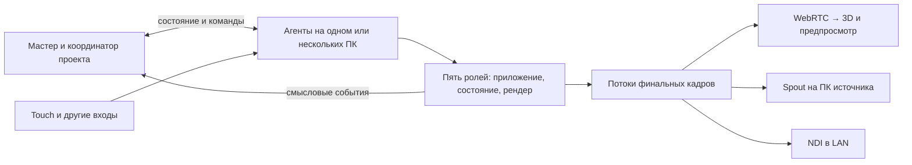
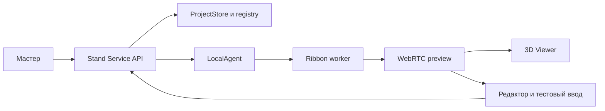

# VK Digital Products — архитектура всего проекта

04.10.2026 — **WAVE08 G1 принят в F; приёмка пользователя OPEN.** Обновлённая серверная Стелла, художественный single-VK renderer; MAX no-op после SHA/build аудита.19files,3DB backup/integrity, прежние данные сохранены. IAB8850 полный цикл19/18элементов, QR/Discovery/пауза/reload/cancel; независимый review исправил cancel/loading и legacy completed gate. [Отчёт](../artifacts/reports/parallel-wave8-integration-20261004.md). G2–G4, физический вывод и production media открыты; следующая итерация после отзыва. Компонентные worktrees не изменены.

04.10.2026 — [WAVE-08: границы интеграции](F:/project/VK_DigitalProducts_Stand/docs/WAVE_08_INTEGRATION_PLAN.md). Shared contracts/entry/transport и бизнес-привязки у root; component adapters в отдельных D-кандидатах. Новый standalone не заменяет master engine; текущий F executor и canonical lifecycle сохраняются. План, не принятый runtime.

04.10.2026 — [Сверка актуальных компонентов с F](../artifacts/reports/components-current-integration-audit-20261004.md): master business authority сохраняется; Native scenario — fixture driver + renderer, новый standalone Стеллы — без MasterSlice, D MAX — самостоятельный entrypoint. Переносить presentation через текущие F adapters, не копировать устаревший vendor executor или локальные state engines поверх F.

04.10.2026 — WAVE-07 технический surface lab принят в F: owner/arch/concurrent ribbons/quiesce/restore. Бизнес-интеграция и физический вывод остаются отдельными. [TODO F](F:/project/VK_DigitalProducts_Stand/TODO.md), [проверка](../artifacts/reports/parallel-wave7-integration-20261004.md). Приоритет пользователя: waiting MAX перед новым квизом, начатый квиз не прерывать.

04.10.2026 — WAVE-06 интегрирован в F: admission config/pins, required renderer failure guard и `/readiness`. Общий output owner пока контракт, физическое отображение не подтверждено. Актуальные статусы — [TODO F](F:/project/VK_DigitalProducts_Stand/TODO.md); [проверка](../artifacts/reports/parallel-wave6-integration-20261004.md), [runtime](F:/project/VK_DigitalProducts_Stand/docs/WAVE_06_RUNTIME.md). D visual/Стелла/MAX владельцы сохраняются.

04.10.2026 — WAVE-05 интегрирован в F: local canonical MAX v4, dataset identity/restore epoch и typed technical video/result. Канонические текущие задачи — [TODO F](F:/project/VK_DigitalProducts_Stand/TODO.md); [проверки](../artifacts/reports/parallel-wave5-integration-20261004.md), [эксплуатация](F:/project/VK_DigitalProducts_Stand/docs/WAVE_05_RUNTIME.md). Разработка визуалов D отдельно, не заменена этим срезом.

04.10.2026 — [WAVE-05 мастера: следующий план параллельной работы](F:/project/VK_DigitalProducts_Stand/docs/WAVE_05_PLAN.md) подготовлен после read-only сверки. A — canonical MAX, B — DB identity, C — media/result; root — shared integration. Владение текущими D visual/Стелла/MAX компонентами сохраняется. Реализация этой волны не начата.

04.10.2026 — WAVE-04 принят в F: standalone technical runner, additive MAX v3 snapshot/orbit handoff, immutable resource overlay/result late-fill. Админка default off для новой автоматики; ручные команды и pending recovery сохраняются. Общий production AV owner и actual GPU/media отдельно. Подробности и границы: [отчёт](../artifacts/reports/parallel-wave4-integration-20261004.md).

04.10.2026 — мастер F: [AUD-03](../artifacts/reports/master-roadmap-audit-20261004.md), [единый roadmap](F:/project/VK_DigitalProducts_Stand/docs/READINESS_ROADMAP.md), статусы только в F/TODO. Root+3read-only аудитора; найден MAX same-tags handoff gap, разделены принятые компоненты/кандидаты/production. Runtime не менялся этим аудитом.

04.10.2026 — **WAVE-03 установлен на8782; техническая проверка PASS, ожидает проверки пользователя.** MAX: принятые ответы проявляют теги; теги на арке → объекты ленты → SCREEN_RIGHT → отдельный presented → ожидание руки. Белой сущности нет. Очередь освобождает Стеллу после enqueue; новый квиз использует арку, сохраняя прежнюю миссию справа. Legacy v1 сохранён. Реальная Стелла теперь проходит все VK-вопросы, camera-not-connected/skip и финал со ссылкой результата. 64 backend assertions,10 UI tests,30 Stella tests+4 adapter tests+2 HTTP paths; IAB MAX/FIFO/pause/reload и полный VK PASS. Применены14exactSHA, SQLite backup/integrity и сравнение10business tables PASS. Реальная игра MAX, общий production AV ownership, GPU/Spout, камера/AI остаются вне принятого среза. [Отчёт](../artifacts/reports/parallel-wave3-integration-20261004.md).

04.10.2026 — **WAVE-02: первый срез реальной Стеллы установлен на8782/stella/?master=1.** Один VK answer/reveal→следующий вопрос read-only, reload/cancel проверены IAB; polling reset заставки найден и исправлен. F:63exactSHA, SQLite backup/integrity, прежние20сессий и все сравниваемые business rows сохранены. Реальный MAX v5 managed и отдельный technical runner прошли HTTP/IAB, остаются кандидатами D. Полный квиз, CanonicalMaxPort v2/FIFO и реальный GPU renderer — следующие независимые шаги; AI/TD/железо не трогались. [Отчёт](../artifacts/reports/parallel-wave2-integration-20261004.md).

04.10.2026 — WAVE-01: BE-14 применён в master F8782; MAX lifecycle и resource late-fill — изолированные проверенные кандидаты D, не runtime. Внешность/тайминги не менялись. [Статус и доказательства](../artifacts/reports/parallel-wave1-integration-20261004.md), очередь работ — [TODO F](F:/project/VK_DigitalProducts_Stand/TODO.md).
04.10.2026 — локальный voice-кандидат5196 переведён в AI pause: общий compile-time флаг закрывает client connect/probe и server session до credentials/fetch; журнал/локальные WAV/manual UI сохранены. F не затронут. [Аудит диалога и проверка паузы](../artifacts/reports/stella-last-conversation-20261004.md).

04.10.2026 — **STELLA-DIAG-01 (кандидат D5196):** семантические события UI/Omni → Pino/browser → Dexie IndexedDB outbox → local collector ACK → Pino JSONL. Общие session/page/event IDs связывают речь, guards и реальный экран; viewer локальный. Мастерские контракты/БД F не затронуты. [Эксплуатация](../apps/stella-prototype/docs/DIAGNOSTICS.md), [обоснование](Research/stella-diagnostics-20261004.md).

04.10.2026 — в F применён [технический MAX](F:/project/VK_DigitalProducts_Stand/docs/MAX_LOCAL_MASTER_ARCHITECTURE.md): мастер владеет общей Стеллой, квизом, назначением и DBOS FIFO; TechnicalMaxPort заменяет только внешние ACK. Canonical game core и Dvisual не перенесены повторно. [Проверки](../artifacts/reports/max-local-integration-20261004.md).

04.10.2026 — MAX flow manual-source-actions-v1: Ajv provenance → строгая проверка выразимости в существующем каталоге → applyAssetAnnotations → Graphlib publish validation эффективного графа. Vendor backend/SessionPort неизменны, contentRevision изолирует новое сохранение. Расширенный v3 runtime, F registry и автоприменение не реализованы этой поставкой. [Отчёт](../artifacts/reports/max-flow-apply-20261004.md).

04.10.2026 — Standalone Стелла на Selectel обновлена релизом20261004T064616Z: прежний статический Vite/Caddy тракт /df/stela/, дополнительно19 готовых WAV и manifest озвучки, без API-провайдера в браузере. Предыдущий релиз сохранён; F/master не переключались. [Публикация/ограничения](../artifacts/reports/stella-selectel-20261004T064616Z/README.md).

04.10.2026 — MAX editor card leases: Verrou0.5.2 MemoryStore в одном Nodeпроцессе, общий serialqueue с persistence, acquire/renew/release через /api/max-asset-locks.30сTTL/8сheartbeat, криптографический clientcapability, expiredcleanup publicrelease, guardlegacy/CAS/merge/sharedscope. JSON/schema не меняются; restart сбрасывает толькоleases. [Контракт](../apps/max-game/docs/ASSET_AUDIT.md), [ресерч](Research/max-card-locks-20261004.md), [проверка](../artifacts/reports/max-card-locks-20261004.md).

04.10.2026 — повторный аудит мастера: подтверждён cancellation gap после нового admission (BE-14); ближайший шаг — reconciliation старого исполнения. VK группы/процент дальше; MAX сначала полный assignment release, затем FIFO/два входа. [Аудит](F:/project/VK_DigitalProducts_Stand/artifacts/reports/master-readiness-audit-20261004.md), статусы только [F TODO](F:/project/VK_DigitalProducts_Stand/TODO.md). Код/live данные не менялись.

04.10.2026 — мастер F8782 принял первый срез VK-02B: типизированные QR результата и теги участвуют в общем пакете, без изменения Discovery. Backend5/HTTP6/view6 и IAB19/19 PASS, SHA/backup/старые данные сохранены. Группы/процент ещё открыты. Текущие статусы — [F TODO](F:/project/VK_DigitalProducts_Stand/TODO.md), [проверка](F:/project/VK_DigitalProducts_Stand/artifacts/reports/content-entities-integration-20261004.md).

04.10.2026 — MAX collaboration: POST /api/max-asset-flow/merge (baseDocument/document), fast-json-patch3.1.1 test/apply на стабильных атомарных сущностях, общий serialstore+atomically. Конфликты409 с currentDocument; poll2с, защита позднегоGET/ACK и правок во времяPOST. Полный импорт сохраняет CAS. Schema3 и оба файла данных прежние; каждая вкладка имеет отдельный recoverykey. [Контракт](../apps/max-game/docs/ASSET_AUDIT.md), [исследование](Research/max-team-editing-20261004.md), [проверка](../artifacts/reports/max-team-editing-20261004.md).

04.10.2026 — MAX cloud-editor принимает schema3 через /api/max-asset-flow: CAS+единая очередь+atomically; migration legacy только на чтении, отдельный flow-v3.json при первой правке, annotations.json не переписывается. После v3save legacyPOST409. IDB recovery только по подтверждению; live runtime/F не переключены. [Контракт редактора](../apps/max-game/docs/ASSET_AUDIT.md), [проверка](../artifacts/reports/max-flow-editor-v3-20261004.md).

04.10.2026 — новое требование F: [сущности и настраиваемые рубежи](F:/project/VK_DigitalProducts_Stand/docs/SCENARIO_ENTITIES_AND_RELEASE.md). QR и теги должны стать участниками пакета наряду с медиа; группы/параллельность и процент на выбранной границе задаются профилем. Пока не реализовано; текущий v7 не менять задним числом. Ранний допуск требует отдельного разрешения конфликтов арки.

04.10.2026 — [TODO визуальных компонентов D](VISUAL_TODO.md) ведёт компонентные задачи и приёмку по архитектуре D → F. Разработка/fixture/handoff выполняются в D; backend, общие контракты и применение в F — у интегратора. Создание списка не запускает кодовые задачи.

04.10.2026 — F принял [wall-items-v1](F:/project/VK_DigitalProducts_Stand/artifacts/contracts/vk-wall-items-v1.md): executor v7 и атомарные item arrivals, partial membership/FIFO. Квиз следующего посетителя независим от остатка первого показа; следующий показ ждёт единственный slot. Старые v1–v6 не изменены. [Проверки](F:/project/VK_DigitalProducts_Stand/artifacts/reports/vk-wall-items-integration-20261004.md). Компоненты D не дублируют этот backend.

04.10.2026 — в F принят [Discovery cycle v1](F:/project/VK_DigitalProducts_Stand/artifacts/contracts/discovery-cycle-v1.md): immutable ранний пакет и единый executor v6 связывают reveal, выпуск, all-visible, erase, центр и стену. Canonical художественные компоненты остаются в D; технический DOM presented не подтверждает TD/GPU. [Интеграционный отчёт](F:/project/VK_DigitalProducts_Stand/artifacts/reports/sys06-discovery-integration-20261004.md).

04.10.2026 — MAX flow: [первый технический срез](../artifacts/reports/max-flow-fe01-foundation-20261004.md) реализует формат v3 и opt-in библиотечную маршрутизацию внутри source Application. Пользовательский интерфейс и runtime пока прежние; полная целевая модель остаётся в [архитектуре редактора](MAX_FLOW_EDITOR_ARCHITECTURE.md).

03.10.2026 — подготовлена [архитектура MAX flow editor v3](MAX_FLOW_EDITOR_ARCHITECTURE.md): mixed hotspots/buttons/timer, один backend commit, presented generation и registry content+rules. Это предложение, runtime не изменён.

03.10.2026 — подготовлены [общие инструкции компонентным агентам D → F](AGENT_INTEGRATION_GUIDE.md) и роли [Стелла](AGENT_STELLA.md), [MAX](AGENT_MAX.md), [визуал/маски](AGENT_VISUAL.md). Зафиксированы реальные исходники и runtime, существующие протоколы и ещё не реализованная интеграция; бизнес-истина мастера не дублируется внутри visual preview. Передача — по точной версии компонента и контракту, через одного интегратора. [Сверка архитектуры](../artifacts/reports/component-agent-architecture-audit-20261003.md).

03.10.2026 — MAX v5 local: apply-asset-annotations.mjs компилирует immutable reviewed JSON на прежний MissionSessionApplication. Новая contentRevision — отдельный IDB key; vendor и прежние сессии сохранены. Nested channel граф обновляется вместе с outer. Builder сверяет source export→generated JSON и vendor SHA. HTTP server-profile не изменён. [Исследование](Research/max-annotation-gameplay-20261003.md).

03.10.2026 — **Уточнение Native-масок:** паритет TD physical/color/morph независимо для large/fine; дополнительно собственная пространственная маска отдельной белой сущности стеллы с управляемыми reveal/hold/erase. Силуэт/флюиды после выбора TD/Native замещают fine-маску в отдельной области, включая чёрные значения, и подавляют large до размера/свечения. Текущий fallback и арочный loop не реализуют полный контракт. [Смысл и границы](Research/native-mask-contract-20261003.md), [сверка](../artifacts/reports/native-mask-contract-audit-20261003.md).

03.10.2026 — стеклянные MAX/Discovery по-прежнему используют общий premultiplied ShaderMaterial; уменьшен только коэффициент широкой заливки ×.25, новых проходов/ресурсов нет. [Проверка](../artifacts/reports/tag-glass-transparency-20261003/README.md).

03.10.2026 — **Единый контракт TD-масок:** [MASK_SYSTEM](../apps/TD/docs/MASK_SYSTEM.md) консолидирует маршруты, три сигнала, проекции, параметры и транспорт по проверенному срезу.42. [MASKS_CURRENT_BUILD](../apps/TD/docs/MASKS_CURRENT_BUILD.md) — навигатор, без отдельной дублирующей архитектуры. Нового изменения поведения нет.

03.10.2026 — Selectel asset-audit применён: Caddy HTTPS/BasicAuth → singleton Node127.0.0.1:19431 → прежний atomically/CAS. Данные вне releases/public, без импорта локальной разметки. Игровой маршрут /df/max-game/ неизменён. [Отчёт](../artifacts/reports/max-asset-audit-selectel-20261003.md).

03.10.2026 — подготовлен изолированный Selectel asset-audit: Caddy HTTPS/BasicAuth → loopback Node → прежний atomically store/CAS, постоянный JSON вне release/public. Meta API prefix сохраняет локальную интеграцию. Не применено: auto-review требует явное согласие на перенос данных и доступ. [Исследование](Research/max-asset-audit-selectel-20261003.md).

03.10.2026 — WhiteEntitySweep: отдельный native LumiCells Engine, клеточный Canvas2D envelope и один target со штатным Three screen blending. Worker snapshot до тайлов, shared clock, TD исходники неизменны. MVP только арка; config в существующем discovery.json/API. [Контракт](../apps/stand-service/docs/WHITE_ENTITY_SWEEP.md).

03.10.2026 — asset-audit разделяет открытие, показ и явное размещение зоны; setRect вызывается только из режима разметки. Геометрией по-прежнему управляет Annotorious, сохранением — прежний серверный API. [Проверка](../artifacts/reports/max-asset-audit-editor-20261003.md).

03.10.2026 — appearance (lumicell/discovery/max) и emojiShare хранятся в прежнем discovery-tags.json/API. MAX/Discovery делят DiscoveryTagEngine, общий atlas и transport; MAX пропускает field/glow. LumiCell — прежний TagBatch. [Реализация/ограничения](../artifacts/reports/max-tags-20261003/README.md).

03.10.2026 — Стелла: click и автоматические эхо-волн используют цвет выбранной кнопки. Посторонние красные pulse тегов убраны; запрет розового на любых пересечениях остаётся OPEN: native tint/hot смешивает оттенки. [Проверка](../artifacts/reports/stella-pulse-colors-20261003.md).

03.10.2026 — MAX asset-audit schema2: отдельный API мастера вне opt-in game backend, конфиг в apps/stand-service/configs, atomically2.1.1, проверка ожидаемого SHA и сериализация мутаций. IDB только recovery, игровые сессии не меняются. Новый route ожидает restart; применение к каталогам требует version pinning. [Исследование](Research/max-asset-audit-live-20261003.md).

03.10.2026 — Стелла: общий animation.brightness0.65 усиливает сигнал клеток перед native gate, отдельно от background.spotA0.045/0.07. [Проверка](../artifacts/reports/stella-cell-brightness-20261003.md).

03.10.2026 — Стелла: используется прежний upstream-композитор bg+glow+cells; изменены только native spotA.strength home0.045/products0.07. Новая wave-архитектура отменена и откатана. [Проверка](../artifacts/reports/stella-subdued-spot-20261003.md).

03.10.2026 — MAX asset-audit: отдельный vanilla/esbuild entry, готовый Annotorious 3.9.3, один SVG editor, lazy WebP-превью sharp; каталог из закреплённого backend, отдельная IDB через idb, version/hash-validated JSON. Применение к gameplay не автоматическое. [Ресерч](Research/max-asset-annotation-20261003.md), [контракт](../apps/max-game/docs/ASSET_AUDIT.md).

03.10.2026 — уточнён аудит Стеллы: постоянный фон импортирует upstream lumicells, WhiteEntity отдельно использует проектный lumicells-project с внешней маской. Перенос основного фона на него не выполнен. [Архитектура](Research/stella-background-architecture-20261003.md).

03.10.2026 — MAX v5 local recovery: native dialog вне WebGL/root, SessionPort initialOwnerActive=false до решения и GPU-ready, общий ownership учитывает focus/visibility. Правила backend не меняются. [Обоснование](Research/max-v5-recovery-20261003.md).

03.10.2026 — Стелла: общий OnboardingScreen больше не подключает touch-hand.svg; обработчики кнопок сохранены.

03.10.2026 — Стелла: enteringProduct устанавливается для VK Видео и MAX; существующий BrandSplash завершает фазу перед показом onboarding. [Проверка](../artifacts/reports/stella-vk-brand-entry-20261003.md).

03.10.2026 — Стелла: result-reset MAX использует геометрию исходного max-cta.svg360×140; фон SVG не растягивается в контейнер другого aspect. [Проверка](../artifacts/reports/stella-max-thanks-size-20261003.md).

03.10.2026 — WhiteEntity владеет соседними img/canvas; общий Motion timeline обновляет CSS mask-image и native envelope. Scan ждёт GPU-ready и image.decode. [Решение](Research/stella-silhouette-ramp-20261003.md).

03.10.2026 — Стелла: main сохраняется без React key; RingActions.phaseKey переинициализирует только gate ввода. VK header — постоянный сосед содержимого в RingScene, вне screen-arrive. [Решение](Research/stella-persistent-brand-20261003.md).

03.10.2026 — MAX v5: native CSS absolute/min/Flexbox размещает внешние actions; их DOM-владелец phone-content сохраняет fade/inert/input. v5DeviceMetrics зависит только от asset aspect, shellH800/inset10×12. [Обоснование](Research/max-v5-external-actions-20261003.md).

03.10.2026 — Discovery: native FieldPass поддерживает opt-in externalMask.proceduralEnvelope; R умножает процедурную маску, G сохраняет white morph. Canvas2D создаёт клеточный atlas из контура и радиальной рампы, Motion управляет reveal/hold/erase после GPU-ready. Стадии scan→generation→QR меняются по completion при одном renderer. [Решение](Research/stella-discovery-ramps-20261003.md).

03.10.2026 — MAX v5 backend=local: idb8.0.3/IndexedDB, DB max-game-local-v1, store sessions, ключ [profileKey, sessionId]. Адаптер PersistencePort делает compare-version/put в одной native transaction и ждёт tx.done. Lazy import legacy readonly, IDB имеет приоритет; серверный профиль и старые renderer сохранены. [Решение](Research/max-indexeddb-local-profile-20261003.md).

03.10.2026 — Ошибки старта MAX читают стандартную цепочку Error.cause до исходного browser exception. PersistencePort не заменяется, автоматического обхода ошибок хранения нет. [Исследование](Research/max-storage-diagnostics-20261003.md).

03.10.2026 — Discovery: реализован первый native adapter на проектных LumiCells Controller/Engine/CubesPass. Отдельный canvas, общий ticker с фоном, константный morph-atlas и штатная per-cell маска/вариация. Узкая TS-граница не меняет vendor; Vite собирает его исходники. Готовность GPU ещё не синхронизирована со сценарием; баланс и изображение ожидают проверки. [Отчёт](../artifacts/reports/stella-discovery-native-20261003/README.md).

03.10.2026 — MAX v5: surface shader декодирует авторский sRGB через native Three EOTF перед colorspace_fragment. JourneyContextGlass сохраняет линейный RT и единственное финальное кодирование. Флаг ограничен v5. [Обоснование](Research/max-v5-ui-color-space-20261003.md).

03.10.2026 — MAX v5: цветовая Texture использует native Three repeat=1/√2 вокруг center=(0.5,0.5), alphaMap независима. Штатная матрица обновляется без повторного upload изображения. [Ресерч](Research/max-v5-gradient-coverage-20261003.md).

03.10.2026 — Discovery: нулевые клетки сохраняются вне балансировки положительных диаметров. Кандидат — существующая cubeMask-ветка LumiCells с нулевым минимумом; обычная ветка с положительным floor не соответствует. Проверять конечные размеры после маски и отдельную долю пустоты. Интеграция пока не выполнена. [Контракт](Research/stella-discovery-architecture-20261003.md).

03.10.2026 — новый local8782: VK-01 связывает execution с session/visit/generation из БД; Anime center marker и release станции фиксируются одной DBOS datasource транзакцией. GET /executions/current независим от текущего квиза. Один renderer-slot; real Spout/production ещё не подключены. [Контракт](F:/project/VK_DigitalProducts_Stand/artifacts/contracts/vk-ribbon-release-v1.md).

03.10.2026 — Discovery: разделены композиция, распределение диаметра и время. Цель — сбалансированный непрерывный спектр, а не повторение частот SVG. Сначала проверяется штатная вариация LumiCells; D3 quantileSorted/scaleLinear исследованы как кандидат калибровки, путь в GPU остаётся открытым. [Решение и ограничения](Research/stella-discovery-architecture-20261003.md).

03.10.2026 — MAX v5: targetPhoneMetrics и v5StartupScreen получают device.asset+actions. V5_DEVICE_FRAME определяет рамку и footer; CSS Flexbox/aspect-ratio размещают изображение и hotspot canvas. kind остаётся metadata совместимости, размер им не выбирается. [Ресерч](Research/max-v5-asset-fit-20261003.md).

03.10.2026 — Стелла/Discovery: предложен отдельный слой проектного LumiCells/CUBES с per-cell размером и белым morph, постоянными индексами клеток, seed и временем. Размеры формирует существующее локальное поле; точные диаметры SVG не обязательны. Это архитектурный кандидат, не реализованная интеграция: сначала проверка совместимости backend, затем переходы и готовность GPU. [Архитектурное решение](Research/stella-discovery-architecture-20261003.md), [аудит](../artifacts/reports/stella-discovery-architecture-audit-20261003/README.md).

03.10.2026 — MAX v5: startup теперь shell→row→trace→fan→content, запускается accept(scanned). deviceShown/readiness отделены от общего settled. logo V5MotionValue передаётся в существующий GPU data-path-presence; host.contentPresence остаётся у V5DeviceMorph. Backend и единый clock прежние. [Ресерч](Research/max-v5-hold-shell-logo-20261003.md).

03.10.2026 — MAX v5: единый источник ширины для оболочки и native Flexbox — phoneMetrics/presentedDevice; startup.rowMetrics удалён. Штатный morph.resize обновляет цели, IconMotion сохраняет инерцию. Backend не изменён. [Ресерч](Research/max-v5-visible-device-width-20261003.md).

03.10.2026 — Стелла/Discovery: единый animated grid.gap признан неподходящим. В исходном LumiCells stamp общий; требуется per-cell размер. Такой расчёт найден в проектной ветке LumiCells/CUBES, но интеграция в Стеллу не подтверждена. [Аудит кода и SVG](../artifacts/reports/stella-discovery-svg-20261003/README.md).

03.10.2026 — Стелла: последующее уточнение заменяет Ribbon EntityRenderer на второй LumiCells element той же pinned ревизии. WhiteEntity использует штатный круглый stamp и modulate(grid.gap), Motion управляет циклом размера. Shader/core не изменён; Color Dodge человека сохранён. [Контракт](../apps/stella-prototype/docs/VK_FLOW.md), [проверка](../artifacts/reports/stella-lumicells-entity-20261003.md).

03.10.2026 — MAX v5 startup — только presentation preview с отдельным ключом runId+serial и ready gates. Backend подтверждает удержание как прежде. Отображаемый ключ splash/task передаётся через decode/GPU; retained .demo-app меняет содержимое через V5DeviceMorph. Three/maath и единый renderer clock прежние, круговой старт v5 заменён. [Исследование](Research/max-v5-phone-first-20261003.md), [проверка](../artifacts/reports/max-v5-phone-first-20261003.md).

03.10.2026 — локальная Стелла: WhiteEntity адаптирует исходный Ribbon EntityRenderer/ENTITY_DEFAULTS/prepareMask, Three r180 из существующего vendor. Один экземпляр на scanning→particles; отдельные CSS-compositing siblings для Color Dodge человека и screen белой сущности, вне scaled UI. [Контракт ветки](../apps/stella-prototype/docs/VK_FLOW.md), [проверка](../artifacts/reports/stella-white-entity-20261003.md).

03.10.2026 — отдельный новый local-мастер8782: BE-03 использует DBOS short operations + Anime.js4.5.0, immutable profile/package/timing и ownerGeneration/controlRevision. Schema3; старые workflow сохранены. Один fixture-slot, Web Locks только локального браузера, без production lease или освобождения Стеллы. [Контракт](F:/project/VK_DigitalProducts_Stand/artifacts/contracts/execution-v1.md).

03.10.2026 — MAX v5: presentation V5PathBatch использует Three QuadraticBezierCurve и maath sine.inOut для целей существующего IconMotion. Один clock, retained pose/velocity, отдельный path-done + settled gate, read-only renderer pose; backend/SessionPort неизменны. [Исследование](Research/max-v5-curved-stagger-20261003.md), [интеграция](../artifacts/reports/max-v5-curved-stagger-20261003.md).

03.10.2026 — Локальная Стелла: обновлённая VK-ветка сохраняет существующие React-state/Motion/LumiCells и timedTransition; добавлен штатный шаг vk-particles между силуэтом и финалом. vk-digitize хранит discoveryAnswerId для корректного события рекомендации после фото/пропуска.18ассетов импортированы существующим SVG-экспортёром с manifest/SHA, без новой render-библиотеки. [Контракт](../apps/stella-prototype/docs/VK_FLOW.md), [проверка](../artifacts/reports/stella-vk-new-20261003/README.md). Действует пока только source/dist/5175.

03.10.2026 — В новом F-проекте реализован local-MVP формирования пакетов после квиза: additive DBOS coordinator, registry schema2, snapshot политики/каталога и фактического выбора; старые workflow сохранены. [Контракт](F:/project/VK_DigitalProducts_Stand/artifacts/contracts/content-package-v1.md), [проверка](F:/project/VK_DigitalProducts_Stand/artifacts/reports/content-package-integration-20261003.md). Это отдельный мастер8782; существующий Stand Service не обновлялся.

03.10.2026 — Стелла, **предложение, не реализация**: один постоянный LumiCells; раздельные профили формы (штатный wave), материала, подложки и продуктовых тем. Текущий flow-профиль визуально отвергнут; точная SVG-карта размеров в API не поддерживается. До переноса на все экраны — один проверяемый образец формы. [Архитектура и исследование](Research/stella-background-architecture-20261003.md), [аудит](../artifacts/reports/stella-background-audit-20261003/README.md).

03.10.2026 — Стелла, следующая local-итерация: существующие LumiCells background.spot/vignette и DOM shadow bindings заменяют постоянную light-подложку; lift.enabled:false исключает слой поднятых клеток. CSS box-shadow даёт непрерывную тень, vendor/WAAPI/Motion не переписаны. Источник финала20261003T134547Z сохранён отдельнымZIP, публичный current не переключён. [Проверка](../artifacts/reports/stella-background-iteration-20261003/README.md).

03.10.2026 — Стелла Selectel: отдельный Vite base `/df/stela/`, статический релиз20261003T134547Z в `/srv/projects/futuronika/df/stela/releases`, атомарный current, host/path-ограниченный Caddy route. Backend/порты не добавлены; local5175 и мастер независимы. [Эксплуатация](../apps/stella-prototype/docs/DEPLOYMENT.md), [проверка](../artifacts/reports/stella-selectel-20261003T134547Z/README.md).

03.10.2026 — Стелла:1280px content area задаёт координаты интерфейса, не clipping viewport. Локальный `.answer-flight .answer-flight__visuals { overflow: visible }` перекрывает demo `.lc-scene overflow:clip`; stage/cqmin и исходный flight остаются прежними. [Проверка](../artifacts/reports/stella-tag-overflow-20261003.md).

03.10.2026 — **Новый мастер: изменяемая комплектация VK.** Канонический контракт нового проекта — [CONTENT_PACKAGE_POLICY](F:/project/VK_DigitalProducts_Stand/docs/CONTENT_PACKAGE_POLICY.md). QuizResult Стеллы отделён от JSON-политики состава: видео и генерации независимо выбирают темы, количества на тему/пакет, случайность/ротацию и правила нехватки.2видео/1генерация/каждая тема — лишь пример профиля. Пакет сохраняет effective policy и фактический состав до внешних действий; retry не перевыбирает медиа. Реализация будущего BE-02 ведётся в F:, не вторая копия на D:; рендер/TD этим уточнением не изменены.

03.10.2026 — **Стелла: новые SVG на существующем renderer.** extract-ux-cards.py выделяет17 ресурсов из клиентских SVG с транзитивными defs и provenance/SHA; ux-artwork.ts связывает их с существующими answer IDs. Сценарий/веса не меняются. ContinuousQuestions сохраняет RingTag, Motion и исходную flight-хореографию; tag-layout учитывает центрированную MAX-карточку. Прежний decode preloader расширен на15 карточек. Только исходная local5175, без обновления runtime/мастера. [Проверка](../artifacts/reports/stella-ux-iteration-20261003.md).

03.10.2026 — MAX v5/local явно использует неизменённые Core/SessionPort и каталог `missions-figma-20261003-151916-v2` из установленного `artifacts/max-game/vendor/backend-figma-v2`. Старые renderer сохраняют прежний backend. Локальное хранилище изолировано revision; автоматической миграции нет. Сборщик сверяет manifest/SHA пакета и устанавливает отсутствующие ассеты, отказываясь перезаписывать различающиеся общие ресурсы. [Контракт](../apps/max-game/docs/SHARED_BACKEND.md), [проверка](../artifacts/reports/max-v5-final-backend-20261003.md).

03.10.2026 — **Стела UX как источник визуальных материалов, не runtime.**44PNG/SVG сохранены в artifacts/DESIGN/UI/stela/Стела UX. SVG: текст в контурах,32уникальных embeddedPNG, filters/masks/foreignObject, статичная сетка; готовой сценарной/анимационной модели нет. [Инвентарь/ограничения](Research/stella-ux-screens-20261003.md). Текущий Motion/LumiCells и приложение не менялись.

MAX v5 (03.10.2026): renderer отдаёт разницу retained pose и измеренной цели для drag; фиксированное обращение hostHeight удалено из пути захвата. Существующие BFM viewport/map/WAAPI контроллер подключены через journey-v5-tools; GPU использует готовые Three texture matrices и alphaMap. Настройки и DOM панелей вне rebuild #circles, SessionPort не изменён этим шагом. [Исследование](Research/max-v5-tools-20261003.md).

MAX (03.10.2026): v2 каталога поставляет общие icon descriptors для узлов/миссий/управления; origin/SHA ведут к пользовательским SVG. `hasEmbeddedLabel` отличает целую карточку от отдельного знака. Неизвестная роль получает явный fallback, без подбора случайного символа. [Контракт и проверка](../artifacts/reports/max-backend-icons-20261003.md).

MAX (03.10.2026): версия missions-figma-20261003-151916-v1 выпускается отдельным ESM-комплектом через прежний shared builder; каталог по умолчанию заменён только внутри релиза, Core/SessionPort общие. Manifest фиксирует SHA модулей/ресурсов, content-source.json — происхождение и порядок. Хранилище выбирается явно; автоматического переноса старых сессий или активации мастера нет. [Проверка](../artifacts/reports/max-backend-figma-release-20261003.md), [обоснование](Research/max-backend-figma-release-20261003.md).

MAX v5 (03.10.2026): native Pointer Events остаётся владельцем контакта; renderer отдаёт retained motion centre для capture, тот же pose обслуживает WebGL/input/masks. Реальный maath0.10.8 damp выполняет X/Y как у телефона; новая физика/gesture engine не добавлены. Presentation drag не меняет backend и формат прогресса. [Исследование](Research/max-v5-drag-anchor-20261003.md), [проверка](../artifacts/reports/max-v5-drag-20261003.md).

MAX v5 (03.10.2026): Three ImageLoader/LoadingManager и native decode готовят весь используемый каталог. Application state не участвует в preview warm: статические descriptors/настоящий UI paint → initTexture/compileAsync/pre-render на существующий target, input после await. Shader references и cache keys pinned до dispose; loader adoption избегает повторного src/decode. Версии backend/формат прогресса не изменены; другие runtime не переключены. [Исследование](Research/max-v5-startup-assets-20261003.md), [отчёт](../artifacts/reports/max-v5-startup-assets-20261003.md).

MAX v5 (03.10.2026): готовый maath0.10.8 easing.damp выполняет X/Y демпфирование вместо новой собственной формулы; адаптер сохраняет MotionValue contract и действующий registry/clock. Only v5 visual, существующие renderer/backend API/сохранения не меняются. Phone pointer задаёт цель; display/input/masks читают подготовленную позу. Справка проецируется из actual phone pose без отдельного фильтра. [Исследование](Research/max-webgl-v5-bfm-theme-20261003.md), [проверка](../artifacts/reports/max-v5-inertia-20261003.md).

MAX v5 (03.10.2026): native CSS Flexbox отвечает за packing/alignment, V5RevealJourney — адаптер измерительных центров к existing Three motion. Phone anchor временный presentation state, не backend progress/layout. Shared SessionPort/формат сохранений не меняются; базовый SharedRevealJourney для других renderer сохранён. [Исследование](Research/max-webgl-v5-bfm-theme-20261003.md), [проверка](../artifacts/reports/max-v5-anchored-row-20261003.md).

MAX v5 (03.10.2026): phone shell/light использует native Canvas2D и существующий Three texture cache/motion/dispose, без дополнительного render target или clock. Готовность корпуса использует deviceShell marker для обоих типов материала, готовность медиа требует upload. Backend/SessionPort не менялись. [Обоснование](Research/max-webgl-v5-bfm-theme-20261003.md), [проверка](../artifacts/reports/max-v5-phone-neon-20261003.md).

MAX game background (03.10.2026): GameBackgroundFrost(doc,frameElement) использует native DOMRect для перехода из parent viewport в iframe framebuffer. Published foreground poses остаются единственным источником масок контролов. Без frameElement действует прежний viewport контракт. Scoped viewer patch включает frost. [Исследование](Research/max-webgl-v5-bfm-theme-20261003.md), [проверка](../artifacts/reports/max-v5-frost-origin-20261003.md).

MAX v5 (03.10.2026): градиент связей исполняет native Three.js vertex-color механизм, через optional параметры render style. Семантический backend, SessionPort и сохранения не меняются; defaults прежних профилей сохранены. Исследование и ограничения: [обоснование](Research/max-webgl-v5-bfm-theme-20261003.md); [фактическая проверка](../artifacts/reports/max-webgl-v5-purple-links-20261003.md).

03.10.2026 — Frame Archive/MAX exporter: общий atomicJson переведён на atomically2.1.1 с fsync/очередью/Windows retry; переносимый bundle закреплён в vendor. ACK по-прежнему выдаётся после сохранения. [Исследование](Research/figma-export-windows-write-20261003.md), [интеграционная проверка](../artifacts/reports/figma-export-windows-write-20261003.md).

03.10.2026 — v5 material исправлен: tile/medallion обходят legacy optical shader, используя native CanvasGradient → Three CanvasTexture → MeshBasicMaterial в том же renderer/cache lifecycle. Motion/SessionPort/сохранения не меняются; новый RAF или render target не добавлен. [Обоснование и ограничения](Research/max-webgl-v5-bfm-theme-20261003.md).

03.10.2026 — MAX v5 добавляет независимый runtime webgl-v5 с исходным WebGL entry и SharedRevealJourney. Флаг материала webgl-bfm-v5 не включает referenceVisual/ReferenceRevealJourney. Backend/catalog/SessionPort общие; локальный профиль v5 изолирован, серверная сессия выбирается query session. BFM DOM entry не импортируется. Scoped builder не активирует эту визуализацию в мастере. [Обоснование](Research/max-webgl-v5-bfm-theme-20261003.md).

03.10.2026 — **MAX Content Exporter:** отдельный адаптер данных Auto Layout поверх native Figma exportAsync и существующего MAX Material Collector/Frame Archive; новый сервер/растеризация/ZIP не создавались. catalog.json связывает source.contentMap с screens[].id/PNG/текстами. Дополнительные fingerprints учитывают справку/иконку/порядок; игровые semantic IDs не угадываются. Плагин read-only, экспорт не активируется в игре автоматически. [Исследование](Research/max-content-exporter-20261003.md), [контракт](../artifacts/DESIGN/figma-plugins/max-content-exporter/README.md).

03.10.2026 — BFM stage scale теперь постоянный presentation layout, устанавливается до session.start; screen transition не измеряет телефон и не изменяет размер группы. Backend/API/сохранения неизменны. [Проверка](../artifacts/reports/max-bfm-fixed-ui-20261003.md).

03.10.2026 — BFM task scale рассчитывается по DOM phone border-box в существующей native update-транзакции; единый stage transform сохраняет согласованность визуала и hit-target. Backend/формат сохранений не меняются. [Проверка](../artifacts/reports/max-bfm-phone-height-20261003.md).

03.10.2026 — BFM viewport wall/lidar — только presentation: native CSS масштабирует одну физическую плоскость4096×1280, SVG и iframe crop согласованы. SessionPort/сохранения/правила не меняются. View selector не отправляет игровые команды; при смене геометрии активное удержание отменяется. [Проверка](../artifacts/reports/max-bfm-lidar-viewport-20261003.md).

03.10.2026 — BFM native compositor: root snapshot с opaque page fill ниже GPU background, затем scene и permanent UI. Root0/background1/stage2/HUD100+. [Проверка](../artifacts/reports/max-bfm-background-layer-20261003.json).

03.10.2026 — BFM HUD/debug имеют отдельные named native groups с explicit слоями над scene/background, без смены SessionPort/сохранений. [Проверка](../artifacts/reports/max-bfm-persistent-ui-20261003.md).

03.10.2026 — **Правила старта подтверждены:** MAX свободен — Стелла освобождается после доставки анимации и показа миссии, готовой к касанию. MAX занят — после постановки в очередь. FIFO, после завершения автоматически показывается следующая; без касания она сбрасывается через60с (настраиваемо). Выбор миссий — при пустой очереди. Квиз Стеллы сбрасывается после20с бездействия. После перезапуска обязательны сохранение всех состояний, пользовательских данных/пакетов, очереди, миссии и квиза с прогрессом и продолжение с места остановки; прежний abort/reset отменён. [Контракт и предел подтверждения](Research/scenario-visual-decoupling-20261003.md#подтверждённые-правила-таймеров-и-восстановления). Не реализовано; требует проверки durable recovery, включая исполнителей.

03.10.2026 — **Три представления тегов:** LumiCell, Discovery и требуемый новый MAX. Общие tagId/смысл/принадлежность пакету сохраняются; визуальный вариант выбирается профилем и настройками слоя, не привязан жёстко к состоянию. Внешний вид MAX ещё не определён и не реализован. [Контракт](Research/scenario-visual-decoupling-20261003.md#разделение-ответственности).

03.10.2026 — **Очередь MAX без лимита длины:** новые миссии принимаются независимо от числа ожидающих, без вытеснения старых или автоматического обрезания. Сохраняемая очередь отделена от числа активных игр и от5 наборов стены VK. После подтверждённой постановки Стелла освобождается. [Контракт](Research/scenario-visual-decoupling-20261003.md#max-два-входа-общая-очередь-без-персонального-закрепления). Требование, не реализованный механизм.

03.10.2026 — read-only TD atlas browser path активирован разрешённым restart в run. Единый receiver/общий TDControlTexture реально обслуживают BFM; живой HTTP подтверждает sourceFrame/sequence и исходные байты. Config JSON и назначения сохранены. Визуальная приёмка остаётся открытой. [Проверка](../artifacts/reports/max-bfm-mask-restart-20261003.json).

03.10.2026 — **MAX: вход со Стеллы и прямо со стены.** Миссия не закрепляется за человеком: играет приложивший руку. Прямой вход сначала показывает выбор миссий. При занятой игре миссия ставится в общую очередь и Стелла освобождается после подтверждения постановки; оба интерфейса показывают число ожидающих, исключая активную. При свободной игре Стелла освобождается после прибытия анимации и подтверждённого запуска миссии на стене. Происхождение задания не равно идентичности игрока. [Контракт и открытые политики](Research/scenario-visual-decoupling-20261003.md#max-два-входа-общая-очередь-без-персонального-закрепления). Реализация не менялась.

03.10.2026 — **BFM/browser TD mask:** read-only свежий атомарный atlas из единственного MaskInputHub → Fetch ArrayBuffer → общий с SurfaceField TDControlTexture → готовый externalMask LumiCells. Новый receiver не запускается, обновление игрового backend не требуется. CPU-копия малого atlas присутствует, zero-copy/FPS не заявлены. Scoped runtime подготовлен; серверная активация и пользовательская приёмка открыты. [Проверка](../artifacts/reports/max-bfm-live-mask-gap-20261003.md).

03.10.2026 — **VK: генерация и публичный результат:** сгенерированное фото по визуальному референсу посетителя входит в пакет и маршрут. QR его набора на стене ведёт на страницу вида `/vkshare/result/<id>` с фото и выбранным контентом именно этого сценария. Генерация, готовность пакета и публикация страницы подтверждаются отдельно. Вытеснение со стены не удаляет страницу; нужен доступный телефону сервис публикации независимо от рендера. Домен/хостинг/TTL ещё не выбраны. [Контракт](Research/scenario-visual-decoupling-20261003.md#сгенерированное-фото-и-страница-результата-vk). Реализация предстоит.

03.10.2026 — **Вместимость VK-стены:** default5 пользовательских пакетов, лимит настраивается в конфигурации/админ-панели для площадки. При поступлении нового готового пакета вытесняется самый старый по первому поступлению на стену; повторная доставка/реакция владельца не меняет порядок. Лимит независим от освобождения Стеллы на центре ленты. Число карточек и число tracked-посетителей — другие величины. [Контракт](Research/scenario-visual-decoupling-20261003.md#вместимость-персонального-контента-стены). Текущая модель ещё фиксирует2 owner-слота, масштабирование не реализовано.

03.10.2026 — **Допуск следующего посетителя VK:** вход занят от начала теста на Стелле до прохода пакетом центра логического пути ленты; затем сессия Стеллы завершена и вход свободен. Пакет/идентификаторы/владелец сохраняются для дальнейшей доставки и стены. Рабочая трактовка прохода — задний край последнего элемента при завершённом выпуске, один маркер на пакет независимо от физических сторон ленты. Правило заменяет ожидание конца всего маршрута. [Условия и ограничения зазора](Research/scenario-visual-decoupling-20261003.md#вместимость-освобождение-стеллы-в-центре-ленты). Пока требование, не код.

03.10.2026 — **Параллельная жизнь поверхностей:** состояние Стеллы публикуется как контекст сессии; арка/лента/стена имеют собственные исполнения и фактические статусы, а не независимые копии квиза. Несколько слоёв/пакетов могут жить на поверхности одновременно в пределах вместимости. Мастер хранит принятые факты и координирует маршрут, приложения сохраняют внутреннюю логику.18 cue не образуют обязательную единственную последовательность всего стенда. Визуальный тайминг не задерживает бизнес-переход без явного условия ожидания. [Анализ и ограничения](Research/scenario-visual-decoupling-20261003.md#параллельные-поверхности-уточнение-модели-пользователя). Реализация предстоит.

03.10.2026 — **Состояние отдельно от визуального исполнения:** бизнес-состояния фиксируют смысл, данные и условия завершения; заменяемый версионируемый профиль задаёт слои, маски, действия, перекрытия, маркеры и ожидаемую длительность. Привязка состояния к совместимому профилю — конфигурация. Плановый тайминг берётся из выбранного исполнения, фактический переход требует обязательных результатов/подтверждений; timeout не равен успеху. XState5 — бизнес-lifecycle, готовый timeline/show-control — художественные зависимости; новый самописный планировщик не выбирать. [Решение и источники](Research/scenario-visual-decoupling-20261003.md). TD-синхронизация остаётся ручной, local/production и TD/Native независимы. Пока архитектурный контракт, не реализация.

03.10.2026 — **Уточнение VK-маршрута:** результат квиза → теги арки → ускорение вращения и затухание тегов с одновременным появлением контента на ленте → выход контента с ленты/всплытие на стене → жизнь пакета и реакция на его владельца. При фото требуется сопоставление фото Стеллы с посетителем PTZ и его body-track/силуэтом; это новый обязательный целевой путь, пока не реализованный. Прибытие пакета не зависит от момента распознавания. [Сверка кода, прежних фаз и слоёв](../artifacts/reports/vk-scenario-alignment-20261003.md). Конкретный механизм идентификации и ветка персональной привязки без фото остаются открытыми.

03.10.2026 — BFM MAX переиспользует существующий CommonMapBackground через изолированный iframe общей карты; общий rear domain/crop и live настройки Stand Service. Собственного background engine в BFM bundle больше нет. [Контракт](../apps/max-game/docs/DEVELOPMENT.md).

03.10.2026 — **Уточнение композиции масок:** собственная маска белого силуэта, флюидов и чёрных пятен вокруг замещает базовую маску в области наложения, сохраняя свои значения. Вне области базовая TD/Native маска остаётся. Чёрный внутри области — ноль, не прозрачность; область наложения независима от яркости. Замещение относится к управлению мелкими клетками; крупные в поле силуэта отключаются. [Контракт](Research/visual-architecture-fit-20261003.md#как-понимать-интерактивную-клеточную-область). Пока только документация.

03.10.2026 — **Целевая визуальная структура пользователя:** градиент → двухразмерное клеточное поле с RGB/white morph → интерактивная фактура человека/флюидов на fine-lattice → связанный контент (кубики, лента/стена, теги, Discovery); Стелла/MAX — отдельные связанные приложения. [Анализ совместимости](Research/visual-architecture-fit-20261003.md), [сверка исходников](../artifacts/reports/visual-architecture-fit-20261003.md). Требуются собственное fine-заполнение силуэта, освобождение мелкого фона вокруг и подавление крупных клеток в теле; существующий верхний SilhouetteOverlay этого не обеспечивает. Модификация результата после выбора TD/Native не изменяет входные TD-маски/синхронизацию. Реализация не менялась.

03.10.2026 — BFM v4 теперь выбирает существующий SessionPort через backend=local/server; server использует session= (default site-shared), авторизацию Stand Service, без fallback. Live backend выключен (503 MAX_BACKEND_DISABLED), активация не выполнена. [Контракт](../apps/max-game/docs/DEVELOPMENT.md).

03.10.2026 — MAX BFM v4 подключён к полному локальному Mission SessionPort: renderer не выбирает правильные ответы и не засчитывает задания. Native transition refresh + AbortSignal отделяют readiness ресурсов от принятия команд; отсутствие контента сохраняет incomplete. [Реализованный контракт](../apps/max-game/docs/DEVELOPMENT.md), [проверка](../artifacts/reports/max-bfm-missions-20261003.md).

03.10.2026 — **Третий канал ToLeft:** morph_large/fine повторяют физическую архитектуру участков, передают alpha через отдельную левую проекцию и существующий G физических страниц atlas. Physical/color не подменяются; справа нет нового генератора. [Проверка](../artifacts/reports/td-left-route-morph-20261003.md).

03.10.2026 — **Аудит состава изображения:** [реестр27 сущностей/слоёв, режимов и управляющих данных](../artifacts/reports/visual-layer-inventory-20261003.md). Проверены порядок композиции, независимые physical/RGB/morph, Vanilla/CUBES, одна/две сетки, четыре fill-режима, Discovery/Lumicell-теги, PixelTags, RowStreams, видео, WallLayer, Стелла и MAX. Установлены ограничения: dualScale требует fill0; MAX game выключен в service worker; RowStreams выключен сохранённым JSON; уже есть процедурный fallback поля после потери TD-входа, но это не полный автономный сценарий. Live-кадр/доставка не проверялись, runtime не менялся.

03.10.2026 — **MAX v4 / BFM:** отдельный native DOM/CSS/WAAPI renderer с BFM View Transitions; существующие SessionPort/каталог/правила и GPU-фон LumiCells сохраняются. Сейчас реализовано только сечение старта. BFM не является WebGL SDK; готовый collision-free drag не найден и не подменяется старым solver. [Обоснование](Research/max-bfm-presentation-20261003.md), [текущий контракт](../apps/max-game/docs/DEVELOPMENT.md).

03.10.2026 — **Размеры TD Masks:** единый источник геометрии — custom parameters `op.masks.par`; нативные зависимости обновляют генераторы, Crop, адаптеры и атласы без пересоздания нод. Задник вычисляется из половин. Автоматическая передача новой геометрии в WebRender не реализована: приёмник сохраняет фиксированный контракт. [Контракт параметров](../apps/TD/docs/MASK_DIMENSIONS.md).

## Админ-панель — ручное управление сценарием

### Управление визуальными слоями

**Источник масок — обязательный переключатель `TD / Native` в админ-панели (03.10.2026).** TD принимает готовые внешние маски; Native использует автономный визуальный режим приложения без входящих TD-масок. Это имя источника, не новый материал клеток. Выбор сохраняется и применяется без перезапуска/сброса сессии; поддерживается в local и production, независимо от Vanilla/CUBES. Панель показывает отдельно выбранный и фактически активный источник, готовность TD и причину резервного перехода. При выбранном TD и отказе входа фактический источник — Native; при явно выбранном Native появление TD-потока не переключает источник обратно. Правила безопасного возврата после аварийного перехода остаются предметом реализации. Общий задник переключается согласованно до crop. Переключатель не редактирует и не синхронизирует TD. Это контракт, не реализованная функция.

Дополнение пользователя 03.10.2026: в той же админ-панели обязателен раздел «Визуальные слои». Оператор должен управлять каждой видимой сущностью из [визуального реестра](../artifacts/reports/visual-layer-inventory-20261003.md#основная-таблица--только-видимые-сущности): включать/выключать, менять доступный вариант отображения и основные настройки. Это требование финального проекта; наличие отдельных редакторов сейчас не считается готовой общей панелью.

| Управление | Требование |
|---|---|
| Выбор области | Показать, к каким поверхностям относится настройка. Стелла, арка, лента и общий задник различаются; общий фон задника сохраняет единые параметры/координаты до crop. Локальный контент VK Видео/MAX управляется в своей зоне |
| Включение | Независимо показать/скрыть каждый визуальный слой, сохраняя его параметры. Выключение видимого слоя не отменяет сессию и не засчитывает сценарный этап; скрытый интерактивный UI не должен оставлять активные невидимые кнопки |
| Вид | Выбирать доступные данному компоненту режимы: например Vanilla/CUBES, вариант тегов, вид полос, оформление карточек. Нельзя обещать перенос любого renderer на любую поверхность; неподдержанные сочетания объясняются |
| Основные настройки | Для конкретного объекта показать применимые параметры: цвет/палитра, прозрачность/яркость/свечение, размер/масштаб, количество/плотность, скорость/характер движения, глубина, текст или медиакаталог. Не создавать бессмысленные универсальные ползунки для всех объектов |
| Сохранение | Использовать единые сохраняемые JSON-настройки, сохранять прежние значения при выключении/смене вида и показывать результат применения/ошибку. Секреты и персональный контент не хранить в арт-конфигурации |
| Согласование со сценарием | Показывать эффективное значение и наличие ручного переопределения. Сценарий не должен молча перезаписывать ручной выбор; нужен явный возврат к сценарному управлению. Параметры оформления отделены от прогресса сессии |
| Ограничения | Отражать реальные зависимости: например dualScale допускает только fill0; прозрачные Discovery-теги и плашки Стеллы пока разные компоненты. Текущие ограничения не маскировать работающим на вид переключателем |

Слои в интерфейсе перечисляются в понятном порядке композиции, но произвольная перестановка GPU-проходов этим требованием не вводится. TD-маски, их художественные генераторы и синхронизация остаются ручным TD-слоем; панель управляет отображением принятых данных и параметрами автономного визуального режима. Управление слоями необходимо в обоих режимах входа масок и при local/production.

Перед реализацией общего редактора — обязательное исследование готового UI/параметрического механизма и сверка с уже существующими схемами настроек. Способ хранения переопределений и полный набор параметров каждого объекта ещё предстоит реализовать и проверить; новый редактор или собственный механизм состояний этим документом не объявлены готовыми.

03.10.2026. Требование пользователя: оператор запускает сценарий, наблюдает состояния, переключается между ними и отменяет текущую сессию из общей админ-панели. Это интерфейс агентной части проекта, которым пользуется человек; ручная настройка TD остаётся отдельной областью. Статус: контракт будущей реализации.

Панель показывает все18 сценарных состояний, активную сессию/ветку, текущий и ожидаемый следующий этап, время в состоянии и причину ожидания/ошибки. Для каждой поверхности (Стелла, арка, лента, VK Видео и MAX общего заднего экрана) показывает назначенный этап и фактически подтверждённый приложением статус. Отправленная команда не считается выполненным переходом. При разрыве связи отображается устаревание статуса. Панель также показывает local/production и фактический источник визуального управления: TD-маски или автономный режим.

Обязательные команды: запустить ветку VK Видео/MAX или AV-шоу; перейти к следующему/предыдущему этапу; выбрать конкретное состояние из списка; отменить текущую сессию. Ручной выбор состояния доступен для всех18 cue, но исполняется с их условиями входа: если нужны фото, миссия или контент, панель показывает недостающие данные и путь подготовки, а не объявляет готовность по клику. Тестовые данные для репетиции должны быть явно обозначены и не подменять реальные результаты в production.

Все команды проходят через того же владельца сценария, что и автоматические события. Панель не пишет состояние отдельных экранов напрямую и не имеет отдельного таймлайна. Переход назад — повторный вход в выбранный этап с определённой политикой сохранения данных, а не откат внешних операций. Смена этапа должна прекращать действия покидаемого этапа; запоздалые события/результаты не должны возвращать уже отменённое состояние. Повторный клик или переподключение панели не должны создавать вторую сессию или повторную обработку.

Отмена относится к выбранной текущей сессии: освободить принадлежащие ей поверхности, убрать её персональный контент и вернуть их в ожидание без сброса другой активной сессии. Внешняя обработка отменяется только при поддержке провайдером; поздний результат отменённой сессии не показывается. Причина, инициатор и результат операторской команды фиксируются в журнале. Подробные правила повторного входа и прерывания AV ещё нужно определить по состояниям; сама панель их не заменяет.

Контракт действует одинаково в local/production и с TD-масками/без них. Панель не настраивает шумы, фазы или синхронизацию TD; возможный сигнал запуска TD-эффекта использует только согласованный вход. Выбор готовых механизмов UI/сценария и интеграционная проверка остаются отдельной малой итерацией по обязательному правилу исследования; новый самописный движок этим описанием не выбирается.

## Два режима входа масок — обязательное требование финального проекта

03.10.2026. Пользователь требует полный рабочий сценарий как с входящими масками TD, так и без них. Это дополнение приоритетнее прежнего запрета автономной анимации при потере TD-входа. Статус: требование к реализации, не подтверждённая готовность runtime.

| Режим | Источник визуального управления | Требуемое поведение |
|---|---|---|
| С масками TD | Готовые локальные входящие маски, настроенные человеком | Приложение принимает и применяет маски; не синхронизирует TD, не корректирует его фазу и не меняет генераторы |
| Без входящих масок TD | Автономный визуальный режим приложения | Полный сценарий от запуска до завершения без наличия, первого кадра или подтверждений TD-масок; также рабочий резерв при отказе их отправки |

Обязательный охват обоих режимов: все 18 состояний финального сценария SB-01, VK-01…07, MX-01…06, AV-01…03, ID-01; Стелла, арка, лента, обе зоны общего заднего экрана. В автономном режиме работают квизы, фото/обработка через соответствующие сервисы, Discovery, перенос контента и миссии, персональная стена, игра MAX, AV-шоу и reset. Прочие реальные зависимости (контент, камеры, обработка и аппаратный вывод) сохраняются; отсутствие масок не разрешает имитировать успешную готовность этих сервисов.

Режим без TD-входов — полноценный поддерживаемый вариант, доступный при запуске, а не только статичный standby, замороженный последний кадр или экран ошибки. Сценарные события, данные посетителя, маршруты и переходы общие для двух режимов. Автономный визуал принадлежит агентному слою; он не обязан побитово воспроизводить TD-маски, но должен передавать те же сценарные действия на всех поверхностях и пройти пользовательскую приёмку.

Требуется явный выбор режима и автоматический переход в автономный режим при подтверждённой потере/невалидности требуемых входов, без сброса сессии и повторного запуска уже выполненных действий. Возврат к TD не должен дёргать режимы при нестабильной передаче; критерии свежести, пороги, согласованное переключение общего полотна и безопасный возврат ещё подлежат проектированию. Неизменный рисунок корректной маски сам по себе не означает отказ. Приёмник не чинит и не синхронизирует TD.

Это независимая настройка от **local/production** и от вида клеток **LumiCell Vanilla/Cubes**. Требуются обе комбинации источника масок в обоих режимах размещения. «Без входящих масок TD» не означает «без TD в цепочке аппаратного вывода»: итоговый Spout → TD → экран может сохраняться. Полный отказ TD как приёмника изображения — отдельная задача, не закрытая этим требованием.

До выбора автономного механизма обязательно исследование готовых решений по правилам проекта; новый генератор/планировщик этим документом не выбирается. Критерии будущей приёмки: холодный запуск без отправителей масок и полный цикл обоих продуктов/AV/reset; потеря входа посреди сессии без потери данных/зависания; восстановление входа без повторных событий; отсутствие разрыва общей задней стены при переключении. Проверки ещё не выполнены.

03.10.2026 — **Редактор RouteMasks:**24 локальных генератора развернуты внутри8 каналов в Annotate-группы, публикация через красные Null и Select. Вложенные Container участков убраны; обработка/выходы каналов не менялись. [Проверка](../artifacts/reports/td-flat-mask-layout-20261003.md).

03.10.2026 — CompositePass и CubesPass переиспользуют общий GLSL фона/backgroundProfile и выборки glow до tone mapping. Дополнительных RT/проходов нет; rear crop остаётся глобальным. [Проверка и ограничения](../artifacts/reports/cubes-glow-composition-20261003/README.md).

03.10.2026 — **Стелла: единый ContinuousQuestions.** questionPresentation сопоставляет существующие ScreenState с вопросом/вариантами, не меняя сценарные handlers и publisher. Вопрос/selected RingTag живут через reveal, onFinalExit последней группы запускает готовый Motion exit; semantic keys создают следующий набор. Полный охват VK/MAX/фото/пол, общий travelScale1.25 для тегов. Пустой photo reveal обслуживает прежний timedTransition; Discovery без карточки остаётся AnswerFlight. Gate имеет фазу вопроса и interactionKey диалога; фокус восстанавливается после commit. [Проверки и границы](../artifacts/reports/stella-all-transitions-20261003.md).

03.10.2026 — **RouteMasks: генерация по участкам.** 2 стороны ×4 канала ×3 поверхности =24 самостоятельных Noise/Level/Out. Нативные Crop/Over собирают их перед прежними маршрутными выходами; физический final Level включён в alpha соответствующего цветового участка. Транспорт и service sampling сохранены. [Контракт](../apps/TD/docs/MASK_SYSTEM.md), [проверка](../artifacts/reports/td-surface-generators-20261003.md).

## Ручной и агентный слои — действующая граница ответственности

03.10.2026. Прямое решение пользователя, приоритетное над прежними планами R2 и распределённой синхронизации ниже. «Агентный» означает область разработки и обслуживания агентом; это не требование использовать AI-агента во время показа. «Ручной» означает настройку человеком, а не покадровое ручное исполнение: настроенный TD продолжает работать автоматически.

| Область | Ручной слой | Агентный слой |
|---|---|---|
| TouchDesigner | Сеть TD, параметры, генераторы и смешивание масок, seed, скорость и художественный рисунок | Приём опубликованного результата по согласованному контракту |
| Синхронизация масок | Часы, фаза, связь TD между ПК, TD Sync и согласованность масок на стыках | Не создаёт вторые часы масок, не выравнивает фазы, не пересчитывает и не воспроизводит маски |
| Обмен текстурами | Готовые выходы масок и настроенный приём итогового изображения в TD | Читает локальные маски, применяет к визуализатору, публикует готовое изображение через Spout |
| Сценарий и контент | Согласованные точки входа TD, если сценарию потребуется запуск эффекта | Сессии, квиз, контент, приложения, события и их доставка; событие запуска не превращается в управление внутренним временем маски |
| Эксплуатация | Настройка и приёмка TD/аппаратного тракта | Запуск и диагностика собственных приложений, состояние приёма, сообщения об отсутствии или устаревании входа |

Граница данных в режиме TD: **ручной TD → готовая локальная маска → агентный приём/визуализация → готовое изображение → ручной TD/экран**. Существующая семантика атласов сохраняется: [контракт масок](../apps/TD/docs/MASK_SYSTEM.md). Формат, имя источника, размер, страницы/каналы, координаты и кодировка согласуются на входе; агент не меняет их самовольно. В режиме TD готовая маска — источник значений; агентный слой не добавляет компенсирующий шум или фазовый сдвиг. Отдельный автономный режим без входящих масок обязателен по дополнению выше и находится в агентной области.

Диагностика размера/формата/свежести и безопасное переподключение приёмника допустимы; исправление TD, автоматическая подстройка его времени, catch-up/replay масок и сетевой перенос масок не входят в агентный слой. При отказе входа приложение переходит в явно обозначенный автономный режим полного сценария, не пытаясь исправить TD. Прежний запрет автономной анимации при отсутствии входа отменён новым требованием. Диагностический frame counter не становится управляющими часами TD.

Разделение одинаково для **local** (всё на одном ПК) и **production** (узлы на нескольких устройствах). В production человек настраивает синхронизацию TD; агентные приложения принимают свои локальные выходы. События сценария и статусы приложений остаются отдельным управляющим обменом.

Прежние задачи выбора/реализации TD Sync, общего seed/tick, восстановления состояния симуляции масок и автоматического устранения стыков перенесены в ручной слой. Риск сквозного рассинхрона финального изображения не исчезает: он остаётся предметом совместной приёмки, но не разрешает агенту вмешиваться в TD. Изменение ручного слоя возможно только по новому прямому поручению пользователя. Сейчас изменены документы; действующие процессы и код не переделаны.

03.10.2026 — **Внешняя проверка архитектуры, R2.** [Исследование готовых проектов и внедрений](Research/stand-architecture-external-review-20261003.md), [библиография/версии](Research/stand-architecture-external-review-sources-20261003.md), [дополнительный static audit](../artifacts/reports/stand-architecture-risk-check-20261003.md). Предпочтительно сначала проверить единый rear renderer; не объединять все устройства одним TD Sync barrier. XState оставлен для бизнес-сессий, TSR/Chataigne исследованы как готовые альтернативы общего show-control. Текущий browser/GPU host сохраняется до сравнения полного контракта с SpoutBrowser/TD Web Render. Уточнён CPU/IPC-тракт малых control atlases и общий домен отказа GPU hub. Windows startup требует PT0S и интерактивной сессии. Это поправки решения, не deployment; подробнее приоритетны выводы R2.

03.10.2026 — **Стелла: план разделения жизненного цикла ввода и визуала.** Текущий keyed RingActions пересоздаёт main и сбрасывает одноразовый RingCue; механическое удаление key недостаточно. Рекомендованы постоянный visual shell, отдельный reset gate и готовый Motion AnimatePresence для удержания уходящего DOM, LumiCells остаётся владельцем полётов. Зависимость ещё не установлена, интеграция не проверена. [Исследование](Research/stella-continuous-transitions-20261003.md).

03.10.2026 — **Стелла: параметры случайного размещения.** tag-layout использует готовый seeded из LumiCells; seed хранится на время AnswerFlight, позиции memoized по seed/группе/карточке и одинаково передаются DOM и Choreographer. Это ограниченная раскладка четырёх объектов, без нового физического движка. [Исследование](Research/stella-random-spread-20261003.md), [интеграция](../artifacts/reports/stella-random-spread-20261003.md).

03.10.2026 — **Masks: 59 Container вместо Base**, прежние пути и обработка сохранены. Operator Viewer явно выбирает внутренний итоговый TOP; сигнальные точки с прямыми ссылочными читателями маркируются красным. [Проверка](../artifacts/reports/td-mask-viewers-20261003.md).

03.10.2026 — **Стелла: tagPresentation передаёт также snapshot выбранной карточки.** AnswerFlight сохраняет его вне Choreographer-контейнера и жизненного цикла групп; исходные CSS/иллюстрации переиспользуются. Аргумент hold готового revealOnce=350ms, алгоритм полётов неизменён. Позиции метаданных учитывают сторону карточки; сценарные состояния/события не менялись. [Проверка](../artifacts/reports/stella-persistent-answer-20261003.md).

03.10.2026 — **Архитектура реализации после аудита технического директора.** [Решение, готовые технологии и гейты](Research/stand-implementation-architecture-20261003.md), [фактический аудит кода](../artifacts/reports/stand-implementation-audit-20261003.md). Выбраны для интеграции XState 5, Mosquitto MQTT 5 / MQTT.js, существующая SQLite, локальные TD/Spout и Electron shared textures; Windows Task Scheduler для интерактивных GPU-процессов. local/production — одна логика с разным размещением. Общие часы — нативный TD Sync Pro при наличии лицензий; сквозной frame lock через Electron ещё не подтверждён и является P0-гейтом. Master — отдельная рекомендуемая роль; арка+лента на одном renderer предварительно. Новые зависимости не установлены, F: не заполнялся, оборудование не проверялось. Собственные generic engines/сетевые часы не разрабатываются вместо готовых механизмов.

03.10.2026 — **RouteMasks: единая адресная карта перед финальной обработкой.** ToLeft/ToRight охватывают Arch→Ribbon→свою сторону Main, проецируются нативными Crop/Flip/Over в 22528×1280 логических координат. Все ServiceMasks читают только final physical/color Out; прямой обход Main удалён. Level каждой ветки управляет её вкладом, общий Level — всей композицией. [Контракт](../apps/TD/docs/MASK_SYSTEM.md), [проверка и ограничения](../artifacts/reports/td-route-canvases-20261003.md).

03.10.2026 — **Стелла: общий адаптер tagPresentation подключён ко всем metadata-состояниям.** Он формирует продукт, заголовок/описание, полные группы по4 и next. AnswerFlight переиспользует неизменённый готовый Choreographer для каждой группы; последний callback переводит актуальный source-state дальше. TimedTransition выключен для непустых reveal. MAX получил max-answer-reveal между ответом и прежним продолжением. Данные/события/миссии сохранены, публикация ответа остаётся однократной в обработчике. [Проверка](../artifacts/reports/stella-all-tags-20261003.md).

03.10.2026 — **Стелла: исходный WAAPI motion LumiCells подключён на5175.** Vendor flight.ts/scene.css побайтно соответствуют1007717; Choreographer адаптирован для one-shot reveal, pause/play и завершения jobs при отмене. Ожидания — пустые Animation с finished вместо независимого таймера; callback владельца состояния переводит к следующему вопросу. SceneBinder-подобная привязка использует auto tracking и авторские pulse/light. GSAP удалён; сценарий/события и фоновый движок сохранены. [Отчёт и ограничения проверки](../artifacts/reports/stella-native-flight-20261003.md).

03.10.2026 — **Чистый проект стенда:** пользователь создал целевой каталог `F:/project/VK_DigitalProducts_Stand/` для проекта без лишних файлов разработки. На момент проверки каталог существует и пуст. Режимы local/production относятся к одному чистому проекту. Перенос ещё не выполнялся; состав необходимых приложений, актуальных конфигов, TD-проекта и зависимостей нужно определить явно, без копирования всего исследовательского workspace. Исходный проект `D:/job/production/FUTURONIKA/VK_DigitalProducts` сохраняется; секреты и идентичности узлов не включаются в общий комплект.

03.10.2026 — **local / production:** два размещения одного сценария. Local совмещает все роли на одном ПК и использует местный TD/Spout; production распределяет те же роли по оборудованию с местным TD на экранных ПК. Конфигурация размещения отделена от качества dev/show и роли master/agent; сессии двух сред изолированы, переход через штатный Stop/Start. [Контракт, готовые решения и ограничения](Research/stand-local-production-20261003.md). Реализация не выполнена; node-config выбран кандидатом для профилей, механизм распределённого исполнения/синхронизации требует дальнейшего ресерча, самописная замена не разрешена.

02.10.2026 — по новому прямому правилу пользователя технические решения должны опираться на готовые репозитории, официальную документацию и описанный опыт применения. Прежнее предложение собственного frame coordinator/collision-механизма MAX не является разрешением продолжать такую реализацию. Следующий шаг — MR-RESEARCH и пересмотр плана интеграции; [текущий to-do](../apps/max-game/docs/TODO.md). Полное правило закреплено в AGENTS.md.

02.10.2026 — проекция `RouteMasks` на Main теперь переключает маршруты по фактической технической границе задней стены X=3072: large column 45 и fine column 90, а не по арифметической середине полотна. Атласы и общий домен до crop сохранены; точный UV-переход ленты на стену требует визуальной проверки. [Контракт](../apps/TD/docs/MASK_SYSTEM.md).

02.10.2026 — `ServiceMasks` теперь проектирует единые 293×19 / 586×38 маршрутные карты на Arch, Ribbon и общий Main. Первые два сегмента читаются последовательно с центральным срезом по Y без масштабирования; стенные хвосты `ToLeft/ToRight` собираются от центра к разным краям до crop двух технических атласов. В каждой поверхности `RouteAdapter` отдаёт шесть карт на прежний упаковщик, `Sourceblend` выбирает его или старые карты. Четыре Spout sender сохранены. [Контракт](../apps/TD/docs/MASK_SYSTEM.md).

02.10.2026 — **Целевая архитектура финального сценария, уточнена пользователем:** отдельный мастер-ПК (сценарий, сессии, параметры/время, аудиокоманды) + четыре локальных GPU-исполнителя с TD (Стелла, арка+лента, VK, MAX) + три Kinect NUC. Каждый TD вычисляет маски локально; `TD → Spout masks → WebRender → Spout program → TD remap → LED`. Процедурные маски по сети не передаются: синхронизируются seed, общий tick, версии, параметры и события. Оба TD стены вычисляют единый Main 7168×1280 до своего crop; stateful-эффекты требуют fixed-step/replay/reset, а не только одинакового seed. Данные реальных сенсоров — отдельный тракт. Совмещение арки/ленты и физическая синхронизация требуют приёмки. Это **решение для внедрения, не готовый deployment**. [Архитектура и границы](Research/stand-runtime-architecture-20261002.md), [аудит](../artifacts/reports/stand-architecture-audit-20261002.md). Доступы сейчас не проверялись.

02.10.2026 — **MAX reference, восстановление:** технический аудит выявил расхождение solver/pose/gates и отсутствие проверки полного frame adapter. Третья визуализация не принята; общий backend не меняется. Предложена единая граница подготовки pose/velocity/presence/constraints для renderer, input и links, но рефакторинг ещё не выполнен. [Аудит](../artifacts/reports/max-reference-recovery-audit-20261002.md), [порядок работ](BACKLOG.md#max-reference-recovery).

02.10.2026 — служебный компонент масок арки получает `UserMasks/RouteMasks` через шестикартовый `RouteAdapter`: alpha→physical, premultiplied RGB→прямой RGB, morph=0. `Sourceblend` выбирает прежний/новый вход до неизменённого атласа и Spout. Лента и Main остаются на прежних источниках; для них нужны отдельные проекции маршрута. [Действующий контракт](../apps/TD/docs/MASK_SYSTEM.md).

02.10.2026 — `DiscoveryTagEngine` сначала формирует единый snapshot поз всех atlas-групп, затем `protectArchDiscoveryText` вычисляет alpha по расстоянию между оболочками и защищёнными зонами надписей с кольцевой метрикой X. Только после этого группы обновляют свои GPU-атласы. Фазы транспорта, count, тайлы и draw-проходы прежние. [Контракт](../apps/stand-service/docs/DISCOVERY.md).

02.10.2026 — **Стелла: пересмотр motion-подхода после отказа пользователя.** Нужная хореография находится в demo/scene LumiCells и работает на WAAPI; это отдельный слой от WebGL/core. Для следующего адаптера использовать авторские flight.ts/choreography.ts и callbacks SceneBinder; GSAP для этого приёма не требуется. Авторскому Choreographer нужны адаптация паузы и замена демонстрационного повторного входа на переход анкеты. Внедрённый GSAP-код пока остаётся на5175. [Исследование](Research/stella-lumicells-native-motion-20261002.md).

02.10.2026 — Материал Discovery-тегов арки получил `glassShell` из `discovery-tags.json` через revision API и arch-worker. Флаг переключает белую alpha-оболочку и кант в общем инстансированном `DiscoveryBubbles` face shader; у двух баблов Ribbon uniform остаётся выключенным. Новых рендереров, проходов и render target на тег нет. [Контракт](../apps/stand-service/docs/DISCOVERY.md).

02.10.2026 — **Первый motion-этап Стеллы внедрён только в source/5175.** AnswerFlight находится вне RingActions и использует GSAP3.15.0/MotionPath + @gsap/react2.1.2. Paused timeline семплируется через LumiCells onBeforeFrame; bindElement(track: frame) получает strength от alpha. Для questionIndex0 общий timedTransition отключён: единственный владелец завершения — AnswerFlightPlayer. Геометрия измеряется в логических координатах до смены экрана; cleanup удаляет timeline, кадровую подписку и influences. [Контракт](../apps/stella-prototype/docs/LOCAL_PAGE.md), [проверка](../artifacts/reports/stella-tag-flight-20261002.md). Последующее исследовательское предложение теперь частично реализовано; остальные сценарии и runtime прежние.

02.10.2026 — [исследование motion-слоя Стеллы](Research/stella-motion-libraries-20261002.md) рекомендует GSAP + MotionPath над существующим LumiCells: постоянный слой перехода, единое время reveal, onBeforeFrame перед измерением DOM, frame-tracking и отдельное затухание influence. [Аудит исходников](../artifacts/reports/stella-motion-audit-20261002.md) подтвердил отсутствие связи opacity с силой света и ограничения auto-tracking для JS-style. Предложение не внедрено; runtime и зависимости прежние.

02.10.2026 — Изолированный `UserMasks/RouteMasks`: две последовательности по четыре карты physical/RGB, каждая в координате Arch→Ribbon→своя половина общей стены. Физические карты имеют alpha по шуму; цвет каждого маршрута умножается на его физическую карту. На общем участке физические и цветовые пары независимо проходят через нативный `Over TOP` в одном выбранном порядке, без порога и условного GLSL. Действующие атласы пока читают прежние user-компоненты. Следующий адаптер должен переводить premultiplied RGBA в общий шестикартовый интерфейс поверхностей до существующей упаковки Spout, а левую/правую половины Main собирать до технического crop. [Контракт](../apps/TD/docs/MASK_SYSTEM.md).

02.10.2026 — отдельная стела на5175 импортирует upstream `3e02630`: состояния reveal/camera/discovery-activation и общий timedTransition с остатком времени на паузе. Промежуточные состояния не создают повторных событий. LumiCells/RingTag/RingActions/events, зависимости и Vite сохранены; QR-reference выведен CSS-crop. Runtime/мастер/3D не обновлялись. [Контракт](../apps/stella-prototype/docs/LOCAL_PAGE.md), [проверка](../artifacts/reports/stella-update-20261002/README.md).

02.10.2026 — Discovery-теги отделены от `ReferenceComposition` как владелец транспорта: `discovery-tags.json` → revision API → arch-worker → `DiscoveryTagEngine` → общий `DiscoveryBubbles` GPU-материал. Стабильные фазы по ID позволяют менять speed/spread без телепорта; подписи и исходные позы пока читаются из каталога композиции. Экранный маршрут в этой итерации поддерживает `vk-arch`; остальные поверхности требуют следующего адаптера поз. [Контракт](../apps/stand-service/docs/DISCOVERY.md).

02.10.2026 — **Предложение, не реализация:** общий motion core для свободных квадратов, тегов и видео должен выдавать стабильные ID, жизненный цикл и позы из общих cue/clock, сохранив разные renderer и media pool. Фоновые LumiCells-клетки остаются полем масок. Передача объектов с арки на ленту требует явного сценарного handoff поверх действующего независимого кольца. [Аудит текущего кода](../artifacts/reports/stand-unified-motion-audit-20261002.md).

02.10.2026 — позиция и слой видеокарточек ленты определяются `content/video-motion.json`: ведущая карточка в центре, смещения спутников в единицах ширины карточки и нормализованной высоты, отдельный `layer`. Общий clock и пул декодеров сохранены. [Контракт](../apps/ribbon-mvp/docs/FRAMED_VIDEO_FLOW.md).

02.10.2026 — **Discovery emitter scope.** Общий label-pass теперь читает один sharp atlas sample и не строит четыре смещённые выборки для halo букв. В glow-pass сохранены непрерывные оконные веса 2×2, но оба масштаба света берут только `field.r` — маску реально присутствующих клеток; rim emission и альфа исходного поля как скрытый эмиттер удалены. Дополнительных проходов и RT нет. [Контракт](../apps/stand-service/docs/DISCOVERY.md).

02.10.2026 — В `/project1/Masks/UserMasks` для Main, Ribbon и Arch действует один маршрут: восемь Base COMP с `out1`, связи через Select TOP, цвет через `paint_large/fine`; в `ServiceMasks` шесть Select TOP на поверхность перед атласом. Экспериментальный обход цвета Ribbon удалён. Контракт четырёх Spout-атласов сохранён. [Рабочий граф](../apps/TD/docs/MASKS_CURRENT_BUILD.md).

02.10.2026 — координаты видеокарточек Ribbon задаёт детерминированная функция `videoCardPose` от общего clock и `content/video-motion.json`; новые процессы и декодеры не добавлены. Пул и загрузка видео остались прежними. [Контракт](../apps/ribbon-mvp/docs/FRAMED_VIDEO_FLOW.md).

02.10.2026 — **Discovery glow continuity.** В существующем 2×2 световом проходе вклад ячейки умножается на компактное smoothstep-окно, уходящее в ноль при расстоянии один шаг до смены соседей. Альфа того же RGBA16F поля хранит исходную маску до текстового подавления; широкий ореол смешивает её с защищённой маской, узкий использует только защищённую. Диаметр для свечения выводится из `detail` и действующего диапазона настроек. Дополнительных fetch, RT и draw calls нет. [Контракт](../apps/stand-service/docs/DISCOVERY.md).

02.10.2026 — **Discovery text clearance, коррекция.** В общем GPU-поле ячеек сохранена безопасная SDF-область вокруг измеренного прямоугольника надписи. Уже вычисленные `detail`/`shape` смещают только её внешний порог, с ограничением амплитуды по свободному месту плашки; `mask` и диаметр круга затухают вместе. Прямоугольное гашение отдельного светового прохода удалено. Новых выборок шума, ресурсов и проходов нет; реализация общая у ленты и арки. [Контракт](../apps/stand-service/docs/DISCOVERY.md).

02.10.2026 — Main в TD организован как восемь пользовательских Base COMP с выходом `out1` у каждой. Цветовые базы получают physical и Lookup через Select TOP; служебный Main берёт шесть карт через Select TOP и пакует два прежних атласа. Внешний WEB-контракт сохранён. [Рабочий граф](../apps/TD/docs/MASKS_CURRENT_BUILD.md).

02.10.2026 — **Discovery text clearance.** GPU-атлас ячеек использует уже рассчитанные `detail/shape` для временного смещения края текстовой маски. Минимальный зазор ограничен максимальным диаметром клетки, а вариация — свободной высотой плашки; дополнительных RT и проходов нет. [Контракт](../apps/stand-service/docs/DISCOVERY.md).

02.10.2026 — В основном TouchDesigner `/project1/Masks` разделён на `UserMasks` (редактируемые карты Main, Ribbon, Arch) и `ServiceMasks` (упаковка четырёх атласов и Spout). Размеры и имена потоков сохранены, общий `.toe` записан; отдельные масочные TOX не менялись. [Схема](../apps/TD/docs/MASK_SYSTEM.md), [рабочий граф](../apps/TD/docs/MASKS_CURRENT_BUILD.md).

02.10.2026 — **Материал Discovery для текстовых тегов арки.** Stand Service передаёт `discovery.json` также Arch worker; тот заменяет только TagBatch текстовой популяции, получает старые ring-позы и рисует баблы через общие атласы по 32 слота с повтором ± ширина кольца. Ribbon продолжает собственный поток. [Контракт](../apps/stand-service/docs/ARCH_LOOP.md).

02.10.2026 — **Discovery: ограничение источников glow по округлой форме.** В общем световом проходе центр каждой из четырёх соседних ячеек проверяется по rounded-rect SDF. Ячейки за контуром не излучают; свет внутренних клеток маскируется по форме, а прежний синий свет контура сохраняет выход вдоль правильного скругления. [Контракт](../apps/stand-service/docs/DISCOVERY.md).

02.10.2026 — **Discovery: свет ограничен контуром.** Общий аддитивный проход продолжает читать поле четырёх соседних клеток, но его белый результат умножается на тот же сглаженный SDF скруглённой плашки; геометрия больше не расширяется наружу. [Контракт](../apps/stand-service/docs/DISCOVERY.md).

02.10.2026 — **Discovery: независимый световой проход.** После резких инстансированных баблов общий аддитивный материал читает тот же atlas локальных клеток, оценивает две ширины ореола по четырём соседним ячейкам и светящийся SDF края; последний общий проход оставляет текст впереди. Дополнительных RT/контекстов и одного рендерера на бабл нет. [Контракт](../apps/stand-service/docs/DISCOVERY.md).

02.10.2026 — фактический рабочий TD-граф масок описан в [MASKS_CURRENT_BUILD.md](../apps/TD/docs/MASKS_CURRENT_BUILD.md): три surface COMP, шесть исходных TOP на поверхность, четыре страницы на атлас; morph упакован в G physical. В Main fine имеет отдельный noise, но общую с large ramp; Ribbon/Arch используют независимые физические noise. Текущий RGB Paint зависит от physical R, хотя транспортная страница цвета отделена. Описание основано на read-only аудите живого патча.

02.10.2026 — **Discovery: запрет генерации ячеек под надписью.** Единый atlas поля получает bounds текста по каждому слоту и записывает ноль для целой ячейки до Perlin. Основной проход лишь читает поле; отдельного screen-space clip на надписи нет. Диагностика локальной маски читает тот же atlas. [Контракт](../apps/stand-service/docs/DISCOVERY.md).

02.10.2026 — **Discovery: размер от текста.** Измеренная ширина sharp/plain атласа определяет пропорцию бабла; округлённые столбцы сохраняют квадратность локальной решётки. Масштаб глифов выбирается по доступным равным боковым и вертикальным отступам. Основной проход гасит локальные клетки в зоне надписи, общий передний проход выводит только текст без локальной тёмной подложки. [Контракт](../apps/stand-service/docs/DISCOVERY.md).

02.10.2026 — **Discovery: текст поверх клеток.** Общая геометрия инстансов рисует оболочки и клетки, затем одним общим проходом надписи всех баблов. Локальные клетки исключаются из зоны надписи. Радиус оболочки и cutout совпадают. Дополнительных RT и экземпляров рендерера на бабл нет. [Контракт](../apps/stand-service/docs/DISCOVERY.md).

02.10.2026 — **TD morph на Main/Ribbon/Arch:** capability bit 0 в header атласа разрешает отдельный morph в G large/fine physical-страниц; R сохраняет физику. Старые отправители дают morph=0. Общий адрес клетки используется в Field/CUBES/vanilla; новых sender/RT нет. Main получает единую пару до технического crop на MainLeft/MainRight. Отдельный кольцевой renderer стелы пока не подключён. [Контракт](../apps/TD/docs/MASK_SYSTEM.md#превращение-клеток-первая-итерация-на-ribbon).

02.10.2026 — **Локальный фон MAX как в общей карте.** После уточнения пользователя выбран существующий браузерный `CommonMapBackground` с настройками/clock по SSE. Guided Reveal заменяет старый автономный фон одним GPU-рендером правого crop; WebRTC, кодирования и Electron sharedTexture в этом пути нет. Шейдеры общие с viewer, в targets выводится видимая область с DPR; игра остаётся выключенной на стенде. Предыдущий модуль GPU-моста не активируется. [Контракт](../apps/stand-service/docs/GPU_BACKGROUND.md).

02.10.2026 — **Discovery этап 2:** один snapshot Ribbon поступает только в primary LumiCells. FieldPass умножает принятую TD/процедурную маску на `1 − max(B)` в центре каждой крупной клетки, до расчёта инстансов и собственного свечения. Нет новых render target для вырезов; fine и входная TD-текстура сохраняются. Серверная настройка featherCells управляет шириной smoothstep в шагах сетки. [Контракт](../apps/stand-service/docs/DISCOVERY.md).

02.10.2026 — **MAX GPU-фон, этап транспорта.** В комплект Stand Service добавлен неактивированный `GPUTextureRelay`: bounded sharedTexture-доставка Electron без чтения пикселей, исходный OSR-ресурс живёт до освобождения всех импортов. Готовый program с foreground не используется как фон. Выделение единственного чистого фонового источника и подключение native-получателей остаются следующей итерацией; обычная браузерная игра пока не изменена. [Контракт](../apps/stand-service/docs/GPU_BACKGROUND.md).

02.10.2026 — **MAX: независимый каталог редакторского Figma-плагина v2.** Источник — сохранённая сборка прежнего плагина + покадровый аудит + клиентский экспорт; текущий игровой каталог не подменяет исторический контент. Сохраняются исходные IDs, тексты, SHA, связи с комментариями. Экспорт версии 2 не применяет изменения к backend автоматически. [Инструкция](../artifacts/DESIGN/figma-plugins/max-content-builder/README.md).

02.10.2026 — Discovery этап 1: отдельный Ribbon-слой, один atlas RGBA16F локальных полей и один instanced материал, переиспользуемая математика белой сущности. Позы/поле готовятся до тайлов, отрисовка поверх контента; независимый JSON/API с revision доставляет настройки worker. Маски LumiCells не меняются. Прежние предложения об общей сетке/чтении TD как источника локального рисунка заменены пользовательским решением о собственной сущности каждого бабла. [Контракт](../apps/stand-service/docs/DISCOVERY.md).

02.10.2026 — уточнение предложения Discovery: общий tag shader читает поле крупных клеток и обрезает процедурные круги собственным face SDF. Это позволяет сохранить порядок фон → теги; нужен GPU-интерфейс общей маски/активности и выборочное затухание обычных крупных клеток. Отдельные движки/текстуры на каждый бабл не предлагаются. Первая схема ниже сохраняется как рассмотренная альтернатива; обе пока не реализованы. [Сравнение](../artifacts/reports/discovery-transition-audit-20261002.md).

02.10.2026 — сборщик Figma применяет reviewed-copy.mjs к копии общего каталога: instructionSource и reviewSource фиксируют происхождение текста и решения по комментариям. Это редакторская проекция, не изменение игрового state; presentationOnly-карточка результата не добавляется в ядро. [Контроль источников](../artifacts/reports/max-content-builder-copy-20261002.md).

02.10.2026 — **Предложение Discovery, не действующий runtime-контракт:** общий snapshot поз баблов до фонового прохода, единые глобальные координаты, маска и непрерывный discoveryMix только для primary LumiCells. Fine не изменяется; вклад ванильных линий требует отдельного различения. Оболочка/текст и маска используют одну позу; итог передаётся текущим programTarget/Spout. [Аудит фактических точек интеграции](../artifacts/reports/discovery-transition-audit-20261002.md).

02.10.2026 — необязательный `rowStreams.spawnMask.ramp` валидируется сервером как 2–8 точек полного X-домена. CPU-функция `spawnMaskValue` вычисляет его до прежних curve/noise; legacy `left/middle/right/midpoint` сохраняется для файлов без ramp. Редактор общей карты и страница линий используют один серверный API и одну функцию превью 106×19. [Контракт](../apps/stand-service/docs/LUMICELLS_BACKGROUND.md).

02.10.2026 — при `rowStreams.renderMode=lumicells` один instanced проход формирует RGBA-текстуру размера клеточной решётки полного заднего домена. Авторский `FieldPass` смешивает её с полем до stamp/bloom/haze/composite; прежний полноразмерный overlay в этом режиме пропускается. `solid` и `tag-glow` не изменены. Передача использует тот же WebGL2-контекст и одну текстуру на кадр/worker, без обработки по одному элементу. Визуальная и TD-приёмка открыты. [Контракт](../apps/stand-service/docs/LUMICELLS_BACKGROUND.md).

02.10.2026 — common backend MAX использует один validLayoutNode и при записи, и при восстановлении сохранения. Исправлено расхождение load/commit, отвергавшее renderer namespace после перезапуска. Контракт координат/схема unchanged; данные не сбрасывались. [Сверка](../artifacts/reports/max-shared-layout-restore-20261002.md).

02.10.2026 — `RowStreams` уже использует один instanced draw call. В `linear-figma` неизменные внутри инстанса угол и пересечение цветовой оси с прямоугольником вычисляются vertex shader. На момент аудита ванильные линии рисовались после `LumicellsBackground.draw`; предложенный источник клеток теперь подключён, как описано выше. [Предыдущий аудит](../artifacts/reports/row-stream-optimization-audit-20261002.md).

02.10.2026 — WebGL Guided Reveal MAX подключён через SessionPort к тому же Mission Core/каталогу v2, что Site. Legacy контроллер переиспользуется только для движения/геометрии, descriptor задаёт экран/инструкцию/допустимые действия. Общий browser PersistencePort, одна подтверждённая сессия; базовые координаты разделены namespace renderer/mission/node, без выдуманного mapping разных сцен. Изолированный builder сохраняет текущие runtime CSS/исторические страницы. Мастер/API не активирован. [Контракт](../apps/max-game/docs/WEBGL_BACKEND.md), [проверка](../artifacts/reports/max-webgl-shared-integration-20261002.md).

02.10.2026 — Figma-сборщик MAX хранит baseline изображения/дерева слоёв как компактный отпечаток fp1, а не полный JSON в pluginData. Это устраняет лимит 100 КБ; экспорт отмечает восстановленную после ошибки базу baselineRecovered. Содержимое ассетов и Auto Layout не меняются.

02.10.2026 — Figma-сборщик MAX больше не вызывает createPage/setCurrentPageAsync: фиксирует страницу назначения на старте и экспортирует собственный контейнер текущей страницы. Повторная сборка сохраняет позицию контейнера.

02.10.2026 — локальный [max-content-builder](../artifacts/DESIGN/figma-plugins/max-content-builder/README.md) собирается из MISSION_CATALOG и оригинальных ассетов с SHA-проверкой, без зависимости от renderer/MCP/сервера. Figma-блоки связаны стабильными mission/task/screen/action/asset IDs; JSON-экспорт не меняет каталог и игровой прогресс автоматически. Исходники и готовый offline-комплект лежат рядом; прежние плагины не заменены.

02.10.2026 — описан будущий Figma-сборщик как потребитель общего каталога MAX: стабильные IDs, Figma-привязки, сохранение ручных правок и экспорт JSON для последующего применения к каталогу. Это предложение; интеграция пока не реализована. [Описание](Research/max-figma-content-builder-20261002.md).

02.10.2026 — существующая Site-версия MAX подключена к общему MissionSessionApplication через SessionPort: renderer получает только descriptors/commands, а browser storage вынесен в явный local PersistencePort отдельного preview-профиля. Server-профиль использует тот же порт/API без fallback, но мастер не активирован. Канонический каталог v2 владеет шестью миссиями/16 заданиями; historical content shapes — совместимые проекции. Изолированный Site-builder выпускает shared ESM/ассеты и Site, не компилируя WebGL. [Контракт](../apps/max-game/docs/SHARED_BACKEND.md), [проверка](../artifacts/reports/max-site-shared-integration-20261002.md).

02.10.2026 — самостоятельный `MaskAuthor.tox` изолирует работу автора масок от рабочего TD-патча: три surface COMP (Main, Ribbon, Arch), независимые крупная/мелкая физические карты, выбор паттернов по таблице сценария и четыре атласа договора TD→WEB. Встроенная копия геометрии и синхронные PreviewTextures показывают именно маску на 3D-стенде без финального WEB-рендера. Код и геометрия сохранены внутри .tox; отдельные Spout sender выключены по умолчанию. [Контракт автора](../apps/TD/docs/MASK_AUTHOR.md), [проверка](../artifacts/reports/mask-author-20261002.md).

02.10.2026 — при `controlRowOccupancy=false` `rowStreamEvents` больше не выбирает top-N видимых полос на каждом кадре. Кандидаты детерминированно назначаются одной из `maxInstances` ёмкостных дорожек; из событий с пересекающимся временем жизни на дорожке допускается только устойчивый победитель по приоритету. Поэтому одновременно допускается не более `maxInstances`, а решение для события не меняется между кадрами. При включённой регулировке прежняя пространственная резервация остаётся. [Проверка](../artifacts/reports/row-stream-smooth-admission-20261002.md).

02.10.2026 — `rowStreams.controlRowOccupancy` нормализуется как boolean с default `true` и хранится в серверном JSON. Когда `false`, `rowStreamEvents` оставляет генерацию событий/маску и общий `maxInstances`, но не строит список резерваций `byRow`, не применяет рекурсивное разрешение конфликтов и не фильтрует видимые полосы по `maxOverlap`. Включённый режим остаётся прежним, общий для двух rear-crop до разделения. [Контракт](../apps/stand-service/docs/LUMICELLS_BACKGROUND.md).

02.10.2026 — общий backend MAX реализован отдельным opt-in модулем: Mission Core/каталог шести миссий, SessionPort, SQLite worker, HTTP/SSE `/api/max-game/v1`, leases, сетевой SessionPort и явный импорт с атомарным target claim. Layout revision и timer checkpoint отделены от GameState revision. Catalog/rules/asset hashes включаются сборщиками; пользовательская DB исключена из выпуска/Git. Текущий мастер не переключён. Site/WebGL и presentation-runtime остаются следующим этапом. [Контракт](../apps/max-game/docs/SHARED_BACKEND.md), [сверка плана](../artifacts/reports/max-shared-backend-integration-20261002.md).

02.10.2026 — коллизии `rowStreamEvents` разрешаются детерминированно по приоритету с memoized-проверкой **принятия** более приоритетного конкурента. Отклонённый кандидат не резервирует X/ряды; активные события по-прежнему отбираются из секундного кэша, затем проверяется фактическое перекрытие не выше `maxOverlap`. Настройка активной кривой 2,5 и потолок 128 хранятся в серверном JSON, не в браузере. [Проверка](../artifacts/reports/row-stream-density-20261002.md).

02.10.2026 — чистый `src/content/client-review.mjs` отделяет клиентскую карту миссий от Site-рендера и backend GameState. Source Site импортирует проекцию, изолированный Site-builder подставляет тот же модуль в runtime; один набор редактируемых данных. Слой описывает покрытие и маршруты, но не принимает команды и не хранит прогресс. [Контракт](../apps/max-game/docs/SHARED_BACKEND.md).

02.10.2026 — `rowStreams.gradientMode=linear-figma` использует общие `RowStreams`/event/Spout и отдельную ветку фрагментного шейдера. Для видимого прямоугольника полосы направление `angleDegrees + (eventAngle−0,5)×angleVariationDegrees` пересекает его границу в двух противоположных точках; цвет `from→to` — линейная проекция пикселя на эту ось, с регулируемым `zoom`. Координаты вычисляются до технического crop задней стены. Геометрия, alpha, маска спавна и события не меняются; прежние виды цвета сохранены. [Референс](Research/row-stream-figma-local-20261002.md), [техническая проверка](../artifacts/reports/row-stream-figma-gradient-20261002.md).

02.10.2026 — `rowStreamEvents.proposed()` после выборки `spawnMaskAtBirth()` использует одну яркость для Bernoulli-проверки, `length = width × mix(lengthMin,lengthMax,brightness^lengthCurve)` и `life = mix(lifetimeLeft,lifetimeRight,brightness^lifetimeCurve)`. Последний случайный множитель 0,85–1,15 удалён; горизонтальная координата по-прежнему влияет только на скорость через `speedAtRight`. Названия legacy-полей `lifetimeLeft/Right` сохранены в JSON для совместимости, в UI они подписаны как тёмная/светлая маска.

02.10.2026 — общий MAX SessionPort владеет созданием/чтением сессии, очередью команд и подписками. GameState и receipts передаются PersistencePort одной записью с CAS store version; состояние/события публикуются после подтверждённого commit. Retry возвращает старое подтверждение и отдельный актуальный snapshot. Общий ViewDescriptor содержит разрешённые action IDs, ресурсы и информационную инструкцию; renderer не получает outcome или доступ к receipts. Headless memory profile явный и недолговременный; SQLite/API ещё не подключены. [Реализация](../apps/max-game/docs/SHARED_BACKEND.md), [сверка плана](../artifacts/reports/max-shared-backend-stage3-20261002.md).

02.10.2026 — источник вероятности `rowStreams.spawnMask` хранится в серверном `row-streams.json` и нормализуется вместе с остальными настройками. Общая CPU-функция строит серое поле на крупной решётке rear 106×19 в глобальных координатах стены; те же данные показываются в просмотрщике. При генерации события сначала выбираются X/ряд/высота, затем значение поля на момент рождения берётся по всем занятым рядам и сравнивается с детерминированным hash. `rowStreamEdgeEvents`, его шейдерный флаг, параметры и тестовый цикл удалены. Текущий лимит X-пересечений и секундный кэш событий сохранены.

02.10.2026 — этап 2 общего backend MAX: общий Game Core получает TaskCatalog аргументом, не импортирует конкретные миссии/рендереры. GameState и receipts разделены, ACT привязан к session/task/screen/revision, retry возвращает старое подтверждение без новых effects. Restore нового формата сверяет смысловые команды и snapshot, не импортируя числовые legacy stages. Это kernel одного активного задания; Application/SessionPort/API ещё не созданы. Приоритет дальнейших работ — logic/backend, затем перенос существующего визуала; отдельный визуальный стенд не создаётся. [Реализация](../apps/max-game/docs/SHARED_BACKEND.md), [проверка](../artifacts/reports/max-shared-backend-stage2-20261002.md).

02.10.2026 — историческая итерация rowStreams.maxOverlap 0–0,30 и rowStreamEdgeEvents. Первая часть и кэш событий сохранены; автоматическое поле накопления удалено после пользовательской проверки. [Историческая проверка](../artifacts/reports/row-stream-edge-fill-20261002/README.md).

02.10.2026 — реализован первый исходный модуль общего backend MAX: чистый TaskCatalog contract и неизменяемый каталог десяти экранов канала. Content содержит IDs, действия/исходы, manifest SHA, native geometry и текстовые аннотации без renderer-зависимостей. Нового владельца сессии/API ещё нет; Site/Legacy остаются прежними до отдельных этапов. [Контракт и статус](../apps/max-game/docs/SHARED_BACKEND.md), [проверка](../artifacts/reports/max-shared-backend-stage1-20261002.md).

02.10.2026 — у связей MAX site-game SVG `linearGradient` использует `userSpaceOnUse`: по одному градиенту на межиконную связь и на каждое из пяти телефонных волокон. Существующий `tick` обновляет границы градиента одновременно с кривыми; новых циклов отрисовки нет.

02.10.2026 — `phoneShift.y` в site-game принадлежит только MotionValue телефона; `translatePhonePlan` переносит позиции ряда только по X. Для карточек отдельный целевой idle offset подаётся в существующий IconMotion из того же кадра, без второго RAF; ссылки читают его фактическую позу. [Аудит](../artifacts/reports/max-site-game-phone-motion-20261002.md).

## 02.10.2026 — целевая архитектура общего backend MAX

Подготовлены [аудит текущего кода](../artifacts/reports/max-shared-backend-audit-20261002.md) и [решение](Research/max-game-shared-backend-20261002.md). Это план, не реализованный runtime: один владелец сессии за Session/Application Port, чистый Game Core, единый каталог миссий/действий и версионированный manifest ассетов; Site/WebGL и следующие визуализации подключаются через Renderer Adapter. Presentation, readiness и layout отделены от ответов/зачёта. Целевой серверный host — изолированный модуль `/api/max-game/v1` в Stand Service, транзакционное хранилище за PersistencePort. Совместимость Electron/SQLite проверяется до подключения. Первый малый перенос — canonical создание канала без изменения внешнего вида; текущие сохранения и страницы не переключены.

02.10.2026 — Paint выбирает lookup по центрам крайних texel: u=(0.5+M×(W−1))/W. Полностью белая физическая маска M=1 даёт последний цвет LUT, независимо от Zero extend. Оба lookup используют собственную ширину. [Проверка](../artifacts/reports/td-paint-endpoint-20261002.md).

02.10.2026 — локальная wall-сцена MAX хранит `phoneShift` отдельно от базовых поз узлов. `translatePhonePlan` сдвигает телефонный слот и все запланированные карточки одним вектором; существующие MotionValue/IconMotion ведут позиции, геометрия связей читает их в том же кадре. Смещение сохраняется в локальном состоянии миссии.

02.10.2026 — rowStreams.renderMode=tag-glow использует прежний RowStreams/rowStreamEvents и один shader draw: quad расширен под halo, SDF строит округлую грань, верхний кант и цветной спад. Валидатор, серверный JSON, оба rear-worker и отдельная страница линий используют один переключаемый режим; solid и lumicells доступны для возврата. [Отчёт](../artifacts/reports/row-stream-tag-glow-20261002.md).

02.10.2026 — `linear-local` использует фиксированный осевой квадрат `L×L`. Направление от `event.angleDegrees + linearGradient.angleDegrees` нужно только для нахождения двух противоположных пересечений луча с его границей (`reach = L/(2·max(|cos|,|sin|))`). Цвет пикселя определяется отношением расстояний до якорей A/B; zoom растягивает координату вокруг 0,5. Это заменяет проекцию на повёрнутый вектор с принудительной X-составляющей и `rightBias`. Виды `linear-wall`/Angular и общие события не затронуты. [Аудит](../artifacts/reports/row-stream-contour-colours-20261002.md).

## 02.10.2026 — сохранение типа и текстовая коррекция публичного кадра

ChannelTransition хранит public/private отдельно от текущего экрана и передаёт его до created/restore; старый public-gap нормализуется в public-link без зачёта. Изображение и текстовый слой исправленного заголовка собраны в channel-frame с общей alpha, не изменяя оригинальные PNG и общий RAF. [Контракт](../apps/max-game/docs/SITE_GAME.md).

02.10.2026 — в `linear-local` направление каждого event после случайного и общего угла получает положительную X-составляющую `max(abs(cos(angle)),0.6)` и исходную Y-составляющую `sin(angle)`. Проекция нормируется на квадрат `длина × длина`, а `linearGradient.rightBias` сдвигает выборку к цвету B; производная цветовой координаты по X остаётся положительной при любом угле. Поле серверно валидируется (0–0,35) и передаётся обоим rear-worker; `linear-wall`/Angular не меняются. [Контракт](../apps/stand-service/docs/LUMICELLS_BACKGROUND.md).

## 02.10.2026 — изолированный контент первого задания site-game

`channel-task.mjs` задаёт семантические экраны/цели и guard единственного перехода; `channel-view.mjs` декодирует изображения, хранит текущий кадр до готовности следующего и использует существующий RAF приложения. Отмена/повтор отделены от визуального crossfade, hit-targets имеют координаты оригинала 360×800. Прогресс только этого задания хранится в отдельном `max-site-game:channel:v2`, не меняя v1 пути; полный контроллер всех миссий ещё не перенесён. Изолированный сборщик включает восемь оригинальных PNG с происхождением и SHA. [Контракт](../apps/max-game/docs/SITE_GAME.md).

02.10.2026 — `rowStreamEvents` сохраняет детерминированный случайный `angleDegrees` каждого event; `RowStreams` передаёт его как `vAngle` обеим задним половинам до crop. `linear-local` теперь семплирует свой квадрат по направлению `linearGradient.angleDegrees + 2π·vAngle`. `linear-wall` продолжает использовать только глобальный угол, Angular — прежний индивидуальный угол. Состав JSON, события, коллизии и размеры не меняются. [Проверка](../artifacts/reports/row-stream-local-angle-20261002.md).

02.10.2026 — в локальной MAX site-game правило `.wall-scene .task aside` больше не задаёт `max-height` и `overflow:auto`; содержимое инструкции определяет высоту плашки, оставаясь в фиксированной сцене 4096×1280.

02.10.2026 — `rim-glow.json` задаёт фазу в диапазоне 0–1 оборот. `rim-glow.mjs` после FNV применяет avalanche-перемешивание только для `channel==='phase'`, чтобы последовательные route-ключи не получали почти совпадающие значения; канал скорости и его конфигурация неизменны.

02.10.2026 — `/viewer/line-lab.html` использует тот же `RowStreams`/`rowStreamEvents`, что оба rear-worker, но рисует только слой линий в локальный WebGL canvas 1792×320 при полном логическом домене 7168×1280. Редактор обращается к существующему серверному JSON/API, без браузерного хранения; сервер рассылает config двум рабочим источникам. `linear-local` в общем шейдере вычисляет цвет из текущего видимого X-интервала полосы и квадратного поля с этой стороной, с валидируемым `linearGradient.zoom`. Старые `angular` и `linear-wall` остаются переключаемыми. [Контракт](../apps/stand-service/docs/LUMICELLS_BACKGROUND.md).

02.10.2026 — позиция источника света MAX site-game управляется одним Web Animations loop на карточку с offset каждого из восьми отрезков по доле его геометрической длины; CSS `max-rim-colors` анимирует только background/box-shadow на том же duration/delay. Анимации отменяются при пересоздании DOM и ставятся на паузу при `visibilitychange`. Размеры берутся из `offsetWidth/offsetHeight` при создании карточки; root-fit масштабирует весь фиксированный экран без изменения этих размеров.

02.10.2026 — `site-game/rim-glow.json` — единый источник диапазонов скорости и фазы анимированной кромки. `rim-glow.mjs` импортирует JSON, выбирает воспроизводимые значения FNV-хэшем от seed и смыслового ключа кнопки, записывает две CSS-переменные на DOM-узел. Существующая CSS-анимация использует индивидуальные duration и negative delay; отдельного таймера/RAF нет.

02.10.2026 — первый шаг наполнения MAX site-game: [карта контента](../artifacts/max-game/design/site-game-content-map-20261002.md) отделяет клиентские экраны/тексты от нового оформления и помечает неподходящие/неподтверждённые кадры. Файлы и комментарии сверены; каталог runtime, контроллер прохождения и сохранение v2 пока не реализованы. Перенос выполняется только в изолированную site-game, без изменений старых редакций/мастера. Исправление интерфейса внутри сюжетных фото отложено.

02.10.2026 — в CSS site-game `max-purple-rim-orbit` сохранил одну позиционную анимацию, но её цвета и тени теперь берутся из наследуемых `--rim-cyan/--rim-violet/--rim-magenta`; при активном вводе все три переменные равны `#9500FF`. Duration существующих карточек увеличен с 8 до 12 с. Тот же `::before` маскированный контур монохромен при контакте, без нового JS или RAF.

02.10.2026 — CSS-переопределение `.node.animated-card.svelte-9yl9sx` снижает backdrop blur игровых иконок до 12 px; базовое правило общих карточек остаётся 24 px. WebKit-префикс обновлён синхронно; JS/DOM без изменений.

02.10.2026 — `rowStreams.gradientMode` выбирает `angular` или `linear-wall` независимо от `renderMode` (геометрия) и `shadeMode` (прозрачность). Новый режим берёт `linearGradient.from/to/angleDegrees` из серверного JSON, интерполирует цвет по глобальному `vWorld` до crop задней стены и нормирует переход на проекцию всего домена `|cos a| × width + |sin a| × height`. Для клеточного отображения цвет семплируется в центре логической клетки. Генератор событий, rowSpan и коллизии не зависят от режима; ввод цветов/угла сохраняется через `/api/common-map-row-streams`. [Контракт](../apps/stand-service/docs/LUMICELLS_BACKGROUND.md).

02.10.2026 — CSS-исправление site-game: многослойный `background` с `linear-gradient(...) border-box` оказался непрозрачным на всей площади, поскольку background-clip `border-box` включает content box. У `.mission-card`, `.node` и `.palm` оставлена одиночная полупрозрачная заливка; градиент кромки рисуют отдельные существующие masked `::before`/`animated-card__glow-outer`. Новых слоёв и DOM нет.

02.10.2026 — в site-game CSS прозрачность карточек обеспечивают два последовательных слоя: внешняя `padding-box` заливка alpha 0,10 с `backdrop-filter` и внутренний `.animated-card__glow-inner` alpha 0,08 без повторного фильтра. Оба требовалось изменить, поскольку импортированный face слой брендбука имел почти непрозрачный `#1c1c1fc7`. DOM, JS, движущийся glow и геометрия не изменены.

02.10.2026 — в site-game CSS-материал `.task aside` выделен из общего правила с `.task .empty-device`: у инструкции собственный полупрозрачный фон и `backdrop-filter`, а у заглушки прежняя плотная подложка. Новый DOM, JS и графические проходы не добавлены.

02.10.2026 — исходный демотег LumiCells состоит из CSS-плашки (`demo/scene/scene.css`) и отдельной связи со светом клеток (`demo/stand/scene-binding.tsx`): `bindElement`/`lift`/`pulse`. У стенда теговые CanvasTexture и TagBatch, полосы RowStreams и мини-квадраты PixelTags рендерятся разными GPU-путями. Первый шаг меняет только `artifacts/ribbon/tag-face.js` и `tag-atlas.js`; это не общий материал и не перенос hover/press. При дальнейшей интеграции делить геометрию/движение, поверхностный материал, ореол и реакцию на ввод, не копируя CSS в каждый шейдер.

02.10.2026 — wall-сцена MAX выравнивает `.task aside` и `.task .device` внутри общего полноэкранного контейнера `.task` через `top:50%` и `translateY(-50%)`. Прежний поздний CSS override `top:228px` удалён; JS-позиционирование по X и состояние заданий не изменены.

02.10.2026 — текущий материал карточек MAX site-game вновь использует имеющийся DOM `animated-card__glow-outer` и его скрытый внутренним слоем источник; новый CSS keyframes повторяет движение исходного компонента с пурпурной палитрой. Opacity меняется существующими состояниями контакта, отдельный RAF/DOM/RT не добавлен.

02.10.2026 — первая световая итерация MAX site-game реализована CSS на существующих карточках: многослойный фон `padding-box`/`border-box`, существующая маска `::before` для кромки, ограниченный `::after` для контакта и переход `box-shadow`/`opacity`. Новый DOM, RAF, SVG-геометрия и фоновые проходы не добавлены; SVG-градиент связей отложен до пользовательской оценки. [Исследование](Research/max-site-game-glow-links-20261002.md).

02.10.2026 — в локальной MAX site-game класс `labels-visible` теперь ставится в том же RAF-переходе `arrange → linking`, где вызывается `drawLinks()`. Таймер и проверка завершения связи по-прежнему определяют только переход `linking → ready` и открытие задания.

02.10.2026 — бегущие полосы задней стены используют общий генератор событий и один GPU-слой с двумя материалами: непрерывный `solid` и дискретный `lumicells` на общей логической сетке. `renderMode` хранится в серверном `row-streams.json`, независимо от выбора `vanilla`/`cubes` у фоновых клеток. [Контракт](../apps/stand-service/docs/LUMICELLS_BACKGROUND.md).

02.10.2026 — локальная MAX site-game измеряет высоту подписи узла однократно при `drawRoute()` и задаёт `--caption-lift`; CSS использует уже существующий класс `labels-visible` для синхронного проявления текста и подъёма рисунка. Дополнительного RAF или таймера нет.

02.10.2026 — стекло игровых иконок локальной MAX site-game задаёт CSS-слой `.node.animated-card` в `style.css` с теми же значениями материала, что `.task .empty-device`; вложенный `animated-card__glow-outer` для узлов скрыт. DOM, RAF, координаты и ссылки не менялись. [Контракт](../apps/max-game/docs/SITE_GAME.md).

02.10.2026 — TD control input: четыре RGBA-атласа MainLeft/MainRight/Ribbon/Arch, каждый с physical/RGB страницами двух сеток. Задний домен общий до crop; единый логический pitch сохраняется при GPU render scale. WebRender атомарно принимает один snapshot на атлас; старые шесть grayscale sender удалены. Межкомпьютерный transport/frame barrier пока не реализован. [Контракт](../apps/TD/docs/MASK_SYSTEM.md), [проверка](../artifacts/reports/td-control-atlases-20261002.md).

01.10.2026 — начальное `drawLinks()` локальной MAX site-game ограничивает активные SVG-связи через `visibleRouteLinkCount(step,total)`: при `step=0` готовится только MAX→первая задача, будущие группы остаются невидимы. Существующие `IconMotion`/`MotionValue` и общий RAF ведут более мягкую вставку телефона; его X не двигается, пока идёт раздвижение иконок. Следующий цикл заданий пока не заменён. [Контракт](../apps/max-game/docs/SITE_GAME.md).

01.10.2026 — `PHONE_FIBER_DURATION=REVEAL_TIMING.trace−4×PHONE_FIBER_STAGGER` синхронизирует каскад пяти SVG-путей к телефону с длительностью одной межиконной связи. `phoneFiberReveal` использует общий `revealTracePresence`; существующий `tick` пишет нормализованный `strokeDashoffset`, без нового clock или DOM-пересоздания. [Контракт](../apps/max-game/docs/SITE_GAME.md).

01.10.2026 — из локальной MAX site-game удалён декоративный слой реакций со всем DOM/CSS, таймингом и логикой обновления; прежние архитектурные записи ниже исторические. В активном runtime нет отдельного SVG реакции. [Контракт](../apps/max-game/docs/SITE_GAME.md).

01.10.2026 — `maxGradient.outerSharePercent` (0–100) и `rotationDegrees` (0–360) валидируются вместе с Angular и сохраняются в серверном JSON. В ветви `opaque-right-tip` радиус выборки ограничен интервалом `[1 − outerSharePercent/100, 1]`, угол — случайная фаза события плюс общий поворот и узкий сектор по длине полосы. Цвет интерполируется от `maxTail` к выбранному участку Angular; прозрачность `vAlpha × vU^shadeCurve` остаётся отдельным каналом. Ветвь `soft-falloff` и генератор событий не меняются. [Контракт](../apps/stand-service/docs/LUMICELLS_BACKGROUND.md).

01.10.2026 — круглый декор локальной MAX site-game применяет `backdrop-filter:blur(30px)` и полупрозрачную заливку к каждому из четырёх переиспользуемых DOM-элементов; emoji располагается поверх оптики. Анимационный `tick` и слой без hit-target не изменены. Это берёт материал локального брендбука MAX, но адаптирует его к круглой форме. [Контракт](../apps/max-game/docs/SITE_GAME.md).

01.10.2026 — локальный слой реакций MAX использует одну общую статическую SVG-основу `reaction-base.svg` для четырёх повторно используемых элементов; emoji и покадровые transform/opacity остаются отдельными. Это заменяет прежнюю CSS-имитацию диска без изменения цикла анимации. [Контракт](../apps/max-game/docs/SITE_GAME.md).

01.10.2026 — `rowStreams.shadeMode` валидируется общим `normalizeRowStreams` и переключает две ветви одного инстансного шейдера. `opaque-right-tip` семплирует MAX Angular один раз на событие через уже назначенный случайный угол и задаёт alpha как `vAlpha × vU^shadeCurve`; `soft-falloff` оставляет прежнюю продольную выборку Angular и затухание. Общие события, X-координаты задней стены и crop обоих rear-выходов прежние. [Контракт](../apps/stand-service/docs/LUMICELLS_BACKGROUND.md).

01.10.2026 — реакции локальной MAX site-game существуют как четыре переиспользуемых DOM-элемента в отдельном слое полного wall-полотна. Тот же `requestAnimationFrame` обновляет позицию и прозрачность; `pointer-events:none` отделяет декор от ввода. За пределами `?layout=wall` слой не создаётся. [Контракт](../apps/max-game/docs/SITE_GAME.md).

01.10.2026 — детерминированный `rowStreamEvents` назначает каждой самостоятельной полосе направление пространственного затухания по отдельному hash-каналу. Шейдер `RowStreams` умножает alpha на продольную широкую огибающую `1 − shadeFalloff × progress^shadeCurve`, где `progress` идёт от светлой стороны к тёмной. Это материал одного GPU-инстанса, без дополнительных текстур или проходов; общие координаты, размер, скорость и коллизии сохранены. Три значения валидирует общий `normalizeRowStreams` и хранит серверный JSON. [Контракт](../apps/stand-service/docs/LUMICELLS_BACKGROUND.md).

01.10.2026 — `WALL_ROUTE.firstActionX=2744` ставит второй узел на 400 px левее центрального телефона (X3144), третий — в освободившийся слот. `planPhoneInsertion()` временно добавляет 400 px всем неманипулируемым узлам с индекса 2, поэтому первый правый оказывается в X3544, а расстояния остаются одинаковыми для всех длин миссий. Ручные позиции имеют приоритет; `IconMotion` и общий RAF прежние. [Контракт](../apps/max-game/docs/SITE_GAME.md).

01.10.2026 — уточнён контракт TD-масок: для каждой крупной/мелкой сетки rear/ribbon/arch два самостоятельных ресурса — grayscale физических свойств и готовый RGB цвета. TD выполняет lookup; WEB сохраняет ручные LumiCells параметры и отображение vanilla/CUBES. Всего шесть пар/двенадцать карт; общий атлас остаётся способом упаковки, его новая раскладка не утверждена. [Основной документ системы и статусы](../apps/TD/docs/MASK_SYSTEM.md). RGB input, snapshots и GPU-import пока не реализованы.

01.10.2026 — `WALL_ROUTE.spacing=400` задаёт начальный шаг всех узлов wall-миссий. `planPhoneInsertion()` транслирует правый хвост на одинаковую величину, сохраняя базовый шаг без зажима по краю сцены. [Контракт](../apps/max-game/docs/SITE_GAME.md).

01.10.2026 — `rowStreams` получили отдельный серверный конфиг `apps/stand-service/configs/row-streams.json`: мастер создаёт его из `common-map-fill.json` при первом запуске, проверяет `normalizeRowStreams`, защищает POST ревизией и передаёт результат обоим rear worker через действующий config-канал. Страница `common-map.html` редактирует этот JSON через API; в браузере состояние не хранится. Слой масок и технический crop остаются прежними. [Контракт](../apps/stand-service/docs/LUMICELLS_BACKGROUND.md).

01.10.2026 — у route-links задержка раскрытия берётся из `ROUTE_LINK_STAGGER=0.2` и включена также в условие завершения фазы `linking`; у пяти phone-fiber paths `PHONE_FIBER_STAGGER=0.05` через счётчик `phoneFiberElapsed` в существующем RAF. Reduced motion мгновенно завершает оба перехода; новых таймеров и RAF нет. [Контракт](../apps/max-game/docs/SITE_GAME.md).

01.10.2026 — шейдер полос MAX заменил линейную координату `vU` на угловой bearing из локальных X/Y. Для каждой высоты `rowSpan` берётся константа `typeScaleByRows`; расстояние центра за верхним краем равно `visibleLength × typeScale + stripHeight × centerOutsideRows`. Bearing нормализован по углу между верхними концами полосы, поэтому диапазон цветовой выборки остаётся `sampleArcDegrees=360/zoom` при любом размере и росте. Сервер валидирует новые параметры; seed, самостоятельный поворот полос и общий rear-домен прежние. [Контракт](../apps/stand-service/docs/LUMICELLS_BACKGROUND.md).

01.10.2026 — `wallLinePositions()` сохраняет одинаковый шаг исходных целей. `planPhoneInsertion()` для четырёхзвенного маршрута вычисляет одну трансляцию двух правых плиток за телефоном, не зажимая крайнюю по X физической стены; исходный интервал остаётся прежним. Левая пара и ручные позы сохраняются. Для остальных маршрутов прежний планировщик сдвигает одну мешающую плитку. Все движения остаются в общем RAF у прежних `IconMotion`. [Контракт](../apps/max-game/docs/SITE_GAME.md).

01.10.2026 — сервер переводит `rowStreams.maxGradient.zoom` в дугу выборки `sampleArcDegrees=360/zoom` для существующего GPU-шейдера. При отсутствии нового поля принимает прежний `sampleArcDegrees`; валидатор не допускает захвата нескольких цветовых остановок одной полосой. Угол отдельного event, шейдерная палитра, движение и общий rear-домен не меняются. [Контракт](../apps/stand-service/docs/LUMICELLS_BACKGROUND.md).

01.10.2026 — `rowStreamEvents` добавляет событию целый `rowSpan`, регистрирует предложение на каждом занятом ряду и сравнивает будущие X-интервалы при любом вертикальном пересечении. Instanced-шейдер получает `aHeight` и умножает базовый шаг ряда на высоту события; оба crop задней стены используют одну детерминированную раскладку. JSON-диапазон 1–3 ряда валидируется сервером. [Контракт](../apps/stand-service/docs/LUMICELLS_BACKGROUND.md).

01.10.2026 — `planPhoneInsertion` больше не возвращает активный узел к телефону поверх ручной цели: только нетронутые позиции получают равномерную временную раскладку. Во время drag индекс узла временно исключается из планировщика, после отпускания его координаты остаются в `manualPositions`; `phoneSide` фиксируется на входе задания. `WALL_MOVE` разрешает ручные X по всей правой стене, не меняя `WALL_GAME`/`WALL_INPUT`. [Контракт](../apps/max-game/docs/SITE_GAME.md).

01.10.2026 — `rowStreams.growWithMotion` выбирает сторону движущегося якоря для роста геометрии и резервирования коллизий; `growDuration` отдельно от `fadeIn` задаёт кривую длины. Сервер валидирует `growDuration > fadeIn`, чтобы полная видимость предшествовала полной длине. Общий rear-домен и два crop используют одну конфигурацию. [Контракт](../apps/stand-service/docs/LUMICELLS_BACKGROUND.md).

01.10.2026 — `row-stream-events.js` вычисляет длину каждого event по глобальному `birthX/7168` через `lengthMin/lengthMax/lengthCurve`, без независимого случайного масштаба. Ограничение коллизий продолжает резервировать полный движущийся интервал полосы; общие seed/clock и технический crop задней стены не меняются. [Контракт](../apps/stand-service/docs/LUMICELLS_BACKGROUND.md).

01.10.2026 — `planPhoneInsertion` закрепляет X телефона в центре `WALL_GAME`, вычисляет временные цели узлов и переносит дальние будущие узлы ниже при нехватке ширины; сохранённые ручные координаты не меняются. Общий RAF и существующие владельцы движения сохраняются. [Контракт](../apps/max-game/docs/SITE_GAME.md).

01.10.2026 — для MAX-линий `row-stream-events.js` выдаёт детерминированный `angleDegrees` каждой полосы; `row-streams.js` берёт `maxGradient.sampleArcDegrees` как малую дугу от общего angular lookup. Это заменяет прежние семь фаз с почти полным циклом вдоль полосы. Число полос, столкновения, общие часы и crop не меняются. [Контракт](../apps/stand-service/docs/LUMICELLS_BACKGROUND.md).

01.10.2026 — `site-game?layout=wall` планирует вставку телефона поверх неизменяемой базы узлов (`planPhoneInsertion`). Общий RAF шагом обновляет `IconMotion`, затем пружину `MotionValue` телефона и пять путей по фактическим портам; временный offset не сериализуется. Дальнейший handoff между заданиями остаётся открытым. [Контракт](../apps/max-game/docs/SITE_GAME.md).

01.10.2026 — подготовлено **предложение**, без изменения runtime: TD Stage1 генерирует независимые карты двух сеток каждой поверхности и LUT; один control atlas передаёт их общим snapshot, Stage2 сохраняет ручные LumiCells параметры/bindings, Stage3 выбирает vanilla/CUBES. Для GPU-input исследован sharedTexture API закреплённой Electron44.4.5; совместимость и точность ещё требуют прототипа. [Исследование](Research/td-visual-control-20261001/README.md), [аудит](../artifacts/reports/td-control-input-audit-20261001.md).

01.10.2026 — `row-stream-events.js` теперь выпускает по одной полосе на event. Генерация из общего seed/clock рассматривает кандидатов и отсекает те, чьи движущиеся интервалы пересеклись бы в одном ряду; постоянный приоритет делает решение независимым от кадра и одинаковым для двух crop задней стены. `row-streams.js` выбирает для каждого принятого event фазу/размах циклического четырёхцветного MAX-градиента; палитра и варианты — серверно валидируемые данные `common-map-fill.json`. Архив v1 — [здесь](../artifacts/ribbon/versions/row-streams-v1/README.md), действующий контракт — [здесь](../apps/stand-service/docs/LUMICELLS_BACKGROUND.md).

01.10.2026 — pointer-drag site-game обновляет только базовую цель узла; существующий `IconMotion` и общий RAF владеют видимой позой, скоростью и lift. Повторный захват стартует с текущей видимой позы, граница гасит скорость лишь ограниченной оси, волокна получают bounds после `IconMotion.step`. [Контракт](../apps/max-game/docs/SITE_GAME.md).

01.10.2026 — `site-game?layout=wall` разделяет слот раскрытия (`lineX`) и ручную базовую позицию (`baseX/baseY`), хранит последнюю по метке layout и обновляет SVG-кривые от текущих `IconMotion` в общем RAF. Pointer-capture принадлежит карточке; отмена/скрытие страницы возвращают исходную позу. Временные телефонные offsets в этой итерации ещё не реализованы. [Контракт](../apps/max-game/docs/SITE_GAME.md).

01.10.2026 — `site-game?layout=wall` хранит отдельно `WALL_GAME` (single zone 1760×1024) и `WALL_INPUT` (полоса 1,0–1,8 м). CSS-стекло занимает первый прямоугольник, тонкий ориентир ввода — второй; полная сцена и SVG-путь по-прежнему используют 4096×1280. [Контракт](../apps/max-game/docs/SITE_GAME.md).

01.10.2026 — `RowStreams` рисует instanced GPU-полосы отдельным проходом после LumiCells и до контента заднего экрана. `row-stream-events.js` детерминированно планирует рождения по общему времени/seed, выводит кластеры соседних рядов; X-координата непрерывна, шаг клетки задаёт только Y. `common-map-fill.json → rowStreams` валидируется Stand Service и раздаётся двум rear worker до crop; локальная GPU-карта использует те же параметры и часы. [Действующий контракт](../apps/stand-service/docs/LUMICELLS_BACKGROUND.md), [проверка](../artifacts/reports/grid-row-streams-mvp-20261001.md).

01.10.2026 — `site-game?layout=wall` выбирает геометрию 4096×1280 и measured `WALL_INPUT` из прежней single-zone модели; рендер, fit и SVG-связи работают в координатах всей правой поверхности. Режим 1600×900 остаётся прежним, build ограничен site-game, мастер не обновляется. [Контракт](../apps/max-game/docs/SITE_GAME.md).

01.10.2026 — изолированная MAX site-game применяет CSS `backdrop-filter:blur(50px)` на `.empty-device` и `.task aside`, по уровню из сохранённых сайтов MAX; WebGL Liquid Glass исходной игры не переносится этим изменением. [Контракт](../apps/max-game/docs/SITE_GAME.md).

01.10.2026 — изолированная site-game содержит побайтовые копии исходных `journey-motion.mjs`/`journey-links.mjs` и локальный адаптер чистой reveal-геометрии; один RAF обновляет исходные `IconMotion` и SVG-проекцию волокон. Функции портов/кривых и токены волокон совпадают с оригиналом, WebGL-композитинг/блум остаются в основной игре. [Контракт](../apps/max-game/docs/SITE_GAME.md).

01.10.2026 — TD-масочный вход расширен с rear на ribbon/arch: `td-mask-sources.js` — единый контракт шести sender/размеров. MaskInputHub держит подписки по поверхности и запускает только нужную пару receiver, направляя кадры соответствующим worker. SurfaceField проверяет поверхность/размер; стадия материала получает независимые маски крупной/мелкой сетки. Общая rear-пара и alias двух лент сохраняются. [Контракт](../apps/TD/docs/MASKS.md), [проверка](../artifacts/reports/td-masks-surfaces-20261001/README.md).

01.10.2026 — site-game использует встроенный SVG-силуэт ладони из прежнего Guided и flex-центрирование `.palm-wrap`; отсутствующие задания по-прежнему имеют явную заглушку. Меняется только изолированный runtime этой страницы. [Контракт](../apps/max-game/docs/SITE_GAME.md).

01.10.2026 — изолированная site-game строит SVG-связи из границ карточек после CSS-перестройки круга в ряд; источник и runtime этой страницы собираются отдельно, прежний WebGL-контроллер и мастер не изменены. Restore не сохраняет промежуточную фазу и показывает готовые связи. [Контракт](../apps/max-game/docs/SITE_GAME.md).

01.10.2026 — BrandSplash — визуальная фаза поверх прежнего screen state стелы, без второго session-start:1200ms ProductEntry с pause/cancel/reduced motion. RingScene получает product и плавно меняет config текущего LumiCells; Web Component/кнопки/worker прежние. [Проверка](../artifacts/reports/stella-brand-entry-20261001/README.md). Изменение доставляется Vite на5175, runtime/мастер не обновлялись.

01.10.2026 — у ладони site-game свет `animated-card` больше не привязан к псевдоклассу `:hover`: JS-состояние владельца контакта переключает `.holding`, CSS opacity обрабатывает уход. Визуальное накопление и `glowUntil` удалены; модель Hold по-прежнему отвечает за 0,8 с. [Проверка](../artifacts/reports/max-site-game-visual-20261001/README.md).

01.10.2026 — ладонь site-game использует тот же `animated-card` DOM/CSS, что меню и игровые узлы. Её orbit работает непрерывно за непрозрачным inner, видимость регулируется CSS opacity и существующим `glowUntil` в общем clock; нового таймера или рендерера нет. [Проверка](../artifacts/reports/max-site-game-visual-20261001/README.md).

01.10.2026 — site-game подключает дословный CSS-фрагмент `animated-card` локального брендбука отдельным `brandbook-card.css` и использует его DOM-слои у меню и узлов пути. Локальный `style.css` задаёт лишь геометрию, стек содержимого и выделение текущего шага; старые псевдослои заливки отключены. [Проверка](../artifacts/reports/max-site-game-visual-20261001/README.md).

01.10.2026 — [локальная стела](../apps/stella-prototype/docs/LOCAL_PAGE.md) запускается отдельным Vite-сервером127.0.0.1:5175 из artifacts/stella-prototype. Hot reload, свой origin/сессия, allowlist исходников/брендов/LumiCells; master worker и runtime не менялись. Это явно запрошенный изолированный путь разработки.

01.10.2026 — тестовый вход TD-масок для рабочего заднего WebRender: два Spout sender `/project1/Masks` → два ограниченных native receiver (grayscale 106×19/212×38) → один Electron `MaskInputHub` → оба rear-wall worker → соответствующие FieldPass большой/мелкой сетки. Выбор texel идёт в едином домене 7168×1280 до crop; существующие пороги и палитра остаются на втором/третьем этапах. При отсутствии свежего кадра WebRender возвращается к процедурному полю. Арка/лента не подключены к этому тесту. [Контракт](../apps/TD/docs/MASKS.md), [проверка](../artifacts/reports/td-mask-web-input-20261001.md).

01.10.2026 — site-game разделяет CSS-эффекты по роли: `.mission-card`, `.node`, `.palm` имеют тёмный `padding-box` и градиентный `border-box`; плавающие псевдослои узлов/карточек отключены. Интерактивный перелив остаётся у `.primary`; логика игры и рендерер не менялись. [Проверка](../artifacts/reports/max-site-game-visual-20261001/README.md).

01.10.2026 — у `.node` в site-game включён `overflow:hidden`: анимированный псевдослой с отрицательным inset теперь обрезается радиусом узла; box-shadow элемента остаётся снаружи. [Диагностика](../artifacts/reports/max-site-game-visual-20261001/README.md).

01.10.2026 — в site-game восстановлена исходная композиция glow brandbook: внешний слой/трек, движущийся источник и закрывающий его `glow-inner`. Локальный inner повторяет игровой градиент поверх непрозрачной базы, использует 30 px backdrop blur; трек inset 5 px. Это заменяет ошибочную прозрачность `#0d001a38` и inset 0 без нового рендерера. [Диагностика](../artifacts/reports/max-site-game-visual-20261001/README.md).

01.10.2026 — стела0.5.1 меняет только presentation/config: отключена видимая sphere, тихий flow и80 клеток; новый renderer не добавлен. RingScene/RingTag/RingCue, state/handlers, publisher и worker сохранены побайтно. [Контракт](../apps/stella-prototype/docs/RING_INTERFACE.md), [проверка](../artifacts/reports/stella-reference-layout-20261001/README.md).

01.10.2026 — непрошедший пользовательскую оценку маскированный `edge-color-flow` удалён из site-game. Сайт «Авторам» задаёт CSS-механику hover/press: трёхцветный градиент и отдельный размытый слой, смещаемый при нажатии. Игровая адаптация реализована локальными pseudo-elements и CSS-переходами; базовые состояния и один rAF контроллера не менялись. CSS источника/ SHA указан в `provenance.json`. [Проверка](../artifacts/reports/max-site-game-visual-20261001/README.md).

01.10.2026 — в site-game исходная орбитальная keyframe остаётся архивным источником, но на игровой карточке её перекрывает маскированный `conic-gradient` по всей скруглённой кромке. Угол меняется через типизированное CSS-свойство `--edge-angle`; прежний 160 px sprite и его box-shadow отключены в локальном стиле. [Аудит](../artifacts/reports/max-site-game-visual-20261001/README.md).

01.10.2026 — для отдельной site-game `fitScene()` рассчитывает единый scale/offset логической сцены 1600×900; viewport не включает прокрутку и не меняет взаимную геометрию меню/поля. Скрипт подготовки выделяет оригинальные правила контура/ключевые кадры из архивного CSS брендбука в локальный `site-effects.css` с SHA происхождения. Контроллер ладони использует общий rAF и отменяемого владельца контакта. [Проверка](../artifacts/reports/max-site-game-visual-20261001/README.md).

01.10.2026 — в TD добавлен изолированный тестовый генератор `/project1/Masks`: два независимых монохромных Noise TOP → два Spout sender для логической крупной/мелкой сетки задника (106×19 и 212×38). Внутренние Spout receiver подтверждают доставку; WEB/LumiCells пока используют прежнюю маску и не принимают эти потоки. [Контракт TD](../apps/TD/docs/MASKS.md).

01.10.2026 — стела 0.5.0: один постоянный оригинальный `<lumi-cells reference/sphere>` внутри React, единый RingTag и фазовый RingCue; семантические content/logic/events сохранены. Worker исключает старый shared-background, ждёт первый успешный GPU-кадр и сохраняет capture/Spout/input/ROI. [Контракт](../apps/stella-prototype/docs/RING_INTERFACE.md). Изменения ограничены стелой; голос/камера/серверная доставка остаются открыты.

01.10.2026 — две GPU-сетки LumiCells используют единый ноль координат по X и Y в фактически загружаемом `vendor/lumicells/lumicells.js`: `nativeGridAlignX/Y` дают начало `hostMargin-pad*pitch`. Это необходимо при шаге 2:1: центр крупной клетки лежит посередине центров четырёх мелких. Ранее X центрировался отдельно по ширине для каждой сетки и совмещал крупную клетку с колонкой мелких; точная пиксельная композиция слоёв сама по себе это не исправляла. Сохранено прежнее поведение Controller, если `nativeGridAlignX` выключен. [Проверка рабочего Spout](../artifacts/reports/lumicells-td-live-mask-20261001/README.md).

01.10.2026 — первая оболочка новой игры MAX изолирована в `artifacts/max-game/public/site-game` → `apps/max-game/site-game`; подготовка выбранных ассетов через `prepare-site-game.mjs`, копирование через `build-brandbook.mjs site-game`. DOM/CSS и один rAF-clock, отдельный ключ `max-site-game:v1`, без импортов прежнего игрового рендера. Сохранение пока фиксирует только миссию/сканирование; полный контроллер заданий ещё предстоит. Мастер и основной runtime не переключены. [Контракт](../apps/max-game/docs/SITE_GAME.md).

01.10.2026 — качество show отделено от утверждённой пиксельной карты: `showQuality` выбирает экономичный (около 50%, cap 4096), сбалансированный (около 75%, cap 6144) или максимальный (100%) рабочий render/profile до упаковки Spout. Stand Service сохраняет выбор, но не меняет текущие GPU-текстуры до штатного перезапуска show; TD распаковывает все пиксели выбранного program без второго уменьшения. Dev-профиль независим. [Запуск и размеры](../apps/stand-service/docs/STARTUP.md).

01.10.2026 — [официальный MAX site-kit](../artifacts/DESIGN/BRANDS/MAX/site-kit-20261001/README.md) хранится как отдельная версия с дедупликацией SHA, источниками, токенами, CSS-зависимостями и рецептами компонентов. Он не зависит от старого игрового рендера и не подключён к runtime. [Контракт будущей изолированной сборки](../apps/max-game/docs/OFFICIAL_SITE_KIT.md): выбранный поднабор материалов, отдельные UI/runtime/сохранения; текущая игра и мастер сохраняются. Новый renderer/контроллер в этой итерации не реализован.

01.10.2026 — MAX Journey Figma получил read-only экспорт `max-review/v1`: текущая геометрия выделенных экранов + REST-комментарии в одном JSON. Авторизация остаётся в UI, единственный разрешённый домен api.figma.com; координатный matcher отделён от Plugin API и проверен CPU. Привязки по узлам приоритетны, неизвестные страницы и неоднозначность сохраняются явно. Изолированная сборка сохраняет встроенный игровой снимок побайтно. [Контракт](../apps/max-game/docs/FIGMA_PLUGIN.md).

История 0.4.0, заменена 0.5.0 — стартовый экран стелы использует оригинальный Web Component LumiCells внутри iframe, со своим авторским field/stamp/optics и DOM bindings. Worker переключает владельца фона `ring-home/shared`, пропускает скрытый старый проход и ждёт `lc-ready` после успешного GPU-кадра. Native capture/Spout и размеры прежние; следующие экраны возвращают общий фон. [Контракт](../apps/stella-prototype/docs/RING_HOME.md). Это подключение только входа, не общий адаптер всех состояний стелы.

01.10.2026 — [предложен разбор комментариев Figma по геометрии экранов MAX](Research/figma-comment-screen-matching-20261001.md): существующие max-source metadata + актуальные координаты Plugin API + ветки REST API. Неоднозначные страницы/перекрытия не назначаются автоматически. Это исследование, режим экспорта и сбор комментариев ещё не реализованы.

01.10.2026 — [изучено управление исходным Кольцом Саурона](Research/stella-ring-controls-20261001.md): оригинальный Web Component разбирает `data-lc-*`, но адаптер стенда создаёт Controller/Engine напрямую и использует CUBES-маску. Автоматической связи этих атрибутов из iframe стелы с общим фоном нет; для сценарных реакций потребуется явный адаптер. Реализация этой задачей не менялась.

01.10.2026 — `run/show` является трактом рабочих страниц и TD: Stand Service включает Spout для каждого запущенного источника независимо от сохранённого флага, NDI остаётся выключенным. Браузерный 3D-шоурил в этом режиме закрывает свой рендер, его маршруты и новые WebRTC-подписки заблокированы; редакторы и страницы поверхностей остаются доступны. `dev` сохраняет прежний облегчённый профиль и браузерный 3D. [Запуск и ограничения проверки](../apps/stand-service/docs/STARTUP.md).

01.10.2026 — фаза маски в рабочем LumiCells идёт от сценических часов источника, переданных в `engine.render` и `bg.draw` (`ribbon-up` для стены/ленты, `vk-arch` для арки); общая GPU-карта вычисляет время по тем же часам. Ранее указанное `field.time` относится к физическому флюиду и не управляет этим shader. Мелкая ветвь рендерится в отдельный target, затем компонуется по координатам пикселей без линейной выборки, чтобы не смещаться относительно крупной сетки.

01.10.2026 — рабочий `commonMapVisual` содержит общие вид/Energy/заполнение. При `dualScale:true` Stand Service разрешает выбранные маски `rear/ribbon/arch` из серверного JSON поверх исторического снимка, затем передаёт worker общий профиль; обе половины задника выбирают `rear`. Прямые правки JSON подхватываются опросом, правки в редакторе — серверным POST. Общие настройки редактора отправляются автоматически. Общий GPU-модуль LumiCells рисует две ветви в одном физическом домене и объединяет их до контента; Spout получает этот же кадр. [Контракт](../apps/stand-service/docs/LUMICELLS_MASK_PRESETS.md).

01.10.2026 — действующее хранение масочных пресетов: отдельный JSON Stand Service в `apps/stand-service/configs/`, атомарная запись, серверная проверка CUBES-профиля, CSRF и проверка ревизии. `GET/POST /api/common-map-mask-presets` обслуживают автосохранение слотов 1/2 и выбора 0/1/2 для каждого экрана; браузер сериализует запросы и показывает ошибку сохранения. Старый `localStorage` ниже относится к отменённому промежуточному этапу; допускается только однократный перенос его валидных данных на сервер. Рабочие GPU-источники получают разрешённый выбранный пресет из этого JSON.

01.10.2026 — локальная карта хранит для каждой поверхности JSON-документ `{version,surface,selected,slots:{1,2}}` в `localStorage`, отдельно от неизменяемого слота 0, который каждый раз создаётся из исходных JSON. Черновики слотов существуют только в памяти вкладки до явного сохранения; экспорт/импорт использует тот же документ. Редактор проверяет кандидат и откатывает только неверное значение, не отравляя текущий packed uniform-профиль. Рабочие Stand Service-профили не меняются.

01.10.2026 — три существующих DOM-редактора масок локальной карты перенесены в один боковой контейнер с независимой прокруткой; выбор панели не пересоздаёт GPU-превью и не меняет per-surface `cubeArt`, пороги или `localStorage`. Обе колонки прокручиваются независимо; рабочий Stand Service не затронут.

01.10.2026 — [дизайн стелы](../apps/stella-prototype/docs/DESIGN.md#8-устройство-нового-проекта) фиксирует границы нового React-прототипа: локальная машина экранов, веса/метаданные, CustomEvent/BroadcastChannel без серверного подтверждения. События missionId для результата MAX нет; VK photoMode=included публикуется до имитации сканирования и не доказывает наличие фото. Связь с операторским journey и физическим посетителем пока проектируется; она не добавлялась при подготовке документа.

01.10.2026 — локальная общая карта создаёт отдельный упакованный `cubeArt` для задника, ленты и арки; каждый профиль передаётся обоим слоям своей поверхности и меняется через существующий uniform FieldPass. Сырая `M` сохранена в alpha bloom-source MRT (RGB bloom не изменён) и вторым композитным GPU-проходом выводится под готовым кадром без повторного вычисления шумов/CPU readback. Черновики изолированы в `localStorage`; рабочий Stand Service их не получает. [Контракт и пределы проверки](../apps/stand-viewer/docs/COMMON_PIXELMAP.md).

01.10.2026 — интеграция стелы 0.3.0 закреплена на e7ac9c3. Новый upstream публикует ответы/рекомендации через CustomEvent vk-stela:event и BroadcastChannel vk-stela; серверный потребитель и передача стенам отсутствуют. Локальные service bridge, readiness, pause-aware scan и общий фон сохранены; обновлены только source/runtime стелы, запрос restart только vk-stella. [Контракт](../apps/stella-prototype/docs/SERVICE.md), [проверка](../artifacts/reports/stella-update-20261001/README.md).

01.10.2026 — исследован локальный editor-путь для LumiCells: черновик существующего `cubes-art.json` → `packCubesArt` → uniform обоих FieldPass без shader rebuild; отдельные `largeZero/smallZero` управляют только передаточными кривыми сеток. Диагностический просмотр сырой `M` должен использовать тот же GPU-код, что итоговая сцена. Это **предложение, не готовая функция**; текущая страница грузит арт-JSON один раз. [Исследование](Research/lumicells-mask-generator-20261001/README.md).

01.10.2026 — аудит видимого 3D изолировал видеоподписки: отключение всех пяти потоков не восстановило FPS генератора левой стены, тогда как при скрытом просмотрщике он возвращался к≈30FPS. В `viewer.js` остаются постоянный 3D render, тени2048² и дополнительный полный `Reflector` проход. Для следующей узкой проверки второй проход пола можно временно отключить локальной кнопкой без изменения настроек/выходов. Его причинная доля пока не измерена. [Данные](../artifacts/reports/3d-subscription-isolation-20261001.md).

01.10.2026 — локальный DualGrid после общего сырого `M` применяет два независимых порога присутствия из JSON: крупная 0 при `M≤0,15`, мелкая 0 при `M≥0,14`. Передаточные функции работают до radiance/геометрии/bloom, но не меняют общий noise+ramp и цвет. Только локальный MVP; рабочий `commonMapVisual` остаётся однослойным. [Контракт](../apps/stand-viewer/docs/COMMON_PIXELMAP.md).

01.10.2026 — [локальный GPU-MVP двух сеток](../apps/stand-viewer/docs/COMMON_PIXELMAP.md) использует два экземпляра LumiCells на одном WebGL-контексте и общий композит. Parent-cell координата обеспечивает `M` и `1−M` для блока 2×2; стиль/палитра/время общие, depth-маска только в мелкой ветке задника. Реальная Z-окклюзия не используется. Это режим предпросмотра, не сохранённый рабочий `commonMapVisual`; production-интеграция и FPS открыты.

01.10.2026 — [исследована двухмасштабная схема LumiCells](Research/lumicells-dual-scale-20261001/README.md): общая маска `M` для крупной сетки и `1−M` для мелкой 2×2, один стиль/clock/палитра и итоговый композит. После исследования пользователь снял требование реальной Z-окклюзии; локальный MVP описан выше. Производственная интеграция и производительность ещё требуют отдельной проверки.

01.10.2026 — у каждого назначенного источника 3D есть локальное управление WebRTC-подпиской текущего просмотрщика. При её отключении 3D возвращает исходный материал экрана и освобождает VideoTexture, но генератор и выходы Stand Service продолжают работу. Это диагностический контроль для разделения стоимости генерации, передачи и 3D-композиции; он не меняет production-схему экранов. [Проверка](../artifacts/reports/3d-subscription-isolation-20261001.md).

01.10.2026 — технический тракт `program render → GPU fence → preview capture/readback → WebRTC encode/send → receive` теперь измеряется сервером по стадиям; GPU-источники и DOM-источники имеют разные метрики, не суммируются как один кадр. [Действующий контракт](../apps/stand-service/docs/DIAGNOSTICS.md), [проверка](../artifacts/reports/video-stage-telemetry-20261001.md). Значения sender доступны только при подключённом peer; открытие 3D-окна пользователем даст сопоставимый видимый срез.

01.10.2026 — одиночный силуэт `viewer-walk` на заднем экране отделён от LumiCells: маска не модулирует клетки, контур движется в отдельном SharedFluid, а foreground GPU-проход композитится между фоном и карточками. [Контракт](../apps/stand-service/docs/LUMICELLS_BACKGROUND.md), [проверка](../artifacts/reports/isolated-silhouette-overlay-20261001.md). Видимое совпадение с прежней версией ждёт пользовательской оценки.

01.10.2026 — [одиночная first-person прогулка и её wall-silhouette](../artifacts/reports/first-person-silhouette-restore-20261001.md) восстановлены рабочим JSON: трёхактёрная симуляция выключена, `viewer-walk` снова принимает позу управляемой модели. Архитектура текстурной coverage-маски, физического флюида и общий рендер стены не менялись. Live config и 5 источников dev проверены; видимый кадр ещё не проверен пользователем.

01.10.2026 — один сохранённый `commonMapVisual` теперь передаётся всем рабочим поверхностям общей карты: задняя стена, Ribbon и внутренняя арка. Он меняет только фоновые GPU-проходы, оставляя интерактивные и контентные слои их сервисам; стела остаётся отдельной сценой. [Фактическая проверка](../artifacts/reports/common-map-all-surfaces-20261001.md).

01.10.2026 — выбранный материал локальной общей карты теперь может становиться сохранённым `commonMapVisual` мастера: один валидированный профиль передаётся левому и правому rear-wall worker, которые рендерят его до технического crop. Обе части используют общий масштаб, время и глобальные координаты; foreground остаётся у своих интерактивных сервисов. Выбор происходит явной кнопкой на карте, не автоматически при каждом эксперименте с контролами. [Контракт](../apps/stand-viewer/docs/COMMON_PIXELMAP.md), [техническая проверка](../artifacts/reports/common-map-live-rear-20261001.md).

01.10.2026 — подготовлена [архитектура state machine маршрута VK Видео](Research/vk-route-state-machine-20261001.md) по матрице ID 1–20: Stand Service — единственный владелец сессии и packet, поверхности получают cue/ack, присутствие у стены является независимой веткой. Это проектирование, не внедрение. [Аудит текущих разрывов](../artifacts/reports/vk-route-runtime-audit-20261001.md): стела не отправляет ответы мастеру, арка исключена из Journey, лента показывает общий контент, Discovery в таймлайне отсутствует.

01.10.2026 — первый самостоятельный [Kinect Agent0.1](../apps/kinect-agent/docs/README.md) установлен: центральный NUC.146 → ПК VK Видео.120, lossless DEPTH16 byteplanes/Deflate, mutual TLS1.2/pinned peer, очередь последнего кадра, ACK/SHA256, numeric status/SDK errors и отдельные Start/Stop/Check-Kinect. Identity только в secrets конкретного узла. Три synthetic кадра приняты; реальная камера блокируется USB status response12/16bytes в k4a_device_open. Оба тестовых процесса остановлены; mini-runtime/configs/manual tasks сохранены на этих двух ПК. Это один enrolled source;3 agents/fusion/calibration/compact field/интеграция с визуалом ещё не реализованы,30Гц не подтверждены. Эта запись уточняет прежний статус «agent не реализован». [Доказательства и ограничение100Mbps](../artifacts/reports/kinect-agent-20261001/README.md).

01.10.2026 — 3D master-preview получил ручной запрос `wall-half-60` только для назначенных SCREEN_LEFT/SCREEN_RIGHT в dev; `client.release` и новая подписка применяются при переключении. [Контракт и ограничения](../apps/stand-viewer/docs/PREVISOR_ARCHITECTURE.md). Это существующий WebRTC тракт, не общий GPU renderer; результаты delivered FPS ещё не измерены пользователем. Нативные рабочие поверхности и остальные preview остаются по прежнему контракту.

01.10.2026 — по обратной связи пользователя отменено дополнение CompositePass для `rearJunctionRing`. Теперь единственный эффект выполняется в FieldPass: радиальная серая рампа с подъёмом, гребнем и плавным возвращением в исходную маску; выборка остаётся на центрах клеток. Параметры в `cubes-art.json`, общий домен/crop прежние. Цветовое заполнение не менялось. [Проверка](../artifacts/reports/rear-junction-ring-ramp-20261001.md).

01.10.2026 — первая версия `rearJunctionRing` добавила модификатор общей CUBES-маски в FieldPass и дополнительное гашение ядра в CompositePass. Пользовательский кадр отверг второй приём; он удалён исправлением выше. Центр/радиус/частота заданы в `artifacts/ribbon/cubes-art.json`, оба crop задней стены разделяют фазу. [Прежняя проверка](../artifacts/reports/rear-junction-ring-20261001.md).

01.10.2026 — локальный просмотрщик `/viewer/common-map.html` теперь создаёт три собственных WebGL-canvas из одной реализации LumiCells и одного набора контролов. Шаг считается от 1280 px задника и `flow.rows`, для каждой прямой поверхности выводятся целые ряды; CSS нормализует ширину без подмены нативных размеров. Адаптер принимает необязательный `previewBrand` для VK Видео на ленте/арке; рабочие источники этот override не передают. WebRTC на этой странице не используется. [Контракт](../apps/stand-viewer/docs/COMMON_PIXELMAP.md).

01.10.2026 — четвёртый локальный GPU-пресет использует один интерполированный `visibleMask` для двух вычислений: `opacity = baseOpacity × (1 − visibleMask)` и `LUT x = visibleMask`. Это убирает независимую временную синусоиду и сохраняет глобальный брендовый переход. Режимы 0–2 прежние; [контракт](../apps/stand-viewer/docs/COMMON_PIXELMAP.md).

01.10.2026 — общая локальная карта держит четвёртый цветовой пресет отдельно от production: JSON задаёт параметры поля и стартовые LUT, редактор хранит выбранные точки в `localStorage`, браузер строит две текстуры 256×1, GPU-композит использует их только при `fill.mode=3`. Маска размера/видимости и глобальный брендовый переход прежние. Первые три режима и рабочие источники остаются на прежней логике. [Контракт](../apps/stand-viewer/docs/COMMON_PIXELMAP.md).

01.10.2026 — локальный четвёртый слой общей карты использует `fieldB.a = visibleMask/2` в обеих сценарных ветках Vanilla/CUBES; выбор режима передаётся из `artifacts/web/common-map-fill.json` через адаптер в существующий CompositePass без отдельного полноэкранного прохода. Режим 0 оставляет рабочую композицию без заполнения. Режим 1 смешивает брендовый цвет по `1 − visibleMask`, режим 2 использует сглаженную пространственную огибающую той же маски, покрытие stamp и обратную видимость. Отдельный bundle `lumicells-fill-mvp.js` подключается только к локальной карте; рабочие источники продолжают импортировать прежний `lumicells.js`. Исходный playground сохраняется. [Контракт страницы и проверка](../apps/stand-viewer/docs/COMMON_PIXELMAP.md).

01.10.2026 — [сеть Azure для силуэтов и флюидов](Research/azure-wall-fusion-20261001/README.md), уточнённый scope: все три камеры под SCREEN_LEFT / VK Видео слева от ленты, не MAX. Локальные depth-agent → calibrated world/радиусная wall ROI → один fusion на гигабитном NUC → coverage/validity384×160/30Гц → существующий SharedFluid. Native3072×1280 и общая задняя сцена7168×1280 не меняются. Предложение расширить LEFT-only gate отменено: crop соответствует зоне; нужны versioned fused contract, extrinsics и bounded timestamp fusion. По WEB-геометрии размещение s1,01/3,03/5,05м, линза Y0,32м, вынос0,12м, подъём30°, WFOV binned; монтаж/обзор ещё не измерены. Wired sync отдельно от LAN; color MASTER обязателен. Agent/fusion/config/запуск не реализованы.

01.10.2026 — [исследование ввода MAX через UST-10LX](Research/max-lidar-touch-20261001/README.md): предложен отдельный CPU-adapter TCP/SCIP → physical ROI/tracking → калибровка в logical 4096×1280 → зарегистрированный input мастера, независимо от video/Spout/FPS. Оптическая завеса возле плоского экрана определяет пересечение, не давление/normal-depth. InputRouter поддерживает несколько контактов, но текущий Electron game host принимает один mouse contact; MVP — один устойчивый контакт. Stream/parser/регистрация adapter/калибровка/телеметрия пока не реализованы; геометрия и показатели датчика не доказывают работу на руках.

01.10.2026 — [лидар UST-10LX найден](../artifacts/reports/hardware-readiness-20261001/LIDAR.md):192.168.50.111:10940/SCIP2.2, TCP и VV/PP/II из ПК MAX PASS, normal/laserOFF. Это LAN-периферия; будущий локальный adapter→калиброванные события input, не доставка сканов по SSH. Adapter/stream/калибровка ещё не реализованы; hardware targets содержат identified-only.

01.10.2026 — [подготовка аппаратного переноса](../apps/stand-service/docs/HARDWARE_DEPLOYMENT.md): найден и проверен парк Producer Kit группы VK_DigitalProducts,7 ПК/оба SSH-маршрута/совпадающие production SELECT. SSH — обслуживание, Stand LAN — состояние/input/clock, локальный program/Spout — вывод рядом с renderer; интеграция БД в мастер и новый remote launcher не реализованы. Актуальный standard запрещает agent, LAN whitelist пропускает Stella route, runtime digest/портативный комплект требуют фиксации; независимые копии мастера не заменяют общий задний домен. [Измеренный инвентарь и ограничения](../artifacts/reports/hardware-readiness-20261001/README.md).

01.10.2026 — [аудит LumiCells/CUBES](../artifacts/reports/background-glow-audit-20261001.md): независимые spot в `composite.ts` создают цвет на пустой подложке; третий MRT-канал уже служит emission/bloom, но энергия не следует итоговому размеру и Z 3D-инстанса. Целевая схема — тёмная подложка + общая серая маска геометрии → фактический size/Z → отдельная нормализованная карта эмиссии → один цветной источник для halo и bloom; передний план после света. Реализация следующими малыми итерациями, без нового полного рендера.

01.10.2026 — connectService использует актуальные subscription/attempt/pc как владельца всех handshake продолжений и событий; first-frame deadline12с, bounded backoff до8с, disconnected grace2с, match offer с POST peerId. Сервер unanswered lease15с+sweep2с исключает вечные регистрации потерянного POST. [Действующий контракт](../apps/stand-service/docs/VIDEO_RECOVERY.md). Это отдельный recovery слой; capture очередь, размеры/частоты и Spout не менялись. [Установка и проверки](../artifacts/reports/video-recovery-fix-20261001.md); новый клиент загружается пользовательским reload.

01.10.2026 — общая карта больше не натягивает `ribbon-up` на строки модулей: геометрия лент и живой длинный источник показаны раздельно до появления проверенного UV/remap. Прежняя проекция была неверной и дробила изображение на изгибе. Задняя стена и арка остаются в общей схеме. [Разбор кадра](../artifacts/reports/common-pixelmap-ribbon-20261001/README.md).

01.10.2026 — [аудит установленного delivery lifecycle](../artifacts/reports/next-delivery-audit-20261001.md): connectService не ограничивает ожидание offer, игнорирует disconnected и не защищает async catch от смены pc/generation; stale reject может закрыть новый peer. Capture имеет только queued maxAge и resize timeout, незавершённый capture удерживает global queue. Ошибки воспроизведены CPU-моками, ремонт ещё не применён. Метрики show host/received MAX/стелы≈14–21 FPS; packet/decode не объясняют уже низкую скорость host. Нужны раздельные согласованные итерации восстановления подписок и bounded pipeline.

01.10.2026 — [общая страница проектной пиксельной карты](../apps/stand-viewer/docs/COMMON_PIXELMAP.md) принимает четыре существующих WebRTC-источника и показывает задний экран 7168×1280 одним полотном, две физические формы ленты и арку в координатах карты. Самостоятельные MAX-игра и стела не входят в canvas. Размещение ленты по строкам модулей пока только предпросмотр: аппаратная UV-развёртка не утверждена. Генераторы, Spout и TD не изменены.

01.10.2026 — реализован idle DepthSilhouettes: отсутствие свежего ввода и точный ноль coverage/trail позволяют вернуть прежний буфер без pixel passes; проверка ввода предшествует idle, новые кадры/настройки обходят cache. Revision стабильна в idle и меняется при новых данных/режиме/размере. Активная обработка и физические флюиды сохранены. [Проверка и ограничения](../artifacts/reports/depth-idle-fix-20261001.md). Применён только один серверный модуль; recovery видеоподписок и dev30 пока прежние.

01.10.2026 — локальная Guided Reveal использует фиксированный размер узла 256 px и передаёт его контроллеру раскладки телефона; 32 px зазор рассчитывается от фактической грани. Позиция, подпись и hit-target сохраняют одного владельца WebGL, сохранённые координаты маршрута не меняются. Сервисная ширина узла остаётся 240 px. [Контракт](../apps/max-game/docs/GUIDED_REVEAL.md).

01.10.2026 — фактический CPU-дефект: fieldPulse вызывает полный DepthSilhouettes.frame даже без свежего ввода; пустая 768×384 маска live занимает 17,05 мс. [Измерения и границы диагноза](../artifacts/reports/preview-diagnosis-20261001.md). Первый запланированный ремонт — пропуск полностью затухшего пустого поля с немедленной реактивацией на ввод/настройки, без отключения флюидов. Пока runtime не изменён. Queue wait стелы почти нулевой при ≈7 preview FPS, поэтому одна только общая очередь не объясняет текущую задержку.

01.10.2026 — реализован [серверный диагностический слой](../apps/stand-service/docs/DIAGNOSTICS.md): master собирает OS/process/event-loop, per-source capture/queue/IPC/paint и принимает numeric WebRTC decode/present отчёты. API latest/history и bounded JSONL позволяют агенту читать данные без browser UI; скриншот нужен только для визуальной оценки. Производительность рендера/качество/транспорт этой итерацией не изменены. Метрики отсутствующего/старого клиента не обозначаются нулевыми. Локальный runtime обновлён отдельным диагностическим delta без активации prepared service профилей.

01.10.2026 — активные художественные числа CUBES вынесены в [один JSON](../apps/ribbon-mvp/docs/CUBES_ART_CONFIG.md), загружаемый при открытии страницы и передаваемый одинаково в field и geometry как uniform. Сборка копирует его в runtime; обе части задней стены читают общую конфигурацию. Палитра брендов и прочие художественные модули пока имеют отдельные контракты, а не этот JSON.

01.10.2026 — [текущий аудит delivery](../artifacts/reports/current-previsor-audit-20261001.md): page без3D воспроизводит видео8,9FPS MAX/4,9FPS стелы при≈30 генераторов. DOM capture+resize общие последовательные; genericGPU readback отдельный. API previewSize не является реальным размером DOM-потока; мерить videoWidth/videoHeight. Два rear потока не применяются атомарным frame bundle. Dev30 остаётся действующим ограничением; следующий ремонт начинается со сквозных timings, не смены материала или автоматической full-native сборки.

01.10.2026 — у рабочей CUBES-маски разделены непрерывно движущийся шум и круговая рампа. Шумовая ветвь ограничена 0.82, а белые пики создаёт только их совместное превышение порогов; уменьшенный разброс `sizeVariation` исключает перекрытие плиток от одного шума. [Формула](../apps/stand-service/docs/MASKS_AND_BACKGROUND.md), [техническая проверка](../artifacts/reports/cubes-mask-crest-20261001/README.md). Визуальная оценка ожидает пользователя.

01.10.2026 — добавлен [монитор всех источников без3D](../apps/stand-viewer/docs/SOURCES_MONITOR.md), /viewer/sources.html: тот же connectService/WebRTC и штатный instance API, без дополнительных генераторов/сцены. Управление генератором отделено от lifecycle видеоподписки; rear outputs стоят рядом в3072:4096. FPS видео — дельта presentedFrames. Прямой half-фон пользователь подтвердил60FPS под общей нагрузкой; рабочие источники восстановлены5/5. [OS/API анализ](../artifacts/reports/source-load-20261001.md) показывает занятость одного CPU-потока и19–25FPS генераторов даже без preview; точная стоимость стадий ещё не измерена.

01.10.2026 — [диагностический direct background path](../apps/ribbon-mvp/docs/BACKGROUND_DIAGNOSTIC.md) использует действующий LumicellsBackground/production CUBES на одном canvas, current rear settings/palette, без program atlas и video delivery. Это изолированная проверка без физического ввода/foreground, а не готовый browser-local стенд. Рабочие источники временно остановлены для сравнения; native и master-preview контракты не заменены.

30.09.2026 — до реализации ремонта3D подготовлены [контракт превизора](../apps/stand-viewer/docs/PREVISOR_ARCHITECTURE.md) и [аудит действующего тракта](../artifacts/reports/3d-previsor-audit-20260930.md). Действующий master-preview остаётся цепочкой Electron/capture/readback/WebRTC/VideoTexture с dev30 и несколькими size caps; новый browser-local shared renderer ещё не реализован. Требуются отдельные состояния source/peer/first-frame/live/stall, deadlines и generation guards, независимое восстановление preview и bounded DOM capture, метрики всех стадий. Одна задняя композиция/атомарный crop целевого browser-local и нативные program/Spout сохраняют разные delivery contracts. Runtime service HTTP сейчас отличается от подготовленных source-оптимизаций; применять их одной полной сборкой без разбора нельзя. Последний пользовательский результат не подтвердил исправление плавности часов.

30.09.2026 — Для проверки рывков LumiCells аналитическая фаза фона теперь вычисляется из существующего project/rear time, передаваемого в RibbonEngine.render; field.time остаётся временем физической реакции. Новый RAF не добавлен, обе части задней стены используют один rearClock. [Проверка](../artifacts/reports/background-clock-test-20260930.json).

30.09.2026 — Реализован мониторинг текущего WebRTC-пути: FPS 3D после рендера, размеры plan.target/renderSize/videoWidth×videoHeight и независимый счётчик кадров видео. Это диагностика текущего тракта; новый browser-local renderer ещё не внедрён. [Контракт мониторинга](../apps/stand-viewer/docs/PERFORMANCE_MONITOR.md).

30.09.2026 — цвет активной CUBES-адаптации задней стены вынесен из `geometryMask` в отдельный `colorSignal` с крупным и средним шумом. Field и composite используют один глобальный переход X=2560…3840 на логическом домене 7168×1280; crops 3072+4096 не выбирают палитру сами. Подложка и реактивный блик следуют тому же брендовому цвету. [Текущий контракт](../apps/stand-service/docs/MASKS_AND_BACKGROUND.md).

30.09.2026 — в Guided Reveal визуальный телефон больше не удерживает `phone-enter` из-за необязательного WebGL-ack. Источник кадра остаётся скрытым DOM для геометрии/input; после `decode()` существующий renderer явно загружает CanvasTexture перед видимым входом. Ошибки подготовки ограничены по времени и показываются в устройстве, старые callback не меняют новый шаг. [Исследование](Research/max-phone-render-pipeline-20260930.md), [проверка](../artifacts/reports/max-phone-lifecycle-20260930/README.md).

Текущий тракт WEB-масок и фона `lumicells-v1`, включая связь серой маски с размером/Z, цветовым lookup и остающиеся ограничения, описан в [документе Stand Service](../apps/stand-service/docs/MASKS_AND_BACKGROUND.md).

30.09.2026 — текущая CUBES-маска получает точные0/1 после смешения пространственных шумов с круговой рампой; радиус рампы приведён к единицам высоты экрана, чтобы одна фаза не заполняла всё широкое полотно. Геометрический размер остаётся функцией маски и лёгкой устойчивой вариации соседей, локальный пик ограничен1.10 шага. Старые коэффициенты1.34/1.14 в исторических записях ниже больше не действуют.

30.09.2026 — линейный переход Guided Reveal использует именованные `REVEAL_TIMING`/`REVEAL_MOTION` и общую кривую видимости связи/пучков телефона. В WebGL рамка устройства нарастает от текущей presence, вместе с корпусом. Прежний clock и владельцы поз/связей сохранены.

## 30.09.2026 — браузерный пайплайн с приоритетом задней стены (подготовлен)

Следующая архитектура браузерной сборки: `browser-local` с одним WebGL2 renderer/RAF, прямыми GPU render targets поверхностей и общим `RearWallComposer`7168×1280. VK Видео/MAX используют один snapshot/clock/background/fluid, crop3072+4096 публикуется целым frameId. Цель стены и финального вида —60 FPS; второстепенные поверхности получают оставшийся бюджет, отражения/тени упрощаются первыми. Browser профиль не наследует dev/demo лимиты WebRTC и не меняет нативный renderProfile. Это заменяет прежнюю цель30 FPS для **нового браузерного профиля**, а не описывает уже изменённый runtime.

Для MAX обязателен GPU foreground adapter поверх существующей игровой модели: текущий iframe/DOM/Electron capture не доступен в чистом браузерном local path. Launcher/поставка browser-local не запускает native generators; сервер файлов/состояния и LAN остаются дополнительными adapters единого проекта. WebRTC сохраняется как явно обозначенный remote-monitor. Подробные контракты владения renderer, приоритетов, pages/ROI, памяти, input/state, переноса MAX и приёмки — в [архитектурном исследовании](Research/browser-render-pipeline-20260930.md). [Аудит кода](../artifacts/reports/browser-pipeline-baseline-20260930.md): при первой проверке мастер был offline, затем подтверждён действующий dev; новый runtime и60 FPS не реализованы/не проверены.

30.09.2026 — в Guided Reveal готовность телефонного экрана теперь связывает `sceneVersion` задания с декодированными DOM-изображениями и материалами после первого WebGL-рендера. `phone-enter` не проявляет устройство до этого барьера; смена содержимого во время уже открытого задания не гасит всю рамку. Это закрывает окно, когда `naturalWidth>0`, но интерьер ещё не собран. [Контракт](../apps/max-game/docs/GUIDED_REVEAL.md), [проверка](../artifacts/reports/max-channel-empty-phone-20260930/README.md).

30.09.2026 — в общей WEB-маске `/CUBES` grayscale Field B.r линейно умножает размер инстанса; цветовой lookup R больше не участвует в масштабе. Нулевой сигнал даёт scale/alpha0 и базовый bloom0 (локальный физический ввод по-прежнему может светиться), пик ограничен 1,14 шага. Несколько независимых пространственных шумов вместе с ослабленной круговой рампой дают макроформу; hash от **глобального** cell index добавляет устойчивую локальную вариацию без нового worker-состояния. Всё вычисляется до crop 3072+4096. Псевдоточечное освещение предыдущей пробы удалено. [Контракт](../apps/stand-service/docs/LUMICELLS_BACKGROUND.md).

30.09.2026 — в существующий WebGL2 Field добавлен общий GPU-граф маски `/CUBES` (`cubes-mask.ts`): noise→ramp→composite→lookup вычисляется до crop, по центрам клеток, без CPU readback. Внешний indexed-instanced проход берёт маску для масштаба/Z, допускает локальное перекрытие до1.34 шага и применяет облегчённое матовое освещение. Исходные TD Simplex/Spring/PBR/soft shadow не воспроизведены буквально. Общее полотно задней стены и физические локальные флюиды остаются отдельными контрактами. [Детали](../apps/stand-service/docs/LUMICELLS_BACKGROUND.md), [проверка](../artifacts/reports/cubes-mask-20260930/README.md).

30.09.2026 — CUBES-подобный объём плитки подключён к действующему LumiCells-полю как один WebGL2 indexed-instanced pass перед контентом. Общие время/seed/координаты задней стены используются до вывода crop; нет отдельного worker-local состояния Spring и второго фонового рендера. Геометрия и пружина адаптированы под рабочий тракт, точное совпадение с TD `/CUBES` не заявлено. В development все источники работают с целью30 FPS, MAX не сериализует цикл за Electron ACK; демонстрационный вывод остаётся прежним. [Контракт](../apps/stand-service/docs/LUMICELLS_BACKGROUND.md), [проверка](../artifacts/reports/cubes-lumicells-20260930/README.md).

30.09.2026 — в MAX Guided Reveal контроллер из одного elapsed/clock ведёт фазы burst → ring-hold → arrange. MAX получает вертикальный первый полёт к вершине кольца, следующие старты перекрываются; ослабляющийся дрейф уже севших иконок заканчивается до проверки settled. При переходе к ряду MAX использует отдельную верхнюю дугу, остальные узлы сохраняют порядок X; просвет проверяется на промежуточных позах. `IconMotion` остаётся владельцем видимой позы. Сканирующий выброс повторно использует подготовленный WebGL intro shader; standalone направляет импульсы в уже существующий `JourneyBackgroundField`, а режим мастера оставляет общий LumiCells-фон. Новых RAF/рендереров/RT нет. [Исследование](Research/max-guided-reveal-choreography-20260930.md), [контракт](../apps/max-game/docs/GUIDED_REVEAL.md).

30.09.2026 — визуальный ключ содержимого телефона Guided Reveal отделён от токена допустимого ответа. При переходе `phone-enter→task` обновляется только токен и активность hit-target, сохранённая WebGL-группа экрана не пересоздаётся; при изменении стадии/шага ключ меняется и действует существующий content transition.

30.09.2026 — Guided Reveal получает режим разметки задания без галерейного chrome; остальные редакции сохраняют старую галерею. Семантические hotspot первого экрана канала используют существующие `data-media-page` и `data-answer`/контроллер, без нового рендера или clock. Для локальной правки только игры собирается комплект MAX и перезапускается только её источник; Stand Service пересобирается при изменении его собственных файлов. [Аудит цикла](../artifacts/reports/max-task-actions-20260930/README.md).

30.09.2026 — стандартный `Start.bat` теперь включает development-профиль: временный рендер 0,5×/≤4096 px по длинной стороне, Spout выключен по умолчанию, WebRTC-превью до 30 FPS, DPR браузерного 3D-шоурила ≤1,25. `StartDemo.bat` — явный native `run`. Сохранённые пикселькарта, разрешения, выходы и единый задний домен не меняются при переключении; portable dev использует собранные `apps/`. [Контракт](../apps/stand-service/docs/STARTUP.md).

30.09.2026 — worker источника `max-wall-right` загружает Guided Reveal в service-режиме. Его логическая поверхность 4096×1280 содержит локальную зону игры; общий фон задней стены создаёт мастер до crop, поэтому Guided не дублирует фоновый слой. Пауза источника передаётся через `max-service-state`. Runtime обновляют штатные сборщики MAX и Stand Service с сохранением configs. [Контракт приложения](../apps/stand-service/docs/MAX_GAME.md), [проверка](../artifacts/reports/max-guided-master-20260930/README.md).

30.09.2026 — позднейшее уточнение LumiCells: эталон пиксельной крупности — высота заднего полотна1280 px, общий шаг `1280 / ribbon-up.flow.rows` передаётся всем пяти источникам, включая арку с независимым физическим полем. Разделение задней стены происходит после общего поля. Это заменяет описанное ниже правило «N рядов по высоте каждого выхода». [Контракт](../apps/stand-service/docs/LUMICELLS_BACKGROUND.md).

30.09.2026 — визуальная сетка LumiCells использует авторское `flow.rows` (2…128, default12) по высоте полного логического выхода; `surfaceSettings.flow.gridRows` отделяет её от пересчитанных world-space `flow.rows` симуляции. Задняя стена считает один grid в7168×1280 до crop3072/4096. Native Renderer использует фактический лимит texture size GPU; выводное разрешение не уменьшается. [Контракт](../apps/stand-service/docs/LUMICELLS_BACKGROUND.md).

30.09.2026 — Figma-плагин MAX переведён на существующий Guided Reveal controller/renderer;216 достижимых снимков,139 основных, SHA256 для 256 источников. Экспортные адаптеры только в памяти, offline media/fonts, отдельные SVG/строки + base/full PNG. Runtime игры/мастер/TD не изменены. [Контракт и проверки](../apps/max-game/docs/FIGMA_PLUGIN.md).

30.09.2026 — [исследован перенос CUBES в WEB](Research/td-cubes-web-20260930/README.md). Предложен отдельный эталон: исходный SOP mesh/instance snapshot → WebGL2-инстансы → согласованные PBR и 2D shadow map → активный composite. Это план, не реализованный профиль; текущий renderer/LumiCells/Spout/TD остаются действующими. Общее состояние Spring, camera/light и shadow domain должны предшествовать crop задней стены.

30.09.2026 — taskDevice выделяет native ID360×800 для create-id/demo-id; Line/Reveal используют размер оболочки и left0/width100% для исходного SVG. Процентные hotspots и ручные координаты сохраняются, нового renderer/таймера нет.

30.09.2026 — taskDevice выбирает phone392×800 или pc688×560 по ориентации исходного кадра; Line/Reveal используют эти размеры для пяти портов, вставки и камеры. Базовые координаты сохранения не меняются. Ответы остаются в phone-content; instruction-copy информационная с высотой по содержимому и прежним владельцем motion. Скругление/тень фото выполнены в существующей CanvasTexture, контур устройства — в SDF-материале foreground; новых renderer/RAF/RT нет. [Проверка](../artifacts/reports/max-device-tasks-20260930/README.md).

30.09.2026 — [инспекция TD CUBES](Research/td-cubes-20260930/README.md) описывает отдельную сеть SOP mesh + CHOP instancing + PBR/shadow Render. Это изученный прототип пользователя, не новый production-тракт мастера. Поле/масштаб/палитра и стоимости зафиксированы для возможного дальнейшего сравнения; текущие домены, протоколы и LumiCells не менялись.

30.09.2026 — RevealJourney владеет countdown180s в общем WebGL clock и хранит remaining по миссиям. Отсчёт независим от busy/drag и визуальных фаз, при hidden/complete остановлен; таймаут переводит контроллер в menu, UI отменяет отложенный ввод через screenEpoch. close() этой редакции не меняет состояние. restart() очищает только текущую миссию/ветку и инвалидирует старые токены; другие редакции и мастер не переключены. Локальный standalone8785. [Контракт](../apps/max-game/docs/GUIDED_REVEAL.md).

30.09.2026 — TD Textures распаковывает Spout в нативном logicalSize без1920×1080 cap и без4×2 фильтра. Один texelFetch на пиксель, только исключение frame stamp/padding. Общий задний домен и назначения не меняются; WEB/WebRTC-превью уменьшается своим отдельным трактом. При стороне>16384 требуется вывод частями, автоматического downscale нет. [Действующий контракт TD](../apps/TD/docs/STAND_AND_TEXTURES.md).

30.09.2026 — `lumiMode` выбирает исходный preset Pulse/Reference/Waves; текущий default pulse применяется к всем доменам. Механика авторского modes.pulse не переписывается, брендовая палитра и чёткая optика задаются независимо.

30.09.2026 — общий registry journey-media разделяет визуальный кадр и состояние задания. Явные node ID и ветки ответов связывают111 исходных PNG с этапами; native ID SVG сохранены. Покрытие меню вычисляется по всем веткам. Галереи используют текущий WebGL renderer и transitionContent, с decode до commit и отменой устаревшего содержимого. [Контракт](../apps/max-game/docs/CONTENT_MEDIA.md).

30.09.2026 — для lumicells-v1 добавлены независимые lumiSoftness/lumiHalo/lumiBloom/lumiHaze в существующие luminous JSON/API. Нативный stamp остаётся резким; только источник света проходит авторский bloom. Старые JSON без новых полей валидны, normalization добавляет defaults, остальные профили их не используют. Дополнительного renderer/прохода размытия композиции нет. [Контракт](../apps/stand-service/docs/LUMICELLS_BACKGROUND.md).

30.09.2026 — актуальные сценарные ассеты ID сохранены в artifacts/max-game/design/digital-id-mascot-urban-stills-20260930: шесть PNG, референс маскота, промпты/источники/SHA. [Состав и статус](../artifacts/max-game/design/digital-id-mascot-urban-stills-20260930/README.md). Runtime не менялся; при интеграции связать пару «подходит → предъявляет» с существующими этапами hotel/benefit/age, сохранив ответы и критерии зачёта.

30.09.2026 — [набор стилшотов ID](../artifacts/max-game/design/digital-id-stills-20260930/README.md) сохранён в artifacts/max-game/design/digital-id-stills-20260930 с промптами и SHA. Runtime пока не менялся. При интеграции использовать существующий рендер изображений и этапы hotel/benefit/age, без нового видеоплеера/renderer.

30.09 — реализован независимый фон `lumicells-v1`: полный Engine/Controller LumiCells на существующем WebGL2-контексте, собственные field/stamp/composite/bloom/haze/tonemap. Прежние фоновые проходы обходятся; foreground и физический ввод сохранены. Общие7168×1280/фазы/палитра до crop, native output без auto-downscale, linear atlas без двойного sRGB. [Действующий контракт](../apps/stand-service/docs/LUMICELLS_BACKGROUND.md), [проверка](../artifacts/reports/lumicells-background-20260930/README.md).

30.09.2026 — подтверждённый сброс Guided создаёт новый контроллер текущей редакции и записывает свежую сессию только в её storage key. Screen epoch отменяет старые callbacks/ответы, resetPrompt допускает отмену во время входа; подтверждение защищено от повторного ввода. Геометрия Reveal сохраняет размер зоны, общий clock/renderer прежний. [Отчёт](../artifacts/reports/max-guided-reset-20260930/README.md).

30.09.2026 — CloudCore MAX current переключён на20260930T090006Z штатным изолированным активатором; previous20260930T073539Z сохранён.200/200 SHA, public-link и неизменный Caddy подтверждены; другие сервисы/Selectel не затронуты. [Отчёт](../artifacts/reports/max-cloudcore-20260930T090006Z/README.md).

30.09.2026 — RevealJourney владеет captionVisible и pending trace-ребром; завершённые reached добавляются после trace с settled gate. advance больше не достигает next. phone-exit и return ждут фактической presence/посадки, затем создаётся pending edge следующего шага. DOM data-caption-visible передаёт цель в общий IconMotion.label, labelVisible default true. Новых clock/RAF/рендереров нет; Guided Line сохранён. [Проверка](../artifacts/reports/max-reveal-link-caption-20260930/README.md).

30.09.2026 — CloudCore использует существующий статический root vidrs.ru. Public `/srv/vidrs.ru/public/df/max-game`→canonical `/srv/projects/futuronika/df/max-game/current`; новый hostname/path-ограниченный активатор проверяет200SHA и меняет только MAX current. Новых сервисов/портов/Caddy-маршрутов нет, Selectel независим. [Контракт](../apps/max-game/docs/DEPLOYMENT.md), [проверка](../artifacts/reports/max-cloudcore-20260930T073539Z/README.md).

30.09 — native-plane добавляет широкую огибающую непосредственно в общую функцию активации; max со старой функцией сохраняет пики. Новых проходов/RT/оптических фильтров нет, shader original и authoritative fluid неизменны. Поле общее до crop; применено к пяти источникам с проверкой generation/SHA. [Контракт](../apps/stand-service/docs/NATIVE_BACKGROUND.md), [проверка](../artifacts/reports/native-plane-wide-20260930/README.md).

30.09.2026 — статический MAX DF20260930T073539Z активирован штатным SHA-валидируемым атомарным current; previous20260930T064646Z сохранён. VK и локальные назначения не изменены.200HTTPS файлов проверены. [Отчёт](../artifacts/reports/max-selectel-20260930T073539Z/README.md).

30.09.2026 — RevealJourney рассчитывает кольцевой вылет и квадратичные дуги в ряд на общем clock; IconMotion остаётся владельцем фактической позы. Цели foreground адресуются стабильным data-object, отдельно от геометрической pose. layoutVersion2 хранит manualNodes; стандартные позиции пересчитываются, ручные/ответы не перезаписываются. Камера и временные телефонные смещения не сохраняются. Новый рендерер/RAF/таймер не добавлены; мастер/предыдущие эксперименты сохранены. [Контракт](../apps/max-game/docs/GUIDED_REVEAL.md).

**30.09.2026 — nlk3wt-native-v1.** Чистый плоский материал вынесен в общий native-plane.js; все источники получают его через SurfaceField/RibbonEngine. CellGrid3D, стеклянное окружение/transmission, DOF и фоновые фильтры в этом профиле обходятся. Сохраняются общий rear-домен 7168×1280 до crop, фазовый брендовый переход, существующий clock, локальный authoritative fluid и отдельный halo ввода, интерактивный foreground и нативный Spout. Это новый действующий подход; прежний потоковый стеклянный профиль остаётся обратимым. [Реализованный контракт](../apps/stand-service/docs/NATIVE_BACKGROUND.md).

30.09.2026 — allowlist статического MAX-комплекта явно включает все Guided-страницы, large-blocks, guided-app.js и их CSS; отсутствие обязательного входа прерывает упаковку. DF-release20260930T064646Z активирован штатным атомарным current, предыдущий сохранён, VK и локальные назначения мастера не изменены. [Проверка](../artifacts/reports/max-selectel-20260930T064646Z/README.md).

**30.09 — nlk3wt-flow-v1.** Общие glass-model/GlassMaterial/CellGrid3D/SurfaceField получили именованный обратимый профиль протяжённых гребней. Поле вычисляется в имеющихся малых RT; geometry остаётся instanced3D. Один rear-domain7168×1280 до crop3072+4096, прежний Spout/native→preview тракт. Solver и отдельная interaction-энергия сохранены; подавляется только ambient halo. [Контракт](../apps/stand-service/docs/FLOW_BACKGROUND.md), [проверки и ограничения](../artifacts/reports/nlk3wt-flow-20260930/README.md).

30.09.2026 — Guided Reveal использует общий Guided entry, WebGL renderer/clock и владельцев движения. Отдельный RevealJourney различает визуальные узлы, активное задание и достигнутые рёбра; фазы ждут фактической посадки. Trace связи и временный сдвиг соседей выполняются одновременно, без отдельных wait/gap/return-фаз; телефон входит вслед за trace. Базовые координаты отделены от временного сдвига соседей. Изолированное сохранение `max-journey:guided-reveal:v1` восстанавливает paused, не промежуточную анимацию. Все три Guided-страницы явно включены в сборку и проверку runtime. [Контракт](../apps/max-game/docs/GUIDED_REVEAL.md).

30.09.2026 — `/max-game/guided-line/` переиспользует entry Guided с opt-in `data-phone-layout=path`, производным контроллером и отдельным сохранением. Постоянный телефон в world-координатах, общий clock/renderer, устойчивые lane-ключи параллельных связей. В обычных версиях lane не задаётся. [Контракт](../apps/max-game/docs/GUIDED_LINE.md).

30.09.2026 — рекомендация по NlK3Wt: сохранить одну фронтальную instanced плоскость, общий материал/SurfaceField и физический SharedFluid; самостоятельно перенести световую иерархию и нелинейное проявление, сначала на стеле. Изометрический Image-pass не добавлять вторым full-resolution фоном. Архив GLSL в Research не runtime-зависимость. Порт пока не реализован; активная ревизия BLOCKED конфликтующими копиями. [Обоснование](Research/shadertoy-NlK3Wt-material-study-20260930.md).

## 29.09.2026 — stella-only pulse

SurfaceField включает аналитическую рампу только для SCREEN_STELLA. CellGrid3D получает opt-in uStellaPulse для масштаба и Z. MaxSharedBackground применяет локальные 32×57 и halo overrides без записи общего JSON; остальные источники и rear-домен не меняются. Один существующий clock/renderer, сохранён локальный fluid solver. [Контракт](../apps/stand-service/docs/STELLA_PULSE.md).

29.09.2026 — [локальные флюиды](../apps/stand-service/docs/LOCAL_FLUID.md) отделены от органического фонового поля. SharedFluid сохраняет один velocity/pressure solver, добавлен пассивный pointerDye с прежней advection/decay; contourDye и0.5s lifetime прежние. Optional `field.interaction` передаёт pointer+contour без autoEmit; SurfaceField пакует density/interaction в RG8 и подключает прежнюю плотностную кривую к текущему стеклу/halo. Старый density не изменён, отсутствие нового поля означает нулевой локальный FX. Новых полноразмерных GPU-проходов нет. [Проверка](../artifacts/reports/local-fluid-20260929/README.md); frame-matched crop и нагрузка остаются открытыми.

29.09.2026 — компоновка задания Guided использует симметричную оболочку и центральный телефон; боковая инструкция измеряется независимо для пагинации. Владельцы WebGL-переходов прежние, центрирование не добавляет CSS-transform поверх их движения. [Контракт](../apps/max-game/docs/GUIDED.md).

29.09.2026 — MAX Guided выделен в отдельный entry/bundle guided-app.js и чистый GuidedJourney поверх существующего ANSWER reducer. Использует прежний WebGLField/JourneyWebGLUI, MotionValue, переходы и onFrame; новых renderer/RAF/таймеров нет. Изолированный ключ max-journey:guided:v1 сохраняет смысловой прогресс и worldX/worldY; camera и фазы transient. [Контракт/ограничения](../apps/max-game/docs/GUIDED.md), [проверка](../artifacts/reports/max-guided-20260929/README.md). Master source не переключён.

29.09.2026 — [frosted-glass-v1](../apps/stand-service/docs/FROSTED_GLASS.md): общий glass-material.js для material-lab и CellGrid3D, лёгкая индексированная геометрия, статический предфильтрованный atlas, раздельные transmission/reflection/emission. SurfaceField использует трёхмасштабный детерминированный noise и существующие halo; полный rear-домен сохраняется до crop. Стела использует MaxSharedBackground с panel:false под прозрачным интерактивным iframe; отдельный портретный масштаб поля, standalone прежний. API luminous совместим со старыми конфигами, профиль можно вернуть. Native-resolution Spout/уменьшенный preview/NDI off сохранены. [Проверка](../artifacts/reports/frosted-glass-20260929/README.md): 17SHA совпали, все поверхности просмотрены; точная crop-эквивалентность и60FPS ещё открыты. PresentMonitor ограничивает ACK одним запросом; дальнейшая оптимизация передачи отложена пользователем.

29.09.2026 — material-lab.html/js — отдельный событийный WEB-тест материала, собирается в Ribbon, не обращается к API/сохранённым настройкам и не создаёт output worker. MeshPhysicalMaterial+одноразовый PMREM не выполняет взаимных отражений плиток. Production ShaderMaterial остаётся прежним; перенос требует общей координаты поля и отдельной проверки бюджета. [Техника и ограничения](../artifacts/reports/tile-material-study-20260929/README.md).

29.09.2026 — `journey-links.mjs`: выбор пары cardinal ports по реальному chord/facing с ограниченным удержанием старой грани; общий shapeTileCurve согласует статическую цель и TileEdgeMotion, плавно ограничивая handles/bow. Граф заданий, input и opacity не изменены; новых циклов/RT нет. [Отчёт](../artifacts/reports/max-link-port-bends-20260929/README.md).

29.09.2026 — канонические исходники/сборки согласованы; проверены7source/runtime/HTTP SHA и новые generation. Guard numbered copies обязателен перед сборкой/запуском через vk-master-startup; codeRevision остаётся временем, fingerprint не реализован. Подтверждённый Windows sandbox-отказ IPC требует штатного разрешённого запуска, без отключения защит. [Результат](../artifacts/reports/project-cleanup-20260929/README.md).

29.09.2026 — [аудит читаемости MAX](../artifacts/reports/led-readability-20260929/README.md): CSS-кегль, масштаб standalone/service, размер текстового растра и нативные LED-пиксели различаются; текущий fit может уменьшать текст без порога читаемости. Следующая реализация должна контролировать итоговые размеры после всей цепочки вывода и менять компоновку при нехватке места. [Исследование](Research/led-readability-20260929/README.md) задаёт расчётную основу P1.953 при кабинетах500×500/256×256 и предложения для одной финальной версии. Контракт и runtime пока не изменены.

29.09.2026 — восстановлен entry MAX с `journey-slot-placement.mjs` и `journey-large-blocks.mjs`; наличие этих модулей в фактическом графе сборки обязательно для check-local. Масштаб крупной редакции `2.5/1.5` задаёт metrics и CSS factor; inset/envelope согласованы с исходной композицией. Сохранены общий clock/renderer, freePosition и retarget существующих плюсов. [Подробности](../apps/max-game/docs/DEVELOPMENT.md).

29.09.2026 — [проверка загруженной сборки](../artifacts/reports/loaded-build-20260929/README.md):4источника сохраняют generation v6, MAX запускался позже; текущие source/runtime/HTTP уже отдают старые ключевые модули organic-material-v5, точная v6 лежит в копиях `(2)`. `codeRevision` обозначает время запуска и не удостоверяет содержание JS. При следующем исправлении требуется согласовать сборку и добавить проверяемый fingerprint загруженного кода; эта диагностика не перезапускала источники.

29.09.2026 — [исследование материала и инстансов](Research/pixel-material-workflow-20260929/README.md) уточняет следующий этап: отдельные данные глобального поля и локальной поверхности плитки, диагностические слои, материал с согласованными нормалями/освещением, затем emission/halo и подача стенда. TD описан как вариант lookdev/приёмник, автоматическая миграция WEB не предлагается; сохраняется один производитель финальной текстуры и единый rear7168×1280. Это рекомендации, не новая реализация. Отвергнутый v6 и расхождение основных файлов с копиями `(2)` зафиксированы в [аудите](../artifacts/reports/luminous-reference-audit-20260929/README.md); текущий загруженный runtime не установлен, перед изменением требуется сверка source/build/HTTP/worker. Нижние записи о v5/v6 относятся к прежним этапам.

29.09.2026 — MAX: `journey-slot-placement.mjs` выполняет детерминированный поиск свободного места с полным envelope контрола. `planningLayout` учитывает текущие/целевые позы и резервирует параллельные слоты; WeakMap хранит цели по зоне/миссии/слоту. Retarget идёт через существующий IconMotion и preview RAF, без нового renderer/clock. PLACE сохраняет координаты слота как freePosition. Общий фон и координаты rear не менялись. [Контракт](../apps/max-game/docs/DEVELOPMENT.md).

29.09.2026 — реализовано локальное ядро `luminous-material-v6`: CPU light director, независимые shape/radiance/atmosphere, полный малый emission/3halo на каждом rear worker, тонкая индексированная геометрия с фаской и внутренним бликом. Устранена framebuffer feedback при reuse полей; кольцевое время арки независимо. [Контракт и отличия от проекта архитектуры](../apps/stand-service/docs/LUMINOUS_MATERIAL.md). LAN atomic revision, отдельный light-event protocol, калибровка junction halo и3D-освещение ещё не реализованы.

## 29.09.2026 — отдельный масштаб MAX

Экспериментальный HTML-entry `large-blocks/` использует общий клиентский bundle, один renderer и изолированный storage key. Геометрия поля/drag/полёта опирается на масштабированные metrics; геометрия окна задания отдельно ограничена viewport. Меню вписываются по измеренному тексту без общего CSS zoom. Worker и глобальная система координат7168×1280 не переключаются на эксперимент. [Контракт](../apps/max-game/docs/DEVELOPMENT.md), [проверка](../artifacts/reports/max-large-blocks-20260929/README.md).

29.09.2026 — разработана [архитектура luminous-material-v6](Research/pixel-light-art-direction-20260929/ARCHITECTURE.md) по референсу: управляемые световые источники, независимые coverage/relief/HDR radiance, общее полное малое emission-поле на обоих rear worker,3 масштаба halo, согласованная revision/time и отдельная3D-подача. Оценка emission/halo≈3.97MiB на rear worker, без native buffers. Это проект следующей реализации; активный runtime остаётся v5,60FPS не подтверждены.

29.09.2026 — MAX разделяет геометрическое движение (`connectionsMoving`) и семантическую перестройку пути (`connectionsSuspended`). Новый `journey-reconnect.mjs` сравнивает назначения существующих узлов и управляет гашением только для replacement/swap; MOVE и добавление сохраняют видимую геометрию с TileEdgeMotion. [Контракт](../apps/max-game/docs/DEVELOPMENT.md).

29.09.2026 — [аудит v5 против референса](../artifacts/reports/organic-reference-audit-20260929/README.md): функциональная реализация не достигла художественного соответствия. Подтверждены раннее насыщение alpha/Z клеток, слабая выборочная эмиссия, отдельный несогласованный дальний glow и узкая локальная палитра. Предложено разделить присутствие клетки, Z-рельеф и излучение, сохранив общий rear canvas и существующие targets. Для расширенного halo учитывать действующий overscan64px либо общее малое световое поле. Это план исправления, не реализованная новая архитектура.

29.09.2026 — реализован `organic-material-v5`: stateless многомасштабное поле в SurfaceField, общие координаты/время, круговое замыкание арки и существующая проекция примыкания ленты. Присутствие клеток, свет, эмиссия и широкое свечение передаются в существующих3 targets; новых GPU-проходов нет. Дополнительные старые ambient-splat выключены, интерактивный solver остаётся. [Контракт](../apps/stand-service/docs/REAR_WALL.md), [проверка](../artifacts/reports/organic-material-20260929/README.md).

29.09.2026 — политика интерактивных переходов задаётся [max-interaction-motion](../artifacts/max-game/skills/max-interaction-motion/SKILL.md). В MAX `JourneyIntent` отделяет ввод от busy-фазы: один отложенный запрос на зону, проверка исходного state для контекстных действий, приоритет навигации и дедупликация принятого ответа. `JourneyTransition` поддерживает прерывание закрытием с сохранением presence/velocity; устаревший commit заменяется. Связи используют freeze → fade-out → пересчёт при opacity0 → reveal, включая быстрый отпуск и удаляемые пары. Без новых clock/renderer. [Действующий контракт MAX](../apps/max-game/docs/DEVELOPMENT.md), [проверки](../artifacts/reports/max-motion-coherence-20260929/README.md).

29.09.2026 — уточнение исследуемого светового эффекта: основу должно составлять непрерывное многомасштабное поле по всей поверхности; кривые и узкие гребни — локальные вторичные детали. Раздельное управление телом/свечением и глобальные координаты заднего экрана остаются требованиями. Это предложение по [новому концепту v3](Research/pixel-light-art-direction-20260929/README.md), впоследствии реализовано в organic-material-v5 (см. актуальную запись выше).

29.09.2026 — исправлена граница состояния MAX: семантические DOM-владельцы и WebGL-группы сохраняются, цели движения задаются из модели через setTarget, текущая поза вычисляется из IconMotion. Общая оптика читает опубликованный подготовленный кадр вместо промежуточной разметки. DOM остаётся для текста/первичной раскладки/ввода; независимые циклы native output пока сохраняются. [Реализация и аудит](../artifacts/reports/max-retained-scene-20260929/README.md).

29.09.2026 — проектируемый световой эффект разделяет генератор формы/траектории и независимый поперечный профиль яркости/пиксельного тела/ореола. Один профиль должен сохранять визуальный масштаб при смене кольца на волну или другую форму; замкнутая геометрия не обязательна. Это уточнение исследования, не реализованная функция. [Контракт исследования](Research/pixel-light-art-direction-20260929/README.md).

29.09.2026 — ограничение MAX: PLACE заменяет DOM и повышает glassRevision до следующего foreground.prepare. Оптика читает новые bounds и fallback uiFade=1 независимо от MotionRegistry; CPU-диагностика подтверждает окно ошибочной видимости скрытого контрола. Стабильный semantic motion-state не гарантирует атомарную замену всех слоёв. Согласование публикации ревизии пока только предложено. [Аудит](../artifacts/reports/max-placement-state-audit-20260929/README.md).

29.09.2026 — исследована замена декоративной fluid-density формы на параметрическое пиксельное световое поле с раздельными presence/body/crest/emission. Это **предложение**, не действующая реализация. Для дальнего bloom выявлен риск текущего64px перекрытия: потребуется padding по поддержке фильтра либо согласованное общее поле низкого разрешения. [Исследование и бюджет](Research/pixel-light-art-direction-20260929/README.md). Runtime сохранён.

29.09.2026 — аудит MAX: общий clock внутри foreground не объединяет весь native-тракт. ROI-превью ограничено 10 FPS; метрика worker описывает завершение output-циклов, не GPU-время или RAF игры. Подтверждены полный rebuild при части действий и каскад общей glassRevision на движении. Инкрементальная сцена, отдельная инвалидация и согласование прерываний предложены, но не реализованы. [Технический аудит](../artifacts/reports/max-motion-audit-20260929.md).

29.09.2026 — активная оптика заднего экрана `fine-core-v4`: узкий контур общей плотности вместо заполненного яркого ядра; два широких плеча той же плотности формируют цветной ореол в underlay-pass. Общие crop/clock/палитра сохранены, дополнительных targets/проходов нет. [Контракт](../apps/stand-service/docs/REAR_WALL.md).

29.09.2026 — MAX: IconMotion определяет активный перенос и успокоение на общем clock; network.suspendedScopes управляет видимостью текущих и удаляемых связей по зоне/миссии. Перед проявлением renderer сбрасывает портовые пружины в актуальную геометрию. Без новых RAF/targets, hidden geometry не обновляется. [Контекст](../apps/max-game/docs/DEVELOPMENT.md).

29.09.2026 — фильтр матовых поверхностей MAX объединён в BACKDROP_BLUR_GLSL из max-panel-optics.js:4перекрывающиеся mip-выборки, native LOD≤5, охват≤56px. Используют фон Stand Service/standalone, FiberGlass и ContextGlass; прежние targets/clock/слои сохранены, новых проходов нет. [Контракт](../apps/max-game/docs/LIQUID_GLASS.md).

29.09.2026 — ручная позиция MAX Journey хранится в объекте с freePosition; MOVE доступен во всех клиентских фазах. planningLayout накладывает ручные координаты поверх scenarioLayout, restore/замена/swap сохраняют признак. MOVE обновляет имеющийся DOM без rebuild, drop-target определяется по живой плитке. [Контекст](../apps/max-game/docs/DEVELOPMENT.md).

29.09.2026 — заднее полотно использует `broad-flow-v3`: крупные составные источники в существующем master SharedFluid; четыре широкие засветки внутри прежнего underlay-pass. Оба crop используют общий `uRearCrop`, field clock и переход брендов. Новых RT/рендеров нет. [Контракт](../apps/stand-service/docs/REAR_WALL.md).

29.09.2026 — MAX: selection хранится в semantic IconMotion, управляет краем существующего SDF-материала плитки; task/picker задают удержание выбора. Beacon-геометрия/шейдер удалены, новых render passes/RAF нет. [Контракт](../apps/max-game/docs/DEVELOPMENT.md).

29.09.2026 — MAX: PlacementFlight — пружина длины пути, скругления и сохранение входящей скорости. Оптика flight/picker приоритетнее поля; невидимые маски исключены. Старые материалы foreground освобождаются после рендера замены, сохраняя ссылки program cache. [Разработка](../apps/max-game/docs/DEVELOPMENT.md).

29.09.2026 — `rear-wall-style.js` задаёт одну версию оптики для двух задних worker; `rear-fluid-emission.js` в серверном fieldPulse питает существующий SharedFluid шестью источниками по полному crop. Нет второй симуляции/дополнительных GPU-проходов. Затухание foreground вынесено в независимый `rear-content-fade.js`, чтобы standalone MAX не импортировал маршрутизацию/transport. [Контракт](../apps/stand-service/docs/REAR_WALL.md).

29.09.2026 — MAX: journey-dismiss отслеживает outside-tap на document capture по фактическим панелям task-dialog, вызывает существующий CLOSE и поглощает совместимый click. Обработка не ограничена host игровой зоны. [Контракт](../apps/max-game/docs/DEVELOPMENT.md).

29.09.2026 — **задний экран — единая логическая сцена 7168×1280**, разрез 3072+4096 — только граница вывода/серверов. Обе реализации вычисляют общий глобальный переход палитры/материала/плотности, общую популяцию квадратов и transportClock. Правосторонние переопределения фона удалены. Локальные foreground-слои затухают у края, общий фон не маскируется. [Контракт](../apps/stand-service/docs/REAR_WALL.md), [проверка](../artifacts/reports/rear-wall-continuity-20260929/README.md).

29.09.2026 — MAX: placementFlightPath отделяет поиск маршрута от разрешения PLACE: полные защитные области → плитки → прямой fallback. chooseObject не возвращается из-за null анимационного пути. [Контракт](../apps/max-game/docs/SCENARIO_LAYOUT.md).

29.09.2026 — MAX: document capture dragstart блокирует HTML drag независимо от динамического DOM; draggable=false у img и общий CSS user-drag:none дополняют защиту. Игровой Pointer Events ввод не перехватывается новым обработчиком. [Контракт](../apps/max-game/docs/DEVELOPMENT.md).

29.09.2026 — MAX: TileEdgeMotion на существующем link entry хранит два MotionValue угла порта; шаг с delta общего renderer, omega14. Живые frame bounds/radius применяются без задержки, roundedPort возвращает границу и нормаль. Без дополнительных RAF/RT. [Контракт](../apps/max-game/docs/SCENARIO_LAYOUT.md).

29.09.2026 — MAX: tileEdgeCurve рассчитывает четыре порта по текущим tile bounds, syncScene передаёт edgeCurve в существующий planar renderer. sampleTileEdgeCurve заполняет прежние буферы волокон и частиц без нового RAF/RT. Топология и игровые статусы независимы от геометрии кривой. [Контракт](../apps/max-game/docs/SCENARIO_LAYOUT.md).

29.09.2026 — MAX: уменьшены промежутки между узлами клиентских схем; целевое сжатие 50%, ограниченное защитой подписей. Иконки/шрифты и свободный выбор не менялись. Только локально. [Контракт](../apps/max-game/docs/SCENARIO_LAYOUT.md).

29.09.2026 — MAX: routeSchema описывает места и допустимые роли отдельно от выбора пользователя. routeAssignments сохраняет фактические slot, routeValid определяет готовность, scenarioLinks оценивает ребро по занятым слотам. Reducer EDIT/SWAP/REVEAL хранит семантику и миграцию, WebGL рисует link.error красным. [Контракт](../apps/max-game/docs/SCENARIO_LAYOUT.md).

29.09.2026 — Video Wall0.4.5: локальный silhouette-bypass направляет пересечение Z через свободный край; обратная связь стороны от общего CardSafety поступает в физическое состояние. Четыре ограниченные пробы готовой маски без графа/нового GPU. [Контракт](../apps/video-wall/docs/CONTENT_COMPOSITION.md).

29.09.2026 — Video Wall0.4.4: один CompositionSpace/CardSafety для всех owner/session, общий прозрачный renderOrder по фактическому Z. Прежние независимые owner-слои отменены. Все48объектов проходят одну фазу после индивидуального полёта. [Контракт](../apps/video-wall/docs/CONTENT_COMPOSITION.md).

29.09.2026 — Video Wall 0.4.3: SilhouetteSafety строит суммированную occupancy-маску из уже полученной CPU coverage; O(1) запросы карточек, общий неподвижный барьер Z=0. Без новой карты глубины и GPU-readback. [Контракт](../apps/video-wall/docs/CONTENT_COMPOSITION.md).

29.09.2026 — ID_FLOW_VERSION2:9 активных состояний/изображений, ID_SOURCE_FRAMES1–6/11–13. restoreIdObject сжимает старые стадии/ответы13-экранного пути; устаревшие ПИН-стадии ведут к биометрии. Общий модуль обслуживает create-id/demo-id. [Контракт](../apps/max-game/docs/DIGITAL_ID_SCREENS.md).

29.09.2026 — journey-main использует штатный MAX_DRAWING_BUFFER_PIXELS для standalone вместо1600×900. resolveRenderPixelRatio разрешает нативный вывод до3840×2160 с учётом DPR. Service сохраняет4096×1280; фон и устройство рендера не менялись. [Контракт](../apps/max-game/docs/DIGITAL_ID_SCREENS.md).

29.09.2026 — Video Wall 0.4.2: CardSafety проверяет расширенные объёмы после интерполяции; единый safeZone.gap задаёт одинаковый абсолютный зазор по XYZ для всех объектов. Ограниченный O(N²) проход внутри владельца, без маршрутизации; слои разных владельцев независимы. [Контракт](../apps/video-wall/docs/CONTENT_COMPOSITION.md).

29.09.2026 — ID asset pipeline: исходный Figma SVG → prepare-id-svg.py → origin-clean SVG → существующий CanvasTexture/WebGL foreground (1600–2048px по высоте телефона). HTML foreignObject исключён, исходные path сохранены; только conic paints кадра13 встроены как PNG. [Контракт](../apps/max-game/docs/DIGITAL_ID_SCREENS.md).

29.09.2026 — journey-id.mjs / journey-id-ui.mjs объединяют создание ID во всех заданиях/редакциях. Локальные 13 PNG предзагружаются, рендерятся существующим foreground; автоматические переходы работают от существующего prepare(delta), без нового RAF. idFlowVersion разделяет старые filler-stages и новую последовательность. [Контракт](../apps/max-game/docs/DIGITAL_ID_SCREENS.md).

29.09.2026 — презентационные сценарии MAX определены в journey-presentation.mjs, добавляются клиентским адаптером и сборщиком WebGL-каталога. Используют существующие reducer/storage/layout/foreground; отдельного renderer или сервиса нет. Госуслуги симулируются внутри UI; стела и переход к стенду находятся вне игровой механики, внешние auth/session API не вводились. QR — статический локальный PNG с https://max.ru/. [Контракт](../apps/max-game/docs/PRESENTATION_MISSIONS.md).

## VK Видео · 29.09.2026: пространственный полёт 0.4.0 реализован

Персональная композиция использует idle/magnet/motion и независимые XYZ/скорость/ускорение с fixed-step 60 Гц. Hermite-заход и скоростной контроллер направляющих, без pathfinding/парного solver. Перспективная камера в существующем renderer, маска силуэта Z=0 в full-wall UV, depth-sort внутри фиксированных owner-слоёв. Новые настройки в JSON v6. Все вращения запрещены по последнему указанию пользователя. [Контракт](../apps/video-wall/docs/CONTENT_COMPOSITION.md), [проверка](../artifacts/reports/video-wall-flight-20260929/README.md). Hardware ID и чистые исходные слои остаются открыты; раннее исследование ниже историческое.

29.09.2026 — MAX client использует journey-topology: позиции по semantic/slot ID, постоянные места, optional object.slot в совместимых сохраненияхv1 и сценарные пары связей. Один renderer/clock; безопасные опорные точки перелёта рассчитываются вне render loop. Worker мастера открывает client/single, другие источники не меняются. [Контракт](../apps/max-game/docs/SCENARIO_LAYOUT.md). Многопользовательское назначение сессий не реализовано. Обновления далее только локально по последнему указанию пользователя.

29.09.2026 — [новая матрица](Research/production-matrix-vk-max-20260929/README.md) требует отдельной сценарной ветки MAX: идентификатор продукта/сессии, назначенная миссия, приём/подтверждение пакета и привязка к игровой зоне. Физический путь Metadata Run не задан; MAX нельзя автоматически вести через VK-маршрут арки/Discovery/ленты. QR-выход требует утверждённых ссылок и отдельного контракта подтверждения скана, если он нужен. Новых экранов нет; текущая пиксельная карта сохраняется. API и runtime в этом обновлении не менялись.

29.09.2026 — исправлено падение MAX collector на get_componentProperties у повреждённого component set. Необязательное свойство получает стабильный маркер недоступности; предупреждение сохраняет ID/имя слоя и причину. Экран остаётся в списке, обязательные PNG/REST/SVG по-прежнему проверяются. [Контракт](../apps/max-game/docs/MATERIAL_COLLECTOR.md).

29.09.2026 — физическая project-pixelmap отделена от simulation pixel-map. Канонический JSON r2 копируется штатной сборкой в публичный комплект; браузер валидирует модули/размеры и сравнивает карту с действующим state. Используются существующие WebRTC-потоки, canvas до 1800×1200, без нового генератора. Native remap/downsample, сенсорный inverse mapping и аппаратные порты ещё не реализованы. [Контракт](../apps/stand-service/docs/PROJECT_PIXELMAP.md).

29.09.2026 — Сборщик MAX подключён к общему localhost:47831 Frame Archive через /api/max/exports. Один экран передаётся с SHA-256, сохраняется и подтверждается до следующего. export.json хранит файловые хеши; resume повторно проверяет диск. Общие launcher, CORS/host guard и SHA-код переиспользованы; PDF-маршруты независимы. [Контракт](../apps/max-game/docs/MATERIAL_COLLECTOR.md).

29.09.2026 — пиксельная карта r2: пользователь подтвердил `ribbon-2 → lower → SCREEN_LINE_DOWN`. Соответствие записано в JSON и Figma-плагине 1.0.3; runtime-источник ribbon-up остаётся общим. Неопределённость UV/стыка блоков/контроллера сохраняется. [Спецификация](PROJECT_PIXELMAP.md).

## VK Видео · 29.09.2026: новый контракт полёта (исследование)

Художественный результат 0.3.4 пользователем не принят: пружинное следование остаётся скованным. Новое требование: **idle** — нет силуэта своего ID, собирается исходная структура; **magnet** — самостоятельные пространственные заходы к своему человеку; **motion** — живой объём вокруг силуэта, включая облёт по Z. Стоящий видимый человек остаётся в motion. Исходная раскладка обязательна в idle, а не как жёсткие offsets во всех состояниях.

[Исследование, источники, проект архитектуры и JSON](Research/vk-video-flight-motion-20260929/README.md); [аудит 0.3.4](../artifacts/reports/video-wall-flight-audit-20260929/README.md). Предложены индивидуальный steering, разные 3D-коридоры и перспективная окклюзия без нового depth-readback модели. Blur контента/тегов/QR не возвращать. Требуются малый художественный прототип, чистые слои и проверка привязки ID для реальных камер. **Не реализовано:** рабочая сборка остаётся 0.3.4; процессы и runtime-конфиги не менялись.

29.09.2026 — MAX collector: структурный режим по умолчанию, сохранение containerPath/sectionPath/sequence, числовой порядок имён, fingerprint родителей; legacy-поиск отдельно. Пакет version=1 расширен аддитивно. [Контракт](../apps/max-game/docs/MATERIAL_COLLECTOR.md).

## VK Видео · 29.09.2026: инерция следования за человеком

Video Wall 0.3.4: каждое медиа/тег/рамка догоняет цель около силуэта собственной пружиной в абсолютных координатах стены. Общий сдвиг блока удалён; масса, упругость и индивидуальный разброс определяют отставание, перелёт при остановке и возврат. JSON v5, без маршрутизации/попарных столкновений. [Контракт](../apps/video-wall/docs/CONTENT_COMPOSITION.md). Художественная приёмка и чистые исходные слои остаются открыты.

## VK Видео · уточнение 29.09.2026: живые элементы

Video Wall 0.3.3: жёсткие блоки отменены. Все 16 элементов каждого посетителя имеют независимое движение и инерцию; опорная композиция периодически собирается после расхождения. Цикл и амплитуды — JSON v4, без попарной физики. [Действующий контракт](../apps/video-wall/docs/CONTENT_COMPOSITION.md). Художественная приёмка открыта; скрытые области плоского PNG требуют исходных слоёв, сейчас это прозрачные вырезы.

29.09.2026 — подготовлена рабочая [проектная пиксельная карта r1](PROJECT_PIXELMAP.md) как общая база дальнейшей реализации. JSON `vk-project-pixelmap/v1` разделяет native-маски, render scale, сервисы и ещё неопределённый controller mapping; SVG/PNG/CSV/PDF производны от общей геометрии плагина. Стена - общее поле с кропами 3072+4096; лента требует source→surface→controller remap, интерактив - обратного преобразования. Снимок действующих профилей в комплекте не означает их изменения.

29.09.2026 — stand-pixelmap 1.0.2: опция `lockLayers` по умолчанию false; команда unlock ограничена поддеревьями карт с pluginData `vk-content-pixelmap/v1` на текущей странице. Геометрический контракт прежний.

29.09.2026 — stand-pixelmap 1.0.1: общий генератор контуров использует подмножество Figma VectorPath (абсолютные M/L/Z) и для Figma, и для SVG; совместимость контролируется регрессионным тестом. Координатный контракт прежний. [Описание](../apps/stand-service/docs/PIXELMAP_PLUGIN.md).

29.09.2026 — реализован локальный [Figma-плагин пиксельной карты](../apps/stand-service/docs/PIXELMAP_PLUGIN.md): общая геометрия → пять native OUTPUTS, отдельные GUIDES, JSON `vk-content-pixelmap/v1`, SVG/PNG-матты. Общий лист — справочная раскладка, не единый видеосигнал. Сборка Ленты2 provisional; мастер, Spout и TD не перенастраиваются плагином. Нативная проверка в Figma остаётся открытой.

29.09.2026 — [production-матрица](Research/production-matrix-20260929/README.md) вводит логический этап Discovery между аркой и лентой; в прочитанном journey-model.js есть только routes stella/arch/ribbon/wall. По уточнению пользователя 29.09.2026 Discovery — существующая белая сущность, а не дополнительный экран или отдельный сервис по умолчанию. Отсутствие отдельной фазы в journey не означает отсутствие визуальной сущности. Связка её четырёх состояний с межзонным journey, передача результатов действующей анкеты, сопоставление session/track ID, параллельные сессии и подтверждение четырёх передач требуют проектирования. [Сценарий и предлагаемые правила координации](Research/production-matrix-20260929/STAND_SCENARIO.md) не являются реализованным API. Стела на отдельном ПК по указанию пользователя; локальный Spout не заменяет сценарный обмен по LAN.

29.09.2026 — [оценка размещения по пиксельным картам](Research/equipment-pixelmaps-20260929/README.md): предложено сохранить четыре render-ПК (VK Видео, MAX, лента с аркой после проверки, стела), NUC трекинга отдельно. Spout/маппер/видеовыход находятся локально на каждом render-узле; единый мастер координирует проект. Схемы на 2–3 ПК — кандидаты для испытаний, 60 FPS не подтверждены; runtime-размещение не менялось.

29.09.2026 — Video Wall 0.3.2: CompositionMotion использует модель критических пружин MAX в текущем кадре; O(N), без solver/маршрутизации/нового renderer. JSON v3 artMotion, состояние owner/session, плавный retarget, пиксельная метрика наклона, особые attachment-группы плоского демо. [Контракт](../apps/video-wall/docs/CONTENT_COMPOSITION.md), [исследование готовых решений](Research/vk-video-art-motion-20260929.md).

29.09.2026 — [«Лента2» уточняет архитектуру маппинга](Research/equipment-pixelmaps-20260929/README.md): общий генератор должен иметь две отдельные карты поверхностей (102 и 99 модулей), простое отражение недостаточно. На втором листе прямой блок 256×1280 отделён от фигурного габарита 1892×896; общий canvas/координаты стыковки контроллера не заданы. Это уточнение предложения, без изменений runtime.

29.09.2026 — [исследована новая раскладка MAX](Research/max-mission-topology-20260929.md): предлагаются миссионные шаблоны, постоянные slot ID для нескольких мест, отдельные условия раскрытия/выполнения и смысловые пары связей. Сейчас routeLayout строит ряд по числу объектов, picker один, nearestLinks использует расстояние. Новые контракты не реализованы; существующие renderer/clock, ответы и независимость редакций должны сохраняться при будущей адаптации.

29.09.2026 — Video Wall 0.3.1: ContentComposition, JSON v2 с пиксельными rect и равномерным масштабом. reference-art.js выделяет 16 маскированных объектов из общего PNG на загрузке, текстуры переиспользуются всеми владельцами. Пружина ведёт группу, относительные позиции фиксированы. Старый clusters сохранён. [Контракт, реальный packet и ограничения](../apps/video-wall/docs/CONTENT_COMPOSITION.md).

29.09.2026 — [клиентские карты и оборудование](Research/equipment-pixelmaps-20260929/README.md) подтверждают стену 7168×1280 и нативную арку 2560×256. Лента — фигурная монтажная карта 2010×2176; её нельзя приравнивать к прямому полотну генератора. Предложено разделить логическое полотно, supersampling, Spout-атлас и физический LED-remap; арка 5120×512 внутри, нативный вывод 2560×256. Это предложение после исследования, конфиги/TD не изменены. Тракт между ПК, входные режимы LED и синхронизация половин стены требуют согласования; [снимок текущих профилей](../artifacts/reports/equipment-pixelmaps-20260929/README.md).

29.09.2026 — отдельный read-only плагин max-material-collector экспортирует schema=max-client-materials/v1: экраны, структурные данные, контекст и бинарные материалы. unpack.mjs создаёт локальную папку; выгрузка не интегрируется в runtime автоматически. [Контракт](../apps/max-game/docs/MATERIAL_COLLECTOR.md).

29.09.2026 — подготовлен [анализ MAX → VK Видео](Research/max-motion-for-vk-video-20260929.md). Возможная адаптация: аналитические пружины и lifecycle состояния в существующем цикле VK Видео, эффекты/связи от фактической позы, настройки в имеющемся JSON. Новый solver, renderer на кластер и поиск путей не предлагаются. Архитектура приложений в рамках исследования не изменялась; различия standalone-фона и общего поля мастера зафиксированы.

Стела0.2.1 (29.09.2026): закреплён upstream c1a3b12, изменены только данные текста в content/max.ts и content/vkVideo.ts. Веса ответов, маршруты, зависимости и сервисный мост прежние. Применение — пересборка runtime и перезапуск только vk-stella. [Описание](../apps/stella-prototype/docs/SERVICE.md) · [Проверка](../artifacts/reports/stella-update-20260929/README.md).

29.09.2026 — единая UI-разметка названия сервиса MAX в journey-brand.mjs используется стартом и телефонами обеих редакций игры; существующий WebGL foreground рисует оригинальный знак и текст. [Контракт](../apps/max-game/docs/DEVELOPMENT.md).

28.09.2026 — Figma MAX: восстановление снимка разделено на создание/измерение DOM поля, раскладку и восстановление оверлеев. [Контракт](../apps/max-game/docs/FIGMA_PLUGIN.md).

28.09.2026 — импортёр max-client-screens использует страницу, открытую при старте импорта; новые страницы не создаются. Секции смещены вправо на240px от существующих render bounds, исходные объекты не меняются. Комплект — папка. [Контракт](../apps/max-game/docs/SCREENSHOT_PLUGIN.md).

28.09.2026 — Figma MAX: компактные состояния помечаются внутри реального каталога reducer; UI выбирает 24 снимка без дополнительной копии сценариев. [Контракт](../apps/max-game/docs/FIGMA_PLUGIN.md).

28.09.2026 — Figma MAX: createPage/setCurrentPageAsync исключены. Страница фиксируется при start, набор размещается справа от её объектов; смена страницы пользователем не меняет назначение кадров. [Контракт](../apps/max-game/docs/FIGMA_PLUGIN.md).

28.09.2026 — отдельный автономный [импортёр 84 скриншотов MAX в Figma](../apps/max-game/docs/SCREENSHOT_PLUGIN.md): исходные растровые байты встроены в UI, последовательная очередь с ACK создаёт новую страницу и вложенные Sections по миссиям/заданиям. Runtime игры и генератор max-journey не менялись.

28.09.2026 — Figma MAX: создание страницы начинается только после сигнала готовности игрового boot; ошибки WebGL/JS/CSP передаются в закреплённый статус. Ответы Figma обрабатываются через pluginMessage без предположения event.source === parent. [Протокол](../apps/max-game/docs/FIGMA_PLUGIN.md).

28.09.2026 — автономный Figma-exporter MAX расположен в artifacts/DESIGN/figma-plugins/max-journey. Каталог импортирует настоящие reducer/tasks; esbuild встраивает игровое приложение и ассеты в UI, применяя capture-адаптеры только в памяти. Sandbox создаёт слои по одному кадру с подтверждениями; networkAccess=none, новая страница на запуск, без изменения runtime игры. [Контракт и пересборка](../apps/max-game/docs/FIGMA_PLUGIN.md).

28.09.2026 — MAX chooseObject вычисляет будущий ряд на копии состояния через reduce, меняет только визуальные цели соседей и flight. PLACE остаётся после landing; отмена возвращает сохранённый ряд. Next-plus имеет отдельный motion-профиль появления и учитывается в caption-opacity. [Контракт](../apps/max-game/docs/DEVELOPMENT.md).

28.09.2026 — PICK больше не зависит от briefs и не выставляет task=open-max. В dispatch удалён соответствующий маршрут renderTask: picker обновляется обычным render. Сохранения и явный OPEN MAX совместимы. [Контракт](../apps/max-game/docs/EDITIONS.md).

28.09.2026 — MAX first-step intro хранится в постоянном IconMotion, а не в reducer/save. Reveal/hold/flight используют общий foreground clock, next-plus ожидает landing. Burst —2 заранее компилируемых quads в том же renderer,900ms, без новых RT/RAF. [Разработка](../apps/max-game/docs/DEVELOPMENT.md).

28.09.2026 — MAX: общий bundle, два HTML entry (index и client/index с base../), edition из HTML. tasksFor/taskFor и reducer выбирают каталог без мутации базового сценария. Отдельный storage key клиента; briefs сохраняются по миссии. Публикация /df/max-game/ изолирована от существующего /vk/max-game/. [Контракт](../apps/max-game/docs/EDITIONS.md).

28.09.2026 — MAX picker: DOM измеряет tile/caption/badge; journey-radial выполняет ограниченный поиск свободных слотов и безопасных origin. Расчёт на render/layout, существующий WebGL motion/clock без изменений. Учитываются текущие и целевые bounds при движении ряда. [Разработка](../apps/max-game/docs/DEVELOPMENT.md).

28.09.2026 — единая точка описания состава и статуса миссий MAX: [MISSIONS.md](../apps/max-game/docs/MISSIONS.md). Новые клиентские сценарии пока документированы, а не реализованы: активные данные остаются в client-missions.json, этапы — journey-tasks.mjs, зависимости — journey-state.mjs. Документ отмечает будущие изменения зависимостей и миграции без изменения текущих контрактов кода.

28.09.2026 — старт MAX отделён от заданий: starts[mission] хранит open-max и координаты; runs хранит только настоящие задачи. Старт входит в visual network, не входит в TASKS/условия победы. Legacy restore добавляет старт, сохраняя все реальные задачи. [Контракт](../apps/max-game/docs/DEVELOPMENT.md).

28.09.2026 — MAX разделяет планирование и выполнение: plans[mission], BEGIN_ROUTE/CONTINUE_ROUTE, planningSteps по размещённым prerequisites и availableSteps по выполненным. journey-route-layout вычисляет ряд, MotionRegistry сохраняет pose/velocity при CTA→объект и перестроении ряда. Ready использует текущую систему контекстного Frost. [Контракт](../apps/max-game/docs/DEVELOPMENT.md).

28.09.2026 — MAX: requires проверяются в reducer при размещении/открытии/ответе. Явный business branchChosen, сохранённые answers и taskFor для зависимого текста; миграция version1 с проверкой prerequisites. Результаты миссий читаются из client-missions.json. [Контракт](../apps/max-game/docs/CLIENT_WORDING.md).

28.09.2026 — MAX: PopupFocus/InstructionMotion/TaskContentTransition используют существующий WebGL clock. Обновляются только группы copy/phone-content, SDF карточки меняет размеры без масштабирования текста; opacity одинакова для foreground и оптических масок. [Контракт](../apps/max-game/docs/DEVELOPMENT.md).

28.09.2026 — networkBackLimits задаёт явный локальный интервал из физического INTERACTION_BAND; constrainBackMotion проверяет фактическую позу после spring-step. Standalone сохраняет viewport-bounds. [Контракт](../apps/max-game/docs/DEVELOPMENT.md).

28.09.2026 — `.field-success` включён в WebGL layer1/context blur; маски фона/волокон используют приоритет слоёв popup controls→popup→world. Появление/парение на прежнем clock, без новых RT. [Контракт](../apps/max-game/docs/DEVELOPMENT.md).

28.09.2026 — MAX возвращает SurfaceField/RibbonEngine cells+PixelTags; локальный MAX-mode2 сохраняет shared dye и применяет отдельную палитру/градиент. MaxWaveLight исключён из активного прохода. Standalone использует тот же градиент, ограниченный SharedFluid и исходные PixelTags; серверная синхронизация не заявляется. [Контракт](../apps/max-game/docs/DEVELOPMENT.md).

28.09.2026 — MAX ANSWER отделён от JourneyTransition: пока task активен, commit обновляет существующую оболочку попапа без изменения presence. При завершении task=null выполняется exitOnly и локальное обновление поля. [Контракт](../apps/max-game/docs/JOURNEY.md).

28.09.2026 — networkBackTarget получает независимые минимумы x/y по всем плиткам, затем учитывает размер кнопки, зазор18px и границы UX-host; существующие пружины и clock не менялись.

28.09.2026 — мастер ссылается на существующий standalone-маршрут /max-game/ обычной same-origin ссылкой. Service API, запуск источников и маршрутизация Spout не меняются; состояние отдельной игры не синхронизируется с worker. [Контракт](../apps/stand-service/docs/MAX_GAME.md).

28.09.2026 — MAX: INTERACTION_BAND остаётся615…1020 для UX; отдельный MOVEMENT_BAND413…1121 расширяет playfield независимо от host. resistedAxis непрерывно уменьшает передаточное отношение ввода до нуля; обратная функция сохраняет исходную позу при повторном захвате. Общий WebGL-clock/renderer без дополнительных проходов. [Контракт](../apps/max-game/docs/JOURNEY.md).

28.09.2026 — выбранная иконка участвует в сети уже во время перелёта: временный visual-node использует текущий центр плитки и тот же semantic id, который получит установленный объект. При посадке существующий link/фаза частиц сохраняются, без повторного появления. Отмена удаляет preview без записи в прогресс. Дальность Journey —7 размеров плитки (532px на стенде,756px standalone); последние18% радиуса плавно ослабляют связь. Ближайшие рёбра строят лес внутри дальности, удалённые компоненты не соединяются принудительно. Обычный bob не меняет топологию; выполнение задания от связей не зависит.

Уточнение будущего входа стелы 28.09.2026: [v6](Research/stella-final-screens-20260928/README.md) предполагает hit-target на всю площадь каждой из двух крупных вертикально расположенных карточек; оба target целиком в верхних2/3. Пока это дизайн-требование, обработчики и разметка действующего приложения не изменены.

28.09.2026 — плавающая кнопка «Назад»: после первого размещения появляется выше и левее крайней левой плитки текущей сети, возвращает к миссиям. Положение плавно следует за drag/сменой крайнего объекта; лёгкое покачивание на общем WebGL-clock, reduced-motion отключает его. Полный hit-target ограничен reachable-зоной; это относительная навигация сети. На пустом поле остаётся CTA. Кнопка использует frosted-pill материал; новые RT/RAF не добавлены.

Стела, будущая визуальная переработка 28.09.2026: [концепция двух вселенных](Research/stella-final-screens-20260928/README.md) разделяет нейтральный вход и оформление веток MAX/VK Видео при общем кольце-собеседнике. Для реализации потребуется ограничить реальные hit-target верхними 2/3 и отделить декоративный нижний слой; это требования следующей итерации, не существующий контракт кода. В рамках исследования runtime, маршруты, конфиги и мост ввода не изменены.

28.09.2026 — подпись и badge после посадки проявляются мягче и последовательно на общих часах: label omega10,40мс задержки; badge omega8,110мс. До90% видимости~430/600мс вместо~195мс. Координаты иконки и скорость не сбрасываются; сохранённые объекты сразу полные, reduced-motion без задержек. [Проверка](../artifacts/reports/max-detail-reveal-20260928/README.md).

28.09.2026 — центральный CTA: круглая матовая WebGL-кнопка с цельным плюсом, под ней отдельная подпись миссии обычным регистром. Исчезновение/возврат на пустом поле сохранены. Закреплённые стрелка и бизнес-кнопка удалены; навигация находится в локальном круговом меню и карточке задания. Бизнес-попап привязывается к нажатому локальному контролу. [Проверка](../artifacts/reports/max-round-cta-20260928/README.md).

28.09.2026 — MAX: `MotionRegistry` владеет `IconMotion` по host+step, независимо от DOM; closed-form critical spring хранит value/velocity. `prepare` одного Three-loop синхронизирует WebGL, hit-target и optical bounds до расчёта связей. PLACE передаёт состояние, MOVE патчит координаты без rebuild; SVG ShapeGeometry кэшируется до dispose. DOM по-прежнему layout/input, не видимый renderer. [Контракт](../apps/max-game/docs/JOURNEY.md), [исследование](Research/max-webgl-motion-20260928.md), [аудит](../artifacts/reports/max-icon-motion-20260928/README.md).

28.09.2026 — MAX mission CTA: текст missions[].cta хранится в клиентском каталоге; showMissionCTA выводит видимость из reducer-сессии и активных шагов. ctaPresence анимируется180мс в существующем WebGL prepare, uiFade синхронизирует текст/подложку. Постоянные field-header/footer удалены из DOM; навигация и ветки сохранены через иконки/контекстный popup. Новых RAF/RT нет. [Контракт](../apps/max-game/docs/JOURNEY.md).

28.09.2026 — контекст задания: выбранная плитка остаётся единственным видимым экземпляром и фиксирует текущую позу; скрывается только её подпись. Остальные узлы плавно приглушаются до45%, фон не затемняется. Карточка раскрывается вокруг исходной плитки, скрытый task-icon служит только layout-якорем. objectContextPresence общий для foreground и оптики. Карточка сильнее матовая:36logical px (WEB-калибровка поверх референса Frost56.25). JourneyContextGlass размывает реальный UI под ней/телефоном: один переиспользуемый RGBA8 mipmapped RT, прогретый вместе с шейдером при загрузке в существующем renderer; без открытого задания дополнительного прохода нет. Sharp popup рисуется после фильтра, выбранная плитка — последним слоем. Профили — glass-profiles.json/contextCard.

28.09.2026 — карточка инструкции использует высоту по фактическому тексту: copy + 18px gap + иконка + 18px padding с каждой стороны. Высота не зависит от телефона; иконка сохраняет привязку. instructionLayout выбирает верх/низ по доступному месту. Подложка — существующий frosted-control shader (Frost56.25), без прежней плотной96%заливки; общий фон и волокна матируются до резкого foreground.

28.09.2026 — попап задания привязан центром и размером своей иконки к исходному объекту на поле; transform-origin там же. Телефон зеркалится у правого края. При недостатке места сверху текст располагается ниже неподвижной иконки, сохраняя полосу 1–1.8 м. Активный объект не парит во время задания. Геометрия: anchoredTaskBounds в journey-popup.mjs.

28.09.2026 — MAX context popups: локальный popupBounds ограничен reachable host каждой зоны. Фон/links остаются в сцене, popupPresence управляет только контекстным UI и его Frost; uiPresence остаётся для смены основных экранов. WebGL-попап содержит инструкцию и портретный телефон0.49:1. Подтверждение сброса локальное. [Контракт](../apps/max-game/docs/JOURNEY.md).

28.09.2026 — MAX full-field tap: при отсутствии доступных объектов reducer не открывает picker. Односекундный WebGL feedback живёт в существующем render clock отдельно от сессии и переходов; один на зону, pointer-events:none, удаляется без отложенных callback.

28.09.2026 — Journey UI: JourneyTransition синхронизирует видимость текста, кнопок, оптики и links отдельно по зонам. prepare выполняется в существующем RAF перед расчётом связей; DOM/сцена заменяются только при нулевой видимости. Отложенных таймеров, новых RT/context нет. [Контракт](../apps/max-game/docs/JOURNEY.md).

Стела 0.2.0 (28.09.2026): исходники синхронизированы с `vk-prototip/vk-max-stela-prototype@261070b`; сохранён локальный мост ввода и паузы Stand Service, добавлен серверный snapshot для SSR-тестов. Фоны WebP, readiness ожидает главный фон/шрифты/DOM-изображения, последующие экраны прогреваются upstream-загрузчиком. Сборщик архивирует только неизменённые устаревшие файлы старого manifest перед удалением из runtime; документация и файлы вне manifest сохраняются. Маршрут `/stella/`, источник `vk-stella`, назначения и транспорт не меняются. [Контракт](../apps/stella-prototype/docs/SERVICE.md) · [Проверка](../artifacts/reports/stella-update-20260928/README.md).

28.09.2026 — Journey nearestLinks: детерминированный Kruskal MST по неанимированным локальным координатам каждой зоны, обновление при drag. Визуальные anchors продолжают следовать парению. Particle trajectory восстановлена из локального upstream, добавлена GPU-пульсация, фаза существующих links сохраняется. Никаких новых GPU-проходов. [Контракт](../apps/max-game/docs/JOURNEY.md).

28.09.2026 — исправлен порядок Frost MAX: существующий HDR target поля теперь содержит fibers+bloom, JourneyFiberGlass фильтрует их под контролами до резкого UI. Один compositor заменяет OutputPass; новых RT/context/RAF нет, пустая цепь пропускается без связей. Профили/координаты общие с подложкой. [Контракт стекла](../apps/max-game/docs/LIQUID_GLASS.md).

28.09.2026: общая процедура maxSilk теперь формирует широкие движущиеся огибающие вместо непрерывных тонких линий; max-wall-atmosphere общий для Service и standalone. Прежний screen-space pass и RT сохранены, новых ресурсов нет. Шейдерное мягкое свечение относится к фону до стекла, не к тексту/иконкам.

28.09.2026: MAX radial geometry вынесена в journey-radial.mjs; координаты тапа преобразуются в положение центра иконки. WebGL flyTo использует прежний render loop без RT/context; placement reducer вызывается по окончании визуального выбора, с проверкой существования меню. [Проверка](../artifacts/reports/max-radial-menu-20260928/README.md).

28.09.2026: Journey WebGL UI встроен в renderer волокон через setScreenForeground, без дополнительного WebGL context/RT. Orthographic scene, SDF-поверхности, SVG ShapeGeometry, CanvasTexture текста с кэшем; DOM остаётся невидимым источником геометрии и доступного ввода. Drag-preview отдельно от reducer MOVE и persistent state. Оптика продолжает считывать синхронные DOM bounds. [Контракт](../apps/max-game/docs/JOURNEY.md).

MAX28.09 — исправлен материал стекла: общий шейдер в мастере и standalone, раздельный Frost кнопок и clear-преломление большой панели; CSS больше не закрывает оптику. Опубликован релиз20260928T034241Z. [Контракт](../apps/max-game/docs/JOURNEY.md) · [Проверка](../artifacts/reports/max-glass-materials-20260928/README.md).

MAX Journey 1.0 (27.09): активный вход journey-main.js, reducer journey-state.mjs разделяет размещение/этап задания/успех миссии, journey-tasks.mjs содержит 17 задач, journey-icons.mjs — общий SVG-набор. Сессии разделены по single/two и зоне, localStorage валидируется. Legacy WebGL рисует только исходные fibers, DOM — смысловые иконки/контролы. Отдельный экранный проход MaxWaveLight использует renderRect тайлов с halo, добавляет десять волн до MaxPanelGlass без нового RT. Standalone импортирует тот же shader при сборке; runtime автономен. [Контракт](../apps/max-game/docs/JOURNEY.md) · [Selectel](../apps/max-game/docs/DEPLOYMENT.md).

MAX physical UI (27.09): circle-model.mjs хранит SCREEN_METRES, heightToPixel/pixelToHeight, INTERACTION_BAND и playBounds. Источник — POSITION/UV SCREEN_RIGHT и верх STAND_PLINTH=0; active screen .4881106913…3.0132200718м. CSS получает --band-top относительно декоративной панели. Игровые координаты/drag используют ту же полосу;44px запас учитывает hit plane .4×.65world. Service readGlassControls измеряет inline branches вместо select; оптическая форма следует DOM. Stamp2 строки не входят в логические1280. [Отчёт](../artifacts/reports/max-reachable-ui-20260927/README.md).

27.09.2026 — отдельная оптика UI-кнопок MAX в существующем MaxPanelGlass. Worker читает DOM bounds только при `data-glass-revision`/смене документа; координаты переводятся через arena scale в глобальные 4096×1280. До 20 контролов, culling по тайлу, 5 локальных bilinear taps только в footprint кнопки. Суммарные pane-refraction + button-refraction + frost offsets ограничены по каждой оси 56 native px в halo 64. Дополнительного RT/контекста/RAF нет. Frost 56.25 калиброван как радиус 9 logical px; численного равенства Figma не заявляется. [Контракт](../apps/stand-service/docs/MAX_GAME.md), [проверка](../artifacts/reports/max-button-glass-20260927/README.md).

27.09.2026 — MAX: оптика панели переведена на конечный squircle-профиль фаски (48 < радиус 56), аналитическую нормаль и GLSL refract. Отдельная экранная линза с номиналом 1.08 усиливает изменение гладкого фона; общий offset по-прежнему ограничен 56 native px внутри halo 64. Два texture fetch, прежний RT/тайлы/Three.js, без новой glass-зависимости. CPU-проверки непрерывности дополнены живым ROI 640×480; общий preview 960 px недостаточен для оценки угла нативной стены. [Выбор и ограничения](Research/max-glass-reliability-20260927.md) · [Проверка](../artifacts/reports/max-glass-optics-audit-20260927/README.md).

27.09.2026 — MaxPanelGlass теперь clear: исходный+смещённый texture lookup вместо исходного+9-tap blur. Нормаль фаски усилена/расширена, depth116.91 используется как художественный коэффициент; смещение плавно ограничивается векторно до56 native px (halo64). Фиолетовая передача и reflections не используют cyan uniform; исходный фон вне стекла сохраняется. Контур неподвижный, свет−68°/0.7. [Детали](../apps/stand-service/docs/MAX_GAME.md).

27.09.2026 — физический контракт интерактивной полосы MAX:1,00–1,80м от чистового пола. Привязка Y должна учитывать фактическую отметку нижнего края экрана, высоту активного изображения и направление UV. Для равномерной развёртки y(h)=H×(hTop−h)/(hTop−hBottom); исходные отметки задаются относительно чистового пола. Полосу рассчитывать по полезным1280 строкам, без двух stamp-строк, с учётом programPlan/LED mapping. Полные bounds текста, контролов, игровых маркеров и hit-target должны лежать внутри полосы; ограничение должно охватывать и drag, и удалённый ввод. Метры не заменять процентами панели без проверенной привязки к экрану. Реализация/проверка этого контракта пока открыта.

27.09.2026 — активная итерация2: MaxPanelGlass наследует RT/lifecycle/culling MaxLiquidGlass и заменяет fragment shader. Blur9 taps применяется только к текстуре фона, смещение+blur ограничены48 native px в halo64. Новых RT/контекстов нет; four-tile culling сохранён. Старый max-liquid-glass.js и max-glass-model.js не менялись. Выбор реализации — import в max-shared-background.js, не настройка UI/конфига. [Контракт и возврат](../apps/stand-service/docs/MAX_GAME.md).

27.09.2026 — MAX glassLayers теперь выдаёт одинаковые три глобальные линзы для two/single, lens.w — фаза отражения. beginTile направляет фон сразу в atlas.tile для crop без масок/тени: при4096×1280 только4 из6 тайлов имеют glass pass. В маске две выборки texture вместо6, без дополнительного blur/RT. Предел смещения halo сохранён. Это сокращение операций, не замер FPS. [Обоснование](Research/max-liquid-glass-20260927.md), [проверка](../artifacts/reports/max-glass-shared-field-20260927/README.md).

27.09.2026 — MaxLiquidGlass добавляет один переиспользуемый HalfFloat RT и один fullscreen проход на render tile: Ribbon final→glass.input→преломление→GPUAtlas.tile→atlas. Нет чтения из текущего framebuffer и CPU readback; обычное преобразование atlas в sRGB остаётся единственным. uTile переводит координаты в логические4096×1280, смещение ограничено запасом tile halo. Размеры панелей проверяются CPU-тестом на равенство circle-model. Новый материал/RT освобождаются вместе с фоном.

27.09.2026 — [уточнение производительности MAX](../artifacts/reports/max-fps-diagnostic-20260927/README.md): текущий фон 4096×1280 проходит шесть фиксированных тайлов 2176×1208, включая малые остатки; это 3,008× полезной площади до учёта оптических проходов. Игра имеет отдельный WebGL с лимитом 2,07 Мп. Оптимизация раскладки/гладкого фонового пути пока не реализована; 51,68 мс FrameTiming включает ожидание present и не является чистым GPU-временем.

27.09.2026 — [исправления DOM-выдачи](../artifacts/reports/spout-dispatch-fix-20260927/README.md) применены к мастеру: MAX/стелла используют дедлайн 60 Гц без дополнительных 33 мс; preview resize/BGRA→RGBA выполняет один отдельный Node worker через ограниченную общую очередь. Main сохраняет capturePage/toBitmap; PNG удалён. Это переходная CPU-preview ветка, не GPU-only и не новая система native fences. [Действующий контракт](../apps/stand-service/docs/SPOUT_PRIMARY_PIPELINE.md).

27.09.2026 — MAX background отключает CellGrid mesh и particles/particleOpacity композиции локально в MaxSharedBackground. SurfaceField по-прежнему формирует гладкий underlay и diffuse light; maxAtmosphere больше не квантует координаты. Остальные потребители Ribbon не меняются. Для изолированных обновлений public существует build_service_public.py <basenames>: preflight по manifest SHA, защита пользовательских правок, без публикации backend/native и ZIP.

27.09.2026 — MAX0.5 ограничивает игру измеренным плоским сегментом SCREEN_RIGHT U=.5351623…1 (X2192.025…4096). circle-model выдаёт два или один безопасный прямоугольник; clipping renderer и проверка координат не допускают ввод на загибе. settings.layoutMode two/single проходит registry validation/revision-checked config и доставляется worker→iframe. Два режима разделяют один renderer, имеют отдельные игровые состояния в памяти. Viewer подходит к U=.767578125.

27.09.2026 — [диагностика текущего FPS](../artifacts/reports/spout-fps-20260927/README.md) выявила дополнительную паузу 33 мс после present у MAX/стеллы и preview через capturePage → resize/PNG в общем Electron main. Асинхронный вызов из renderer не изолирует синхронную обработку изображения в main, который обслуживает и общий GPU hub. Исправление планирования, изоляция вторичного preview и стадийные метрики предложены, но ещё не реализованы. Простой setFrameRate(60) не означает 60 уникальных program-кадров.

27.09.2026 — MAX planar renderer: геометрия скруглённых маркеров и SDF их световой рамки; stemHeight=0 для узлов и endpoints, опоры и altitude handles не создаются. Экранный центр связи — квадратичная дуга в плоскости камеры; пять динамических LineSegments2 и частицы на их траекториях. Игровой граф и вычисление достижимости не изменены.

27.09.2026 — MAX horizontal flow: SurfaceField формирует ambient density двумя горизонтальными дорожками до появления объёмных ячеек и bloom. Одна геометрия дорожек используется для плотности, underlay и периодической пикселизации; depth-силуэты добавляются после неё. MAX-only uniform и плавное сохранение общего поля у стыка; дополнительных render targets нет.

27.09.2026 — MAX 0.4: circular-main + circle-model, один createWebGLField/worker на три независимых состояния. Локальные ID/проекции/удержание, ограничение ввода кругом; старые 16:9/wall-layout не активны. Viewer подходит к центральному кругу; worker/Spout/WebRTC контракт сохранён. [Контракт](../apps/max-game/docs/CLIENT_MISSIONS.md).

27.09.2026 — общий focusInteractiveScreen в Viewer выбирает SCREEN_STELLA либо SCREEN_RIGHT и переводит в активную прогулку через фактическую геометрию/проверку окклюзии. Стела использует тот же raycast → UV → pointer API → работающий worker. Изменение применяется пересборкой Viewer и обновлением его вкладки, без рестарта источников. [Контракт](../apps/stella-prototype/docs/SERVICE.md).

27.09.2026 — max-wall-atmosphere.js добавляет MAX-only GLSL в существующий SurfaceField underlay. Оптический слой без дополнительных RT/blur, время service clock, активация только MaxSharedBackground. Остальные экраны/общие настройки Ribbon не изменяются. [Контракт](../apps/stand-service/docs/MAX_GAME.md).

27.09.2026 — `vk-stella` переведён на `/service/stella-worker.html` → локальная React/Vite-сборка `/stella/`. Используется существующий Chromium DOM/Spout host: program1080×1920, stamp transport1080×1922, preview и нормализованный pointer API; одна сессия на источник. Исходники artifacts/stella-prototype, сборщик build_stella_prototype.py, runtime apps/stella-prototype. LAN digest/portable builder учитывают приложение; master-конфиги сохранены. Старый /flow/ не связан с результатами React-анкеты. [Подробности](../apps/stella-prototype/docs/SERVICE.md).

27.09.2026 — MAX 0.3 снова собирает main.js и исходный Three.js renderer с прежней оболочкой. Планарный режим отключает Землю, окклюзию и орбитальную камеру; screenProjected проверяет фактические узлы на плоскости. client-webgl.json генерируется из client-missions.json. DOM/SVG-редизайн отменён. [Контракт](../apps/max-game/docs/CLIENT_MISSIONS.md).

27.09.2026 — единая точка запуска мастера: apps/STARTUP → start.mjs → managed Electron в run. Старые сервисные батники/npm и корневые portable-батники делегируют этому пути. Проверка принадлежности узла и продвижения кадров отделена от визуальной/TD-приёмки. Канонический origin localhost:8770; TD нормализует legacy loopback. [Контракт](../apps/stand-service/docs/STARTUP.md).
27.09.2026 — входящий клиентский сценарий MAX сохранён в `artifacts/max-game/incoming/`, его анализ — в [Research](Research/max-client-missions-20260927.md). Исходник не входит в public/runtime. Текущий evaluator проверяет спутниковые связи; продуктовые миссии потребуют отдельной логики действий и критериев завершения. Это вывод анализа, архитектурные изменения пока не выполнены.

27.09.2026 — актуальное уточнение MAX: ввод только в прогулке (Pointer Lock либо обычный курсор при отказе браузера); прежний rear-wall фон восстановлен под прозрачной игрой. Поле сдвинуто вправо на 2/3 ширины (x≈2273 при 4096×1280); шесть HEX пользователя применяются ко всем авторским цветам игры и её статусам. Код/runtime собраны и применены: мастер запущен по указанию пользователя, пять источников running/Spout sending, прозрачный фон и реальный тап из прогулки подтверждены. 210 CPU-тестов прошли. **Открыто:** аппаратная приёмка шва/touch и оптимизация плавности (MAX около 6 FPS при пяти источниках). [Контракт](../apps/stand-service/docs/MAX_GAME.md) · [Проверка](../artifacts/reports/max-native-wall-20260927/README.md) · [Диагностика выключения](../artifacts/reports/shutdown-20260927/README.md). Это уточнение заменяет прежний вариант с отдельным фоном и вводом из обзора.

27.09.2026 — Viewer получил raycast → UV показанной текстуры → pointer API → MAX worker. Учитываются ближайший видимый объект, материал грани, generation/revision и отмена жеста; второй игровой процесс не создаётся. Ввод из 3D ранее отсутствовал, теперь подтверждён на действующем мастере. [Контракт](../apps/stand-viewer/docs/MAX_INTERACTION.md).

## 27.09.2026 — игра MAX как сервис правого экрана

`SCREEN_RIGHT → max-wall-right` теперь выдаёт полную DOM/WebGL-игру через отдельный Electron worker. Program 4096 × 1280, Spout texture 4096 × 1282 со штатным stamp; pointer API доставляет все фазы в native input, WebRTC-превью содержит интерфейс. Идентификаторы и настройки остальных сервисов сохранены. Это заменяет прежнее описание MAX как участника общего флюидного рендера: общая карта остаётся, но визуал и управление правой стены теперь принадлежат игре. LAN digest включает MAX. [Реализованный контракт](../apps/stand-service/docs/MAX_GAME.md) · [Проверка](../artifacts/reports/max-right-service-20260927/README.md).

27.09.2026 — Проверка доставки WEB-изменений закреплена в [vk-live-verification](../artifacts/skills/vk-live-verification/SKILL.md): исходник → runtime → работающий источник → реальный потребитель. Смена generation и видимая проверка подтверждаются отдельно; изолированный fixture не доказывает обновление потока.

## 27.09.2026 — оригинальные рамки VK Видео

Рамки VK Видео 0.2.0: общий brand-frame.js загружает проверенный SVG как sRGB-текстуру; карточки используют horizontal nine-slice и отдельное contain-окно для медиа. Подробности: apps/video-wall/docs/BRAND_INTEGRATION.md.

27.09.2026 — VK Видео 0.2.0: defaultFrame=vk-video-frame-main, secondaryFrame=vk-video-frame-second; старый vk-video-frame-spot-master сопоставлен вторичному. prepare_vk_video.py поддерживает method=provided для сохранения пользовательского SVG с проверкой SHA. Текущая интеграция основных ресурсов 0.1.0 сохранена, новые рамки в runtime пока не перенесены. [Проверка](../artifacts/reports/vk-video-frames-20260927/README.md).

27.09.2026 — выбранные ресурсы VK Видео проверяются и публикуются сборщиком Ribbon; Video Wall и Flow используют общий локальный набор и шейдер рамки. Manifest потребителей содержит provenance выбранных ассетов. Физика и пользовательские конфиги сохраняются. [Интеграция и пути](../apps/video-wall/docs/BRAND_INTEGRATION.md).

27.09.2026 — бренд **vk-video**: неизменный Figma-export → curation/rules → prepare_vk_video.py → artifacts/DESIGN/BRANDS/vk-video. Пакет содержит source-map/index, asset/font-index, SHA-манифест, CSS/JSON-токены, интеграционную карту и proof; агент подключается через vk-video-brand в AGENTS. Runtime пока не подключён: будущий сборщик копирует только выбранные assetId с provenance, сохраняя конфиги и границы брендов. [Контракт](../artifacts/DESIGN/BRANDS/vk-video/INTEGRATION.md) · [Проверка](../artifacts/reports/vk-video-brand-20260927/README.md).

27.09.2026 — completionStatus получает options из сохранённого run при publish/resume. Для hidden=false и nodes=[] допускает metadata-only результат с точными native PDF/SVG no-visible-layers warnings, если сохранены raw JSON/text и нет других блокирующих ошибок. Схема/ключ запуска не меняются. [Контракт](../apps/figma-pdf-export/docs/README.md#автопродолжение).

27.09.2026 — completionStatus Frame Archive допускает complete-with-warnings для native frame-svg no-visible-layers при проверенном PDF, сохранённых raw JSON/text и отсутствии иных блокирующих предупреждений. SVG=null и диагностические записи сохраняются. Это серверное правило применяется publish/resume без изменения UI или ключа экспорта. [Контракт](../apps/figma-pdf-export/docs/README.md#автопродолжение).

27.09.2026 — Frame Archive: POST /api/jobs принимает необязательный requestId и сериализует создание; повтор возвращает прежние id/token только при совпадении exportId/frameId/fingerprint. UI удерживает pendingCreation/pendingCleanup до подтверждения, перед новой работой восстанавливает/отменяет прежнее задание. Upload без активности 15 минут освобождает блокировку при следующем HTTP-запросе; in-flight upload/build/publish не истекают. Частичные файлы сохраняются. [Контракт](../apps/figma-pdf-export/docs/README.md#автопродолжение).

26.09.2026 — разработка MAX автономна от каталога X-SPUTNIK: полный исходный WEB-комплект и 13 skills находятся в `artifacts/max-game/upstream`, исторические документы/референсы — в источниках исследования, текущий контракт — `apps/max-game/docs/DEVELOPMENT.md`. Активный skill max-game-development подключён через AGENTS. `check:local` проверяет 560 SHA первоисточников, локальность 53 входов сборки и 168 файлов runtime. Архивные редакторы/инструменты не запускаются автоматически и не входят в runtime. [Контекст](../apps/max-game/docs/DEVELOPMENT.md).

26.09.2026 — игра MAX: `artifacts/max-game/` → собственный Node/esbuild-сборщик → `apps/max-game/`; Three.js 0.185.1 изолирован в bundle. Модули состояния/правил отделены от DOM и постоянной WebGL-сцены; сохранена hybrid-проверка связей X-Спутника. Локальный срез брендового пакета включён в сборку игры. Stand Service отдаёт `/max-game/` в dev/run, меню открывает игру без смены назначений экранов. Сборщик полного комплекта включает runtime игры; отдельный полный ZIP в этой итерации не выпускался. Интеграции worker/Spout у игры пока нет. [Контракт](../apps/max-game/docs/README.md) · [Исследование](Research/x-sputnik-max-game-20260926/README.md).

26.09.2026 — автопродолжение Frame Archive хранит подтверждённые статусы exportRun в UI и повторяет текущий фрейм через 1 секунду после cleanup, без POST /api/exports и проверки всей папки. Контекст очереди должен совпадать; ручное/холодное восстановление проверяет диск. fingerprint/selectionKey не изменены. Сервер классифицирует пустой контейнер с конкретными native PDF/SVG предупреждениями как complete-with-warnings, сохраняя все доступные данные; реальные ошибки содержимого остаются блокирующими. [Поведение](../apps/figma-pdf-export/docs/README.md#автопродолжение).

26.09.2026 — Frame Archive читает страницы через PageNode.loadAsync/findAllWithCriteria, кеширует список до «Обновить» и экспортирует узлы вне текущего выделения. frames[].page и общий source.pages сохраняют происхождение; ключ продолжения учитывает область и страницы, старый ключ выделения совместим. Генерация списка защищена от устаревших async-ответов. [Инструкция](../apps/figma-pdf-export/docs/README.md).

26.09.2026 — текущая кластерная механика и сценарий трёх посетителей сохранены как контрольная точка `cluster-mechanics-stable-20260926`: рабочие исходники и JSON с проверкой SHA-256. Архитектура и runtime в этой фиксации не изменены. Статус стабильной механики не распространяется на художественный результат: он неудовлетворительный, планируется изменение механики. [Состав, ограничения и возврат](../apps/video-wall/docs/CLUSTER_CHECKPOINT.md).

26.09.2026 — Viewer получил симуляцию трёх посетителей: общая подготовленная текстура модели, пакет трёх поз с ownerId, существующая маска/флюиды и независимые кластеры Video Wall. Сценарий хранится в configs Stand Service, исходные пользовательские наборы не перезаписываются. [Архитектура и JSON](../apps/stand-viewer/docs/VISITOR_SIMULATION.md).

26.09.2026 — пилот брендового pipeline использует существующую `artifacts/DESIGN/BRANDS/MAX/`: manifest, компактный source-index, rules/evidence, curation, asset-index/SHA, tokens и локальные ассеты. Источники остаются в figma-exports; инструменты — `artifacts/DESIGN/brand-tools/`, skills — `artifacts/skills/`. Инспектор проверяет Frame Archive v2, подготовщик воспроизводит явный отбор SVG/шрифтов/HEX/Main; универсальный ingest произвольных брендбуков не заявляется. Runtime-интеграция через сборщики пока не реализована. [Контракт пилота и развитие](Research/max-brand-pipeline-20260926/README.md).

26.09.2026 — ограничение личных карточек Video Wall теперь применяется к полному прямоугольнику с тенью, в целях и в каждом подшаге физики; контакты не выталкивают карточки за границу своего участка. Общий задний фон остаётся единым полотном. [Контракт](../apps/video-wall/docs/CLUSTER_ARCHITECTURE.md).

26.09.2026 — Frame Archive v5: export-store при возобновлении проверяет inventories на диске и возвращает complete/complete-with-warnings. UI исключает готовые IDs до inspect-frame; отпечаток новых/повторяемых фреймов проверяется как прежде. Продолжение сохраняет уже зафиксированное содержимое; не сверяет изменившуюся Figma для готовых фреймов. Неблокирующий allowlist — asset-svg и preview при наличии PDF/SVG. [Контракт](../apps/figma-pdf-export/docs/README.md).

26.09.2026 — Frame Archive v4: POST /api/exports создаёт/возобновляет запуск; задания получают exportId/frameId. Worker последовательно копирует и хеширует native-файлы без ZIP/merge; export-store публикует именованную подпапку и обновляет общие метаданные. Подтверждения и inventory находятся в export.json; SHA-проверка при продолжении сохраняется. Старый ZIP-packager/fflate исключён, localhost не изменён. [Контракт](../apps/figma-pdf-export/docs/README.md).

26.09.2026 — параметры кластеров Video Wall вынесены в пользовательский JSON Stand Service; редактор и рендер используют один валидируемый источник с обновлением на лету. Владельцы/пакеты остаются в состоянии мастера. [Контракт](../apps/video-wall/docs/CLUSTER_CONFIG.md).

26.09.2026 — Frame Archive UI: crypto.subtle.digest заменён встроенным SHA-256 с ограниченными блоками обработки и уступкой event loop через 1 МиБ. Хеши совместимы с прежними receipt fingerprints и Node SHA-256; серверный контракт не изменён. [Контракт](../apps/figma-pdf-export/docs/README.md).

26.09.2026 — Frame Archive: локальный launcher сериализует запуск файловой блокировкой, проверяет путь установки и buildId, переиспользует здоровый процесс и штатно заменяет устаревший при activeJobs=0. Сервер работает отдельным скрытым процессом; readiness проверяется HTTP, служебный stop отклоняет браузерный Origin и активные задания. Runtime/log находятся вне плагина, localhost сохранён. [Контракт](../apps/figma-pdf-export/docs/README.md).

26.09.2026 — отклик карточек Video Wall ускорен коэффициентом 3 через согласованное масштабирование пружин, демпфирования и ограничений движения; число подшагов не увеличено. Разделение слоёв и orbit clock остаются прежними. [Расчёт](../apps/video-wall/docs/CLUSTER_ARCHITECTURE.md).

26.09.2026 — из материала карточек Video Wall удалены blur-сэмплы и зависимость резкости от Z; слои и физика остаются прежними. [Материал левой стены](../apps/video-wall/docs/CLUSTER_ARCHITECTURE.md).

26.09.2026 — Frame Archive v3: одно серверное задание на фрейм. SHA-256/размер каждого файла сверяются после записи и перечитывания; worker собирает и проверяет результат до перехода очереди дальше. Отпечаток JSON_REST_V1 + контекст + опции связывается с постоянным подтверждением в figma-exports/receipts; при возобновлении все файлы сверяются с диском. Общего пакета всей selection и прежних лимитов 384/512 МБ нет; сборка одного фрейма остаётся в памяти worker. Адрес только localhost:47831. [Контракт](../apps/figma-pdf-export/docs/README.md).

26.09.2026 — Video Wall группирует карточки по owner/session и выполняет прежние layout/physics ×1.5 отдельно для каждой группы. Раздельные диапазоны Z и renderOrder включают также hub и собственный буфер линий. Общий renderer/фон сохранён; межкластерных сил, поиска мест, маршрутов, новых библиотек и JSON-полей нет. [Подробности](../apps/video-wall/docs/CLUSTER_ARCHITECTURE.md).

26.09.2026 — Frame Archive bridge: случайный UI session ID отражается sandbox в сообщениях; проверка event.source===parent снята, поскольку это не контракт Plugin API. Обработчик main установлен до showUI; handshake повторяется ограниченно. localhost-сервер не изменён. [Контракт](../apps/figma-pdf-export/docs/README.md).

26.09.2026 — по запросу пользователя WallLayer возвращён к индивидуальным clusterGoal/cluster-layout/cluster-physics с темпом 1.5. ClusterClouds отключён; нет общего scale/очереди групп. Это восстановление поведения по сохранённым модулям и историческому контракту, не побайтовый откат репозитория. [Текущая архитектура](../apps/video-wall/docs/CLUSTER_ARCHITECTURE.md).

26.09.2026 — Frame Archive v2: Figma → XHR по одному файлу → localhost:47831 → disk → worker_threads PDF/ZIP → публикация папки результата. UI без PDF/ZIP-библиотек, ACK после записи, опрос прогресса 500 мс. Host/CORS, ключ задания и ограничение путей; сервер не раздаёт проект. Это заменяет прежнюю полностью браузерную сборку. [Контракт](../apps/figma-pdf-export/docs/README.md).

26.09.2026 — ClusterClouds: event-only упаковка дисков по 32 фиксированным направлениям, O(N) аналитическая анимация и ограниченные O(G²) проверки групп. Центр QR совпадает с центром композиции; у контакта до двух дополнительных осевых sweep для скольжения. Размеры рендера и крепления связей учитывают единый scale. Нет кадрового поиска путей/пар карточек. [Контракт и бюджет](../apps/video-wall/docs/CLUSTER_LIGHTWEIGHT_ARCHITECTURE.md).

26.09.2026 — добавлен независимый dev-плагин Figma в artifacts/DESIGN/figma-plugins/pdf-export: read-only Plugin API → iframe → локальное объединение PDF и ZIP. Сеть запрещена manifest; зависимости встроены. Атлас v1 хранит матрицы относительно фрейма, hierarchy, rich-text runs и пути ассетов. Стендовые runtime не затронуты. [Контракт](../apps/figma-pdf-export/docs/README.md).

26.09.2026 — apps/STARTUP содержит относительные Windows-обёртки над stand-service/start.mjs: --run и --stop. Вся логика запуска, проверка идентичности проекта и штатное завершение остаются в существующем launcher. [Контракт](../apps/stand-service/docs/STARTUP.md).

25.09.2026 — WallLayer переведён на ClusterClouds: компоновка O(m log m) по событию, O(N) локальные преобразования, фиксированное число проходов по AABB групп. В draw больше нет arrangeClusterGoals/advanceClusterCards. Материал карточек использует ограниченное число сэмплов для DOF/тени; нет CPU-поиска пар для теней и новых GPU targets. Старые solver-файлы сохранены для регрессий, но не импортируются engine.js. [Контракт и замеры](../apps/video-wall/docs/CLUSTER_LIGHTWEIGHT_ARCHITECTURE.md).

> Ниже сохранена история предыдущих решений; актуальное состояние этой итерации описано выше.

25.09.2026 — отказ от планировщика путей в пользу ограниченной по работе иерархии: один AABB на облако с запасом локального движения, разделение/касательное руление групп, устойчивая упаковка только по событиям, линейное обновление карточек. Требуется убрать старые глобальные раскладку и контакты из кадрового цикла; одного удаления нового поиска недостаточно. Прототип не развёрнут, исходники восстановлены. [Контракт и бюджет](../apps/video-wall/docs/CLUSTER_LIGHTWEIGHT_ARCHITECTURE.md).

25.09.2026 — проект координации расширен до XYZ: тонкие объёмы безопасности, резервирование прохода по глубине, непрерывная проверка траектории и возврата. XY-перекрытия разрешаются при достаточном Z-просвете; читаемость оценивается отдельно. Прогресс по назначенному Z-маршруту учитывается антизатором. Рендер должен согласовать непрерывный порядок глубины, DOF, силуэт и тени; текущих округлённого renderOrder и depthTest:false для контракта недостаточно. **Код не изменён.** [Архитектура и проверки](../apps/video-wall/docs/CLUSTER_CONGESTION_RESEARCH.md).

25.09.2026 — **проект, не runtime:** исследование заторов выявило разрыв между резервированием конечных прямоугольников и достижимостью движения к ним. Предложен CPU-координатор поверх существующего renderer: устойчивые назначения, промежуточные пути, локальные цепочки уступания с временным наследованием права прохода и мягкие области размещения владельцев при неизменном hub над головой. Движение по Z не отменяет проверку экранных проекций. Флюиды/силуэты/API не менялись, новые библиотеки не подключались. [Архитектура следующего этапа и измерения](../apps/video-wall/docs/CLUSTER_CONGESTION_RESEARCH.md).

25.09.2026 — cluster-activity хранит события намеренного движения/возврата владельца и поступления пакета. Приоритет передаётся в сортировку резервирования мест и распределение локального обхода/контактных коррекций. Вынужденное движение не создаёт обратную связь активности; у центров прежний приоритет головы, у равных карточек прежние массы. Параметры и API не расширяются. [Контракт](../apps/video-wall/docs/MVP.md).

25.09.2026 — clusterGoal заменяет полярные орбиты ограниченным независимым блужданием по X/Y около hub. cluster-layout сортирует карточки по убыванию площади и заполняет свободные места малыми тегами. Контакты, tracking, положение центра и множитель времени ×1.5 сохранены. motion.radius совместим по данным и управляет локальным размахом. [Контракт](../apps/video-wall/docs/MVP.md).

25.09.2026 — перед физикой WallLayer выполняет cluster-layout: резервирование прямоугольников всех видимых карточек и hub в координатах высоты экрана, устойчивый порядок ID, предпочтение предыдущей цели. cluster-physics дополнен ограниченными контактными коррекциями и гашением встречной нормальной скорости; Z не отменяет проверку проекций. CLUSTER_MOTION_RATE=1.5 ускоряет движение без миграции сохранённых параметров; дополнительных GPU-проходов нет. [Подробности](../apps/video-wall/docs/MVP.md).

25.09.2026 — cluster-model задаёт минимальный просвет над макушкой в одну высоту hub и симметричные орбиты относительно него. Радиус ограничивается доступным пространством по каждой оси; постоянное вертикальное смещение удалено. Контракт tracking, физика обхода и общий renderer не менялись. [Контракт Video Wall](../apps/video-wall/docs/MVP.md).

## 2026-09-25 · Реализована базовая иерархия личных кластеров

Video Wall использует cluster-model/cluster-physics/cluster-links в существующем WallLayer. Центр получает цель над headX/headY; сервис извлекает верх центральной части coverage-атласа один раз на загрузке, затем преобразует по pose прогулки. Клиент сохраняет owner/session и свежесть входа. Без трекера используется оценка роста. Межкластерных коллайдеров нет; общий локальный обход карточек ограничивает ускорение и его изменение, без мгновенного раздвижения. Физика один раз на кадр, один буфер линий; общий renderer/тайлы/маска силуэта сохранены.

normalizeWall дополняет settings.cluster для старых настроек; /api/config продолжает проверять revision и разрешённые поля. [Реализованный контракт и ограничения](../apps/video-wall/docs/MVP.md), [полный проект развития](../apps/video-wall/docs/CLUSTER_ARCHITECTURE.md). QR пока placeholder; camera identity и автоматическая ротация не реализованы. Предложение ниже сохранено как история исследования.

## 2026-09-25 · Предложение: двухуровневая физика личных кластеров

Исследование рекомендует сохранить общий Three.js/worker и добавить иерархию «track binding → cluster body → личные node bodies». По уточнению пользователя 25.09 пространственное смешение разрешено: межкластерных коллайдеров и containment нет. Центр следует за человеком, элементы прогнозно и плавно облетают соседей любых владельцев, затем возвращаются к своим локальным целям. Ускорения ограничены; перекрытие областей не толкает центры. Один снимок используется всеми тайлами. WebCola/fCoSE теперь лишь необязательные кандидаты начальной раскладки; зависимости не установлены и не выбраны по бенчмарку.

Подробности принадлежат Video Wall: [аудит кода и источники](../apps/video-wall/docs/CLUSTER_RESEARCH.md), [контракты, модули, ограничения, риски и приёмка](../apps/video-wall/docs/CLUSTER_ARCHITECTURE.md). Статус — **проект, не реализовано**. Будущие настройки сохраняются Stand Service, оперативные позы не записываются покадрово. QR-провайдер и реальная привязка camera track к owner/session требуют отдельных интеграций. Текущий формат API и рабочая сцена не изменены.

25.09.2026 — масса личных карточек зависит от площади: обычный тег имеет массу 1, диапазон 0.35–5. При одинаковой силе большая карточка медленнее разгоняется и дольше сохраняет скорость; случайный множитель отклика по индексу заменён размером. Предиктивный обход применяет равные встречные силы с ускорением 1/m, контактная коррекция и гашение закрывающей скорости распределены по обратным массам. Маленький тег уступает больше, крупное изображение меньше. Размеры, орбиты, привязка к владельцу и защита от пересечений сохранены.

25.09.2026 — теги и медиа левого экрана совместно избегают столкновений. Расчёт учитывает полный отображаемый прямоугольник каждой карточки и соседей обоих владельцев. Прогноз на 0.45 с отклоняет движение в сторону свободного прохода; сторона обхода удерживается на время сближения. Контактный ограничитель сохраняет зазор, не позволяя плашкам пройти сквозь друг друга при смене Z. При ортографической камере глубина сама не освобождает текст от перекрытия, поэтому обход выполняется по X/Y, а исходная Z-динамика продолжается. Притяжение к владельцу, инерция и дрейф после ухода сохранены; новых GPU-проходов нет.

25.09.2026 — личный контент магнитится к пользователю с инерцией. После потери сохраняется последний центр (2 с), затем облако медленно циркулирует к середине; исходный home используется только при создании. Орбиты и глубина карточек продолжают двигаться, повторное появление меняет цель без телепорта. Прогулка передаёт положение центра тела вместе с маской: владелец текущего journey, иначе второй MVP-посетитель. Только этот ownerId получает временные координаты; тайм-аут источника снимает притяжение. У остальных владельцев сохраняется независимое тестовое управление. Реальная depth-камера сама не идентифицирует ownerId: связь с персональным тестом остаётся задачей входного адаптера.

25.09.2026 — map.ribbonJunction вычисляется по геометрии верхней задней кромки. SurfaceField оптически согласует конец Ribbon с этим отсчётом до клеток/bloom; solver/input остаются на логической карте. CPU-маска контента учитывает полный габарит карточки. Новых GPU-проходов нет. [Контракт](../apps/stand-service/docs/SHARED_SURFACE_ENGINE.md).

25.09.2026 — живой рельеф силуэта: клетки больше не прижаты к одной ближней плоскости. Два плавных пространственно-временных колебания постоянно перемещают их по Z, включая неподвижную фигуру. Текущий свет слегка влияет на глубину, яркий контур преимущественно удерживается в фокусе. Физические размеры плоских квадратов и их экранные центры фиксированы; видимый размер меняется перспективой, DOF читает реальную depth texture. Рецессия ограничена min(45% nearZ, 35% диапазона near/far), управляется существующим amount; blur/focusRange сохранены. Непрозрачная маска тела, затухание границ и эмиссия только от движения не изменены. Новых GPU-проходов или вычисления depth модели нет.

25.09.2026 — rear workers рендерят view-offset одного виртуального кадра 7168×1280; общий field crop, rows/columns и transportClock, локальный atlas/Spout. 64 px halo захватывает соседнюю часть перед копированием. Server проверяет proof по собственному surfaceLayout. Pixel-map v3 — rear split 3:4. [Контракт и пределы синхронизации](../apps/stand-service/docs/REAR_WALL.md).

25.09.2026 — управление сеткой использует существующий /api/config с expectedRevision: flow.rows и neon.roundness профиля ribbon-up распространяются на общие поверхности, vk-arch остаётся независимым. Кеш геометрии обновляется при смене формы; нулевой радиус использует PlaneGeometry. Новых render targets/проходов и изменений разрешения нет. [Контракт](../apps/stand-service/docs/SHARED_SURFACE_ENGINE.md).

25.09.2026 — боковые границы области силуэта теперь имеют плавное затухание вместо жёсткого среза. Общая smoothstep-маска шириной до 8 клеток применяется к заполнению, текущему контуру/bloom, слабому следу и перекрытию задних карточек. Внутри области тело остаётся непрозрачным. Измеренная маска для трекинга и физической эмиссии не меняется: градиент исчезновения не создаёт ложных флюидов. Геометрия и назначения экранов сохранены.

25.09.2026 — восстановлен яркий bloom узкого текущего контура силуэта. Это отдельное оптическое свечение, видимое также в покое; оно не вводит плотность/скорость в симуляцию. Спокойная непрозрачная заливка и выборочное свечение плотного ядра флюида сохранены. Физическая эмиссия остаётся только при движении.

25.09.2026 — выборочное свечение: яркий HDR и bloom только от плотного ядра физического флюида. Заполнение силуэта остаётся непрозрачным, но не становится источником bloom; слабый хвост и размытая подсветка затемнены. Форма/движение клеток, эмиссия от движения и время жизни не менялись. Открыта художественная приёмка контраста ядра и хвоста.

25.09.2026 — native lifecycle теперь ожидает закрывающиеся записи, close ACK и exit до уничтожения производителя; одинаковое имя не переиспользуется раньше ACK. Каталог Spout проверяется отдельно от публикации, missing → blocked без остановки остальных выходов. Собственная SDK балансирует WAIT_ABANDONED. [Контракт](../apps/stand-service/docs/NATIVE_OUTPUTS.md), [один подтверждённый stop/start с TD](../artifacts/reports/spout-fix-20260925/README.md).

25.09.2026 — компактнее флюид движения контура: максимум 24 точки вместо 48, radius ×0.45, force ×0.65, ink ×0.8 относительно кисти мыши. Общий stroke и направление движения сохранены; в статике эмиссии нет, короткая плотность исчезает за ≤0.5 с. Это заменяет прежний размер кисти контура; настройки мыши и автоматического фона не меняются. Художественная приёмка размера следа остаётся открытой.

25.09.2026 — эмиссия контура переведена с таймера/нормалей на сопоставление соседних coverage-масок и общий SharedFluid.stroke. До 48 перемещающихся точек, независимые связные фигуры, сброс на разрывах/неоднозначных слияниях; без нового solver/readback. Короткое затухание плотности сохранено. [Контракт](../apps/video-wall/docs/USER_SILHOUETTES.md).

25.09.2026 16:16 — повтор подтвердил отказ общего каталога Spout: 45 внешних выборок и 30 TD main-thread выборок, sender counters растут, входы TD остаются 128×128. Исправления discovery telemetry/shutdown/abandoned mutex пока не реализованы; момент возникновения не записан. [Доказательства и границы вывода](../artifacts/reports/td-spout-recurrence-20260925/README.md).

25.09.2026 — SharedFluid получил отдельную короткоживущую плотность контура, переносимую существующими vx/vy после pressure/curl. Предел исчезновения ≤500 мс задаёт реальный elapsed, обычная плотность сохраняет настройки. Два lazy Float32 буфера, без второго solver/GPU-рендера; существующий density snapshot суммирует вклады. [Контракт](../apps/stand-service/docs/SHARED_SURFACE_ENGINE.md).

25.09.2026 — подтверждено различие sending в мастере и приёма TD: существующая GPU-текстура не гарантирует доступность общего каталога Spout. При пустом каталоге все Syphon Spout In могут показывать 128×128 при верном programPlan. Диагностика должна проверять каталог/блокировку и реальные кадры получателя; автоматическое снятие чужих mutex недопустимо. [Диагностика](../artifacts/reports/td-signal-20260925/README.md).

25.09.2026 — walk: однократный R8-атлас покрытия 16 ракурсов PERSON_JAMIE → pose 30 Гц → текущая coverage/edge/trail → SSE worker левой стены → текстура. Покадровый GPU-readback/DEPTH16 удалён из прогулки; старый polling остаётся fallback и для реальных камер. Перегруженные кадры не накапливаются, preview cadence сохраняет фазу. [Контракт и ограничения](../apps/stand-viewer/docs/WALK_DEPTH.md).

25.09.2026 — depth-контур → наружные splat-импульсы в существующий SharedFluid; до 96 кандидатов на серверный шаг, ограниченный вклад без затрагивания мыши. Coverage тела идёт через alpha поля в CellGrid3D для непрозрачного заполнения и используется WallLayer для перекрытия карточек согласно Z орбиты. DEPTH16 и геометрия прогулки остаются единственными источниками фигуры; метрическая привязка контента к сенсору не добавлена. [Контракт](../apps/video-wall/docs/USER_SILHOUETTES.md).

25.09.2026 — изменены только сохранённые рабочие профили текущего проекта: Ribbon 10240×512 (Spout atlas 5120×1026), arch 6656×512 (Spout 6656×514), minShortSide=512. Приёмники продолжают использовать programPlan для распаковки; формат и движок прежние. Остальные профили и общий задний canvas 7168×1280 сохранены. [Контракт и основание расчёта](../apps/stand-service/docs/RESOLUTION.md).

25.09.2026 — утверждена задняя LED-карта 7168×1280: SCREEN_LEFT / VK Видео 3072×1280 на X=0 и SCREEN_RIGHT / MAX 4096×1280 на X=3072. Два независимых program-потока сохраняются; дополнительного рендера всего полотна нет. Контракт rearWall в API отличает план от фактического рендера/Spout. Геометрия и симуляционная pixelMap не меняются. [Карта и транспорт](../apps/stand-service/docs/REAR_WALL.md).

25.09.2026 — Flow-атлас и отдельный просмотр экранов приведены к физическим пропорциям UV-развёрток. Все карточки атласа используют единый масштаб по размерам модели; добавлено увеличение 150/200%. Разрешение видеопотока больше не определяет геометрию превью; ввод мыши согласован с видимой областью. [Контракт просмотрщика](../apps/vk-video-flow/docs/MVP.md). Физическая LED-калибровка остаётся отдельной приёмкой.

## 2026-09-25 · Арка — независимое замкнутое кольцо

По новому указанию арка больше не связана с лентой: периодический флюид, градиент, теги и буллеты замыкаются по U. У vk-arch свои настройки и часы; переход, заворот и тень удалены из активного Viewer, геометрия сохранена. На обеих лентах остаётся один поток видео в рамках. Компактный атлас показывает арку отдельно, соседство его участков не означает связь потоков. Реализация и ограничения: [кольцевая арка](../apps/stand-service/docs/ARCH_LOOP.md). Художественная/LED-приёмка и внешний halo для увеличенных tiled-профилей остаются открытыми. Это требование заменяет прежнюю задачу соединения арки с Ribbon и описания одной общей симуляции для арки ниже.

25.09.2026: направление нижней ленты в TD приведено к WEB: один общий Spout-источник, поворот live-копии на 180° после распаковки/уменьшения; статический макет сохраняет исходную ориентацию. Подробности — [TD](../apps/TD/docs/STAND_AND_TEXTURES.md).

25.09.2026 — [аудит WEB / TouchDesigner](../artifacts/reports/render-audit-20260925/REPORT.md) сверил фактический путь WebGL tiles → GPU atlas → Electron OSR → общий D3D11/Spout hub. Полного CPU readback program здесь нет; общая сериализация и GPU fences требуют измерения. Один атлас ограничен 8192 по стороне и 128 MiB, а tiling не уменьшает суммарную работу. Как потенциальное развитие предложен сменный renderer backend: WEB/Node сохраняет мастер и сетевые контракты, TD может генерировать final. Это рекомендация для пилота, не существующий TD backend и не утверждённая миграция.

25.09.2026 — состав контента выбирается по роли: arch → tags, ribbon → videos, прочие поверхности → без ambient-контента ReferenceComposition. FramedVideos работает внутри существующей сцены Ribbon после фонового bloom, с пулом до 8 VideoTexture, без нового renderer/RAF. Рабочие MP4 и исходная SVG-рамка упаковываются вместе с Ribbon; Service поддерживает byte Range. Journey-оверлей Ribbon отключён, доставка прежнего пакета на левую стену сохранена. Карта/геометрия и отложенный arch-fold не менялись. [Контракт](../apps/ribbon-mvp/docs/FRAMED_VIDEO_FLOW.md).

25.09.2026 — работы над текстурным соединением арки и ленты **отложены**. В исходниках сохранён незавершённый Viewer-шейдер arch-fold.js, который сдвигает разрез выборки собственной текстуры арки и добавляет локальное затемнение; геометрию он не меняет. Это не доказанная непрерывность физического стыка и не реализация эффекта в TD/Spout. Сопутствующие изменения общего поля и маршрута сохранены, дальнейшая проверка остаётся в бэклоге. [Фактическое состояние](../apps/stand-viewer/docs/SPIRAL_CONNECTION.md).

Размещение от 25.09.2026: папки приложений именуются без пробелов (`apps/stand-service`, `apps/stand-viewer`, `apps/ribbon-mvp`, `apps/video-wall`, `apps/vk-video-flow`). Конфиги мастера остаются в `apps/stand-service/configs/`; временные тестовые данные — в `artifacts/workspace/tests/`, локальная машинная идентичность/профиль/логи — в `artifacts/workspace/runtime/`. Исходники и публичные HTTP-маршруты не перенесены.

25.09.2026: состояние мастера перенесено в `apps/stand-service/configs/`. Это данные приложения Stand Service, не корневого проекта. Запуск dev/run, LAN, проверка владельца порта и portable ZIP используют новый путь; сборка приложения сохраняет настройки. Корневая папка configs удалена после переноса без изменения JSON. [Контракт хранения](../apps/stand-service/docs/SERVICE.md).

25.09 — экспериментальная спиральная геометрия отменена пользователем. Восстановлены прежние GLB, UV, корпуса, карта поля и алгоритм импорта. Новое соединение пока не принято; масштабно перестраивать арку нельзя.

Новое требование 25.09: открытый маршрут «вход под витком → арка → лента», без периодического замыкания начала и конца арки. Общая симуляция и один источник обеих лент сохраняются. Текущие ring UV / arch-seam sampling требуют замены; реализация спирального соединения ещё впереди. [Геометрия и текстурный контракт](../apps/stand-viewer/docs/SPIRAL_CONNECTION.md).

25.09 — у живой нижней ленты Viewer исправлено встречное направление UV: поворот отображения 180° при одном общем видеопотоке, без зеркального текста и изменения GLB. [Привязка](../apps/stand-viewer/docs/MODEL_IMPORT.md).

25.09 — SurfaceField учитывает замыкание SCREEN_ARKA: общий arch-seam sampling согласует density/underlay/palette возле u=0/1 в координатах всей карты. Сохраняются один SharedFluid, положительное направление осей и непрерывность соседних crop. Геометрия и solver не меняются. [Подробности](../apps/stand-service/docs/SHARED_SURFACE_ENGINE.md).

Уточнение 25.09.2026: исправлена также **физическая геометрия Стеллы**, а не только program. Активная плоскость 0.948866×1.686872 м имеет пропорции 9:16; корпус, опора и основания расширены вместе с экраном. WEB GLB, OBJ в TD и геометрия общей карты согласованы; высота и центр экрана сохранены. [Импорт модели](../apps/stand-viewer/docs/MODEL_IMPORT.md).

## 2026-09-25 · Шесть поверхностей, пять источников

Внешней экранной поверхности арки физически нет. SCREEN_ARKA_OUTER и vk-arch-outer удалены из каталога, модели Viewer, Flow, пиксель-карты и Spout; старые конфиги мигрируют без запуска лишнего worker. Две ленты по-прежнему делят один ribbon-up. Стелла: текущий program и новый профиль по умолчанию 1080×1920, 9:16, minShortSide=1080. Превью уменьшается отдельно. Это актуальный контракт, заменяющий упоминания семи экранов и внешней арки ниже. [Профили](../apps/stand-service/docs/RESOLUTION.md), [TD](../apps/TD/docs/STAND_AND_TEXTURES.md).

Следующая итерация 24.09: вид от первого лица; виртуальная depthmap 320×132 до 30 Гц с асинхронным GPU-readback и заменой ожидающего кадра свежим. Coverage/edge без смешивания поз + отдельный trail в RGBA8; свежий sequence обходит cache. Превью левой стены до 30 Гц. [Контракт](../apps/video-wall/docs/USER_SILHOUETTES.md), [Viewer](../apps/stand-viewer/docs/WALK_DEPTH.md).

## 2026-09-24 · Depth-only силуэты

Sensor SDK DEPTH16 → локальный бинарный вход Stand Service → depth-range / пустой фон / 2D-проекции → общая coverage+edge маска SCREEN_LEFT → SurfaceField → существующий CellGrid3D. WEB program с силуэтом идёт в 3D через прежний WebRTC и в Spout. Карты только в памяти, настройки в ProjectStore. Скелет/body-index не используются; силуэты независимы от owners. Метрическая многокамерная калибровка и LAN-ввод ещё не реализованы. [Контракт и код](../apps/video-wall/docs/USER_SILHOUETTES.md).

## 2026-09-24 · Единая плоская пиксель-карта

Текущая архитектура заменяет описанную ниже world→UV проекцию. Одно поле развёрнуто в согласованном порядке: стела → арка → лента → левый экран → правый экран. Поверхности выбирают соседние прямоугольники одной карты с целочисленными границами клеток, без зеркал и независимых симуляций. Обе ленты дублируют ribbon-up; обе стороны арки используют один участок фона, сохраняя отдельные выходы. /flow показывает исходную карту тем же RibbonEngine. [Координаты и ограничения](../apps/stand-service/docs/SHARED_SURFACE_ENGINE.md).

## 2026-09-24 · Все поверхности в TouchDesigner

TD получает все семь экранов через шесть общих Spout-приёмников: обе ленты используют ribbon-up. Асинхронные назначения/programPlan из мастера управляют стабильными SCREEN_* TOP; исходный GPU program распаковывается в уменьшенную копию без повторного генератора. Контроль потери сигнала и повторного подключения, данные API без csrf. Native hub проверяет точное имя и восстанавливает потерянное объявление своего sender. [Подробности TD](../apps/TD/docs/STAND_AND_TEXTURES.md).

## 2026-09-24 · Шесть источников для семи поверхностей

SCREEN_LINE_UP и SCREEN_LINE_DOWN используют один ribbon-up, один clock, renderer и Spout-поток; отдельный ribbon-down удалён из активной модели, старые назначения мигрируют. Нижняя лента дублирует верхнюю вместо независимой выборки поля по своей геометрии. Остальные пять источников сохраняются. Flow подписывается на шесть существующих WebRTC-превью; новый GPU-рендерер для атласа не создаётся. UV движения мыши передаётся в API общего поля, с учётом object-fit и ограниченной очередью. [Контракт](../apps/stand-service/docs/SHARED_SURFACE_ENGINE.md).

## 2026-09-24 · Общее пространственное полотно

Последнее уточнение отменяет статичный MAX: фон всех семи поверхностей — единое поле флюида и динамический градиент. VK использует #0077FF/#0040FF, правая зона плавно переходит к #471AFF/#9500FF. Красный остаётся в контентных акцентах; красно-синие фоновые градиенты и локальные световые полосы исключены. Геометрия стенда задаёт выборку одного поля, включая обе стороны замкнутой арки. Сущность и теги остаются фронтальными. [Контракт и ограничения](../apps/stand-service/docs/SHARED_SURFACE_ENGINE.md).

Stand Service владеет одной ограниченной симуляцией velocity/pressure/dye. Исполнители получают одинаковые снимки, интерполируют их по серверному времени и проецируют через world→UV геометрию GLB. Отдельные GPU program и разрешения сохраняются. Общий шаг сетки определяется в метрах. Это пространственная непрерывность поля, а не аппаратный генлок отдельных выходов.

Уточнение сетевого ТЗ после замечаний подрядчика: база — 1 Гбит/с и Cat5e или выше; достаточность проверяется совместным тестом всех потоков. Белый IP и 4G/5G — согласуемые опции. Нужен удалённый доступ администраторов, S2S не требуется; размещение/владельца VPN-сервера и доступы ещё согласуют сисадмины с сетевым подрядчиком. Сеть лидара готовит подрядчик, обработку и восстановление связи в TD — разработчики. См. [ТЗ](tech_docs/NETWORK_BRIEF.md).

## 2026-09-24 · Контент правой стены

Исправлено ошибочное наследование текстовых тегов и продуктовых карточек Ribbon правым экраном. MAX использует только общую визуальную среду: фон, флюиды, сетку и небольшие буллеты. Его отдельный контентный сценарий остаётся не реализован. Настройки и контент остальных экранов не изменены.

TD 3DShowreal: точечный depth offset материала заднего экрана устраняет конфликт глубины без изменения UV/модели и без отключения occlusion. Home обрабатывается локальной панелью; зависимости сохраняются в assets. [Настройки](../apps/TD/docs/STAND_AND_TEXTURES.md).

## 2026-09-24 · Фронтальные сущность и теги

Убраны наклоны и развороты сущности/тегов, включая переворот в арке. Их пропорции сохраняются; движение, смена цвета и глубина Ribbon остаются. [Контракт](../apps/stand-service/docs/SHARED_SURFACE_ENGINE.md).

## 2026-09-24 · Единый движок поверхностей

Все визуальные поверхности переведены на Ribbon continuous: один код рендера и общий профиль ribbon-up, независимые симуляции/clock/program по источникам; сценарии стелы, арки и стены — слои. Новый max-wall — визуальная основа правого экрана, без сценария MAX. [Контракт реализации](../apps/stand-service/docs/SHARED_SURFACE_ENGINE.md).

TD-навигация 3DShowreal реализована событийным Panel Execute DAT, связанным только с панелью COMP. Контроллер в assets/scripts/showreal_navigation.py меняет camera/target; нового рендера и глобального Mouse In нет. Состояние ракурса хранится в параметрах патча, drag — только в памяти callback-модуля. [Контракт](../apps/TD/docs/STAND_AND_TEXTURES.md).

Уточнение сети: в ТЗ предложена общая подсеть 10.0.0.0/24; Primary Dante-карты — 10.0.0.51 и один физический порт 1 Гбит/с, номер закрепляет монтажник. RTSP принимается в Video Stream In TOP; VISCA отправляется бинарными командами через UDP Out DAT или подтверждённый камерой TCP-вариант через TCP/IP DAT. Адреса и аппаратные подключения ещё не настроены. См. [ТЗ оборудования](tech_docs/NETWORK_BRIEF.md).

**24.09 — TouchDesigner подключён через Envoy MCP.** В apps/TD/VK_DP_Show.toe реализованы Textures (один Spout program, распаковка карты в уменьшенную 3D-копию) и 3DShowreal (28 отдельных OBJ, материалы из Textures, обзор 1280×720/MSAA4). Атлас 7812×3242 сохраняет полотно Ribbon 23434×1080; TOP шириной 23434 не создаётся. Обе ленты используют один живой источник; остальные TD-экраны пока статические. Новые зависимости — apps/TD/assets с относительными путями. [Контракт и ограничения переноса](../apps/TD/docs/STAND_AND_TEXTURES.md). Полный перенос MCP-среды и нагрузочная приёмка не выполнены.

## Общий сценарий VK Видео · Stand Service 0.10.0

Координатор хранит journey/clock/packet/receipt в ProjectStore, передаёт общий сценарий worker-ам stella, arch, ribbon-up и video-wall-left. Доставка пакета и квитанция атомарны; повторный start текущего id не дублирует события. Рендер Ribbon получает слой маршрута в своём контексте; фон и сохранённые настройки остаются прежними. Стела/арка — новые модули, источник истины для межзонного состояния один. [Контракт, восстановление и границы MVP](../apps/vk-video-flow/docs/MVP.md). Автоматический опрос/камеры, физический mapping/генлок и долговременная производительность не подтверждены.

По уточнению пользователя звук формируется и поканально управляется в TouchDesigner: Audio Device Out CHOP → совместимый ASIO-драйвер Dante-карты → Dante → назначенные приёмники. Dante Controller настраивает маршрутизацию; он не является источником воспроизведения. Данные Hokuyo UST-10LX принимаются непосредственно в TouchDesigner по Ethernet/SCIP TCP 10940. Эти требования закреплены в [ТЗ оборудования](tech_docs/NETWORK_BRIEF.md); выбор драйвера, приёмник сканов и физическая проверка ещё предстоят.

Требование к Kinect уточнено: от каждого NUC сервер должен получать RGB, исходную карту DEPTH16 без потери точности и числовые данные сенсора/трекинга по OSC. Предлагаемые транспорты изображений — NDI для RGB и бинарные кадры по TCP для depth, это ещё не реализованные адаптеры. Потоки связываются по источнику, кадрам и времени; передаётся калибровка RGB/depth, согласуются системы координат и частоты. Визуализация глубины не заменяет исходные расстояния. Пропускная способность рассчитывается также для портов NUC с учётом одновременных потоков трёх Kinect. Подробности — [общее техническое задание](tech_docs/NETWORK_BRIEF.md).

Для PTZ подготовлено [исследование CleverCam 2720UHS](../artifacts/reports/clevercam-2720uhs-control-20260924.md): предлагается серверный адаптер управления по VISCA/LAN от событий контента; внешнее наведение по координатам Kinect требует калибровки и привязки трека к сессии. Сетевое управление описано в руководстве версии NDI; точная прошивка, команды AI-трекинга и аппаратная интеграция ещё не проверены.

Технические задания собраны в `docs/tech_docs/`: [сеть и подключение оборудования](tech_docs/NETWORK_BRIEF.md), [технический директор](tech_docs/TECH_DIRECTOR_BRIEF.md), [исходное ТЗ художнику VK Видео](tech_docs/ТЗ_Цифровые_решения.docx). Общее техническое задание охватывает подключения, получение видео/координат, управление PTZ из контента, Dante, ответственность подрядчика и разработчиков, складскую и площадочную проверку. Предлагаемые протоколы и IP-план требуют согласования; существующие защищённые соединения приложений сохраняются. Наличие документа не означает реализацию адаптеров или аппаратную приёмку.

Уточнение приёмки 24.09: асинхронный WebGL fence и ограниченное последовательное повторение первого commit восстановили передачу 23434×1080 в коротком GPU-прогоне. Реальная скорость в нём около 2–3 FPS, поэтому цель 60 FPS остаётся открытой. Native monitor исправлен: учитывает уникальные epoch/frameId, не повторные чтения. Подробности в [Spout pipeline](../apps/stand-service/docs/SPOUT_PRIMARY_PIPELINE.md).

**24.09 — текущий контракт 0.8.0, приоритет над прежними разделами.** Ribbon рендерит один final GPU atlas; централизованный native Hub передаёт его одним Spout sender на источник. 23434×1080 пакуется без ресайза в 7812×3242. Program 1×, NDI отключён, preview/ROI до 1920×1080 и 15 FPS без второй сцены; очередь и handles ограничены. LAN остаётся управлением/preview, Spout локален GPU. Реализация экспериментальная: GPU fence устранил остановку на первом кадре в коротком 23K-прогоне. Большое полотно передаётся, но 60 FPS, длительная стабильность и нагрузка всех поверхностей не приняты. [Фактическая реализация, карта и ограничения](../apps/stand-service/docs/SPOUT_PRIMARY_PIPELINE.md).

**24.09, 0.7.0 — актуализация кадрового пути.** Вместо потолка 30 Гц задана цель 60; ожидание учитывает уже выполненную работу. Tile-группа использует фиксированный физический RT, одну подготовку композиции, видимый диапазон клеток и условную сборку preview. API сообщает `instances[].timing` с частотой полных групп. Native-путь остаётся CPU readback/IPC/pipe; NDI 60/1 — метаданные, не гарантия throughput. GPU zero-copy, Output Packer и 23K/60 аппаратная приёмка остаются следующими этапами. [Подробный контракт](../apps/stand-service/docs/RENDER_PERFORMANCE.md).

**24.09 — исследование вывода в TouchDesigner (предложение).** Отделить OutputPlan/упаковку от RenderPlan: для 23434×1080 рассмотреть 4×UHD, локально — один Spout-атлас. Сохранить tiled renderer; предусмотреть карту logicalRect→packedRect, budget, frameId и синхронизацию приёмника. D3D11-предел текстуры, лимиты bridge и возможности NDI/TD различаются. Пакер и TD-компонент ещё не реализованы. [Исследование и источники](../apps/stand-service/docs/TOUCHDESIGNER_OUTPUT_RESEARCH.md).

**0.6.0 — рендер больших полотен.** Минимум короткой стороны 1080 сохраняется. Реализованы logicalCanvas и до 64 частей/core 1920×1080 с полями эффектов, одна симуляция на группу и глобальный ввод, bounded GPU buffers, полная tileProof перед ready-swap, группы каналов Spout/NDI и отдельное обзорное 3D/WebRTC-превью. В LAN целый источник закреплён за одним исполнителем; распределение его частей между ПК и genlock остаются следующими этапами. Сохранённые профили не меняются до Apply. [Контракт и ограничения](../apps/stand-service/docs/LARGE_CANVAS.md), [исследование](../artifacts/reports/large-canvas-research-20260924.md).

**Обновление 0.4.0 — рабочие разрешения.** Общий каталог renderProfiles охватывает пять ролей и шесть профилей (Ribbon up/down). Профиль содержит width/height, lockAspect и сохранённую базу отношения сторон. Существующий instance хранит renderProfile; будущие роли — serviceRenderProfiles. POST /api/resolution проверяет CSRF/projectRevision, bounds и соотношение. Ticket фиксирует размер generation; новая сцена подготавливается до ready-swap, старая не меняет размеры при промежуточном config. Реальный Ribbon resize обновляет камеру/canvas/render targets, выходы используют новый кадр локально и на агенте. [Контракт и границы](../apps/stand-service/docs/RESOLUTION.md).

**Текущая реализация 0.3.0.** К master/LAN добавлен работающий Spout/NDI bridge финального canvas Ribbon. Ниже 0.16 фиксирует фактический контракт; прежние research-разделы про общий compositor и GPU interop остаются целевыми. [Выходы и инструкция](../apps/stand-service/docs/NATIVE_OUTPUTS.md).

Основной архитектурный документ. Актуализирован 24.09.2026. [Дизайн](DESIGN_DOCUMENT.md) задаёт поведение и образ, [бэклог](BACKLOG.md) — задачи. [WORKLOG](../WORKLOG.md) сохраняет историю и доказательства проверок. Здесь явно разделены действующая реализация и целевая интеграция.

## 0. Единый мастер-проект · решение от 24.09.2026

**VK Digital Products — один продукт, один репозиторий, один проект данных и одна управляемая среда исполнения на одном или нескольких компьютерах локальной сети.** Пользователь запускает мастер, видит общее меню и открывает 3D-визуализацию, Ribbon и остальные разделы внутри проекта. Viewer, Ribbon, Stella, арка и стены развиваются как модули этой системы. Их каталоги, процессы и размещение по компьютерам обозначают технические границы, а не отдельные продукты.

Основание — прямое указание пользователя от 24.09.2026 и [исследование текущего кода и вариантов объединения](../artifacts/reports/master-project-research-20260924.md). Этот раздел задаёт направление следующих изменений и имеет приоритет над прежними формулировками о самостоятельных приложениях. **По новому указанию пользователя начата реализация: мастер-меню, manifest/ProjectStore, registry и LocalAgent доступны в 0.2.0. Фактическая граница — разделы 0.14–0.15; остальные положения раздела 0 описывают целевую систему.**

Уточнение пользователя от 24.09: распределённый запуск в LAN, перенос версий архивом, Spout Out и NDI Out входят в обязательную целевую архитектуру. По отдельному ответу пользователя на этом этапе подготовлены архитектура и план интеграции, без реализации выходов. Раздел 0.8 заменяет прежнее ограничение одной машиной; [новое исследование](../artifacts/reports/lan-outputs-research-20260924.md) и [технический план host/выходов](../apps/stand-service/docs/DISTRIBUTED_OUTPUTS.md).

### 0.1. Что означает общий движок

Общий движок состоит из двух частей: ядро проекта управляет данными, событиями, временем и жизненным циклом; графическая библиотека на Three.js/WebGL 2 предоставляет общие рендерные правила и повторно используемые эффекты. Ribbon остаётся первым визуальным модулем. Viewer использует тот же графический стек для модели и камеры, получая готовое изображение сцен. Будущие интерфейсы touch могут использовать DOM без лишнего WebGL-контекста.

На экземпляр сцены приходится один владелец симуляции. Редактор, 3D-превью и выход подписываются на этот экземпляр. Открытие раздела или второй вкладки не создаёт новую симуляцию. Новый независимый экземпляр создаётся отдельной явной командой. Общие часы имеют один источник; локальная пауза/скорость задаются преобразованием времени экземпляра.

Единство проекта не требует одного процесса ОС или одного WebGL-контекста. Electron уже использует main и renderer-процессы; обычные GPU-ресурсы WebGL не разделяются между контекстами. Внутри одного исполнителя эффекты используют его общий renderer, между исполнителями кадры передаются через адаптер. Источники и вывод исследования — в отчёте. Количество процессов и стоимость передачи подлежат аппаратной приёмке, а не выводятся из слова «единый».

### 0.2. Границы и владельцы

| Слой | Ответственность | Что не должно принадлежать этому слою |
|---|---|---|
| Мастер-интерфейс | Главная, меню, выбранный модуль/экземпляр, команды пользователя, сводное состояние | Собственная копия сцены, скрытый запуск симуляции, самостоятельная запись конфигов |
| Ядро проекта | ProjectStore, registry модулей, настройки и revision, каталог ресурсов, часы, координатор сессии | DOM редактора, камера Viewer, художественные алгоритмы конкретной сцены |
| Среда исполнения | Запуск/остановка исполнителей, ready/health, лимиты, dev-обновление, диагностика | Бизнес-логика вопросов Stella, ручные списки модулей в каждом UI |
| Общая графическая библиотека | Renderer host, цветовой тракт, качество, освобождение ресурсов, общие эффекты | HTTP, Electron API, localStorage, файловые пути проекта |
| Модули зон | Сценарное/визуальное поведение Ribbon, Stella, арки, стен; адаптер Viewer | Собственные серверы конфигов, независимые проектные часы, прямое управление другими модулями |
| Адаптеры ввода и выхода | Touch/оператор, browser-preview, позднее Spout/NDI/звук/трекинг | Дублирование симуляции или обход координатора событий |

Граф зависимостей: интерфейсы → клиент общего API → ядро → зарегистрированные адаптеры. Визуальные адаптеры используют графическую библиотеку и контракты. Ядро зависит от контрактов адаптера, а не импортирует Ribbon для валидации всех возможных сцен. Между модулями используются ID, события и каталог; прямые импорты чужих редакторов запрещены. Это целевые ограничения. В 0.2.0 схемы Ribbon загружает доверенный module-registry; server пока сохраняет Ribbon-specific config-фасад, общий render adapter ещё предстоит.

### 0.3. Единый вход и размещение

Основа мастера — существующий **Stand Service**. Его host развивается в координатор проекта и агенты узлов одной системы, без отдельного конкурирующего мастера. Рабочее пользовательское имя — «VK Digital Products». Техническое имя каталога `apps/stand-service` сохраняется на первом этапе, чтобы не ломать запуск и перенос.

Первый интерфейс мастера — web-страница на текущем `127.0.0.1:8770/`, открываемая общим launcher после ready сервиса. При повторном запуске открывается существующий мастер. Сам мастер не требует Python; прежние самостоятельные Viewer/Ribbon остаются средствами совместимости и разработки. Нативное окно Electron может впоследствии показывать тот же UI и API, без отдельной реализации продукта.

| Назначение | Сейчас | Цель первого этапа |
|---|---|---|
| `/` | Главная мастера 0.2.0 | Реализовано меню, состояние проекта и пяти ролей |
| `/viewer/show/`, `/viewer/settings/` | Рабочие страницы Viewer | Раздел 3D с общей навигацией и контекстом проекта |
| `/ribbon/fluid.html?instance=ribbon-up` | Редактор сервисного экземпляра | Раздел Ribbon; выбор существующего up/down до открытия редактора |
| `/ribbon/`, `/ribbon/entity.html` | Самостоятельные лаборатории | Явно обозначенные лаборатории до их подключения к общему API |
| Stella, арка, стены | Документация/поверхности модели | Пункты со статусом «Запланировано», без запуска несуществующего модуля |

Первый этап использует существующие страницы с общей навигацией. Переход между страницами допустим: исполнение живёт в сервисе. SPA, iframe-сетка и новый UI-фреймворк не являются условием объединения. На главной нет автоматически запущенных WebGL-превью всех модулей. Полный пользовательский сценарий — в [дизайне мастера](DESIGN_DOCUMENT.md#0-мастер-проект-и-общее-меню).

Целевое размещение исходников без новых корневых каталогов:

| Путь | Назначение при реализации |
|---|---|
| `artifacts/service/` | Host, launcher, HTTP/SSE, адаптеры процессов; развитие существующего сервиса |
| `artifacts/service/public/` | Мастер-меню и клиент API; текущие worker/client сохраняются до миграции |
| `artifacts/shared/` | Будущие общие контракты, графические примитивы и согласованная версия зависимостей; каталог создаётся при извлечении реального общего кода |
| `artifacts/ribbon/`, `artifacts/web/` | Исходники модулей Ribbon и Viewer; без массового переименования на первом этапе |
| `apps/stand-service/configs/` | Пользовательские данные приложения Stand Service: manifest, состояние, локальные блокировки и резервные копии |
| `apps/stand-service/docs/` | Подробности host/API/launcher; общий архитектурный контракт остаётся в этом документе |
| `apps/<существующий модуль>/docs/` | Форматы, настройки и поведение соответствующего модуля |
| `artifacts/workspace/dist/` | Единая сборка/архив проекта и воспроизводимые промежуточные файлы |

Общие принципы и статусы остаются только в трёх корневых документах. Новые отдельные бэклоги, STATE и репозитории модулей не создаются. `apps/stand-service/configs/` также содержит переносимое размещение по логическим ролям компьютеров; фактический nodeId создаётся на узле, доступы хранятся только в `secrets/` и не входят в архив.

### 0.4. Данные одного проекта

`projectId` обозначает весь стенд. `moduleId` обозначает тип функции (`ribbon`, `viewer`, позднее `stella`); `instanceId` — запущенный экземпляр (`ribbon-up`); `surfaceId` — поверхность модели (`SCREEN_LINE_UP`); `outputId` — физический или программный выход. Эти сущности не взаимозаменяемы. Один instance может быть назначен нескольким поверхностям; отдельные экземпляры нужны только для независимого содержимого.

**Предлагаемое хранилище:** `apps/stand-service/configs/project.json` содержит schemaVersion, projectId, название, engineApiVersion, ссылки на catalog/surfaces/assets и настройки модулей. `apps/stand-service/configs/stand-service.json` на этапе совместимости продолжает владеть instances/assignments/clock. Manifest ссылается на него, а не дублирует эти поля. ProjectStore — единственный писатель; последующее изменение физической раскладки не меняет API клиентов. В 0.2.0 минимальный `project.json` и ProjectStore реализованы; каталоги assets и multi-file migration пока отсутствуют.

Для registry нужны moduleId, label, moduleVersion, engineApiVersion, capabilities, route/entrypoint из доверенной сборки, схема настроек и способ их миграции. Каталог строится из поставленных адаптеров; browser-команда не может передать путь исполняемого файла. Меню и управление источниками читают один каталог. Отсутствующий адаптер имеет статус planned/unavailable и не получает команду start.

Настройки, назначения и ссылки на ассеты сохраняются на диск через проверенную атомарную замену с revision. Одновременные правки используют expectedRevision; конфликт показывается с перечитыванием актуального состояния, без молчаливого перетирания. Камера и открытая панель — пользовательское состояние UI; GPU-поле жидкости — временное состояние исполнителя, не часть обычного сохранения.

Перенос проекта включает manifest, настройки, каталог, реальные медиа/маски/шрифты и GLB с хешами. Только ссылки на IndexedDB для переноса недостаточны. Импорт старых браузерных данных выполняется явно: экспорт из прежнего origin → проверка схемы/ресурсов → резервная копия конфигов → применение. Автоматически читать данные другого origin нельзя. Проверка недостающих ассетов предшествует записи; неизвестная версия не заменяет рабочий проект defaults.

### 0.5. Контракты исполнения и связи

Общий адаптер определяет `prepare(context)`, `start(clock)`, `applyConfig(config, revision)`, `handleEvent(event)`, `pause()`, `resume(clock)`, `health()` и `dispose()`. Только render-модуль дополнительно публикует выходы; UI-модуль не обязан симулировать сцену. Это проектируемый контракт, не имена уже экспортированных функций. Состояния: stopped → starting → ready/running ↔ paused; error/stale показываются отдельно. Каждый запуск получает generation; поздние ответы старой generation отбрасываются.

Обновление исполнителя: валидация → новый кандидат → ready → смена generation/подписок → остановка прежнего. Ошибка кандидата оставляет прежний экземпляр. Сохранение GPU-жидкости между поколениями не обещается; UI показывает пересоздание сцены. Общие изменения библиотеки перезапускают только зависимые экземпляры в пределах бюджета; dev/run выбираются для всего мастера и не смешиваются неявно.

HTTP-команды + SSE состояния/сигналинга остаются первым транспортом. Сценарный конверт: projectId, sessionId, eventId, sequence, sceneTime, type, targetInstanceIds/targetSurfaceIds, configRevision и payload. Координатор назначает порядок, исключает повторное применение eventId в пределах сессии и отвечает на команду только после принятия. Переподключение получает snapshot с revision/последним sequence; разрыв истории требует нового snapshot. Сам SSE не обеспечивает прикладную доставку «ровно один раз». WebSocket вводится только при обоснованной потребности в частом двунаправленном вводе, не как обязательная замена рабочего транспорта.

Одна открытая страница использует одну клиентскую сессию SSE; главная показывает статусы без видеоподписок, скрытые представления освобождают видео. Лимиты соединений браузера и сервиса учитываются при будущем одновременном открытии нескольких представлений. BroadcastChannel допустим для локального состояния UI, но не является владельцем проекта или межпроцессным координатором.

Кадры идут отдельно от событий: исполнитель → OutputAdapter → WebRTC preview → Viewer/редактор. Контракт выхода включает instanceId, generation, размер сцены, размер транспорта, colorSpace, ориентацию и профиль качества. Несколько поверхностей одного клиента используют одну подписку/текстуру. Нативный renderer, видеоencoder и Viewer могут иметь разные частоты: общего аппаратного frame-lock текущий видеопуть не обеспечивает.

Сейчас сохраняется нативный путь 3884×179 → 3884×180 и прямая VideoTexture, максимум настройки кодека 30 кадров/с / 18 Мбит/с, приоритет motion/maintain-framerate. Возврат к 2×, shared GPU textures, Spout или NDI требует отдельного адаптера и измерений. Экспериментальный Electron sharedTexture не является гарантией доступности текстуры обычному браузеру или готовой интеграцией Spout.

### 0.6. Один запуск, одна поставка, предсказуемые отказы

Первый launcher расширяет существующий `apps/stand-service/Start.bat`: проверяет свой сервис, запускает при необходимости и открывает мастер после ready. Повторный запуск не создаёт ещё один host. Занятый чужим приложением порт даёт понятную ошибку. Закрытие мастера не останавливает сцен; команда «Остановить проект» завершает только его исполнители и host. Подготовленный запуск сейчас выводит URL, но ещё не открывает мастер автоматически.

Общий сборщик должен выпускать один каталог/архив с совместимыми host, UI, модулями, зависимостями, конфигами и ассетами. Текущие сборщики используются как шаги; итоговый build-manifest фиксирует projectVersion, engineApiVersion, moduleVersions и SHA-256. Частные версии модулей полезны для диагностики, но пользователь получает один выпуск. Подробности каждого модуля сохраняются в его docs. Runtime читает пакет без зависимости от `artifacts/*` исходников; проверка переносимости выполняется на копии комплекта. Путь данных обязан определяться корнем пакета, а не случайным cwd.

Перед обновлением сравниваются хеши и сохраняются пользовательские данные. Миграция конфигов сначала проверяется на копии; откат восстанавливает согласованные код и данные. Неизвестная engineApiVersion блокирует несовместимый модуль с объяснением, не весь интерфейс мастера. Для нового рабочего места зависимости устанавливаются одним Setup; полностью автономный установщик с включённым Node/Electron — следующий шаг упаковки, пока не готов.

Сбой модуля показывается в мастере; управление остальными остаётся доступным. Зависший источник получает stale, последнее изображение помечается как устаревшее. При потере host редакторы показывают «Нет связи», не создают локальную симуляцию и не подтверждают несохранённые правки. Общий отказ GPU/драйвера по-прежнему может затронуть несколько процессов. Права остаются текущими: loopback, проверка Host/Origin, sandbox исполнителей, разрешённые публичные каталоги; корень проекта и secrets не раздаются.

### 0.7. Последовательность внедрения

1. **Основание:** manifest/registry с node/placement/output-контрактами и единый контекст; существующие ID, параметры и назначения сохраняются (VK-001, VK-022).
2. **Первый видимый мастер:** один launcher, главная, общая навигация, 3D и сервисный Ribbon; будущие разделы обозначены честно (VK-019). Локальное размещение использует те же контракты узлов, что LAN, без обещания уже готовой сетевой связи.
3. **Общее ядро и LAN:** адаптер Ribbon, графические примитивы, файловые данные; координатор/агент, регистрация компьютеров, размещение, восстановление и удалённое preview (VK-020, VK-002, VK-013, VK-022).
4. **Перенос и видеовыходы:** общий/выборочный portable-комплект, нативный мост к финальному кадру, Spout Out и NDI Out проверяются на Ribbon без ожидания Stella (VK-021, VK-010).
5. **Расширение и приёмка:** координатор сессии, Stella/арка/стены, проверка всех готовых модулей вместе на одном ПК и при распределении по LAN (VK-003, VK-007–009, VK-014). Аппаратные ограничения уточняют размещение, а не меняют модель проекта.

Для первого мастера обязательно: повторный Start использует один host; главная не запускает дополнительные сцены; переход 3D → Ribbon → 3D сохраняет instance/generation, параметры и назначения; перезагрузка клиента не сбрасывает источник; недоступный модуль не запускается; старые адреса продолжают работать. Изменение параметра Ribbon должно быть видно на обеих назначенных лентах без второго владельца симуляции. Это будущие критерии, не результаты текущего исследования.

### 0.8. Размещение на одном ПК и в локальной сети

**Один компьютер — частный случай сети с одним узлом.** Основные сущности и API не содержат предположения, что renderer, мастер и Viewer находятся на одной машине. Все готовые модули, 3D, редакторы и видеовыходы можно назначить одному ПК; допустимая одновременно работающая конфигурация подтверждается его ресурсами. Те же экземпляры можно распределить без изменения художественного кода.

| Роль | Ответственность | Размещение |
|---|---|---|
| Координатор проекта | Единственный владелец ProjectStore, ревизий, размещения и событий; общий clock | Один выбранный ПК; может одновременно рендерить и показывать 3D |
| Агент компьютера | Исполняет назначения координатора, управляет своими процессами/выходами, хранит проверенный кэш ресурсов, сообщает capabilities/health | На каждом ПК исполнения; на единственном ПК используется тот же агент |
| Renderer модуля | Одна симуляция instance, финальное изображение и заданные выходы | На назначенном агенте |
| Viewer/редактор | Управление и просмотр проекта, локальная камера 3D | На любом подключённом ПК; не становится координатором или владельцем удалённой сцены |

Примеры профилей: **«Всё здесь»** — координатор, все модули, 3D, Spout/NDI на ПК A; **«Распределённый»** — мастер/3D на A, Ribbon/Spout/NDI на B, Stella на C; **«Просмотр»** — 3D/редактор на C получает состояние и preview работающих модулей A/B. Это топологии, а не утверждение готовности ещё не реализованных зон.

`projectId` и instanceId сохраняются при переносе. Добавляются `nodeId` (идентичность установки), `nodeRole` (например, render-ribbon), `placementRevision` и назначение instanceId → nodeId; поверхности по-прежнему ссылаются на instance/output, не на IP. IP/hostname — изменяемый адрес подключения. Новый компьютер после распаковки получает новый nodeId; архив не клонирует идентичность, сертификаты или активную сессию узла. `moduleVersion`, `engineApiVersion`, `protocolVersion` и asset-hashes проверяются до ready. Несовместимый узел виден в меню, но не запускает назначенную сцену.

**Подключение:** в архиве есть выбор «Запустить весь проект здесь» либо «Подключиться к существующему мастеру». Агент находит кандидатов через mDNS/DNS-SD; всегда доступен ручной адрес. Обнаружение не даёт права управления: оператор сопрягает узел с выбранным projectId/координатором. Отсутствие multicast не блокирует ручное соединение. Ни пустой список обнаружения, ни обрыв связи не создают новый мастер автоматически. Сеть работает без облачного сервиса и обязательного Интернета.

**Управление:** UI использует локальный API своего агента/координатора, агент пересылает авторизованные команды владельцу проекта по постоянному TLS-соединению (WSS) и получает snapshots, события и подтверждения. HTTP/SSE остаются между UI и локальным host; процессные сообщения остаются локальными. Это расширяет прежний транспорт 0.5 для связи компьютеров, не заставляя каждую вкладку иметь отдельное LAN-соединение. Локальное и сетевое исполнение проходят через одинаковые команды, версии и expectedRevision.

LAN-канал включается явно на выбранном сетевом интерфейсе; роли/сопряжение/разрешённые origins и доверие сертификату входят в реализацию. Текущий loopback-токен, возвращаемый любому локальному `/api/state`, не является сетевой аутентификацией: просто заменить bind на `0.0.0.0` нельзя. Локальные worker endpoints остаются закрытыми от LAN. Правила firewall ограничены приложением и нужной сетью, не требуют отключения защиты. Ключи — `secrets/`, никогда не в transferable archive. Удалённый web-доступ напрямую к мастеру, если добавлен, требует собственного корректного HTTPS/auth; базовая схема использует локальный UI агента.

**Данные:** координатор подтверждает единую configRevision, но каждый узел отдельно сообщает appliedRevision. Мастер показывает отставшие узлы и не выдаёт сохранение на мастере за применение везде. Файлы поставляются архивом либо разрешённой доставкой ассетов по хешу; агент сначала скачивает/проверяет зависимости и только потом отвечает ready. Сетевые общие папки с несколькими писателями не используются как ProjectStore. В run-режиме узел исполняет закреплённую версию; обновление кода — развёртывание пакета, а не загрузка произвольного пути по команде браузера.

**Время:** агент измеряет смещение и RTT относительно часов координатора, рассчитывает sceneTime через монотонные часы и сообщает оценку рассогласования. События имеют sequence, eventId и время применения; подтверждение/дедупликация/восстановление дополняют snapshot. Синхронная смена сцены использует prepare/ready и назначенное время старта; опоздавший узел возвращает late/error, политика определяется сценарием. Одного Date.now на разных ПК недостаточно. Согласованный clock не делает GPU-fluid детерминированным и не заменяет аппаратный frame-lock/genlock; идентичное изображение на двух экранах получают от одного владельца кадра.

**Разрыв сети:** по умолчанию уже работающий renderer продолжает последний применённый конфиг и локальные выходы, а UI показывает автономное продолжение и возраст последней связи. Новые общепроектные команды/события не принимаются локально за подтверждённые. После восстановления agent сверяет coordinatorEpoch, revisions и sequence; параметры обновляются согласованно, несовместимая история симуляции требует reset. Автоматического переноса потерянной сцены или самовыбора нового координатора в первой версии нет. Для конкретной зоны может быть задана остановка/чёрный кадр вместо продолжения.

**Переназначение:** новый узел готовит ресурсы и renderer без публикации стабильных выходов. После ready старый подтверждает остановку публикации, координатор меняет placementRevision/generation, новый публикует и клиенты переподключаются. Если старый не подтвердил остановку, переключение отменяется: при сетевом разделении нельзя автоматически запускать второй одноимённый sender. GPU-состояние не переносится, допускается короткий разрыв и пересоздание жидкости. Перенос координатора выполняется отдельным обслуживанием с остановкой прежнего и переносом его состояния; холодная копия архива не становится вторым активным мастером.

### 0.9. Portable-поставка и выходные сигналы

Пользователь сохраняет **версию проекта или выбранного модуля с зависимостями** в архив, переносит, распаковывает и запускает. Полный профиль содержит всё; выборочный содержит host/agent, общие библиотеки, выбранный модуль, ресурсы, версии и docs. В обоих есть projectId и логические роли размещения. Общий проект не превращается в независимые конфиги модуля: в LAN текущее состояние координатора имеет приоритет над старым снимком архива, конфликт не перетирается молча.

Целевой Windows x64 portable-комплект содержит закреплённый runtime и разрешённые к поставке нативные зависимости; на принимающем ПК не требуется исходное дерево, Python, npm, компилятор или загрузка пакетов из Интернета. Системные драйверы и необходимые компоненты ОС проверяются при запуске. SDK и лицензии учитываются в сборке, доступы и device identity исключены. Текущие ZIP/Setup ещё не соответствуют этому контракту.

| Путь | Для чего | Где идёт сигнал |
|---|---|---|
| API событий/состояния | Управление, сессия, параметры, синхронизация | Локально или LAN через агенты |
| WebRTC preview | Изображение существующего источника для browser Viewer/редактора | Между узлом источника и клиентом, локально/LAN; сигналинг через мастер |
| Spout Out | Финальный кадр для совместимого приложения Windows | На ПК renderer; межмашинным протоколом не является |
| NDI Out | Финальный кадр для совместимого видеоприёмника | IP-сеть; также возможен приём на той же машине |

Spout Out и NDI Out — обязательные подключаемые OutputAdapter одной сцены. Их можно включать независимо и одновременно с 3D-preview. Кадр берётся после всех эффектов/карточек из финального рендера, до сжатия и уменьшения preview. Нативные выходы не снимают изображение UI или видеотекстуру из Viewer, не создают вторую симуляцию. Разрешение/частота/цвет/alpha production-выхода отделены от качества preview.

На каждом render-узле проектируется управляемый native output bridge. Первый Spout-путь — Electron offscreen shared texture → проверенный D3D11-мост → Spout sender; первый NDI-путь — тот же финальный кадр → staging/readback с ограниченным пулом → NDI SDK sender. Отсутствие копирования GPU→CPU для NDI не обещается. Проверочный CPU fallback допустим с явной диагностикой; готовность sharedTexture/совместимость GPU устанавливается прототипом, а не названием API. Подробности буферов, форматов, SDK и этапов — в [плане интеграции](../apps/stand-service/docs/DISTRIBUTED_OUTPUTS.md).

Output-конфиг содержит outputId, instanceId, streamId (уточнение 0.10), kind, enabled, имя источника, профиль кадра и сетевые настройки NDI. nodeId вывода следует размещению renderer; публикация через другой ПК потребует явного receiver/relay, не скрытого использования Spout по LAN. Sender names стабильны, уникальны, нормализованы под ограничения протокола; отображаемое имя не заменяет outputId. NDI discovery и обнаружение узлов проекта — разные службы. Наличие NDI/Spout-приёмника не подтверждает получение им команд проекта.

Зависший выход освобождается/перезапускается независимо от сцены; кадры в очереди ограничены, устаревшие ожидающие кадры отбрасываются без освобождения ещё используемого SDK буфера. Выходы публикуются только в одном месте; несовместимая версия native bridge/SDK даёт понятный статус unavailable. Отсутствие приёмников одного протокола не останавливает другие активные выходы. После закрытия UI включённые выходы продолжают работу в пользовательской сессии; сон/выход из ОС не гарантируют исполнение.

Приёмка включает: всё готовое на одном ПК; перенос выбранного Ribbon на второй ПК архивом; join с новым nodeId; сохранение projectId/assignments; удалённые команды и 3D-preview; одновременный Spout/NDI/preview; потерю сети и безопасный reconnect; проверку сигнала независимыми приёмниками. LAN/NDI и устойчивость при двух физических ПК не объявляются проверенными одним loopback-тестом. Бюджет GPU/сети, число получателей и фактические FPS принимаются отдельно.

### 0.10. Пять интерактивных экранных сервисов

**Последнее уточнение 24.09.2026: сейчас выполняется комплексное исследование и проектирование потенциального MVP; реализация MVP не поручена.** Разделы ниже расширяют первоначальный этап «меню + Ribbon» до целевого сквозного MVP. [Основания, сравнение вариантов и программа проверки гипотез](../artifacts/reports/interactive-master-research-20260924.md).

Экранный сервис — логическая роль зоны, которая объединяет интерактивное приложение, состояние, ввод и один или несколько видеопотоков. Роль не равна физическому ПК, процессу, поверхности или Spout/NDI sender. Пять ролей могут работать на одном агенте или распределяться по пяти компьютерам; координатор и 3D можно разместить вместе с любым из них либо отдельно.

| Роль сервиса | Поверхности существующей модели | Поведение потенциального MVP |
|---|---|---|
| Стела | SCREEN_STELLA | Touch-диалог, локальная обратная связь, выбор ветки, подготовка и подтверждённая передача сессии; [сценарий](../apps/Stella/docs/USERFLOW.md) |
| Арка | SCREEN_ARKA, SCREEN_ARKA_OUTER | Реакция на сессию/событие, связанные виды внутренней и внешней стороны; тестовый вход до подключения датчиков |
| Ribbon | SCREEN_LINE_UP, SCREEN_LINE_DOWN | Существующая сцена, реакция флюида на ввод и на смысловые события, один или несколько связанных видов |
| Левый экран · VK Видео | SCREEN_LEFT | Выбор тестового контента и реакция на предпочтения; финальные медиа и трекинг отдельным этапом |
| Правый экран · MAX | SCREEN_RIGHT | Интерактивный выбор/подтверждение тестовой миссии и реакция на переданную сессию; физический контроллер уточняется |

Роли стен взяты из действующего DESIGN_DOCUMENT. Touch стелы обязателен; для остальных зон контракт поддерживает touch/мышь/внешний адаптер, но сенсорное покрытие каждого LED-экрана не предполагается без данных оборудования. «Тактильный» здесь означает ввод касанием; механическая обратная связь не заявлена. Флюид — подключаемая визуальная реакция, его наличие не определяет способность приложения работать с вводом, кнопками или сессией.

Добавляются проектируемые идентификаторы `serviceId` (роль зоны) и `streamId` (конкретный вид изображения). Связь: service → instance(s) → stream(s); surface binding указывает stream и преобразование координат; output ссылается на stream. `instanceId` остаётся владельцем состояния/симуляции. Арка может выдавать два вида из одного состояния; обе ленты могут использовать один поток, как сейчас. Независимое содержимое требует явно объявленного вида/экземпляра, а не автоматически второго движка при подписке. На этапе миграции прежние ribbon-up/down и их назначения сохраняются; недостающий streamId выводится адаптером совместимости.

**Реестр потоков**, а не единая GPU-память в сети: streamId, instanceId, generation, nodeId, размеры/contentRect, цвет/alpha, временная метка, последний кадр, доступные транспорты и health. Мастер хранит описание и права подписки, сами кадры идут от renderer к потребителям. WebRTC обслуживает браузер, Spout — локальный Windows-приёмник, NDI — IP-приёмник. Статические ресурсы доставляются отдельно по хешам. Производственный поток не обязан идти через GPU компьютера мастера. При перегрузке сначала ограничиваются необязательные миниатюры/preview; тихое снижение production-профиля запрещено.

### 0.11. Состояние, интерактивность и обратный путь

В каждом модуле разделяются логика приложения, визуальное представление и адаптеры I/O. Общий contract из 0.5 расширяется декларацией capabilities, `handleInput`, публикацией snapshot приложения и streams. Это потенциальные интерфейсы, не существующие методы. Выключение output не выключает ввод или приложение; закрытие редактора не уничтожает сессию.

| Данные | Авторитетный владелец | Восстановление |
|---|---|---|
| Конфиги, назначения, placement | ProjectStore координатора | Диск, revision, проверка ресурсов |
| Локальный шаг диалога, фокус, выбранные элементы | Единственный app instance на render-узле | Версионированный checkpoint по правилам модуля; UI только подписчик |
| Переданная межзонная сессия | Координатор сессий | sessionRevision, eventId и подтверждения назначения; политика хранения отдельно |
| Pointer-контакты, импульсы, GPU-fluid | Исполнитель | Временные; cancel/reset, без воспроизведения старых движений после reconnect |
| Кадры | Renderer данного stream/generation | Новый актуальный кадр; не журнал проекта |

Быстрый путь локального касания: устройство → InputAdapter местного агента → активный app instance → его кадр. Для локальной подсветки или флюида не требуется круговой запрос через координатор. Передача между зонами, смена общих параметров и подтверждение результата идут через координатор. При обрыве control-сети локальный жест может продолжать декоративную реакцию; переход в другую зону отображается как неподтверждённый и не считается завершённым. Истёкшие сессии не отправляются автоматически после восстановления.

Предлагаемый InputEvent содержит inputSourceId, pointerId, gestureId, phase (down/move/up/cancel), target instance/stream/surface, generation, mappingRevision, sequence, captureTime, нормализованные x/y и тип устройства; pressure опционален. Начало координат контракта — верхний левый угол изображения. Адаптер учитывает ориентацию, letterbox, crop, UV и contentRect; поля за активной областью не превращаются в клик по краю. При смене назначения, disconnect, потере capture или перезапуске все активные контакты отменяются. Идентичность контакта включает источник: pointerId двух разных устройств может совпадать. Мультитач и арбитраж ввода задаются capability/политикой модуля; приоритет посетителя над тестовым вводом оператора — предлагаемый default.

Семантические команды (выбор ответа, подтверждение, reset, передача сессии) доставляются надёжно с dedup/ack и expected state revision. Подтверждение приёма транспортом не равно применению приложением. Последовательности move имеют ограниченную очередь и срок годности: можно объединять промежуточные движения, но нельзя терять окончание контакта. Начальный транспорт — агентский WSS с ограничением частоты/объёма; отдельный RTCDataChannel рассматривается только после измерений задержки. Он сам по себе не заменяет авторизацию или дедупликацию. Поздний ввод старой generation/mappingRevision отклоняется.

3D остаётся потребителем существующих кадров. В явном режиме «Тест взаимодействия» raycast поверхности → UV → обратное преобразование binding → InputAdapter. Навигация камеры и pointer lock в этом режиме отключаются; выход возвращает обычный осмотр. Для плоского preview используется то же преобразование. Для кнопок передаётся frame/state revision, модуль отклоняет выбор по устаревшему экрану; оператор видит отказ/задержку. NDI/Spout передают изображение и не обеспечивают общий touch-канал проекта: устройство ввода отдельно подключается к агенту с нужным binding.

Интерактивный финальный кадр должен содержать и графику, и видимые посетителю кнопки/текст. Canvas-only capture текущего Ribbon не захватит DOM будущей Stella. Для MVP предлагается единая композиция видимого приложения в render host с общим состоянием и hit-test; offscreen compositor/native bridge требует отдельного прототипа. Панели редактора размещаются вне этой композиции. Переиспользование HTML-интерфейса не означает запуск его второй независимой сессии для вывода. Варианты DOM/WebGL и технический gate описаны в [плане сервиса](../apps/stand-service/docs/DISTRIBUTED_OUTPUTS.md#7-интерактивные-приложения-и-композиция-кадра).

### 0.12. Потенциальный сквозной MVP и исследовательские gates

Минимальный целевой результат: один запуск/проект; пять управляемых интерактивных ролей; семь корректно назначенных поверхностей; общий реестр streams; ввод в сцены; один демонстрационный переход сессии между зонами; 3D, Spout и NDI от тех же исполнителей; режимы «всё здесь» и LAN; переносимый пакет. Прототипы незавершённых сцен помечаются как демонстрационные. Полные AI-сценарии, оцифровка человека, трекинг, haptics и производственные ассеты не требуются для проверки этой архитектуры.

Первый вертикальный срез — интерактивная стела с тестовым выбором → подтверждённая сессия → видимая реакция Ribbon/арки и соответствующей стены. Для ветки MAX демонстрируется выбор миссии, для VK Видео — тестового контента. Временное ручное подтверждение прихода явно обозначено и не выдаётся за трекинг. Одновременно локальный touch/мышь вызывает визуальную реакцию, которую показывают подписчики, без отдельной симуляции для каждого выхода.

Порядок 0.7 сохраняет основу, но до масштабирования на все пять ролей вводятся gates: контракт input/state/stream → проверка полной интерактивной композиции → один сквозной сценарий → тот же сценарий на двух ПК и реальных output-приёмниках → пять ролей/семь поверхностей. Только после этих исследований фиксируются render host, ограничения разрешения/FPS, сетевой бюджет и состав поставки. В 0.2.0 создан локальный master/input Ribbon; gates полной DOM/WebGL-композиции, LAN/native и пяти приложений ещё не пройдены. Программа с критериями и открытыми вопросами — в [комплексном исследовании](../artifacts/reports/interactive-master-research-20260924.md); единые статусы — VK-018/023/024 и связанные задачи общего бэклога.

### 0.13. Подготовленный порядок реализации и совместимость

Подготовка от 24.09 объединяет три исследования в последовательность [шагов общего бэклога](BACKLOG.md#последовательность-реализации). Это дополнение уточняет 0.7/0.12 и снимает неоднозначность порядка: начальное меню предшествует полному сквозному MVP; чистые input/frame-контракты предшествуют SDK; native-проба Ribbon не ждёт всех зон. Подготовительный этап впоследствии реализован частично в 0.14–0.16; этот раздел сохраняет порядок развития. [Аудит охвата и готовности](../artifacts/reports/implementation-readiness-20260924.md).

**Решения, которые можно использовать при начале кода:** один projectId/координатор, пять ролей/семь surfaces; один owner каждого instance; реестр stream вместо общей GPU-памяти; LocalAgent и LanAgent используют одинаковые команды; локальный ввод без обязательного RTT мастера; смысловые межзонные команды с ACK; конфиги сохраняет один ProjectStore; frontend не выбирает исполняемый путь; preview и native-профили раздельны; архив не переносит идентичность ПК и секреты. Отдельные процессы допустимы. Единственный движок означает общую контрактную и графическую базу, не один глобальный WebGL-контекст.

**Решения с техническим условием:** DOM/WebGL-композиция, конкретный compositor → preview путь, D3D11 interop, NDI format/stride/color, пределы потоков и аппаратные FPS фиксируются после прототипа и приёмки. До этого интерфейс адаптера стабилизируется на уровне FrameDescriptor/ownership, а не платформенного texture handle. GPU-fluid не включается в обещание snapshot/rollback. Выбор конкретного SDK/runtime закрепляется в manifest поставки после проверки совместимости и условий распространения.

#### Минимальная контрактная база

| Контракт | Обязательное содержимое первой версии | Инвариант |
|---|---|---|
| Project/registry | schemaVersion, projectId, revision; module/service/instance/stream/surface/output definitions или ссылки на них; protocolVersion/engineApiVersion | Непустые уникальные ID по типу; ссылки разрешаются внутри project; entrypoints только из доверенной поставки |
| Module | moduleId, moduleVersion, engineApiVersion, settings schema/migration, capabilities, доверенный adapter | Нет адаптера → planned/unavailable; нельзя запустить URL/путь из пользовательского JSON |
| Instance и placement | instanceId, moduleId, serviceId, node role/nodeId, placementRevision, generation, appliedRevision | Runtime generation создаёт host; постоянные назначения не ссылаются на старую generation |
| Stream/binding | streamId, instanceId, viewId; surfaceId → streamId + mappingRevision/transform/contentRect | Stream ID стабилен между рестартами, кадр несёт generation; трансформация однозначно обращается для ввода либо input для binding запрещён |
| FrameDescriptor | streamId/generation, frameId, sceneTime/captureTime с timebase, width/height/contentRect, format/stride/color/alpha, buffer ownership | Нельзя использовать кадр после release; native handle остаётся локальным узлу, не сериализуется как LAN-ресурс |
| Command/ACK | protocolVersion, projectId, coordinatorEpoch, commandId, target, expectedRevision/generation по операции, type/payload; accepted/applied/rejected и error | accepted не равен applied; повтор commandId возвращает тот же результат в пределах объявленного окна дедупликации |
| Input | inputSourceId, gestureId/pointerId, phase, target, generation/mappingRevision, sequence/time, x/y; pressure при поддержке | Координаты конечные и в разрешённой области, move устаревает, up/cancel завершает контакт; старый owner не принимает новый ввод |
| App/session snapshot | schemaVersion, instanceId/generation, appRevision; sessionId/sessionRevision/phase/expiry отдельно | Checkpoint диалога и межзонная сессия имеют разных владельцев; snapshot не содержит GPU-fluid/секретов |
| Output | outputId, streamId, kind, enabled, profile, publishedName; requested/actual health | unavailable SDK не изображается running; падение output не создаёт новую симуляцию |

Все revisions — неотрицательные целые с явно заданной областью (config, app, session, placement, mapping); их нельзя сравнивать между собой. Тimestamps сопровождаются единицей измерения и источником часов, а не смешиваются с revision. JSON-числа должны быть конечными; размеры положительными; неизвестная несовместимая major-версия отклоняется до запуска. Размеры payload/число контактов/подписок ограничиваются настройками host; конкретные лимиты закрепляются вместе с тестами, не выводятся из числа пяти ролей.

Минимальная семантика ошибок: incompatible_version, invalid_reference, revision_conflict, stale_generation, input_denied, busy, assets_missing, output_unavailable, owner_unreachable. Клиент получает код и понятное сообщение; локальные пути/credentials не попадают в публичный ответ. При reconnect используется snapshot + cursor/epoch; если история не покрывает cursor, нужен свежий snapshot. Старые pointer movements не воспроизводятся. Срок дедупликации команд и срок сессии объявляются явно; после их истечения нельзя обещать бесконечное exactly-once.

#### Миграция без потери текущего проекта

1. До записи прочитать и проверить legacy `apps/stand-service/configs/stand-service.json`, сохранить его побайтовую резервную копию и hash. Путь manifest — `apps/stand-service/configs/project.json`; в 0.2.0 файл создаётся при первом запуске, с сохранением legacy bytes и backup. Пробный импорт формирует отчёт, а не включает новые источники.
2. Первый ProjectStore остаётся единственным писателем прежнего файла instances/assignments/clock; manifest ссылается на него. Не дублировать mutable instances в двух JSON. service/stream view достраивается адаптером; отдельное физическое хранение streams вводится только с владельцем/версией миграции.
3. Сохранить ribbon-up/down, enabled/paused, все пользовательские assignments и настройки без сброса на defaults. В том числе нестандартное назначение Ribbon стене не перетирается «идеальными» пятью ролями. Planned-роли не меняют назначения автоматически. stream ID детерминированно связан с прежним instance/view и не зависит от IP/generation.
4. Нужный набор файлов проверяется целиком; при ошибке записи/ресурса прежний manifest остаётся активным. Изменение схемы нескольких файлов публикуется через подготовленную версию и атомарное переключение ссылки, а не обещание атомарности нескольких независимых rename. Повторный импорт идемпотентен.
5. Старый runtime не должен одновременно писать в файл нового владельца. Во время миграции используется сервисная блокировка; обнаружение второго писателя даёт отказ. Старые HTTP-маршруты поддерживает адаптер в новом host, а не второй запущенный host.
6. Для отката остановить новые executors/outputs, восстановить соответствующие **и runtime, и snapshot схемы/данных**, затем запустить прежнюю версию. Не запускать старый бинарник поверх неизвестной новой schema. GPU-fluid пересоздаётся; изменения после snapshot не обещаны сохранёнными автоматически.

Legacy-схемы, точные имена будущих файлов, модули host, испытания отказов, сборка и команды проверки находятся в [IMPLEMENTATION.md сервиса](../apps/stand-service/docs/IMPLEMENTATION.md). Общие статусы остаются в BACKLOG; рабочий документ не создаёт второй реестр. Полные художественные сценарии и интеграции трекинга/звука продолжаются по VK-005/007/008/011/012 после общего контура, а не исчезают из объёма при готовности MVP.

### 0.14. Реализованная локальная основа 0.2.0

`artifacts/shared/contracts.mjs` содержит environment-independent версии/валидаторы и registry пяти services, семи surfaces, instances, streams, outputs и nodes. У Ribbon стабильный streamId `<instanceId>:main`; обе ленты могут ссылаться на один поток. Generation остаётся признаком конкретного запуска. Registry пока строится поверх legacy instances/assignments; отдельной записи streams нет, remote placement добавлен через instance.nodeId в 0.15.

ProjectStore — единственный новый писатель `apps/stand-service/configs/stand-service.json`; `apps/stand-service/configs/project.json` хранит идентичность и версии и ссылается на stateFile. Первое открытие сохраняет исходные байты в hash-backup и не переписывает настройки. Мутация проверяется до atomic rename, повышает projectRevision. Блокировка по PID/token отвергает второго писателя; после аварии снимается только при подтверждённо отсутствующем процессе. Неизвестный владелец требует проверки. Повреждённая схема или пропавший stateFile не заменяются defaults. Это однофайловый commit, не гарантия устойчивости к потере питания и не готовая миграция нескольких файлов.

ModuleRegistry изолирует загрузку схем Ribbon; LocalAgent владеет handles запуска/остановки. Готовая симуляция по-прежнему одна на instance. Legacy HTTP/SSE/WebRTC сохранены; server остаётся частично Ribbon-specific. Главная использует registry, не запускает дополнительные preview. InputRouter принимает фазовые контакты от зарегистрированного SSE-клиента, проверяет generation/revision/sequence, ограничивает контакты и переводит движения в Ribbon stroke. Ответ accepted не подтверждает GPU application. Общего app-state/session API и 3D hit-test пока нет.

Полный локальный portable ZIP строится по allowlist из трёх собранных приложений, configs snapshot, установленного Electron и лицензий. Node identity и профили создаются после распаковки; secrets/locks/backups в архив не входят. Launcher проверяет project/node identity перед reuse/Stop и различает dev/run. Сетевое сопряжение добавлено следующим этапом 0.15; selected-module export, update/rollback UI и чистый второй ПК ещё требуют реализации/приёмки.

**В локальной основе 0.2.0 Spout/NDI bridge и runtime четырёх других зон отсутствовали. Native Ribbon-выходы добавлены в 0.3.0 (0.16 ниже).** Они обозначены planned/unavailable; LANAgent добавлен в 0.15; наличие registry-контрактов не делает эти функции рабочими. Следующие границы расширения и ограничения перечислены в [IMPLEMENTATION.md](../apps/stand-service/docs/IMPLEMENTATION.md), результаты — в [отчёте реализации](../artifacts/reports/master-implementation-20260924.md).

### 0.15. Сопряжённое исполнение Ribbon по LAN

В рамках той же реализации добавлены `lan-common.mjs`, `lan-coordinator.mjs`, `lan-agent.mjs` и процедура `lan-pair.mjs`. Это HTTPS/SSE transport с взаимным TLS 1.3 и точным pinning сертификатов; браузерное loopback API не открывается в LAN. Ручной endpoint и обмен публичными identity заменяют discovery на первом этапе. Секреты каждого узла остаются только в secrets и не входят в portable.

Координатор проверяет project/node/coordinator IDs, protocol и SHA-256 состава apps. Агент запускается из той же сборки с `--agent`, обслуживает worker assets локально и проксирует только разрешённые worker control routes. WebRTC передаёт изображение между исполнителем и клиентом; settings/clock/input остаются под управлением мастера. Контракт lifecycle использует полные snapshots, sequence/ACK и session/epoch, а не произвольный remote shell. Автоматической доставки кода нет.

Placement сохраняется в legacy instance.nodeId; отсутствие поля означает локальный узел. UI требует выключения источника; перенос с удалённого узла ждёт ACK остановки всех его исполнителей. Offline не даёт права запустить копию на другом ПК. При потере control-канала агент останавливает свои окна; при reconnect старые tickets отзываются и создаётся новая generation. Потеря эфемерного GPU-state ожидаема. Offset часов оценивается по serverTime/RTT, точность физической синхронизации не заявляется.

Проверен реальный путь двух Electron-процессов на одном ПК: remote Ribbon → WebRTC 3884×180 → 3D и обратный ввод. Это не доказательство работы через сетевое оборудование/Windows firewall. Discovery, сертификатная ротация без остановки, общий session coordinator ещё предстоят. Native outputs добавлены в 0.3.0 (0.16). [Инструкция сопряжения/границы](../apps/stand-service/docs/LAN.md), [результат проверки](../artifacts/reports/master-lan-smoke-20260924.json).

### 0.16. Реальные Spout/NDI выходы · 0.3.0

Worker → финальный canvas RGBA8 → ограниченный preload IPC → Electron main → отдельный C++ процесс каждого адаптера. Нативные команды берут только полный кадр, без маршрутов к файлам/процессам. Spout D3D11 и NDI High Bandwidth работают на узле владельца источника; raw-пиксели через координатор не проходят. Preview и Pointer Events остаются прежними. Только активная generation может включить sender; старая освобождает имя перед следующей.

Один неподтверждённый кадр на выход, таймаут 5 секунд, независимые процессы, пропуск новых кадров при занятости; отказ native не выключает сцену. Это ограниченный MVP CPU-readback, не полный DOM compositor и не zero-copy shared handle. NDI дополняет нечётные края без масштабирования: Ribbon 3884×179 → 3884×180; Spout сохраняет 3884×179. UI публикует реальный размер и ACK-счётчик, не объявляет наличие физического приёмника по факту отправки.

Сохраняются только outputs.spout/ndi, изменения проверяют projectRevision. Health идёт с worker status, также через mTLS агента. Portable включает EXE и notices Spout/NDI headers; NDI 6 Runtime остаётся внешним установленным компонентом. Физическая сеть, коммерческий приёмник и многопоточная производительность требуют отдельной приёмки. [Контракт, SDK и проверки](../apps/stand-service/docs/NATIVE_OUTPUTS.md).

## 1. Принцип системы

Требования к комплектации и интеграции собраны в [ТЗ техническому директору](TECH_DIRECTOR_BRIEF.md). Два приоритетных этапа его контроля — тестовая сборка согласованного комплекта на складе подрядчика и передача технически готовой площадки после стройки, чтобы наша команда сразу начала настройку. Ежедневное дежурство на мероприятии — отдельный объём к обсуждению. Паспортные параметры оборудования и показатели аппаратной приёмки ещё подлежат согласованию.

Целевая модель всех частей: **поверхности + контент + настройки + сценарий + время**. Модули одного мастер-проекта распределяют нагрузку под управлением общей среды и не должны иметь расходящиеся копии смысловой логики. Взаимосвязь обеспечивается общими ID, версиями данных и событиями. Общий manifest и координатор LAN-исполнения Ribbon уже есть; межзонный сценарный координатор ещё предстоит.

Целевая цепочка: входы touch/оператора/датчиков → сценарный координатор → общие события → визуальные и звуковые исполнители → адаптеры поверхностей → предпросмотр или производственный выход. Хранилище конфигов и каталог ассетов обслуживают все звенья.

## 2. Что существует сейчас

| Часть | Исходники / комплект | Реальная граница |
|---|---|---|
| Stand Viewer | `artifacts/web/` → `apps/stand-viewer/` | Three.js, GLB, семь поверхностей, show/settings/electrika; локальные медиа и настройки браузера |
| Stand Service 0.3.0 | `artifacts/service/` → `apps/stand-service/` | Мастер, registry/ProjectStore, локальные или сопряжённые LAN Ribbon, WebRTC в Viewer/редактор, input/placement, portable и локальный dev-watch |
| Ribbon | `artifacts/ribbon/` → `apps/ribbon-mvp/` | Three.js/WebGL 2, генеративное поле, XYZ-теги, карточки, эффекты, лаборатория сущности и чистый browser-output |
| Настройки Ribbon | `shared-state.js`, `entity-assets.js`, `entity-session.js` | localStorage, IndexedDB, BroadcastChannel, экспорт scene JSON; синхронизация в пределах origin |
| Конфиги на диске | `apps/stand-service/configs/stand-service.json` | Состояние экземпляров Ribbon и назначения Viewer с API/revision; общая библиотека пресетов всего стенда ещё не подключена |
| Сборка | `artifacts/web/tools/` | Отдельные сборщики, manifest с хешами, защита пользовательских правок, архивы |
| Исследования | `docs/Research/`, `docs/other/`, `artifacts/reports/` | Основания и подтверждения; не runtime-зависимости |

Порты самостоятельных комплектов: Viewer 8767, Ribbon 8768; общий Stand Service — 8770 с маршрутами обоих приложений. Разные порты — разные origin; BroadcastChannel не связывает прежние отдельные адреса. Spout/NDI финального canvas Ribbon реализованы; сквозного сценарного координатора посетителей и touch-приложения сейчас нет. Для самостоятельных комплектов нужен Python; для сервиса — Node/Electron, установка через Setup.

Публичная тестовая сборка Ribbon: [0.24.0](https://futuronika.pro/vk/test/) от 23.09.2026. Она публикуется отдельно от Viewer и GitHub; настройки локального origin автоматически на сайт не переносятся. [Публикация и откат](../apps/ribbon-mvp/docs/DEPLOYMENT.md).

Снимок проекта для синхронизации через GitHub ведётся в ветке `codex/project-structure` приватного `premium-producer/VK_DigitalProducts`. Он включает исходники, приложения, текущие `apps/stand-service/configs/project.json` и `apps/stand-service/configs/stand-service.json`, общую документацию и отчёты; `secrets/`, `artifacts/workspace/`, блокировки процессов и локальные резервные копии конфигов исключены. Нативные исходники и готовый bridge сохраняются без преобразования байтов для проверки `source-hashes.json`. Основная ветка `main` пока содержит прежний выпуск.

## 3. Целевые общие контракты

Это проектируемые интерфейсы VK-001–003, а не уже существующие JSON-схемы.

| Контракт | Основные данные | Потребители |
|---|---|---|
| Project manifest | schemaVersion, projectId, revision, ссылки на поверхности, каталоги, сцену и конфиги | Все приложения и сборка |
| Surface | surfaceId, физические размеры, UV/маска, pixelWidth/Height, подтверждённость разрешения, outputId | Viewer, рендер, маппинг и вывод |
| Content | tagId, productId, maskId, assetId, связи, формат, пропорции, версия/хеш | Стелла, ленты, стены, редакторы |
| Scene config | Общая палитра, эффекты, сценарий; отдельные overrides по поверхности | Пульт и все рендеры |
| Session/event | sessionId, eventId, sequence, type, targetSurfaceIds, sceneTime, payload, configRevision | Координатор и исполнители |
| Output profile | Выход, размер, целевая частота, цветовой тракт, адаптер, ограничения качества | Производственный renderer |

Минимальные события: выбор/подтверждение тем, вход в зону, поглощение тега, раскрытие продукта, начало/сброс сессии, pause/resume и смена конфигурации. Координатор валидирует вход, назначает порядок и время. Повторное событие не должно повторно запускать переход. После переподключения клиент получает снимок текущего состояния и актуальную ревизию.

Сценарий первой точки контакта уточнён по презентации стелы 2209 v3: [userflow и состав передачи](../apps/Stella/docs/USERFLOW.md). Для VK Видео передаются предпочтения и отдельное решение об оцифровке; цифровой образ по исходному сценарию появляется позже в арке. Для MAX передаются три ответа и выбранная миссия, при необходимости уточнённая посетителем. Связь через идентификатор сессии, подтверждение приёма следующей зоной и различение завершения диалога / физического прихода — проектируемые контракты, не реализованный API. Продолжение без образа при отказе и правила привязки посетителя ещё требуют решения. `apps/Stella/docs/` содержит документацию будущего приложения; runtime стелы пока отсутствует.

Первый транспорт модулей мастера — текущий локальный сервис с HTTP для команд/конфигов/ассетов и SSE для состояния/событий. WebSocket остаётся возможным адаптером для частого двунаправленного ввода. BroadcastChannel — локальная оптимизация вкладок. Исполнители рассчитывают движение локально; кадровый транспорт preview отделён от сценарных событий. Редактор не становится неявным главным источником времени.

### Живые выходы на 3D-модели · исследование VK-006

По [исследованию передачи финальных текстур](../artifacts/reports/live-texture-research-20260923.md) реализован первый сервисный путь Ribbon → Viewer. Каждый экземпляр имеет одного владельца состояния; редактор и 3D получают его изображения. [Документация реализации 0.2.0](../apps/stand-service/docs/SERVICE.md).

**Единый локальный сервис разработки, исполнения и 3D-превью** слушает 127.0.0.1:8770. Electron main/Node обслуживает HTTP и SSE, управляет скрытыми offscreen GPU-исполнителями с включённой песочницей. Закрытие клиентов не завершает включённые сцены. Первый каталог содержит ribbon-up и ribbon-down варианта «Один поток»; верхний включён по умолчанию. Остальные типы приложений ещё требуют адаптеров.

Работает цепочка: финальный canvas Ribbon → 2D canvas передачи → captureStream/WebRTC → VideoTexture в `MAT_SCREEN_*`. Захват после последнего прохода включает карточки. Viewer управляет включением, паузой и назначениями на семь экранов; камера/геометрия рассчитываются у клиента. После отката 23.09 нативный выход верха 3884×179 передаётся как 3884×180; WebRTC может адаптивно уменьшать разрешение ради частоты. Это видеопуть с копированием/кодеком, не общая GPU-память между процессами. Loopback offscreen/WebRTC и работа без вкладок проверены ранее на текущей Windows; целевая аппаратная приёмка отдельно.

В dev-режиме watcher читает JS/JSON/GLSL Ribbon из `artifacts/ribbon`, проверяет JS и запускает новую версию перед отключением старой. После ready клиенты переподключаются, камера и назначения сохраняются; GPU-флюид пересоздаётся. Это замена движка, не сохранение GPU-состояния через HMR. Параметры применяются live через API с revision и сохраняются в configs. В run-режиме загружаются фиксированные сборки `apps/` без watcher. Одновременные dev/run пространства в одном сервисе пока не реализованы; режим выбирается при запуске.

Сервис управляет только собственными процессами и маршрутами, не останавливает чужие серверы при конфликте портов и не публикует корень проекта. Конфиги/назначения сохраняются на диске. Ошибки, перезапуск и очереди кадров изолированы по приложениям; общая GPU-нагрузка ограничивается качеством, частотой и числом активных экземпляров. Разделение процессов не гарантирует изоляции отказа драйвера или нулевого влияния на GPU других программ. Lifecycle относится к VK-013, схемы/конфиги/события — к VK-001–003, живые поверхности — к VK-006.

## 4. Поверхности и разрешения

Модель обновлена из FBX 22.09.2026: 26 узлов, три фигуры людей, прежние семь стабильных SCREEN_ID. [Импорт и совместимость](../apps/stand-viewer/docs/MODEL_IMPORT.md).

Источник текущей геометрии — [screens.json](../artifacts/web/assets/screens.json), размеры — [SCREEN_DIMENSIONS.md](../artifacts/web/SCREEN_DIMENSIONS.md).

| ID | Расчётный размер, px |
|---|---:|
| SCREEN_LEFT | 2329 × 967 |
| SCREEN_RIGHT | 3198 × 971 |
| SCREEN_STELLA | 264 × 649 |
| SCREEN_ARKA | 2534 × 209 |
| SCREEN_ARKA_OUTER | 2584 × 213 |
| SCREEN_LINE_DOWN | 3741 × 178 |
| SCREEN_LINE_UP | 3768 × 179 |

Это расчёт P2.6 по модели, а не паспорт контроллеров. Стелле требуется собственное нативное разрешение touch-дисплея. Наружная арка — управляемая поверхность модели, её отдельный физический выход ещё не подтверждён. После импорта FBX 22.09 ширина полос уменьшилась; нативные сцены Ribbon пока сохраняют прежние 3884×179 / 3847×178, их полный выход сжимается вдоль новой UV. Ограничение «всё не больше 4K» не принимается как архитектурная гарантия. Итоговая упаковка в выходы определяется интегратором. Нельзя выводить число GPU/выходов только из суммы пикселей.

Рендер использует логические координаты маршрута; Surface Adapter переводит их в развёртку конкретного экрана. Viewer отображает эту же развёртку на GLB. Размер симуляции, размер ассета, размер предпросмотра и выходное разрешение — четыре независимых величины.

## 5. Визуальный движок

Текущая Ribbon: GPU-поле малой размерности → неподвижная сетка → XYZ-теги/продуктовые карточки и свет → финальная композиция. Общий EntityRenderer используется в лаборатории и ленте; лента разделяет с ним WebGL-контекст. Маска выбирает диапазоны диаметров, Perlin оживляет их; отдельная защита центра исключает посторонние элементы. Атлас тегов и подготовленные уровни blur сокращают стоимость текста/глубины.

Целевая общая библиотека должна отделить алгоритмы поля, сущности, тегов, линий и композиции от DOM редакторов и транспорта. Поверхности выбирают композицию через данные. Не создавать отдельную художественную реализацию для просмотра на модели: отличается качество предпросмотра, но не содержание сценария.

Для вихревого фона VK-004 по запросу пользователя выбран GPU fluid с памятью скорости и света, давлением и импульсами курсора. Результат поля меняет освещение фиксированных ячеек поверх Perlin. Ограниченные буферы, фиксированный шаг, общий WebGL-контекст, без чтения GPU на CPU. Художественная и аппаратная приёмка ещё не выполнены.

У fluid есть накопленная история: seek требует сброса с воспроизведением событий либо снимков состояния. Для аналитических эффектов возможен прямой расчёт по времени. Это различие должно быть видно в контракте сцены, чтобы разные поверхности не расходились после паузы/перезапуска.

### Интерактивный флюид в Ribbon 0.11.0

VortexField заменён решателем жидкости: перенос скорости, curl/confinement, divergence, Jacobi pressure, проекция скорости и перенос света. Ввод мыши даёт импульсы через полную ленту или корректно преобразованный crop. Восемь half-float буферов в существующем контексте, шаг 1/60 с и максимум три шага за кадр. Пустое поле не рассчитывается. Perlin остаётся самостоятельным основанием; флюид накладывается через Screen по той же сетке, размеру и зазору. Клеточная маска центра исключает оба слоя до белой сущности.

Параметры fluid добавлены в studio-v10 и JSON v5 с миграцией прежних настроек. Жесты транслируются между открытыми вкладками, но сами GPU-поля временные: перезагрузка/seek/разрыв времени очищают их. Независимые renderer не гарантируют одинаковый кадр; общий производственный вывод остаётся отдельной задачей. Автоматический импульс от события тега теперь не используется — текущий прототип имеет автономный центральный источник и дополнительные импульсы мыши.

[Техническая документация, параметры и ограничения](../apps/ribbon-mvp/docs/VORTEX_LIGHT.md) находятся внутри приложения. Страница `?settings=vortices` использует общий финальный renderer. В 0.10.2 проверены запуск и видимый результат в браузере; полная GPU/художественная приёмка и нагрузочные измерения не проводились.

Размер фона в 0.10.1 отделён от зазора: Perlin выбирает размеры двух диапазонов, поле плотности плавно смешивает их, а общий footprint обрезает фон и флюид. Форма клетки остаётся квадратной. Шум хранится в half-float буфере, без дополнительных проходов. Опциональные диапазоны находятся в noise существующего JSON v5; старые настройки получают значения по умолчанию. Детали — в документации приложения выше.

Защита инициализации Ribbon: компактный canvas задан до renderer, модуль boot.js показывает ошибки импорта/инициализации и runtime. Ошибка UI не должна оставлять огромный пустой экран. Перед сдачей обязательна короткая браузерная проверка запуска и результата; тяжёлые прогоны остаются запрещены.

В 0.11.0 автоматический ввод скорости/света встроен в существующие проходы advection. Все светящиеся внешние точки выбираются в центрах фоновой сетки; геометрия плавно меняется от круга к квадрату в зависимости от расстояния и плотности флюида. Новый particle-buffer, новая сетка и дополнительные проходы не вводятся. Опциональные параметры источника добавлены в fluid JSON v5 с совместимостью прежних состояний. [Исследование и ограничения](../apps/ribbon-mvp/docs/CENTER_EMISSION_RESEARCH.md).

### Коррекция перехода Ribbon 0.11.1

Убрана зависимость начала исходящих волн от широкой фоновой маски. Поток начинается у края области белой сущности; клетки плавно уменьшаются до нуля на границе, сохраняя общую сетку. Минимальный размер первых кругов допускает 0, как и минимум разреженного фона. Сохранённые пользовательские настройки не сбрасываются. Подробности: [документ приложения](../apps/ribbon-mvp/docs/CENTER_EMISSION_RESEARCH.md#коррекция-стыка-0111). Художественная приёмка — по результату пользователя.

### Согласованное угасание сущности · Ribbon 0.11.2

Внешние круги самой сущности плавно уменьшаются до нуля на границе области. Исходящий флюид появляется в перекрывающейся зоне угасания по сетке фона; крупные круги силуэта защищены. Единый renderer применяет край и в лаборатории, и в шоуриле. Сохранённые диапазоны не сбрасываются. [Технические границы и реализация](../apps/ribbon-mvp/docs/CENTER_EMISSION_RESEARCH.md). Художественная приёмка перехода остаётся открытой.

Коррекция Ribbon **0.11.3**: переход флюида заменён двумерной маской расстояния с защитой размытого силуэта. Горизонтальный порог роста и повторное гашение яркости убраны, чтобы не возникала общая вертикальная граница клеток. Проверка художественного соответствия остаётся на приёмке; [подробности приложения](../apps/ribbon-mvp/docs/CENTER_EMISSION_RESEARCH.md).

### Вариант «Неоновый поток» · Ribbon 0.13.0

Отдельная fluid.html сохраняет поток слева направо, неподвижную сетку и Perlin только для оживления фона. По уточнению пользователя возвращены красные акценты. Добавлены выборочное свечение клеток, плавный тональный отклик, скругление, вытянутые источники и кнопка «Образ по референсу». Это первая итерация материала/света: теги, карточки и самостоятельные световые линии референса в этом варианте ещё отсутствуют. Основная сцена с сущностью сохранена. [Аудит и источники X-SPUTNIK](../apps/ribbon-mvp/docs/REFERENCE_NEON_AUDIT.md), [реализация и настройки](../apps/ribbon-mvp/docs/CONTINUOUS_FLOW.md).

В continuous-режиме цветовой RT HalfFloat, два переиспользуемых RT и два прохода selective bloom; сложение в linear и единая конверсия на выход. Новая секция neon совместима со старыми пресетами, настройки между редакторами изолированы. Проектные скиллы находятся в artifacts/skills/ и подключены через AGENTS.md; глобальная установка не выполнялась.

### Композиция по референсу · Ribbon 0.14.0

В fluid.html реализованы многоплановые красно-синие теги, карточка робота с опциональными наушниками, направленные шлейфы и горизонтальные световые полосы. Фон стал ярче, но сохраняет неподвижную общую сетку и независимый от Perlin вклад жидкости. Раскладка хранится в отдельном JSON; параметры композиции — в переносимом пресете. Основная сцена с белой сущностью сохранена. [Поведение, рендер и ограничения](../apps/ribbon-mvp/docs/CONTINUOUS_FLOW.md#композиция-0140).

### Подложка и резкость · Ribbon 0.15.0

В варианте «Один поток» добавлена независимая живая градиентная подложка с тремя цветами и управляемым Perlin. Усилено скругление клеток, уменьшен bloom нового образа, дальние теги непрозрачны и имеют отдельный ползунок blur. Редакторское превью композиции и атлас тегов получили повышенное разрешение; размер чистого видеовыхода сохранён. Новые параметры мигрируют и переносятся в JSON. [Реализация, настройки и границы качества](../apps/ribbon-mvp/docs/CONTINUOUS_FLOW.md#живая-подложка-и-качество--0150).

### Свет общей сетки · Ribbon 0.16.0

В варианте fluid.html материал клеток отделён от источника света. Два малых прохода распространяют поле жидкости до шейдинга; sharp/diffuse сигнал добавляет энергию тем же клеткам поверх живой подложки. Нет дополнительной геометрии или Perlin-маски флюида. Настройки lighting мигрируют и экспортируются вместе с вариантом. Основной шоурил не меняет свой путь. Контракт и бюджет — [документ приложения](../apps/ribbon-mvp/docs/CONTINUOUS_FLOW.md).

### Контраст света · Ribbon 0.17.0

Освещение continuous-варианта сохраняет raw core и добавляет diffuse в свободный диапазон; количество RT/проходов прежнее. Perlin фонового материала и подложки формирует яркостную глубину отдельно от света. Контракты настроек и миграции не изменены. Формулы и обновлённая палитра — [CONTINUOUS_FLOW.md](../apps/ribbon-mvp/docs/CONTINUOUS_FLOW.md).

### Нулевая alpha спокойных клеток · Ribbon 0.17.1

В continuous-шейдере отдельная quietCellVisibility вычисляет alpha материала с конечной нулевой областью и плавным переходом. Не применяется к подложке или энергии флюида. Существующие настройки и бюджет проходов сохранены; [формула](../apps/ribbon-mvp/docs/CONTINUOUS_FLOW.md).

### Пиксельные плашки · Ribbon 0.18.0

Слой composition получил ограниченный batch до 96 декоративных плашек (один draw без новых RT). Геометрия соразмерна текущей сетке, позы воспроизводимы по общему времени/seed. Палитра/seed — content/composition.json, пользовательские параметры — переносимая секция composition с совместимым дополнением старых записей. Подробности — [CONTINUOUS_FLOW.md](../apps/ribbon-mvp/docs/CONTINUOUS_FLOW.md).

### Ribbon 0.18.1

Из continuous field и underlay удалён вертикальный множитель затухания band. Контракты данных и GPU-бюджет прежние; историческое описание 0.17 о затемнении краёв отменено.

### Динамика плашек · Ribbon 0.19.0

Пул по умолчанию 72, лимит 96 и один draw сохранены. В composition добавлено optional particleDynamics; аналитические позы воспроизводятся по общему времени. Стандартный старый пул 36 мигрирует в 72 без изменения других пользовательских настроек.

## Прогулка Stand Viewer · 23.09.2026

В walk.2 ввод активен только при подтверждённом Pointer Lock. Отказ оставляет камеру на паузе; потеря захвата/фокуса очищает клавиши. Автоматическое перетаскивание без захвата удалено. Встроенный браузер отклоняет запрос; проверка настоящего захвата в обычном Chrome/Edge остаётся открытой.

Просмотрщик получил временный режим от первого лица: WASD/стрелки, мышь, фиксированная высота 1,7 м, простые столкновения с треугольниками модели. Используется существующая камера с переключением OrbitControls; данные экранов и GLB не меняются. [Управление и ограничения](../apps/stand-viewer/docs/WALKTHROUGH.md).

### Объёмная сетка · Ribbon 0.20.0

В continuous-варианте фоновые клетки теперь реальные экструдированные GPU-экземпляры с движением по Z и перспективным размером. Проекции центров закреплены на общей сетке флюида. Независимые сигналы Perlin/света управляют глубиной и исчезновением; depth texture используется для выборочного размытия дальних клеток. Новая переносимая секция cellDepth мигрирует без сброса прежних настроек. Основной шоурил сохраняет прежний рендер. [Геометрия, формулы и бюджет](../apps/ribbon-mvp/docs/CONTINUOUS_FLOW.md).

### Управление клетками только флюидом · Ribbon 0.21.0

Continuous-сетка получает глубину и alpha исключительно от поля жидкости. Perlin-проход пропущен, подложка — аналитический градиент. Физические XY-размеры больше не зависят даже от настроек nearZ/farZ; увеличение создаёт перспектива. cellDepth.driver мигрирует прежние шумовые пороги в параметры проявления жидкостью. [Контракт и совместимость](../apps/ribbon-mvp/docs/CONTINUOUS_FLOW.md).

### Пиковый свет · Ribbon 0.22.0

В continuous-материале добавлена highlights-секция: нелинейная маска ядра из raw-fluid управляет HDR-усилением, cyan и источником selective bloom, независимо от Z/alpha. Динамическая аналитическая подложка использует общий clock и отдельную скорость; Perlin не возвращается. Число RT/draw прежнее. Совместимая миграция стандартной палитры помечается reference-v2. [Контракт](../apps/ribbon-mvp/docs/CONTINUOUS_FLOW.md).

### Плоская сетка в глубине · Ribbon 0.23.0

Геометрия continuous-сетки — скруглённые ShapeGeometry нулевой толщины, экземпляры перемещаются по Z без анимации физических XY-размеров. Depth-aware DOF привязан к ближней плоскости, новый focusRange задаёт узкий переход в расфокус. Совместимая миграция настроек фокуса, прежние RT/один instanced draw. [Подробности](../apps/ribbon-mvp/docs/CONTINUOUS_FLOW.md).

### Плотность текстовой композиции · Ribbon 0.24.0

Вариант «Один поток» поддерживает 0–96 текстовых слотов (default 60), независимо от пиксельных плашек. Раскладка расширяется из общего каталога, первые 60 подписей уникальны; один пакет рассчитан на 864 экземпляра со следами. Уникальные тексты упаковываются один раз с ограничением размеров GPU и 128 MiB. Маркер миграции и сохранение количества входят в переносимый JSON этого варианта. [Контракт и память](../apps/ribbon-mvp/docs/CONTINUOUS_FLOW.md#количество-текстовых-тегов--0240).

В ревизии Viewer uv2 продольная UV-координата лент привязана к общим поперечным сечениям, устраняя сдвиг кромок; геометрия и размеры прежние. Один источник ribbon-up назначен обеим лентам и передаётся одним видеопотоком. [Подробности](../apps/stand-viewer/docs/MODEL_IMPORT.md).

Передача live Ribbon: нативный выход, motion / maintain-framerate, потолок 18 Мбит/с при 30 кадрах/с; Viewer использует прямую VideoTexture. Настройки кодека не гарантируют фактические FPS. [Контракт передачи](../apps/stand-service/docs/SERVICE.md).

По жалобе на FPS путь ribbon-tiles-v1 отключён: worker editorPreview=false, клиентская распаковка и CanvasTexture исключены. Один видеопоток и одна текстура обслуживают обе поверхности. DOM-диагностика Viewer обновляется раз в секунду. Неактивный helper упаковки и optional frameLayout сохранены в коде, обычный worker публикует frameLayout=null.

## Второй визуальный модуль: Video Wall · Service 0.9.0

В существующий master/runtime добавлен moduleId=video-wall, instanceId=video-wall-left, роль left. Исходники artifacts/video-wall; сборка apps/video-wall. Отдельного HTTP-сервера нет. WallEngine использует общий worker, GPUAtlas, ready-swap, preview и назначение SCREEN_LEFT. Registry/config validation теперь выбирают схему по appId; dev watcher изолирует обновления Ribbon и стены. Master/Viewer и allowlist LAN знают маршрут модуля.

Контент группируется по ownerId/sessionId. POST /api/wall/receive с revision переносит снимок разрешённых текущих тегов/медиа Ribbon в пакет конкретного владельца. Остальные владельцы не меняются. Тестовая позиция/присутствие и пакет сохраняются ProjectStore. Реальное присутствие от камер будет отдельным временным каналом с owner/session, sequence/confidence/TTL; такой адаптер не реализован. Полный событийный маршрут Stella→Ribbon→стена остаётся целевым. [Схема и фактические ограничения](../apps/video-wall/docs/MVP.md).

Экспорт Figma `artifacts/DESIGN/figma-exports/MAX - 2026-09-26_17-35-42/3.6/frame.pdf` хранится через Git LFS из-за размера свыше 100 МиБ. Для полного checkout нужен Git LFS; при получении только pointer-файла выполнить `git lfs pull`. Остальные материалы текущего снимка хранятся обычным Git.

### MAX v5: размер устройства как presentation-state (03.10.2026)

Размер displayed device отделён от descriptor нового экрана; V5DeviceMorph координирует готовые maath damping и Three group.scale в прежнем clock. Backend/SessionPort/сохранения не меняются. [Реализованный контракт](../apps/max-game/docs/DEVELOPMENT.md), [ресерч](Research/max-v5-device-morph-20261003.md).

MAX v5 (03.10.2026): порядок между заданиями координирует presentation handoff с барьерами settled/deviceHidden/deviceReady. Backend не получает анимационные фазы. [Контракт](../apps/max-game/docs/DEVELOPMENT.md).

MAX v5 (03.10.2026): профиль V5_MOTION централизует cadence готового maath и существующих переходов. Arrange сразу использует измеренную рабочую раскладку; backend state/SessionPort прежние. [Контракт](../apps/max-game/docs/DEVELOPMENT.md), [исследование](Research/max-v5-cadence-20261003.md).

MAX asset editor (03.10): отдельный native Image на запрос, проверка до подключения Annotorious, epoch сохраняет владельца открытия. [Обоснование](Research/max-audit-image-dimensions-20261003.md).
