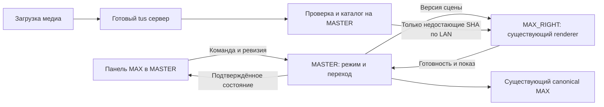

# Панель управления MAX на стенде — исследование и план

## Уточнение после начала реализации

06.10.2026, этап2: по последнему указанию пользователя устройство и иконки получили независимые переключатели. Прежнее каскадное скрытие иконок вместе с устройством из описания ниже отменено. При скрытом устройстве сохраняется его виртуальная геометрия; иконки могут оставаться видимыми. Используется существующий игровой WebGL foreground/maath, без линков к устройству; центр правой стены и относительная раскладка сохраняются. Текущий короткий этап объединяет существующие ассеты с относительным рядом иконок; загрузчик новых файлов остаётся отдельно. Порядок меняется стрелками, без нового механизма drag/drop. Состояние реализации и проверки: [контракт](../../apps/max-game/docs/CONTROL_PANEL.md), [отчёт этапа2](../../artifacts/reports/max-control-panel-slice2-20261006.md). Исследование ниже описывает также ещё не реализованные этапы.

06.10.2026. Статус: проект решения, не реализованная панель. Выполнены локальный аудит D/F и исследование готовых механизмов; три субагента независимо разобрали MASTER, renderer и библиотеки. Стенд, сервер, F, процессы и пользовательские данные не изменялись. Браузерные проверки не запускались.

## Решение

Добавить раздел «MAX» в существующую операторскую панель MASTER. Одна группа из четырёх переключателей выбирает ровно один режим. Под ней — собственный блок управления выбранным режимом. Открытие блока настроек другого режима само по себе не переключает стену.

Панель использует существующий защищённый операторский gateway. Первое размещение — на MASTER; доступ с операторского ноутбука/планшета по LAN оформляется через тот же контур, если он ещё не настроен. Публичный сайт посетителя не превращается в админку. В панели достаточно миниатюры текущего ассета и схемы устройства/иконок; постоянный видеострим стены и дополнительный WebGL-preview для базового управления не нужны.

MASTER хранит режим и настройки, MAX_RIGHT показывает принятую версию через существующее представление. Не создавать отдельный игровой backend, второй WebGL renderer или независимый фон. Общее заднее полотно, флюиды, Spout, звук MASTER и стандартная игровая механика сохраняются.



| Режим | Результат активации | Его блок управления |
|---|---|---|
| ID → ролики | Сразу запускается реальная автомиссия «Цифровой ID». После последнего задания — плейлист внутри устройства, повторяющийся до смены режима | Запуск заново, пауза/продолжить, интервал экранов (по умолчанию1с), текущий этап, список и порядок роликов, предыдущий/следующий ролик, состояние звука |
| Ассеты в устройстве | Независимая от миссий композиция: фон, затем устройство с выбранным медиа, затем иконки | Три состояния сцены, выбор ассета, показать/скрыть устройство, видео play/pause/repeat, два списка иконок, порядок/сторона/отступы/размер/активность, загрузка файлов |
| Стандартная игра | Штатный запуск через Стеллу, удержание, задания и действующее управление со смартфона | Готовность, текущая миссия/задание, состояние мобильного пульта, штатная отмена текущего запуска, повторный запуск только через разрешённый игровой сценарий |
| Только фон | На MAX остаётся общий фон; игровой foreground, устройство, иконки, QR и звук режима убраны | Фактически применённое состояние, состояние фонового renderer, возврат к выбранному игровому режиму. Не дублировать глобальные художественные настройки всего заднего экрана |

Смысл «контрольного пункта» здесь — блок управления внутри каждого режима. Параметры этих блоков сохраняются независимо. Переключение обратно возвращает настройки, но не оживляет отменённую игровую сессию.

## Что выяснено в текущем решении

1. `/max/show-mode` уже хранит enabled и screenDelayMs с commandId, CAS ревизии и receipts; диапазон500–10000мс, default1000мс. Но enabled лишь меняет следующий запуск MAX со Стеллы. Он не запускает показ сразу.
2. Сегодняшний show workflow требует `stationId=stella-main`, занимает реальную Стеллу и проходит tags/ribbon/wall. Для прямого запуска из новой панели нужен отдельный операторский вход, без выдуманного посетителя и ответов квиза.
3. `backgroundOnly` в MAX-адаптере — отдельный локальный параметр представления. Он не отменяет миссию и не освобождает очередь. Комбинация двух старых флагов не обеспечивает четыре корректных режима.
4. Панель MASTER — vanilla HTML/JS с существующим fleet gateway и защитой команд. Подключать React только ради этой панели не требуется.
5. Устройство с плавной сменой пропорций, Video.js-плейлист, движение иконок на maath, готовность ресурсов и ограниченный кеш уже существуют. Универсального загрузчика произвольных медиа и независимой сцены ассетов пока нет.
6. Новый stage watchdog покрывает schema4 launch/delivery, но не show и будущие переключения режимов. Нужны явные дедлайны и восстановление нового процесса переключения.
7. В локальных документах есть противоречие normal/background-only, а F содержит не все поздние D-дельты. Этот аудит не устанавливает, что именно сейчас включено на физической стене. Начало реализации — сверка manifest/SHA/config живой версии и принятие точного исходника. Не копировать старый background-only overlay поверх нового normal/mobile/diagnostics.

Подробные исходные пути и ограничения: [аудит действующего кода](../../artifacts/reports/max-control-panel-source-audit-20261006.md).

## Поведение независимой сцены

**Состояние1 — фон.** Устройство и иконки скрыты, выбранные ассет и раскладка сохранены. Никаких фиктивных task/completed/QR. Это локальная ступень режима «Ассеты», а не изменение глобального режима на «Только фон».

**Состояние2 — устройство.** В центре области MAX плавно появляется существующая оболочка устройства. После готовности внутри проявляется выбранный ассет. Отдельные команды «Показать устройство» и «Скрыть устройство» доступны всегда; скрытие сначала убирает иконки, затем содержимое и оболочку.

**Состояние3 — устройство и иконки.** Включённые иконки плавно появляются слева/справа с небольшим последовательным запаздыванием. Можно напрямую выбрать любую из трёх ступеней; промежуточные анимации выполняются автоматически. Без подготовленного ассета переход2/3 не применяется, панель показывает причину.

Предлагаемый default для независимого показа — центр правой стены4096×1280, то есть(2048,640) в её локальных координатах. Это отдельная неигровая сцена; положение и комфортная полоса стандартной игры не меняются. Размер всей композиции ограничен видимой областью MAX, без обрезки на стыке задней стены. Если требуется центр игровой LiDAR-зоны, это отдельный preset области, а не неявное смещение.

При замене портретного изображения широким видео остаётся та же оболочка: содержимое гаснет → меняются пропорции → готовое новое содержимое проявляется. Никаких пустых полей из-за различия phone/PC. Размер подбирается по реальному aspect ratio с ограничениями площади; крайние пропорции не создают огромную промежуточную текстуру. При ошибке подготовки старый ассет остаётся видимым.

Иконки организованы в два списка: «Слева» и «Справа». В каждом порядок задан **от устройства наружу**; рядом показывается схема фактического порядка слева направо. Оператор может перетаскивать, перемещать стрелками, менять сторону, включать/выключать, убирать из композиции. У каждой иконки стабильный instanceId и assetId, необязательная подпись; галочка выполнения в независимой сцене не добавляется.

Положение рассчитывается от края устройства: сторона, порядковый номер, общий gap, размер иконки, смещение поY. Значения задаются в логических пикселях стены, а не в пикселях окна панели. При изменении ширины устройства иконки плавно перестраиваются, сохраняя порядок. Переполнение показывается в схеме; допускается единое масштабирование композиции в пределах утверждённого минимума, иначе конфигурация отклоняется с объяснением. Не сжимать иконки до нечитаемого размера и не обрезать молча.

Порядок/параметры автоматически сохраняются после завершения жеста/короткой задержки ввода. В активном режиме новая допустимая версия применяется плавно после подготовки. В неактивном режиме редактируются только его сохранённые настройки. Загрузка файла не включает его автоматически на стене.

## Единое управление и переключение

Предлагается новый контракт `max-presentation-control-v1`; имена ниже ещё не являются существующими API.

```text
command: commandId, expectedRevision, mode, settingsRevision
state: desiredMode, effectiveMode, transitionId, modeEpoch,
       phase, settingsRevision, rendererBootId, lastError
phase: preparing → stopping → applying → active
       либо blocked / failed с конкретной причиной
```

В панели раздельно показываются «Выбрано», «Подготовка», «Применено на стене». Сохранённая настройка или принятый HTTP-запрос не означают, что режим уже виден. Мобильный пользовательский сайт `/max/game` не получает операторские переключатели/загрузки.

Порядок переключения:

1. MASTER проверяет commandId/revision, необходимые ресурсы и конфликты. При повторе потерянного ответа возвращается тот же receipt; другой payload с тем же ID отклоняется.
2. Атомарно закрывает новые MAX admissions и резервирует переход. Запрос Стеллы в этот момент получает понятный статус доступности; другие сервисы стенда не блокируются без реального конфликта общего ресурса.
3. Подготавливает целевые ресурсы, не скрывая ещё работающий экран. Ошибка медиа оставляет прежний режим.
4. Штатно завершает владение предыдущего режима: fade/audio stop, canonical cancel/release при необходимости. Не засчитывает недоигранную миссию как completed.
5. Применяет целевую версию в persistent presentation host; ACK проверяется по dataset/epoch/boot/revision. Только после подтверждения показ считается активным.
6. При timeout/offline остаётся понятный pending/blocked с журналом; старый ACK не может включить режим заново. Не имитировать успешную очистку lease.

Переключение свободной стены — одним выбором режима. Если есть посетитель или очередь MAX, обычная смена возвращает «Стена занята» и показывает причину. Отдельная явная команда «Завершить текущий запуск и переключить» отменяет по штатному API без зачёта. Очередь не стирается. Требуется durable gate не только новых admissions, но и продвижения уже queued DBOS workflows: текущий activate_assignment_v2 не проверяет режим и после освобождения слота может сам включить следующую миссию. Резервирование режима и разрешение активации очереди проверяются атомарно на MASTER. Пока этот gate не реализован, принудительное переключение при queue>0 запрещено. При возврате в стандартный режим сохранённые записи сверяются; политику устаревших ожидающих посетителей нужно согласовать в контракте до реализации, без массовой отмены по умолчанию.

Для прямого ID запуска — новый `max_operator_show_v1` с `source=operator`, без занятия stella-main фиктивным visit. По умолчанию он управляет только MAX_RIGHT: повторять сцену арки/ленты не нужно. В standard Стелла запускает обычный квиз; в id_video стена уже принадлежит операторскому сценарию и новая MAX admission не принимается. Старые уже начатые show workflows сохраняют свой replay/штатную очистку, но старый enabled-флаг после миграции не остаётся вторым переключателем. Legacy endpoint читает производное состояние нового authority; запись либо явно переводится в новую команду с её preconditions, либо возвращает понятный код перехода на новый API. Тихое создание фиктивного Stella visit запрещено. Общие canonical prepare/assign/observe/terminate переиспользуются.

ID действительно проходит все задания с интервалом1с после готовности экрана. Затем начинается цикл роликов в том же устройстве. Следующая автомиссия сама не запускается. Пауза — новый согласованный контракт: приостанавливаются canonical gameplay clock/deadline, автоэкраны, input owner и медиаплеер с сохранением остатка времени. Одной остановки auto advancement или master observe недостаточно: нынешний canonical EXPIRE может завершить такую миссию. Кнопка паузы входит в готовую поставку только после проверки этих гарантий, включая restart во время паузы. Перезапуск ID — новый управляемый run после очистки прежнего. Кнопка перехода сразу к роликам, если нужна, должна быть отдельной операторской отменой игры без ложного completed.

Использовать уже установленный DBOS3.2.0/SQLite для устойчивого выполнения и receipts. Новые семантические шаги — в новом workflow, старые replay-истории не переписывать. HTTP/renderer side effects остаются повторяемыми с проверкой идентичности; это последовательность подтверждаемых этапов, не «атомарная транзакция между компьютерами». Ограничения восстановления и изменения порядка durable steps описаны в [официальной документации DBOS](https://docs.dbos.dev/python/tutorials/upgrading-workflows); at-least-once внешние действия требуют идемпотентности, как в [официальном outbox-примере](https://docs.dbos.dev/python/examples/outbox). Новые возможности текущей онлайн-документации не считать автоматически доступными в pin3.2.0.

## Медиа, загрузка и готовые компоненты

Рекомендуемый механизм загрузки — готовый Uppy с tus-клиентом и готовым сервером tus, единый путь для изображений/иконок/видео. Он должен реально возобновлять прерванную передачу; собственный протокол кусочной загрузки не проектировать. Для vanilla панели — SortableJS с сохранением порядка только после drop и отдельными клавиатурными стрелками. Точные версии, лицензии, серверный кандидат и ограничения зафиксированы в [ресерче компонентов](max-control-panel-libraries-20261006.md); окончательный lock — после короткой проверки на принятом Windows/Node runtime.

Выбранные кандидаты: Uppy core6.2.0/Dashboard6.0.1/Tus6.0.0 и tusd2.10.1 Windows amd64 (MIT); SortableJS1.15.7 (MIT). Для SVG — resvg-js2.6.2 (MPL-2.0), совместимость native addon с принятым Windows/Node ещё требует проверки. Это не уже установленные зависимости. tusd добавляет один управляемый upload-процесс с health/storage limits в существующий launcher. Если SVG gate не пройден, первый срез явно ограничивается растровыми иконками; произвольный SVG не принимается через небезопасный обход.

Хранилище на MASTER отделено от сборок и visitor media. Файл получает неизменяемый SHA/assetId, оригинал и проверенную производную версию. Пользовательский filename — только подпись. Повторный SHA переиспользуется. Ассеты игры можно выбрать из текущего каталога без повторной загрузки и изменения их разметки.

Цепочка статусов: `загружается → проверяется → готов на MASTER → доставлен на MAX_RIGHT → подготовлен → показан`. Визуальное применение разрешено только после подготовки нужной версии. Сбой/отмена загрузки не меняет сцену. Не передавать URI произвольных файлов или внешних сайтов непосредственно в renderer.

В первую поставку входят JPEG/PNG/WebP и поддержанные MP4 для устройства; PNG/WebP и безопасно нормализованный SVG для иконок. Размер/разрешение/кодек/длительность проверяются готовыми декодерами и FFprobe. SVG не исполняется inline: скрипты, внешние ссылки и foreignObject недопустимы; нужна безопасная нормализация готовым растеризатором. Текущий Figma extractor не является универсальным импортом. Конкретные лимиты файлов и количества элементов определяются на целевом ПК коротким квалификационным тестом, не выдаются за измеренную пропускную способность сейчас.

Подготовка тяжёлых ассетов выполняется вне кадрового пути. Постоянно загружены shell/font/basic icons; декодируются текущий и следующий медиа, не весь каталог. Существующие ограничения растров/кешей сохраняются. Замена отменяет устаревшие async результаты и освобождает их ресурсы. Видео обслуживается с Range; один воспроизводящийся и максимум один подготавливаемый элемент, без одновременного воспроизведения всего плейлиста.

MASTER → MAX_RIGHT передаёт по LAN только отсутствующие SHA; повторный полный пакет игры не нужен. Удаление из сцены не удаляет файл. Используемый/подготавливаемый файл защищён от удаления; очистка неиспользуемых медиа — отдельная операция. Аудио идёт через существующую MASTER/Dante authority с версионной регистрацией нового asset, не дублируется локальными колонками браузера.

## План реализации короткими итерациями

| Этап | Конкретный результат | Приёмка перед следующим этапом |
|---|---|---|
|0. Сверка и контракт|Живой baseline/SHA, текущая конфигурация, agreed mode/queue/admission contract, разделённые владельцы файлов|Согласованный источник без отката mobile/logging/recovery/audio; миграция сохраняет фактический выбранный режим|
|1. Первый вертикальный срез|Панель и настоящий standard ↔ background переход через MASTER с ACK, одним mode owner и сохранением настроек|Переключение, reload, потерянный ответ, занятая миссия, сохранённый фон и возврат ввода; короткая пользовательская проверка|
|2. Устройство с существующим ассетом|Независимый режим, ступени1/2, выбор готового catalog asset, показать/скрыть, морфинг по aspect|Нет фиктивной игры; смена портрет/landscape и отмена подготовки не создают пустой экран|
|3. Иконки и загрузчик|Ступень3, два списка/перестановка/активность/relative layout, библиотека новых файлов с resume/readiness|Стороны/порядок/overflow, плохой файл, прерванная загрузка, SHA reuse, иконки плавно сопровождают morph|
|4. ID → бесконечные ролики|Прямой operator workflow, действительное завершение ID, скорость1с, циклический playlist и per-mode controls|Без Стеллы/фиктивных ответов; один и несколько роликов, pause/restart, выход в любой режим без audio/lease хвостов|
|5. Общая проверка и применение|Все12 направленных смен режимов, миграция/рестарт, scoped delta MASTER/MAX_RIGHT, при необходимости узкий статус доступности STELLA|Резерв, SHA до/после, сохранены данные, protocol/logs PASS; физическая приёмка всех режимов пользователем|

Не включать заглушки четырёх режимов и называть панель готовой. Каждый этап — работающий срез, после него обратная связь пользователя. В финальной поставке все четыре режима и их блоки управления должны быть реально подключены.

## Субагенты и владение

Одновременно root + три исполнителя, без второго владельца одного файла:

- **АгентA, MASTER/контракт:** новые models/store/workflow/API, admission/очередь и миграция; работает в изолированном D-кандидате относительно принятого F. Shared gateway изменения передаёт root, F сам не меняет.
- **АгентB, MAX renderer:** независимый presentation adapter, device morph/layout hooks, версии ACK, отмена анимаций/подготовки. Не меняет master business state и uploader.
- **АгентC, медиа:** Uppy/tus интеграция, валидация/manifest/кеш/доставка, lifecycle файлов; не меняет renderer или игровые каталоги.
- **Root:** операторская панель, согласование схемы, shared entrypoints/lockfiles/build, интеграционные тесты и единая передача назначенному интегратору. Когда один исполнитель освобождается — независимый review чужой части, без повторной реализации.

Сначала контракт и fixtures, затем независимая работа A/B/C; сборки и интеграция последовательны. Для каждой передачи: точные SHA/source, defaults/миграции, зависимости/лицензии и результаты. Удалённое применение выполняет один назначенный владелец; запись F/TODO — только интегратор. Нельзя обновить только живую стену и оставить следующей master-сборке старую версию.

## Обязательные проверки

-12 направленных смен между режимами, повтор текущего режима без нового run, настройки сохраняются раздельно.
-Два оператора, CAS-конфликт, retry того жеcommandId после потерянного ответа; новая команда не оживляет отменённую подготовку.
-Гонка admission Стеллы/телефона со сменой режима; очередь не теряется, публичный пульт не управляет демонстрационными ассетами.
-Сбой MASTER/MAX на этапах reserve/cleanup/prepare/apply и восстановление; старые epoch/boot/dataset ACK отвергаются, releasing не выдаётся за free.
-Смена ассета во время morph, hide в середине появления, отключение видео, нечитаемый/неготовый ресурс, отсутствие декодерных утечек и повторной загрузки всего каталога.
-Фон и стык X=3072 не меняются, устройство и иконки не обрезаются; обычная зона игры остаётся прежней, device/video использует ту же оболочку.
-Подтверждённые gameReady/visibility/audio состояния и журнал переходов. CPU/HTTP/SQLite тесты не заменяют проверку LED/плавности/звука; браузер/визуальный сценарий — только по прямому запросу пользователя.

Новая конфигурация с нуля: standard. Миграция существующего стенда: сохранить фактически подтверждённый текущий режим, не включать игру поверх явно выбранного фона. Старый enabled=true без активной сессии означает «вооружён следующий запуск», а не запущенный ID; импорт этого флага сам не должен стартовать миссию. Такое состояние требует явного выбора оператора после миграции с сохранением прежнего foreground до команды. Панель после reconnect читает серверное состояние и не отправляет автоматически последний локальный переключатель.

Трафик SIM: RX не измерено; TX не измерено; всего не измерено; учёт: не измерено; основание: локальный аудит D/F и web-ресерч без подтверждённого маршрута через SIM, 0МБ передачи файлов на стенд, WAN-счётчик не опрашивался; остаток: неизвестен. Подзадачи учитываются один раз в WORKLOG.
