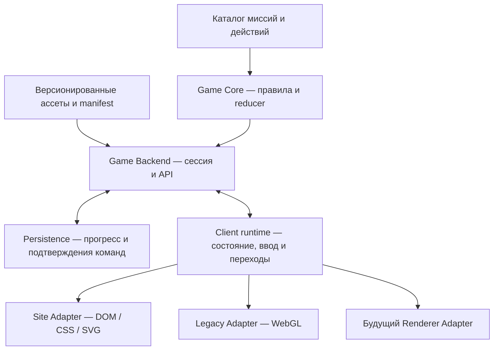

# MAX — единый backend и подключаемые визуализации

02.10.2026. Архитектурное решение по запросу пользователя. **Статус: предложение для реализации; runtime пока прежний.** Основание — [технический аудит](../../artifacts/reports/max-shared-backend-audit-20261002.md), [карта контента](../../artifacts/max-game/design/site-game-content-map-20261002.md) и требование независимо развивать логику, ассеты и любые новые визуализации.

## Решение

Модульный backend с чистым игровым ядром, версионируемым каталогом контента и контрактом Renderer Adapter. В работающем стенде **один backend владеет сессией**, её ответами и прогрессом. Site и Legacy — реализации одного renderer-контракта. Смену изображения, движение, GPU и hit-test выполняет клиентский presentation-runtime, общий для адаптеров по политике переходов, но с отдельными механизмами отрисовки.

Серверный модуль MAX размещается в существующем Stand Service через отдельный `/api/max-game/v1`, с изолированным владельцем сессий и хранилищем. Он не вмешивается в backend других приложений. Чистое ядро также запускается в Node CPU-тестах и явно выбранном автономном preview с тем же контрактом. Автономный preview не становится вторым владельцем серверной сессии и не выполняет автоматический offline takeover.



Рендерерам запрещены собственные миссии, reducer ответов, бизнес-ветки, localStorage прогресса и самостоятельный зачёт. Изменение действия/текста/ассета происходит в общем каталоге и отражается в обеих визуализациях. Изменение свечения/материала не меняет session state.

## Границы и ответственность

| Модуль | Владеет | Не зависит от |
|---|---|---|
| Contracts | JSON-схемы команд, snapshot, screen, assets, renderer capabilities | DOM/Three/сервисных конфигов |
| Content | шесть миссий, task/screen/action IDs, текст справа, варианты/результат, зависимости, ветки, hotspots, gaps | CSS/shaders/этапов motion |
| Asset Manifest | assetId, revision/hash, URL, размеры, тип, origin, hotspot coordinates, текстовые коррекции | выбранного renderer |
| Game Core | правила действий, один current task, ответы, scan fact, skips, зачёт, финал, логическая политика timer | браузера, сети, файлов, Three, анимации |
| Backend Application | session ownership, command queue, revision/idempotency, storage, выдача view snapshot | конкретной визуализации |
| Client Runtime | connection, общий sequence переходов, подготовка ресурсов, focus/input gating, контакты и clock | содержимого конкретной миссии и shader-реализации |
| Renderer Adapter | mount/update, готовая поза, hit-test, DOM/SVG или GPU, dispose | persistence и принятия ответов |
| Layout/Profile | габариты поля, safe zones, renderer footprints, базовые ручные координаты и временные сдвиги | условий правильности ответов |

Зависимости идут от адаптеров к контрактам/ядру, не обратно. Browser `Image`, `document`, `localStorage`, `THREE` и сетевой `fetch` не импортируются в Game Core. Media decoding реализуется browser-портом; `initTexture` и release GPU — только WebGL-портом. Сервер выдаёт описание ресурсов, а не texture/HTML.

## Канонический каталог

Использовать существующие стабильные mission IDs: `blogger`, `digital-id`, `communication`, `business`, `demo-benefit`, `demo-business`. Сохранённые site aliases `id/benefit-test/business-test` обрабатываются только migration-адаптером. Текст метки не является ID. Узел маршрута, задание, экран задания и действие имеют разные IDs.

Пример канала: task `blogger.channel`, screen `blogger.channel.chats`, action `channel.open-create-menu`. Public/private — именованные ответы; numeric answer 0/1 остаётся только в legacy migration. Один экран включает `deviceKind: phone|pc`, assetId, информационный copy, описания действия и native hotspot rect. Raw markup в каталоге отсутствует.

Экран переключается после семантического действия, а декоративное перелистывание не получает зачёт. У этапа явно указаны `manual|automatic|choice`, ожидаемое действие и результат. Voice → video, бизнес platform → sector → tool, test business без ID и пары сцен Мишки применяются одинаково к обоим скинам. Историческая механика ручной сборки пути — отдельный scenarioId, если её потребуется сохранить; она не включается неявно выбором WebGL.

Gap описывается данными: reason, available context asset, допустимый skip. Skip записывается как skipped, не completed. Menu coverage рассчитывается одним backend-проектором по каталогу, включая три бизнес-ветки; новое изображение автоматически меняет статус только после проверки его смыслового назначения. Наличие файла не означает наличие сценария.

## Состояния и хранение

Разделить три состояния:

1. **GameState, долговременное:** schema/content/rules revision, sessionId, scenarioId, current mission/task/screen IDs, scan facts по миссиям, ответы с actionId, business tool, completed/skipped tasks, timer checkpoint и revision.
2. **PresentationState, временное:** sequenceId, rendererGeneration, loading/transition/settled, pending presentation, input readiness. Не мигрирует как прогресс; после reload восстанавливается безопасная остановка с продолжением текущего задания.
3. **LayoutState, отдельное долговременное:** layoutId и base positions по nodeId. Временные раздвиги вокруг телефона, camera interpolation, velocity/alpha и DOM rect не сохраняются. Размеры/фон/skin preference не входят в ответы.

Одна серверная сессия может иметь несколько клиентов-наблюдателей и одного владельца ввода. Второй renderer не получает отдельный GameState; он отображает тот же snapshot. Lease и generation отсекают события отключённого владельца. Для стенда owner привязывается к существующей игровой зоне/instance, а не к названию скина. Разные игроки/зоны остаются независимыми сессиями.

Целевое долговременное хранилище — **SQLite за PersistencePort**: sessions, processed_commands, completion_receipts. Принятие команды, новая revision и receipt записываются одной транзакцией, ответ клиенту отправляется после commit. Повтор после обрыва связи с тем же commandId возвращает прежний результат и не засчитывает задание второй раз. Snapshot — основной способ восстановления; записи команд нужны для дедупликации/диагностики, не для бесконечного replay всего движения.

SQLite обеспечивает транзакционную запись; встроенный Node API `DatabaseSync` синхронный. Поэтому его применять в изолированном backend/storage worker, не блокируя server/render transport loop. Это опирается на [SQLite transactions](https://www.sqlite.org/transactional.html) и [Node SQLite API](https://nodejs.org/api/sqlite.html). Native API в текущей документации имеет статус release candidate: доступность и API конкретного Electron/Node хоста проверяются перед подключением. Shell Node v25.9.0 поддерживает импорт, production Electron этим не проверен. При отсутствии драйвера выбирается совместимый SQLite-адаптер отдельно; скрытого fallback на браузерный прогресс нет.

Конфигурация backend хранится в `apps/stand-service/configs/`, например max-game.json; DB текущей игры — в отдельном runtime data подкаталоге там же, с явным исключением пользовательских данных из исходников/релизной замены. Сборка не перезаписывает DB; перенос стенда включает согласованную backup-копию, а не только SQLite-файл при активной записи. Ассеты и каталог — в переносимом `apps/max-game/shared/`.

## Протокол backend

```text
GET  /api/max-game/v1/catalog
POST /api/max-game/v1/sessions
GET  /api/max-game/v1/sessions/:id
POST /api/max-game/v1/sessions/:id/commands
GET  /api/max-game/v1/sessions/:id/events       (SSE)
POST /api/max-game/v1/sessions/:id/input-owner  (acquire/renew/release lease)
POST /api/max-game/v1/sessions/:id/contacts     (ordered InputPort events)
PUT  /api/max-game/v1/sessions/:id/layouts/:layoutId
```

Command envelope: `sessionId, commandId, expectedRevision, contentRevision, ownerId, ownerGeneration, actionId, taskId, screenId, payload`. Команды SELECT_MISSION, ACT, RESUME, RESTART_MISSION, RESET_PROGRESS, RETURN_TO_MENU; произвольного SET_DONE нет. Типы/допустимые действия сверяются с текущим экраном. SELECT/RESTART/MENU инвалидируют незавершённый контакт/устаревший presentation request.

Очередь последовательна по sessionId. Повтор commandId сначала проверяется в receipts; новая команда с устаревшей revision получает conflict и актуальный snapshot. Ошибочный выбор возвращает notice без продвижения. Client может сразу показать feedback нажатия, но новое семантическое состояние принимает только из backend ACK. HTTP — для смысловых действий, SSE — revisions/snapshots; не передавать координаты каждого анимационного кадра через сеть.

Lease выдаёт backend; присланный произвольный ownerId не даёт права на ввод. Contact API не принимает completed/scanPassed: verifier сам переводит подтверждённое удержание в событие ядра. Layout сохраняется отдельно с layoutRevision, nodeId, base positions и idempotency key; смена положения не увеличивает GameState revision и не конфликтует с ответом. Runtime ограничивает частоту/размер входных сообщений; временные позы в этот API не отправляются.

При reconnect клиент запрашивает snapshot и продолжает с подтверждённой revision; пропущенные SSE не теряют прогресс. При недоступном backend сохраняется последний подтверждённый экран, показывается восстановление связи, отправка ответов приостанавливается. Незавершённая команда повторяется с прежним commandId. Не переключать authority автоматически на localStorage.

ClockPort вводится явно: backend application владеет логическим временем сессии и проверкой удержания; renderer только отображает countdown и hold. Input Adapter передаёт нормализованные down/up/cancel, выход из зоны и потерю контакта с contactId, sequence и монотонным временем; высокая частота координат остаётся локальной. Один контакт владеет удержанием 0,8 с. Потеря владельца/видимости отменяет незавершённый контакт, устаревший sequence отвергается; renderer не может сам выдать scanPassed. Согласование часов browser/server и границы задержки проверяются отдельно в первом сетевом срезе. Preview вызывает тот же verifier напрямую, без сетевого транспорта.

Политика timer также общая: 180 с активной миссии, включая переходы и ожидание задания; меню останавливает её, restart начинает заново. При потере владельца ввода/скрытии текущая сессия приостанавливается с сохранённым остатком; новый owner возобновляет подтверждённое время. Backend не обязан хранить 60 тиков в секунду: достаточно checkpoint/deadline, а renderer интерполирует отображение. События скрытия и owner heartbeat проходят application-порт. Ручной drag завершается записью base position на отпускании. Hokuyo подключается как существующий InputPort отдельно, без распознавания ладони в этой миграции.

## Контракт visual adapters и переходов

Renderer Adapter предоставляет:

```text
describeCapabilities() -> contractVersion, phone, pc, hotspots, textLayers
mount(surface, runtimePorts)
prepare(viewDescriptor, assetHandles, requestToken) -> ready / error
present(frame)                                  // готовые позы и presence
hitTest(point) -> actionId/nodeId + transformed bounds
dispose()                                      // cancel, release, unsubscribe
```

`ViewDescriptor` содержит node/edge IDs, current task/screen, device description, instruction copy, resource IDs и разрешённые действия. Он не содержит HTML, Three.Mesh, CSS selector или game-specific callback. Размеры UI/аннотаций заданы в родных координатах ассета; адаптер масштабирует картинку и hotspot одним transform. Заголовок-коррекция публичного кадра становится общим content annotation, а не CSS-костылём только Site.

Client Runtime владеет sequence reveal → arrange → connect/shift → device enter → task → result → device exit → next connection. Он запускает подготовку следующего descriptor заранее, объединяет результат/навигацию и умеет ждать фактическую посадку через адаптер. Backend не ждёт отрисовки каждого кадра и не считает arrival ответом; готовность текущего presentation открывает допустимый ввод через sequence/generation guard.

Физические позы и интерполяция принадлежат общим Motion primitives либо реализации адаптера с одним владельцем на значение. Link читает фактические порты, caption/device/actions читают ту же presence. Прерывание сохраняет видимую позу, stale callback проверяет session/revision/sequence/generation. На reload текущий screen появляется с RESUME, без нового зачёта/повторного scan. Reduced motion сокращает визуальные перелёты, сохраняя смысл и 0,8 с hold.

Asset decode и GPU upload отделены: ресурс имеет loading/decoded/error, а renderer.prepare подтверждает собственную готовность. Прогреваются текущий и ближайшие кадры; ограниченный кеш и освобождение ресурсов принадлежат ResourceRuntime, а GPU handles — WebGL. Предыдущий кадр сохраняется при ожидании. Плашка загрузки включается после 800 мс, ошибка/таймаут имеет retry. Готовность ассета не завершает задание. Задержка GPU не может бесконечно запереть progression: bounded prepare переводит в recoverable paused/error, не в fake completion.

Смена скина: заблокировать новые ACT → отменить контакт/drag без временного commit → сохранить base poses → создать новый rendererGeneration → prepare нового адаптера по текущему descriptor → отключить старые hit-targets и dispose после передачи → RESUME того же task/screen. Session/revision/ответы остаются прежними. Если prepare не удался, прежний renderer продолжает владение после явного abort; оба не принимают ввод одновременно. Выбор доступен параметром/настройкой bootstrap, но физический selector — отдельная UI-итерация.

## Независимая работа над тремя частями

| Изменение | Где править | Что получают остальные |
|---|---|---|
| Порядок миссии, действие, зачёт | Core/Content | Новые descriptors через прежний контракт |
| Инструкция, фото, скриншот | Content/Asset Manifest | Одна новая content revision для всех renderer |
| Свет, материал, flight, blur | Renderer/Presentation profile | Прежние semantic commands/snapshots |
| Новый renderer | Новый Adapter package | Каталог/ядро/прогресс уже существуют |

Asset manifest и content release публикуются атомарным комплектом. URL с hash/revision не меняет bytes задним числом. Если картинка заменена/обрезана, hotspot geometry обновляется в той же revision. Текущая сессия закреплена за совместимой content revision; новые sessions берут новый комплект. Изменение логики до другого графа экранов требует migration, а смена цвета/текста обычно не меняет прогресс. Исторические исходные Figma/клиентские PNG сохраняются.

Совместимость определяется `apiVersion`, `contentRevision`, `rulesRevision` и `rendererContractVersion`. Сессия закреплена за совместимыми контентом и правилами: новый backend либо сохраняет поддержку её rulesRevision, либо выполняет явную миграцию на безопасной границе задания. Нельзя незаметно менять условия зачёта открытого экрана. Добавление необязательного поля обратно совместимо; обязательная новая способность требует capability-check и явной несовместимости. Неизвестное обязательное действие/экран не скрывается и не получает авто-зачёт. Старый renderer тестируется на новой версии ядра отдельной матрицей совместимости.

Для параллельной разработки renderer имеет read-only fixture provider: те же descriptors и командные ответы, без подключения к реальному session store. Это позволяет менять look без изменения progress. Fixtures версионируются с контрактом и проверяются на валидность, не заменяют проверку реального backend. Logic-тесты работают вообще без browser/GPU.

## Размещение будущей реализации

```text
artifacts/max-game/src/contracts/               схемы и валидация
artifacts/max-game/src/core/                    reducer, invariants, selectors
artifacts/max-game/src/content/                 миссии, задачи, manifest
artifacts/max-game/src/application/             session/commands/ports
artifacts/max-game/src/presentation/            общий runtime и motion
artifacts/max-game/src/renderers/site/          CSS/SVG adapter
artifacts/max-game/src/renderers/legacy/        WebGL adapter
artifacts/service/max-game/                     API host и persistence worker
apps/max-game/shared/                          результат штатной сборки
```

Это будущие подкаталоги в существующих разделах, не новые корневые приложения. Использовать текущие ESM-модули; новые фреймворки/переписывание на другой стек для разделения не требуются. У контрактов runtime validation и JSDoc-типы; несовместимые импортные зависимости ловит build/test gate.

## Переход короткими итерациями

Последнее уточнение пользователя: основной упор на logic/backend; существующий визуал переносить после этого, отдельный стенд для разработки визуала не создавать. Это меняет прежнюю очередность подключения адаптеров, сохраняя границы архитектуры.

1. **Первый срез: каталог и чистое ядро.** Общие screen/action IDs, public/private, immutable GameState, команды/revision/receipts и restore. Канал — проверочный сценарий ядра; внешнего изменения нет. Эти два исходных этапа реализованы, [статус](../../apps/max-game/docs/SHARED_BACKEND.md).
2. **Application/SessionPort.** Владелец сессии, очередь команд, snapshot/subscriptions и projection в descriptor; headless-проверки без отдельного визуального стенда.
3. **Backend host и durable session.** PersistencePort/API/SQLite worker после проверки реального хоста. Тесты commit/retry/reconnect и независимых зон; текущий мастер не переключать.
4. **Механика миссии и остальные задачи.** Scan/timer/progression/reset, затем задания по одному: комментарии/статистика, ID/сюжетные пары, общение, бизнес/тесты. Один каталог, gap semantics, phone/PC.
5. **Миграция и комплект логики.** Явный импорт выбранных сохранений, версии правил/контента, сборщики и guards независимости. Не додумывать ответы, не перезаписывать исходные данные.
6. **Перенос существующего визуала.** Подключить Site, затем Legacy к готовому SessionPort. Сохранить материалы/хореографию, заменить владельцев ответов/прогресса; подтвердить смену renderer на текущем screenId. Отдельные новые визуальные решения не входят в архитектурный перенос. Переключение назначения мастера и публикация — только отдельный запрос после локального отзыва.

Старые standalone/client/guided страницы сохраняются как зафиксированные сценарии для возврата. Adapter Legacy новой игры использует их визуальные компоненты с новым сценарием; старую семантику builder не смешивать с новой guided механикой.

## Миграция и критерии готовности

Исходные localStorage keys не перезаписываются. Migration читает только указанный пользовательский export/profile, маппит semantic IDs/версии и создаёт новый session record с provenance. Текущий site-channel v2 позволяет доказать screen/type/completed; старые три channel stages не эквивалентны десяти новым экранам. Без доказанного соответствия восстановить ближайший безопасный незавершённый этап, сохранив исторический результат отдельно. Не подставлять правильные ответы. Index positions преобразуются в nodeId только при совпадении известной версии маршрута. Базовые ручные координаты преобразуются по layout contract, не pixel-to-pixel между разными геометриями.

Готовность архитектуры подтверждается проверяемыми условиями:

- Одинаковые команды обоих renderer дают одинаковый GameState и receipts; private/public, три бизнес-ветки и gaps покрыты CPU-тестами.
- Смена renderer в середине screen/phone transition не меняет ответы, scan, current task и completed; устаревший renderer не может ответить.
- Повтор ответа, reconnect и restart после commit дают один зачёт; DB transaction сохраняет state и receipt вместе.
- Замена фото/копирайта обновляется в обеих skins через один manifest, а styling patch не меняет catalog/core hash.
- Engine работает в Node без DOM/Three; сборщик запрещает циклическую/обратную зависимость на renderer. Оба runtime включают одну content revision и все её ресурсы.
- Drag/смена экрана/reduced motion и pause проверяются малыми CPU-тестами; визуальную приёмку двух adapters выполняет пользователь. Тяжёлые GPU-тесты отдельно согласуются.

Ни первый срез, ни этот документ не считаются переносом всех шести миссий. Действующая игра продолжает работать по прежней архитектуре до отдельных малых изменений.
