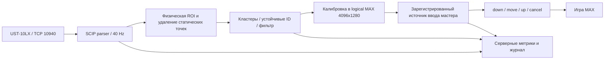

# Касания MAX через верхний UST-10LX

Дата: 01.10.2026. Статус: исследование и предложение архитектуры, **не реализация ввода**. Новые измерения, включение лазера, изменение удалённых ПК и патча TD не выполнялись. Модель исследована по WEB-коду; монтаж и реальные касания пока не проверены.

## Рекомендация

Использовать имеющийся Hokuyo UST-10LX как оптическую завесу: сверху по центру **плоского игрового участка**, плоскость сканирования вертикальна и параллельна экрану, проходит близко перед его лицевой поверхностью. Рука пересекает завесу; её положение преобразуется в координаты игрового полотна. Обрабатывать сканы отдельным небольшим CPU-процессом на ПК MAX, независимо от Spout, WebRTC, TD и FPS рендера. В первую итерацию передавать один устойчивый контакт в существующий pointer-тракт мастера.

Это наиболее прямой путь с уже найденным оборудованием. **Один 2D-лидар не измеряет давление и расстояние пальца по нормали к экрану.** Он обнаруживает пересечение плоскости, то есть приближение, которое мы можем трактовать как касание. Если обязательно отличать физическое касание от пальца в нескольких миллиметрах перед экраном, нужна дополнительная контактная система. Настройка дальности лидара этого не решает: дальность измеряется от датчика вдоль луча, а не от экрана.

Предположение о плоскости основано на текущей геометрии проекта. Фактическая плоскость LED/защитного покрытия, швы модулей, выступы и точка крепления должны быть подтверждены монтажом. Изогнутую игровую поверхность одна плоская завеса не покрывает корректно; программная калибровка это не исправит.

## Что подтверждено в проекте

Датчик `192.168.50.111:10940` идентифицирован как UST-10LX, SCIP 2.2, прошивка 4.0.0-A. Чтение VV/PP/II из ПК MAX `DESKTOP-64J4BMN`, `192.168.50.91`, успешно; на момент чтения лазер выключен. Ответы и контрольные суммы сохранены в [аппаратном отчёте](../../../artifacts/reports/hardware-readiness-20261001/LIDAR.md). Это подтверждает связь и модель, но не качество измерений руки.

В текущем сервисном маршруте запускается `guided-reveal/?surface=right&service=1&layout=single`, а не историческая игра с двумя зонами. Проверены исходники:

- [max-game-worker.js](../../../artifacts/service/public/max-game-worker.js): активный маршрут.
- [circle-model.mjs](../../../artifacts/max-game/src/circle-model.mjs): полотно, плоский участок, игровая область.
- [journey-guided-main.js](../../../artifacts/max-game/src/journey-guided-main.js): сервисное полотно 4096×1280 и размещение игровой области.
- [surface-geometry.json](../../../artifacts/service/public/surface-geometry.json): координаты и UV модели.
- [contracts.mjs](../../../artifacts/shared/contracts.mjs), [input-router.mjs](../../../artifacts/service/input-router.mjs), [server.mjs](../../../artifacts/service/server.mjs), [game-page-host.mjs](../../../artifacts/service/game-page-host.mjs): фактический ввод.

| Параметр | По текущему коду/модели |
|---|---|
| Правое логическое полотно | 4096×1280 |
| Плоский участок справа | X ≈2192…4096 |
| Активный прямоугольник Guided Reveal | X=2264…4024, Y=192…1216; 1760×1024 |
| Физический размер этой области | ≈3,572×2,020 м |
| Нижняя / верхняя граница над полом | ≈0,614 / 2,634 м |
| Центр по X правого полотна | 3144 px |
| Центр в общем заднем полотне | 6216 px, с учётом начала MAX на X=3072 |

Это оценка из GLB-derived WEB-геометрии, **не исполнительный обмер и не финальная аппаратная пиксельная карта**. Горизонтальный и вертикальный масштаб здесь различаются: ≈2,030 и ≈1,973 мм/px. Нельзя получать физическую ширину игрового участка только из вертикального масштаба. [Воспроизводимый расчёт](geometry-calculation.py), [результат и SHA исходной геометрии](geometry.json).

В старом `INTERACTION_BAND` задана высота 1,0…1,8 м. Текущая Guided Reveal размещает host в большем прямоугольнике; старую полосу нельзя считать действующим ограничением всего её ввода. Отдельный вопрос UX: верхняя часть на 2,63 м недоступна большинству посетителей. Калибровка может покрывать весь прямоугольник, а реальные обязательные hit-target следует проверить на доступной высоте. Перестройка интерфейса в это исследование не входит.

## Возможности и пределы датчика

UST-10LX сканирует 270° с угловым шагом 0,25°, один оборот занимает 25 мс: **40 сканов/с**. Паспортная дальность — 10 м для белой мишени и 4 м при отражении 10%; точность ±40 мм и повторяемость σ<30 мм указаны для заводских условий с белой мишенью. Значение DMAX=30000 в ответе PP не означает гарантированное обнаружение руки на 30 м. [Спецификация Hokuyo, с. 2–4](https://www.hokuyo-aut.jp/dl/UST-10LX_Specification.pdf).

По геометрической оценке при оптическом центре на 100 мм выше игровой области дальний угол находится на 2,77 м; при 100 мм выше всего экрана — на 3,07 м. Это два расчётных примера, а не утверждённые точки крепления. Покрытие по углам помещается в сектор датчика при направлении центрального луча вниз; нужно исключить закрытие боковых лучей креплением.

Шаг между лучами приблизительно `r × 0,25°` в радианах: около 12,1…13,4 мм у дальних углов. Палец шириной 20 мм там может дать лишь 1–2 отсчёта; правило «не менее трёх точек на контакт» способно пропускать реальные нажатия. Пространственный шаг не равен точности: добавляются ошибка дальности, поверхность руки, угол, нестабильный центр кластера и ошибка монтажа. Нельзя обещать точность до одного пикселя или миллиметра по этому паспорту.

40 Гц ввода совместимы с отображением на 60 FPS: новые измерения приходят каждые 25 мс, а графика может интерполировать курсор между ними. Интерполяция не превращает датчик в 60-герцовый и не должна создавать вымышленные нажатия. В исследованиях лазерных интерактивных поверхностей отмечено перекрытие дальних объектов ближними; прогноз траектории не восстанавливает невидимое касание. [Paradiso et al., Ubicomp 2002](https://resenv.media.mit.edu/pubs/papers/2002-09-UbicompSurfaces.pdf).

## Монтаж

Вид спереди: датчик над центром игрового прямоугольника, сектор направлен вниз и в стороны. Вид сбоку: экран и плоскость сканирования параллельны; между ними небольшой рабочий зазор. Лидар нельзя направлять перпендикулярно на экран как камеру: тогда он измерит линию на поверхности, а не всю двумерную игровую область.

Нужно регулируемое жёсткое крепление: наклон плоскости на 1° даёт уход примерно 35 мм за 2 м; даже 0,2° — около 7 мм. Гомография не компенсирует отсутствие руки в сканирующей плоскости. Зазор выбирать по натурной проверке луча, ровности стены и покрытия. Диапазон 5–15 мм можно исследовать как начальную гипотезу, но это **не характеристика UST-10LX и не готовый монтажный допуск**; подходящий зазор может оказаться больше.

Проверить верхнюю кромку и корпус датчика, выступающие LED-модули, руки возле боковых границ, нижние углы и посетителя, стоящего вплотную. Сверху удобнее отделить тело от приэкранного слоя, но предплечье всё ещё может пересечь его раньше пальца. Необходимо проверить разные позы, одежду и освещение.

## Предлагаемый тракт



### Получение сканов

Один владелец TCP-сессии получает непрерывные дистанции; два потребителя не должны независимо управлять одним датчиком. Порт фиксирован 10940; для потока предусмотрена MD, для управления измерением BM/QT. Драйвер должен явно учитывать состояние датчика и корректное завершение. [Официальный протокол UST](https://www.hokuyo-aut.jp/dl/UST_Communication%20Protocol%20Specification_en.pdf). В исследовании эти команды не выполнялись.

SCIP parser обязан собирать сообщения из произвольных TCP-фрагментов, проверять статус и checksum, восстанавливать границы после повреждения, разворачивать время датчика и создавать новый epoch после переподключения. Диапазон лучей берётся из PP: 0…1080 включительно, 1081 значение. Недействительные измерения не превращать в точку у начала координат. Ответы с кодами ошибок обрабатывать отдельно от нормальных дистанций. Не учиться на ошибочно пустом скане.

Для полного потока 1081×40 получается 43 240 дистанций/с; при трёх символах на дистанцию это ≈130 кБ/с, ≈1,04 Мбит/с только полезных дистанций, плюс framing/TCP. Нагрузка LAN небольшая относительно видеопередачи. CPU-обработку нельзя заранее считать измеренной, но масштаб не требует растеризации полноразмерной текстуры или GPU-readback.

### Обнаружение и сопровождение

Угол определяется шагом относительно AFRT=540: `(step−540) × 360/1440`. После проверки ориентации точки переводятся в XY сканирующей плоскости и физические миллиметры. Знак горизонтальной оси/поворот подтверждать калибровкой, а не угадывать по изображению превью.

Последовательность обработки:

1. Отсечь невалидные дистанции, точки вне физического полигона ROI и известные рамки/крепления.
2. При пустой области записать устойчивые статические возвраты по лучам: медиана и разброс. Где возврата нет, учитывать появление валидной точки, а не вычитать фиктивную дальность. Не обновлять baseline на удерживаемой руке.
3. Объединить соседние лучи в кластеры с порогом расстояния, учитывающим дальность и угловой шаг. Порог числа точек/размера задавать с учётом дальних пальцев и ложных отражений. Начальный диапазон 25–50 мм для межточечного порога — настройка для эксперимента, не доказанный оптимум.
4. Сопоставлять кластеры с прежними ID по ограниченному перемещению; при слиянии рук снижать confidence. Центр видимой руки не обязательно совпадает с пальцем: алгоритм выбора представительной точки сверить на касаниях, затем при необходимости корректировать систематическое смещение.
5. Применять лёгкий адаптивный фильтр к координатам, не к факту нажатия. Кандидат — [1€ Filter авторов](https://gery.casiez.net/1euro/): уменьшение дрожания при малой скорости с меньшим запаздыванием быстрого движения. Параметры настроить по записанным сканам, без длинного усреднения, скрывающего задержку.

Для начального прототипа: подтверждение нового контакта двумя сканами; исчезновение в 2–3 сканах закрывает жест. Это добавляет задержку, поэтому по реальным данным можно сократить подтверждение уверенных контактов. Сетевое отсутствие свежих данных порядка 150–250 мс вызывает `cancel`, а не удержание последней координаты. Точные таймауты — проверяемые параметры; штатный timeout маршрутизатора 2 с слишком велик как единственный механизм отпускания потерянного лидара.

### Калибровка и логические координаты

Сначала выставить плоскость физически. Затем собрать 6–9 известных точек по области, включая углы и центр; в каждой — несколько неподвижных сканов. Для плоской параллельной завесы начать с преобразования XY→pixel через affine least squares. Если остаточная ошибка показывает обоснованную проективную зависимость — сравнить гомографию. Дополнительная сетка поправок допустима только после независимой проверки; не маскировать ей неверную плоскость или окклюзии.

При локальных нормированных координатах игровой области `(u,v)`:

```text
rightX = 2264 + u × 1760
rightY = 192  + v × 1024
pointer.x = rightX / 4096
pointer.y = rightY / 1280
rearX = 3072 + rightX  # только при адресации общего заднего домена
```

Нативный выход, половинный dev-рендер, WebRTC-превью и CSS-размер окна не меняют эту привязку. Две служебные строки program добавляются внутри game host; их нельзя включать в физическую калибровку или добавлять второй раз. Реализованный input-router сам маршрутизирует локальную реакцию; не подавать одновременно дублирующий сигнал во флюиды.

Профиль калибровки планируется хранить среди данных мастера в `apps/stand-service/configs/`, без секретов: serial, геометрическая ревизия, физическая ROI, матрица, погрешности, дата, параметры обнаружения. Пока этот файл и драйвер **не созданы**. Перемещение датчика, смена геометрии/назначения или профиля отменяют активный жест и требуют проверки калибровки.

### Интеграция с действующим input

Контракт уже содержит `inputSourceId`, `gestureId`, `instanceId`, `generation`, `mappingRevision`, `sequence`, `phase` и нормированные XY. Это следует сохранить; к нему добавить внутреннюю связь с calibration revision/epoch. Последние move можно объединять, но down/up/cancel не терять. При переподключении старый жест завершается, новый не переиспользует старый ID.

Важные фактические ограничения:

- POST `/api/pointer` принимает только зарегистрированный client; `inputSourceId` должен совпадать с clientId. Нативный адаптер нельзя подключить произвольным POST без штатной регистрации/авторизации и получения актуального target/generation/mappingRevision. Способ регистрации headless input нужно выделить отдельной малой реализацией, не отключая проверку существующего API.
- InputRouter допускает до 32 контактов, но `createGamePageHost` хранит один `contact` и передаёт Electron mouse events. **Сквозной мультитач игры пока отсутствует.**
- MVP удерживает первый подтверждённый контакт до отпускания/отмены; вторая рука не перехватывает управление. Если нужны два игрока/две руки одновременно, потребуется самостоятельная доработка игрового Pointer Events/gesture-тракта и проверки прекращения/слияния жестов.
- Перекрытая рука не должна по прогнозу нажимать новый объект. Короткий прогноз может удержать визуальный курсор, но нельзя синтезировать по нему новый down или выбор задания.

## Варианты реализации

| Подход | Применение здесь | Ограничение |
|---|---|---|
| TD: Hokuyo CHOP → Blob Track CHOP → калибровка → события | Быстрый монтажный прототип при наличии TD на владельце датчика | Требуются TD и мост в мастер; частоту обработки контролировать отдельно от тяжёлого патча |
| Отдельный Node TCP/SCIP adapter | Рекомендуемый постоянный вариант для переносимого мастера; существующий Node runtime | Parser, lifecycle, регистрация и tracking нужно реализовать и проверить |
| URG library, нативный процесс | Альтернатива для готового драйвера/расширения функций | Дополнительная сборка и упаковка под Windows |
| ROS 2 urg_node2 | Подходит при уже существующем ROS-стеке | Для нынешнего Windows-мастера добавляет лишнюю инфраструктуру |
| Второй лидар под другим углом | Может уменьшить тени и расширить покрытие | Требует общей калибровки/слияния ID; не гарантирует реальное касание |
| Контактная рамка / подходящий touch overlay | Если нужен именно факт касания и точный палец | Подбор совместимости с LED, размера, крепления и бюджета |
| Depth-камера | Дополнительные силуэты/присутствие/оценка глубины | Не считать без натурных измерений заменой точному пальцевому вводу |

Derivative официально поддерживает Ethernet UST-10LX в [Hokuyo CHOP](https://derivative.ca/UserGuide/Hokuyo_CHOP). [Blob Track CHOP](https://derivative.ca/UserGuide/Blob_Track_CHOP) принимает упорядоченные XY, имеет ROI, размер кластеров, пороги появления/потери и prediction; consecutive search соответствует порядку лазерных лучей. Для первого теста не нужно преобразовывать скан в TOP. Это возможности штатных операторов, а не готовое подтверждение пригодности нашего монтажа. На ПК MAX наличие TD пока не подтверждено.

Первичные драйверы: [URG library](https://github.com/UrgNetwork/urg_library), [Hokuyo urg_node2](https://github.com/Hokuyo-aut/urg_node2). TUIO имеет стандартные source/session/alive/fseq для передачи треков через OSC; его можно оставить опциональным интерфейсом TD, но не вводить обязательную прослойку там, где достаточно действующего input-контракта. [Спецификация TUIO](https://www.tuio.org/?specification).

## Диагностика и условия приёмки

Данные нужны серверу и агенту без открывания браузера. Будущий адаптер должен отдавать numeric-метрики в действующий [диагностический слой](../../../apps/stand-service/docs/DIAGNOSTICS.md): connected/laser/scanHz/age, valid fraction, checksum/status errors, reconnects, processing p50/p95, число кластеров и подтверждённых контактов, mapping/calibration revision, delivery/consumer acknowledgement и причины cancel. Разделять «скан получен», «контакт вычислен» и «игра приняла событие». UI — только дополнительный просмотр для оператора.

Постоянный журнал хранит события подключения, калибровки и агрегаты; сырые сканы — ограниченный диагностический буфер, выгружаемый для конкретного теста. Не хранить бесконечный поток и не создавать очереди старых move. Повторяемые fixtures parser/tracker должны жить в `artifacts/workspace/tests/`; будущая документация готового адаптера — в `apps/stand-service/docs/`.

Приёмка на реальном экране:

1. Один палец/ладонь: центр, углы, нижняя кромка; отдельные тестовые точки вне набора калибровки. Измерить ошибки в мм и px, p50/p95, пропуски и ложные down. Допуск выбрать по минимальному hit-target, а не по разрешению текстуры; паспорт ±40 мм не означает такой же результат на коже.
2. Движение и удержание: cursor не дрожит, drag не отпускается сам, рука после выхода не оставляет нажатие. Предварительная цель полной задержки p95≤100 мс, её достижение пока не измерено.
3. Две руки/два человека, одна рука за другой: нет перескока активного ID и ложного выбора при тени. MVP здесь проверяет безопасное поведение одного контакта, а не объявляет мультитач готовым.
4. Одежда, разные высоты, яркий/тёмный экран и реальное освещение; положение предплечья и близкого корпуса.
5. Обрыв TCP, отключение адаптера, reconnect, изменение назначения/калибровки: своевременный cancel, отсутствие replay и залипания.
6. Под общей нагрузкой MAX сравнить scanHz/age/processing и конечную задержку; графические 60 FPS и 40 Гц ввода измерять раздельно. Тяжёлый прогон требует отдельного согласия по AGENTS §6.

## Следующая короткая итерация

Сначала подтвердить ровность игровой области и установить плоскость. Затем отдельным коротким захватом получить **сырые дистанции с одной рукой и без неё**, без подключения управления игрой. По ним проверить покрытие, реальные scanHz/ошибки и число лучей на палец в углах. Только после этого выбирать пороги, делать калибровку и подключать один контакт. Непроверенные обещания миллиметровой точности и мультитача в мастер не переносить.

Источники проверены 01.10.2026; все ссылки выше — документация производителя, авторов алгоритма/исследования или официальных операторов/драйверов. Монтажные числа получены нашим расчётом; параметры фильтра/таймаутов и latency target являются предложениями для проверки, не результатами испытаний.
