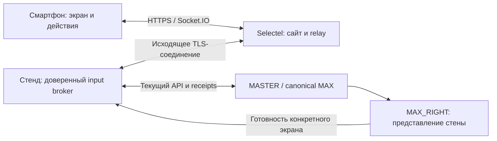

# MAX: прохождение со смартфона

Дата: 05.10.2026. Статус: архитектурное предложение после аудита текущего кода; реализация и установка не выполнены.

## Решение

Одна каноническая игровая сессия и два представления: стена показывает существующую композицию MAX, смартфон показывает содержимое устройства и доступные действия. Телефон не запускает независимую копию игры и не рассчитывает переходы. MASTER/canonical MAX остаётся владельцем прогресса, ветвлений, результатов и жизненного цикла задания.

Публичный адрес: `https://futuronika.pro/max/game`. QR под ладонью содержит этот адрес с одноразовым идентификатором подключения во fragment: `#join=<opaque-token>`. Один и тот же базовый адрес без идентификатора не позволяет определить текущего игрока; такая страница предлагает отсканировать QR на стене. Не использовать публичный список активных стендов или автоматическое подключение к случайной сессии.



## Пользовательский сценарий

1. В ручном режиме назначенной игры стена показывает ладонь и QR. Фон и пространственная композиция сохраняются.
2. Пользователь сканирует QR и нажимает «Играть с телефона». Открытие ссылки или предпросмотр мессенджера само по себе не занимает сессию.
3. Телефон показывает активацию удержанием; сервер проверяет длительность тем же механизмом, что и физическое удержание. В текущем canonical значение — 800 мс; мобильная версия не вводит собственный таймер подтверждения.
4. После активации телефон получает изображение текущего экрана устройства, справочный текст, активные области и кнопки под устройством. Используются уже применённые игровые данные, без отдельной разметки для телефона.
5. Нажатие отправляет идентификатор действия. Backend проверяет его, выбирает переход, стена проигрывает анимацию. Телефон показывает состояние перехода и включает следующие действия после готовности соответствующего экрана стены и собственного изображения.
6. Все задания, ветки и итоговое действие «Продолжить» доступны с телефона. Завершение/отмена текущего запуска отзывает подключение. Для следующего игрока появляется новый QR.

Автомиссии и рекламный видеопоказ не принимают подключение игрока автоматически: это отдельный ручной режим. Последняя прочитанная F-запись `production-source-max-single-loop-20261005/README.md` описывает отключённый show overlay и режим background-only. Внедрение пульта не должно самовольно возвращать отключённый показ; включение режима игры входит в отдельное применение.

## Что уже есть, а что нужно добавить

| Механизм | Фактическое состояние | Изменение |
|---|---|---|
| Каноническая сессия, ветки и результат | Есть | Использовать без второй игровой БД |
| Ассеты, intrinsic-размеры, hotspots, внешние кнопки, инструкции | Есть в игровой модели | Добавить ограниченную мобильную проекцию |
| Идемпотентность commandId и сохранённые receipts | Есть | Использовать при неопределённом результате команды |
| Единственный владелец ввода | Есть, lease 15 с | Один доверенный broker вместо второго ServerSessionPort |
| Роль MAX_RIGHT | Отдельный mTLS grant/lease 5 с | Не передавать телефону и не заменять мобильным lease |
| Готовность изображения/анимации | Есть локально у presenter | Добавить подтверждение конкретного screen/presentation epoch |
| QR pairing и мобильный controller lease | Нет | Одноразовая привязка и один контроллер на запуск |
| Публичный realtime-канал к текущему стенду | Не подтверждён/не реализован | Новый ограниченный relay и исходящий companion |

Актуальным источником canonical является `F:/project/VK_DigitalProducts_Stand/artifacts/canonical-max/`. Старые D/vendor и assignment-v1 не считать текущим контрактом автоматически. Принятые master/show-адаптации сверять отдельно перед реализацией.

## Владение вводом

Нельзя подключать телефон вторым обычным игровым клиентом: он конфликтует с existing input-owner и может остановить таймер или забрать ввод у стены.

В мобильном режиме trusted broker становится единственным владельцем canonical input lease. Обычный физический ввод и мобильные намерения проходят через него; renderer не пытается параллельно занять этот lease. Роль MAX_RIGHT и подтверждения показа остаются отдельными полномочиями.

Поверх этого вводится controller lease: один телефон на текущий run. Второй получает «Игра уже управляется другим участником», без автоматического перехвата. Пока телефон подключён, физические игровые нажатия не выполняют параллельные действия; оператор сохраняет возможность отозвать контроллер штатным управлением. Отключение телефона не означает отмену пользовательского прогресса.

## Синхронизация и переходы

Backend может уже перейти на следующий screen, когда стена ещё скрывает старое устройство или строит линки. Поэтому простого копирования snapshot недостаточно.

Ввести отдельный `presentationEpoch`, связанный с run, screen и версией содержимого. Wall presenter сообщает готовность после завершения перехода и подготовки изображения. Это логическая готовность renderer; не доказательство физического появления на LED. Существующий `browserPrepared:true, physicalPresented:false` не заменяет новый per-screen gate.

Проекция имеет `committed` и `presented` идентичности. Во время несовпадения телефон блокирует действия; после подтверждения стены и загрузки собственного ассета включает их. Абсолютная синхронизация физических кадров через мобильную сеть не обещается, но действие никогда не относится к другому экрану.

Автопереходы остаются серверными. Для мобильного режима нужен явный ready-gate их запуска: отсчёт после готовности текущего экрана, без независимого `setTimeout` перехода на телефоне. Ожидание телефона ограничено и связано с controller lease: скрытая/отключённая вкладка не удерживает игру бесконечно. Это новая политика, которую необходимо проверить с существующей паузой owner и дедлайнами задания, а не считать уже реализованной.

Предлагаемая, ещё не существующая проекция:

```text
protocolVersion, contentRevision, runId, taskId, screenId,
stateRevision, actionRevision, controllerEpoch,
presentation: { epoch, wallReady, interactive },
asset: { id, sha256, url, width, height },
instruction, progress, result,
actions: [{ id, kind, label, enabled, rect? }],
autoAdvance: { enabled, serverDeadline? }
```

`actionRevision` меняется при изменении допустимых действий, а не на каждом tick таймера. При реализации проверить, можно ли выразить её существующим business revision, не расширяя canonical без необходимости. Мобильная проекция не содержит административных команд, токенов роли, произвольных nextScreen/outcome или управления раскладкой стены.

Команда содержит `commandId`, `controllerEpoch`, `runId`, `screenId`, `actionRevision`, `presentationEpoch`, `actionId`. Сессионная привязка проверяется сервером, а не принимается на веру из payload. Broker переводит допустимое действие в текущий canonical API. Подтверждение relay о приёме не считается подтверждением выполнения.

Удержание передаётся как begin/end/cancel с последовательностью контакта и heartbeat; backend измеряет время. `pagehide`, потеря связи и истечение lease отменяют контакт. Клиентское «удержано» не является доказательством.

## Мобильный интерфейс

Лёгкая адаптивная DOM-страница, без WebGL стены, видеострима, фона 4096×1280 и загрузки всей коллекции роликов. Центральная часть — тот же asset; hotspots располагаются по исходным координатам с учётом contain/letterbox. Кнопки под устройством остаются отдельными элементами с текущими текстами и enabled-состоянием. Можно одновременно иметь несколько hotspots, несколько кнопок и серверный автопереход.

На телефоне также нужны удержание активации, справка, прогресс задания, состояния перехода/связи и итоговый экран. Не показывать лишние редакторские/дебаг элементы. Мелкие зоны нельзя автоматически расширять до пересечений соседних действий; при нехватке места нужен доступный масштаб или явные кнопки, связанные с теми же actionId.

Изображения публикуются на VPS по неизменяемому SHA-манифесту той же принятой версии игры. Кэшируются текущий и ближайшие допустимые экраны с ограничением объёма. Несовпадение contentRevision блокирует управление с понятным сообщением; подмена похожим ассетом недопустима. Серверные черновики редактора и пользовательские рабочие данные не публикуются.

## Транспорт: готовое решение

Рекомендован **Socket.IO 4.8.4, MIT**, для браузера, публичного relay и исходящего stand companion. Использовать готовые reconnect, ACK, rooms и heartbeat. Caddy из существующего развёртывания обслуживает HTTPS и узкий realtime-route. Не создавать собственную реализацию WebSocket/reconnect и не открывать MASTER/LAN API в интернет.

Socket.IO гарантирует порядок сообщений, но по умолчанию доставка at-most-once. Connection State Recovery — оптимизация, не гарантия. Корректность обеспечивают уже имеющиеся canonical receipts и полный snapshot после подключения. После разрыва запрещено буферизовать новые игровые нажатия; для уже отправленной команды сначала сверяется receipt, затем при необходимости повторяется ровно тот же commandId/payload. Не выпускать новую команду для неопределённого старого результата.

Для первого выпуска достаточно одного relay-процесса. Перезапуск relay приводит к восстановлению авторизованного соединения и snapshot, не к потере игры. Redis/кластер не нужны без отдельного требования HA. Документировать совместимость adapter с recovery, если масштабирование понадобится.

Публичный путь выделяется отдельно от редактора ассетов и административных endpoints. Существующие scripts/activate-client-1080.sh и activate-asset-audit-selectel.sh дают локальные образцы Caddy, systemd, release/current, SHA-проверки и отката; их auth/editor-data настройки не копируются в мобильный игровой контур.

## Pairing и отказоустойчивость

- Криптографически случайный одноразовый token, предлагаемый TTL 120 секунд; QR обновляется до claim. Он связан с dataset/assignment/session/run/contentRevision. Это предлагаемые defaults, не установленные настройки.
- Claim атомарный, только после явного действия пользователя. Fragment удаляется из адресной строки после обмена; браузер получает защищённую HttpOnly/Secure cookie. Токены не попадают в логи и аналитические события.
- Companion использует отдельное отзываемое полномочие с правом только на свою комнату и разрешённые игровые действия. Producer Kit SSH, mTLS MAX_RIGHT и мастерские полномочия телефону/relay не выдаются.
- На каждом сообщении проверяются актуальность lease/epoch/run/screen и разрешённый actionId; Origin, размер/частота сообщений ограничены. Смена dataset, задания или запуск нового run отзывает прежнее подключение.
- Потеря сети: кнопки немедленно блокируются; локального продвижения нет. Предлагаемое окно восстановления контроллера — 30 секунд с сохранением прогресса и отменой удержания. По истечении доступ возвращается через явное освобождение/операторскую политику, не через захват вторым телефоном.
- Перезапуск MASTER/изменение authority generation требует повторной проверки текущей сессии. Старые команды не воспроизводятся автоматически. Прохождение телефона при недоступном стенде не обещается.

## Трафик

Между стендом и VPS передаются состояние, команды, подтверждения и heartbeat, а не кадры видео. Планировочный пример: 100 экранов × 10 КБ проекции ≈ 1 МБ полезных данных за прохождение, без TLS/heartbeat/повторов. Это оценка для проектирования, не измерение текущего расхода.

Ассеты телефон получает с VPS. При собственном интернете посетителя они не расходуют SIM стенда; при подключении к Wi-Fi стенда расходуют. Перед публикацией считать размер недостающих файлов и передавать только их. Измерять WAN при пилоте отдельно от payload.

## Реализация короткими этапами

1. Изолированный вертикальный срез одной миссии: broker, claim QR, current snapshot, изображение/hotspots/внешние кнопки, hold и per-screen readiness. D-кандидат, без применения к F/стенду.
2. Проверить все действующие ветки, несколько действий, активность экранов, финальные экраны, autoAdvance и результат. Использовать игровые данные, не копировать редакторские черновики.
3. Протокольные проверки: два телефона; повторный QR; двойной tap; stale screen; потерянный ACK; Wi-Fi→LTE; pagehide при удержании; restart relay/MASTER; cancel/new run; несовпадение ассетов. Браузерные проверки — только по новому прямому запросу пользователя.
4. Ограниченное развёртывание отдельным feature flag, точечный D→F комплект и согласованное применение владельцем. Сохранить актуальные master/audio/background-only адаптации. Откат отключает мобильный режим и возвращает штатный ввод без удаления игровой БД/разметки.

Критерий готовности: выбранную ручную миссию можно пройти от активации до завершения целиком с телефона; стена остаётся единственным представлением общей игры, все принятые действия соответствуют показанному экрану, повторная доставка не меняет результат дважды.

## Источники и ограничения исследования

### Уточнение production SSE, 05.10.2026

Для Node companion принят официальный [EventSource5.1.2](https://github.com/EventSource/eventsource), MIT, Node>=22.12.0 (зафиксирован npm pin; проект требует>=22.13). Библиотека реализует SSE-разбор и reconnect и встраивается через eventSourceFactory действующего ServerSessionPort; собственного парсера нет. Причина: MASTER может освободить завершённую миссию раньше500мс polling; push нужен для короткого terminal-state. Snapshot polling остаётся восстановлением, не гарантией захвата промежуточного события. README документирует custom fetch и ограничения runtime; запросы ограничены точным loopback endpoint, redirect:error и Origin. Официальная реализация проверена реальным локальным HTTP/SSE-тестом; живой стенд пока недоступен. [Отчёт публикации](../../artifacts/reports/max-mobile-controller-deployment-20261005.md).

- [Socket.IO 4.8.4 release](https://socket.io/docs/v4/changelog/4.8.4/) — применимая версия, 25.09.2026; [MIT](https://github.com/socketio/socket.io/blob/main/LICENSE).
- [Delivery guarantees](https://socket.io/docs/v4/delivery-guarantees/) — порядок и ограничения доставки; не обещать exactly-once транспорт.
- [Connection state recovery](https://socket.io/docs/v4/connection-state-recovery/) — best effort, ограничения адаптеров; не обходить повторную авторизацию при восстановлении.
- [Client offline behavior](https://socket.io/docs/v4/client-offline-behavior/) — default buffering нужно исключить для новых игровых действий офлайн.
- [Reverse proxy](https://socket.io/docs/v4/reverse-proxy/) — Caddy, соответствие пути и таймаутов.
- [Реальный разбор Wi-Fi → мобильная сеть, Socket.IO discussion 5248](https://github.com/socketio/socket.io/discussions/5248) — recovery не универсальная гарантия при смене соединения; полный snapshot обязателен.
- [Caddy/Socket.IO, ответ сопровождающего](https://caddy.community/t/i-cant-get-socket-io-proxy-to-work-on-v2/8703/2) — готовый reverse_proxy, старый опыт настройки; современную конфигурацию сверять с текущей документацией.
- [OWASP WebSocket Security](https://cheatsheetseries.owasp.org/cheatsheets/WebSocket_Security_Cheat_Sheet.html) — Origin, авторизация сообщений, лимиты и защита журналов.

Готовая библиотека решает транспорт и восстановление подключения; специфическая привязка к MAX, проекция интерфейса и wall-ready gate остаются интеграцией с существующим движком. Они ещё не проверены end-to-end. [Фактический аудит исходников](../../artifacts/reports/max-mobile-controller-audit-20261005.md).
