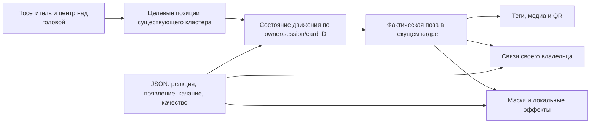

# MAX: анимация, флюиды и связи — возможности адаптации для VK Видео

Дата: 29.09.2026. Статус: исследование текущего кода и предложение архитектуры; перенос в VK Видео **не реализован**.

## Вывод

Для VK Видео полезен подход MAX к движению: сохранять состояние объекта при смене цели, согласовывать движение, материал и связи в одном кадре, разделять появление на несколько коротких фаз. Это можно адаптировать в существующем рендерере VK Видео без нового физического движка или поиска путей.

«Физичность» MAX складывается из нескольких разных механизмов. Движение интерфейса — преимущественно аналитические пружины. Фон — симуляция поля. Всплеск при появлении первого MAX — процедурный шейдер. Связи — деформируемая геометрия с движущимися частицами. Их нельзя считать одной универсальной системой физики.

Одной замены анимации недостаточно для исправления перегруженной композиции VK Видео. Количество одновременно видимых карточек, их размеры, приоритеты и порядок появления остаются отдельными художественными решениями.

## Основания и границы исследования

- Активная точка входа сборки — `artifacts/max-game/src/journey-main.js`. Старые `main.js` и `circular-main.js` не приняты за текущий Journey.
- У текущей и клиентской редакций общий bundle; редакционные различия не создают второй движок анимации.
- SHA-256 десяти изученных модулей совпали с `apps/max-game/source-manifest.json`. Это подтверждает соответствие исходников записанному манифесту сборки, но само по себе не доказывает загрузку этих байтов работающим worker.
- Через штатный мастер просмотрен фактический старт MAX. Временная вкладка закрыта; состояние игры не менялось. Полный цикл начала игры и полёта первых карточек в этой проверке не проигрывался: разбор последовательности основан на коде и существующих CPU-тестах.
- 51 существующая проверка прошла. Это проверка контрактов и математики, а не художественная приёмка и не измерение стоимости GPU.
- [Технический отчёт и результаты](../../artifacts/reports/max-motion-study-20260929/README.md).

## 1. Почему движение воспринимается плавным

В [journey-motion.mjs](../../artifacts/max-game/src/journey-motion.mjs) каждый канал хранит значение и скорость. Для координат, размера, радиуса, прозрачности и появления деталей используются отдельные `MotionValue`.

Основа — аналитическое решение критически затухающей пружины при постоянной цели на интервале кадра:

```text
offset = value − target
c = velocity + omega × offset
e = exp(−omega × dt)
value = target + (offset + c × dt) × e
velocity = (velocity − omega × c × dt) × e
```

При смене цели состояние продолжает жить: очередное движение начинается с текущих координат и скорости. Поэтому выбор иконки, её полёт и переход в состояние на поле не выглядят как три склеенных ролика. Реестр хранит объект по зоне и смысловому ID шага, а не по временному DOM-элементу.

Для постоянной цели тесты подтверждают совпадение позиции и скорости при 30/60/120 Гц. Для непрерывно движущейся цели точное совпадение не гарантируется: оно зависит и от частоты поступления координат. Это надо отдельно проверять при адаптации к посетителю.

В текущем VK Видео пружины уже есть: `advanceCluster` в [cluster-model.js](../../artifacts/video-wall/cluster-model.js) интегрирует движение центра небольшими шагами. Поэтому речь об улучшении численного метода и управления состоянием, а не о добавлении физики с нуля. Замена может уменьшить зависимость от шага, но выигрыш CPU нужно измерить.

### Настройки MAX сейчас

| Поведение | Реализация |
|---|---|
| Полёт выбранной иконки | `place: 10.5`; мягкий разгон и торможение |
| Появление первого MAX | `travelOmega: 10` после стартовой паузы |
| Следование перетаскиванию | `drag: 38`; более быстрый отклик |
| Состояние на поле | `field: 20` |
| Новый плюс | движение `next: 10`, раскрытие `nextReveal: 7`, скрытие `nextHide: 14` |
| Подпись и badge | отдельные каналы, задержки 40 и 110 мс |

Это частоты реакции пружин, не скорости в пикселях/с. Копирование чисел в другую систему координат без проверки не даст гарантированно того же ощущения. Константы MAX сейчас находятся в JS; для VK Видео их следует вынести в существующий JSON конфигурации, как просил пользователь.

Не все анимации MAX пружинные: есть временные easing-переходы, сглаживание hover и смена содержимого через нулевую прозрачность. Также удержание объекта попапом имеет специальную логику восстановления, включая сброс отдельных скоростей. Не следует переносить утверждение «скорость никогда не сбрасывается» на все режимы игры.

## 2. Появление MAX и первых объектов

Стартовая последовательность устроена в [journey-motion.mjs](../../artifacts/max-game/src/journey-motion.mjs), [journey-webgl-ui.mjs](../../artifacts/max-game/src/journey-webgl-ui.mjs) и [journey-main.js](../../artifacts/max-game/src/journey-main.js):

1. До смены экрана фиксируются реальные координаты нажатого стартового элемента.
2. За 240 мс MAX раскрывается и меняет форму в этой точке. Подписи пока скрыты.
3. Следующие 500 мс раскрытый MAX остаётся на месте. Idle-качание в этот момент не мешает представлению.
4. Затем тот же объект пружинно перемещается на поле. Если кадр пересекает границу удержания, полёту передаётся только соответствующая часть `dt`.
5. Подпись и badge проявляются отдельными каналами. Следующий плюс движется скрытым и раскрывается при приближении к цели.

Окончание полёта определяется остаточным расстоянием и скоростью, а не независимым таймером. Перестроение DOM не создаёт новую физическую иконку. Восстановление сохранённого шага не повторяет стартовый эффект.

Выбранная из меню карточка также продолжает своё фактическое движение. Связь с соседями может появиться ещё во время перелёта, до окончательной постановки шага. Это делает добавление объекта частью уже живого поля.

Для VK Видео полезен сам порядок: сначала центр над посетителем, затем несколько основных элементов, потом вторичные. Конкретное число карточек, задержки и необходимость стартовой паузы надо подобрать под проходящего человека: буквальные 740 мс ожидания MAX не являются обязательным шаблоном для стены.

## 3. Что именно называется «флюидами»

### Физическое поле фона

[journey-background-field.mjs](../../artifacts/max-game/src/journey-background-field.mjs) использует существующий `SharedFluid` проекта. В standalone-режиме это небольшая сетка 128 × 48, фиксированные 30 шагов/с и максимум два шага после длинного кадра. Плотность передаётся в небольшую текстуру; шейдер рисует пиксельную сетку и свечение. Вычисление самого поля здесь выполняется на CPU: наличие WebGL не делает всю симуляцию вычислением на GPU.

В мастере путь другой: [max-shared-background.js](../../artifacts/service/public/max-shared-background.js) использует RibbonEngine/SurfaceField и общую карту стены, с геометрией ячеек исходного VK-фона. MAX получает собственную палитру и стеклянную композицию. Это важное ограничение: standalone-плоскость и фон на стенде не тождественны по реализации глубины.

Следовательно, новый solver для VK Видео ради «флюидов как в MAX» не нужен. Родственная инфраструктура уже используется обоими приложениями.

### Стартовый всплеск

[journey-intro-burst.mjs](../../artifacts/max-game/src/journey-intro-burst.mjs) — отдельный визуальный эффект. Фрагментный шейдер строит 12 расходящихся изогнутых струй и затухающий след. Длительность — 0,9 с. Геометрия — quad; предусмотрены два заранее подготовленных слота для двух зон. Нет отдельного fluid solver, отдельной цепочки render targets или собственного RAF для этого эффекта.

Он напоминает жидкость, но не переносит массу и импульс через физическое поле. Его можно адаптировать для появления центра/карточки. Он не заменяет требование VK Видео о физических импульсах от движущегося контура посетителя.

### Переливы цвета

Текущий фон использует медленно меняющийся градиент и флюидную сетку; старые «шёлковые» потоки сохранены в коде, но не являются активным режимом MAX. Переносить старую ветку только потому, что её название подходит описанию пользователя, было бы ошибкой.

MAX-палитра не переносится в VK Видео автоматически. Для самодельных градиентов VK сохраняется запрет перехода синего в красный через розовый. Оригинальные фирменные рамки, изображения и логотипы из-за этого запрета не перекрашиваются.

## 4. Связи между объектами

[journey-links.mjs](../../artifacts/max-game/src/journey-links.mjs) строит минимальное остовное дерево/лес ближайших связей внутри зоны с ограничением дистанции. До шести объектов маршрута — небольшой граф. Это не поиск путей и не система предотвращения столкновений.

Внешний вид связей складывается из пяти тонких нитей, изгиба/колебания и 32 движущихся частиц на связь; текущий профиль содержит 80 сегментов. Геометрия и частицы обновляются через переиспользуемые буферы. Частицы идут вдоль нитей с индивидуальными фазами; близ границы дальности связь плавно затухает. Фактическая анимированная поза иконки используется до расчёта концов связи в кадре.

В VK Видео уже есть [cluster-links.js](../../artifacts/video-wall/cluster-links.js): общий буфер изогнутых полос от центра к элементам своего владельца, с учётом их размера и глубины. Поэтому целесообразно адаптировать визуальную модель нитей и движение сигнала в имеющийся модуль.

Автоматически заменять связи «центр → карточки» на MAX-дерево нельзя: это другая смысловая структура. Также не следует копировать профиль 5 × 80 сегментов на все карточки стены без ограничения числа связей. Построение MAX-графа использует все пары и сортировку; при большом числе элементов это ненужная стоимость. Для существующей звезды владельца топология известна заранее.

## 5. Стекло, слои и согласованность

Внутри игрового foreground сначала обновляется движение, затем связанные с ним координаты и оптические маски. Текст, иконка, подложка и область взаимодействия используют одну фактическую позу. Это устраняет запаздывание связи за уже улетевшей карточкой.

В [journey-fiber-glass.mjs](../../artifacts/max-game/src/journey-fiber-glass.mjs) слой волокон из существующего HDR target фильтруется под масками стекла. Glyphs и текст переднего плана остаются чёткими. Для контекстного стекла существует отдельный переиспользуемый буфер, активный по необходимости. Ресурсы готовятся до первого нажатия и освобождаются при удалении.

Утверждение «вся игра — один renderer и один RAF» неверно. Standalone фон создаёт отдельный renderer/цикл; в мастере фон и игровой foreground также разделены. Единое время и порядок обновления здесь прежде всего относятся к взаимодействующим объектам игрового foreground.

Переносить в VK Видео стоит согласование слоёв и времени. Фирменную оптику Liquid Glass MAX переносить по умолчанию не нужно. Ранее заданное отсутствие blur у тегов, изображений и QR остаётся действующим.

## 6. Предлагаемая структура адаптации

Ниже — предложение, не описание уже внесённых изменений.



| Что адаптировать | Способ | Что сохранить в VK Видео |
|---|---|---|
| Аналитические пружины | Небольшой модуль состояния без DOM/миссий MAX | Цели и ограничения текущей модели; независимые слои владельцев |
| Непрерывная жизнь карточки | Стабильный ID; retarget без пересоздания | Уже существующие owner/session и конфиги |
| Появление и исчезновение | Явные фазы; отдельные каналы размера/alpha/деталей | Заполненный силуэт, центр над головой; точный стиль бренда |
| Живые связи | Фазы сигнала и изгибы в имеющихся буферах | Связи только внутри своего кластера |
| Всплеск появления | Один общий материал и ограниченное число инстансов | Физическое поле контура продолжает работать отдельно |
| Небольшая жизнь в покое | Непрерывная фаза и индивидуальное seed-качание | Без постоянного испускания флюида неподвижным человеком |
| Настройки | Расширение существующего JSON кластеров | Без нового реестра или дублирующего конфига |

Не стоит переносить `webgl-field.js` целиком: это большой модуль с наследием космического проекта, не нужным стене. Также не нужны игровой reducer, миссии, система телефона и DOM-пикер MAX.

### Нагрузка и ограничения

- Обновление пружин — линейно от числа анимируемых каналов. Оно не требует обхода всех пар, поиска пути или отдельного потока.
- Число связей для звезды — линейно от числа карточек. Сегментацию и частицы следует выбирать отдельным профилем качества, а не копировать максимальные значения MAX.
- Раскладка и столкновения — отдельная система. `MotionValue` только доводит объект до цели; две совпадающие цели останутся совпадающими.
- Внутри одного кластера сохраняются ограничения от наложений. Между разными кластерами не добавляется поиск путей и взаимное расталкивание; их независимые слои — последнее принятое правило пользователя.
- Для приостановки, исчезновения пользователя и смены набора нужен lifecycle: не накапливать отложенные появления и callback после удаления owner/session.
- Ресурсы, текст и геометрию кэшировать. Не создавать texture, material, render target или обработчик на каждый кадр/объект без необходимости.
- На каждом кадре сначала движение, затем концы связей и маски, затем рендер. Не читать положения из DOM для каждой карточки стены.
- Не размывать карточки/QR ради маскировки наложений. Отсутствие blur не запрещает согласованные масштабы, окклюзию и тени.

## 7. Предлагаемый первый этап и критерии

Начать с одного владельца: центр над головой и небольшой набор тегов/медиа. Проверить непрерывное следование при разворотах, последовательное появление и привязку концов линий во время полёта. После выбора художественного результата расширять до трёх посетителей.

Критерии будущей реализации:

1. Смена цели не телепортирует карточку и не начинает движение заново из старой точки.
2. При смене owner/session очищаются временные эффекты; возврат человека не поднимает старую очередь появления.
3. Концы связей следуют текущей позе карточки в том же кадре, в том числе во время появления.
4. 30/60/120 Гц и длинный кадр проверяются отдельно для постоянной и движущейся цели.
5. Параметры доступны в существующем JSON; единицы, диапазоны и значения по умолчанию документированы.
6. Нет дополнительного solver или отдельного RAF на карточку/кластер. Замеры CPU/GPU сравниваются с текущей версией при одинаковом числе объектов.
7. Оригинальные брендовые рамки/цвета сохраняются; тексты, контент и QR чёткие.
8. Отдельно оцениваются плотность композиции и читаемость, а не только стабильность физики.

Этот этап требует следующего запроса на реализацию. Текущая работа не меняет механику MAX или VK Видео.

## Навигация по первичным источникам

- [Активная сборка](../../artifacts/max-game/scripts/build.mjs), [старт и оркестрация](../../artifacts/max-game/src/journey-main.js).
- [MotionValue / IconMotion / реестр](../../artifacts/max-game/src/journey-motion.mjs), [WebGL UI](../../artifacts/max-game/src/journey-webgl-ui.mjs), [переходы экранов](../../artifacts/max-game/src/journey-transition.mjs).
- [Процедурный всплеск](../../artifacts/max-game/src/journey-intro-burst.mjs), [фон standalone](../../artifacts/max-game/src/journey-background.mjs), [симуляция и поле](../../artifacts/max-game/src/journey-background-field.mjs).
- [Фон мастера](../../artifacts/service/public/max-shared-background.js), [активная атмосфера и исторические режимы](../../artifacts/service/public/max-wall-atmosphere.js).
- [Граф и сигналы](../../artifacts/max-game/src/journey-links.mjs), [рендер связей](../../artifacts/max-game/src/webgl-field.js).
- [Стекло волокон](../../artifacts/max-game/src/journey-fiber-glass.mjs), [контекстное стекло](../../artifacts/max-game/src/journey-context-glass.mjs).
- [Планировочная раскладка](../../artifacts/max-game/src/journey-route-layout.mjs), [мягкие края перетаскивания](../../artifacts/max-game/src/journey-drag.mjs).
- [Текущая модель VK Видео](../../artifacts/video-wall/cluster-model.js), [связи VK Видео](../../artifacts/video-wall/cluster-links.js).
- [Предыдущее исследование анимации MAX](max-webgl-motion-20260928.md), [действующая документация MAX](../../apps/max-game/docs/DEVELOPMENT.md).
