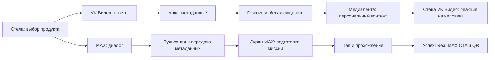

# Сценарий стенда: VK Видео и MAX

**Приоритет изменён 02.10.2026:** пользователь назначил [VK_MAX_Stand_Agent_Handoff v1.0](../../../artifacts/client-input/stand-scenario-final-20261002/README.md) финальным сценарием. Ниже сохранены историческая матрица и художественные уточнения; при конфликте смысловых состояний действует новый источник. Согласованная хореография VK сохраняется с привязкой к новым gates готовности. [Архитектурное решение](../stand-runtime-architecture-20261002.md).

Актуальная рабочая редакция 29.09.2026 по [Production_Matrix_VK_MAX_Motion.xlsx](../../../artifacts/client-input/production-matrix-vk-max-20260929/Production_Matrix_VK_MAX_Motion.xlsx), лист `Production Matrix`, ID 1–30, строки 3–32. [Разбор изменений и ограничений](README.md). Предыдущая [редакция только VK Видео](../production-matrix-20260929/STAND_SCENARIO.md) сохранена как история.

**Матрица** — содержание нового Excel. **Уточнение пользователя** — Discovery является существующей белой сущностью. **Предложение** — недостающая координация, которую надо согласовать. Описание состояния не означает, что оно уже реализовано. Все 30 исходных строк имеют статус «Нужен референс».

## Уточнение пользователя от 02.10.2026: хореография VK Видео после квиза

Это утверждённый пользователем порядок **видимых событий** ветки VK Видео. Он уточняет художественный переход между стелой, аркой, лентой и левой стеной; таблица клиентской матрицы ниже сохранена как источник смысловых состояний. Длительности, звук и точные траектории этим описанием не заданы.

1. После завершения квиза на Стелле арка постепенно наполняется белыми пикселями.
2. По заполненной арке проходит белый пиксельный импульс. Он продолжается по ленте до основного левого экрана и обозначает Дискавери.
3. После прохождения импульса на затронутых поверхностях снова виден синий фон.
4. Затем появляются Discovery-теги — прозрачные баблы (буллеты) с внутренней маской и светящимися круглыми пикселями — и движутся по ленте.
5. Примерно в центре ленты эти теги визуально преобразуются в контент; получившийся контент продолжает движение и выходит на левую стену VK Видео.

Заполнение арки, белый импульс, возврат синего фона и выпуск баблов — последовательные такты одного сценария, а не одновременная замена фоновой сцены. Место появления баблов до движения по ленте пользователь пока не уточнил; не закреплять его произвольно. На MAX эту хореографию не распространять.

## 1. Вход и выбор ветки

В действующем прототипе стелы есть выбор VK Видео/MAX. Новая матрица описывает обе ветки, но общего состояния выбора не добавляет.

**Предложение:** при начале взаимодействия создать сессию и закрепить выбранный продукт. Дальше ответы, метаданные, назначенная миссия/контент и результат сохраняют один session ID. Стела работает на отдельном ПК; мастер координирует события по LAN. Spout переносит локальное изображение, а не сценарную сессию.

Выбор продукта — контекст текущего проекта; он не является новым ID матрицы. Линия MAX между стелой и экраном не назначает промежуточные физические поверхности.

## 2. Ветка VK Видео — ID 1–20

Посетитель отвечает на вопросы стелы. Ответы превращаются в метаданные, арка собирает их в поток и передаёт Discovery. Белая сущность поглощает данные, показывает преобразование и выпускает контент на медиаленту. Контент приходит на стену VK Видео; система реагирует на человека, организует его персональное окружение и возвращается к фону после ухода.

Ниже компактно собраны все состояния без изменения их порядка. Excel-строка всегда равна ID + 2. Объекты и движение объединены в колонку видимого результата. Discovery нормализован к белой сущности по прямому указанию пользователя.

| ID | Зона / состояние | Видимый результат | Условие из матрицы → продолжение | Звук |
|---|---|---|---|---|
| 1 | AI-стела / Idle | AI-субстанция, спокойное «дыхание» | Нет взаимодействия; далее Listening | Ambient / тихий пульс |
| 2 | AI-стела / Listening | Реакция AI-интерфейса на голос/активность | Голос/touch → Processing | Реакция на голос |
| 3 | AI-стела / Processing | Данные собираются, уплотняются, меняют динамику | Ответ завершён → Data Transfer | Processing cue |
| 4 | AI-стела / Data Transfer | Импульс метаданных покидает стелу | Вопросы завершены → Арка / Data Capture | Transfer cue |
| 5 | Арка / Idle | Минимальное движение линий, частиц, света | Нет пользователя/данных; далее Data Capture | Ambient |
| 6 | Арка / Data Capture | Прибывшие теги/частицы/линии проявляются и собираются | Получен пакет → Data Spiral | Data arrival |
| 7 | Арка / Data Spiral | Поток закручивается по геометрии, ускоряется и концентрируется | Capture завершён → Transfer to Discovery | Acceleration |
| 8 | Арка / Transfer to Discovery | Собранный сгусток направленным импульсом уходит к сущности | Поток собран → Discovery / Intake | Transfer hit |
| 9 | Discovery / Idle | Белая сущность с едва заметной внутренней динамикой | Нет входящего потока; далее Intake | Low ambient |
| 10 | Discovery / Intake | Белая сущность поглощает/втягивает метаданные | Данные с арки → Processing | Impact / intake |
| 11 | Discovery / Processing | Частицы, 0–1 и контентные фрагменты расщепляются и пересобираются | Intake завершён → Output | Processing texture |
| 12 | Discovery / Output | Готовый контент раскрывается/выбрасывается в поток | Контент сформирован → Медиалента / Travel | Release cue |
| 13 | Медиалента / Idle | Спокойное направленное движение фоновой графики | Нет активного потока; далее Travel | Ambient |
| 14 | Медиалента / Travel | Персональные карточки и частицы движутся к VK Видео с общим ритмом | Output Discovery → Стена / Content Arrival | Moving pulse |
| 15 | Стена VK Видео / Ambient Content | Постоянное свободное движение бабблов/тизеров/карточек | Нет человека рядом; далее Person Detected | Ambient wall |
| 16 | Стена VK Видео / Content Arrival | Новый персональный тизер включается в существующее поле | Контент с ленты → Ambient / Person Detected | Arrival cue |
| 17 | Стена VK Видео / Person Detected | Проявляется силуэт, элементы начинают реагировать | Вход в tracking-зону → Content Reaction | Detection cue |
| 18 | Стена VK Видео / Content Reaction | Бабблы расходятся/собираются/двигаются около силуэта | Стабильный tracking → Personal Orbit | Reactive sound |
| 19 | Стена VK Видео / Personal Orbit | Персональное окружение, пластичное движение вокруг силуэта | Reaction завершён → Exit | Personal climax |
| 20 | Стена VK Видео / Exit | Силуэт растворяется, контент возвращается в общий поток | Потерян tracking → Ambient Content | Soft release |

«Нет данных» в строках Idle — условие ожидания, не немедленная команда перехода. Цикл вопросов, времена удержания и возвраты остальных зон по-прежнему надо определить. Состояние Personal Orbit требует художественного согласования с текущим направлением idle/magnet/motion; название не отменяет последние пользовательские правки.

Приход контента и вход человека — независимые события. Система должна различать посетителя с анкетой, посетителя без анкеты, контент до прихода человека и человека до прибытия контента. Способ идентификации не задан матрицей.

## 3. Новая ветка MAX — ID 21–30

### ID 21. Dialogue — строка 23

**Матрица:** человек общается с AI-агентом и отвечает на вопросы; интерфейс реагирует и ведёт диалог. Триггер — голос/touch; продолжение — Answer Complete. Звук `Dialogue cue`.

Открыто: визуальное отличие от VK Видео. Сохраняем текущую анкету как основу интеграции; присутствие голоса в описании не подтверждает готовность распознавания.

### ID 22. Answer Complete — строка 24

**Матрица:** получен последний ответ, вся стела начинает заметно пульсировать. Объект — стела/AI-субстанция; продолжение — Metadata Run. Звук `Pulse / confirmation`.

Открыто: характер, амплитуда и длительность пульсации. **Предложение:** зафиксировать результат анкеты один раз; повторная анимация не создаёт новую сессию или повторный пакет.

### ID 23. Metadata Run — строка 25

**Матрица:** текст, теги и поток метаданных движутся от стелы по системе к экрану MAX. Триггер — Answer Complete; продолжение — Mission Loading. Звук `Data transfer`.

Открыто: внешний вид, траектория и промежуточные поверхности. Арку, Discovery и ленту не подключать к этой ветке по аналогии без согласования. **Предложение:** отделить подтверждение получения данных от окончания визуального перелёта.

### ID 24. Mission Loading — строка 26

**Матрица:** из метаданных на экране формируется персональная миссия, данные собираются в карточку/интерфейс. Вход — получены метаданные; продолжение — Mission Ready. Звук `Loading / build-up`.

Открыто: образ преобразования данных в миссию и правила выбора. **Предложение:** экран принимает результат назначения и резервирует свободную игровую зону для этой сессии. Если зона занята, пакет ожидает согласованным способом; чужая игра не сбрасывается.

### ID 25. Mission Ready — строка 27

**Матрица:** готовая карточка миссии и CTA приглашают начать. Вход — Loading завершён; продолжение — Mission Start. Звук `Confirmation`.

Открыто: появление, акцент CTA и idle до тапа. Состояние должно ожидать реального действия, а не автоматически запускать игру из-за заполненной колонки «Следующее состояние».

### ID 26. Mission Start — строка 28

**Матрица:** пользователь тапает миссию, карточка раскрывается в игровую механику. Продолжение — Mission Gameplay. Звук `Start cue`.

Открыто: переход карточки в поле. **Предложение:** запускать существующую миссию MAX с переданным mission ID, owner/session и назначенной зоной; не создавать отдельный рендерер или копию игры.

### ID 27. Mission Gameplay — строка 29

**Матрица:** пользователь проходит последовательность действий; выбирает, перемещает и раскрывает шаги/иконки, получает feedback. Триггер — действия пользователя; продолжение — Mission Complete. Звук `Interaction feedback`.

Открыто: общая динамика интерфейса. Детальные задания берутся из действующих [миссий проекта](../../../apps/max-game/docs/MISSIONS.md): новая матрица их не перечисляет и не заменяет. Размещение иконки само по себе не равно выполнению задания.

### ID 28. Mission Complete — строка 30

**Матрица:** все шаги выполнены; финальная сборка и подтверждение успеха. Продолжение — Real MAX CTA. Звук `Success cue`.

Открыто: характер финала. **Противоречие для согласования:** здесь описана одна персональная миссия, тогда как существующая игра имеет общий финал после четырёх. **Предложение:** персональный режим завершать по назначенной миссии, самостоятельный режим сохранять; это предложение, не внесённое изменение.

### ID 29. Real MAX CTA — строка 31

**Матрица:** посетителю предлагают повторить действие уже в настоящем MAX. Объекты — QR/CTA/интерфейс MAX; вход — Mission Complete; продолжение — QR / Exit. Звук `CTA cue`.

Открыто: плавная связь игрового результата и настоящего действия. Нужны утверждённые тексты и адрес перехода для каждой миссии. Учебная игра не создаёт автоматически реальный аккаунт, канал, звонок или цифровой ID.

### ID 30. QR / Exit — строка 32

**Матрица:** QR доступен для сканирования, затем система возвращается к базовому состоянию. Триггер — скан QR/таймаут; продолжение — Idle. Звук `Soft release`.

Открыто: длительность показа, конкретный Idle и критерий сканирования. **Предложение:** если подтверждённого события открытия ссылки нет, возвращаться по согласованному таймауту/явной кнопке выхода. Не считать само отображение QR доказательством скана. Сбрасывать только завершившуюся зону и её сессию.

## 4. Передачи и общая координация

| Ветка | Передача | Смысл |
|---|---|---|
| VK Видео | Стела → арка | Ответы и метаданные |
| VK Видео | Арка → Discovery | Собранный поток данных |
| VK Видео | Discovery → медиалента | Сформированный персональный контент |
| VK Видео | Медиалента → стена VK Видео | Тот же набор для своего посетителя |
| MAX | Стела → экран MAX | Метаданные и результат назначения миссии; физический путь пока не задан |
| MAX | Экран → телефон посетителя через QR | Утверждённая ссылка на реальное действие, не видеопоток и не доказанный факт выполнения |

**Предложение к реализации:** общий пакет содержит product, session ID, уникальный packet ID, версию, целевую зону и данные выбранной ветки. Для MAX нужен mission ID/версия правил; для VK Видео — теги/ассеты. Повтор одного packet ID не создаёт второго задания или второго контентного набора. Точный API ещё предстоит спроектировать.

Пакет получен, зона готова, анимация завершена и действие выполнено — разные события. У каждой зоны своя очередь/занятость, а у мастера — просмотр стадии, ошибки, повтор и отмена конкретной сессии. Количество одновременно активных сессий и таймауты не определены книгой.

## 5. Прерывания

Следующие правила — предложения, а не новые строки Excel:

- Незавершённая анкета отменяется по согласованному условию; частичный ответ не выдаётся как финальный.
- Отказ голоса оставляет понятный touch-путь, если он утверждён.
- Отключённый/занятый экран не подтверждает приём; повтор безопасен и не сбрасывает чужую игру.
- Посетитель у стены сопоставляется с сессией явно; ближайший силуэт не получает автоматически чужие данные.
- Краткая потеря tracking отличается от ухода. После подтверждённого ухода освобождается только соответствующая зона.
- Для MAX до старта, во время игры и на QR нужны отдельные условия ожидания/отмены; новый пакет не перехватывает текущий интерактив.
- После перезапуска мастер восстанавливает согласованное состояние или явно предлагает повтор; завершённый результат не воспроизводится как новая победа.

## 6. Поверхности, материалы и критерии готовности

Используется [проектная пиксельная карта](../../PROJECT_PIXELMAP.md): задняя стена 7168×1280, регионы VK Видео 3072×1280 и MAX 4096×1280; стела 1080×1920; внутренняя арка и две стороны ленты. Новых физических экранов обновление не задаёт. Нижняя Лента2 и неготовые UV/remap остаются отдельной задачей; сценарий не устраняет эти ограничения.

Для каждого из 30 состояний нужны референс, ключевые кадры, тайминги, правила прерывания, привязка к поверхности и звуковой cue/ассет. В Excel J/N пусты, точные интервалы не заданы. Звук должен быть согласован между одновременными ветками; количество cues не равно количеству физических колонок.

Готовность сценария: работают обе ветки от действующей анкеты до своего результата; данные не меняют владельца; MAX ждёт тапа, проверяет выполнение заданий и выдаёт правильный QR; повтор/уход/сбой не ломают соседнюю зону; все переходы читаются на реальных поверхностях. 60 FPS, аппаратный ввод, звук и вывод проверяются отдельно на целевом комплекте после реализации. Тяжёлые тесты требуют отдельного согласия.

Эта редакция обновляет постановку. Приложения, мастер, модель, TD и опубликованная игра здесь не изменялись.
