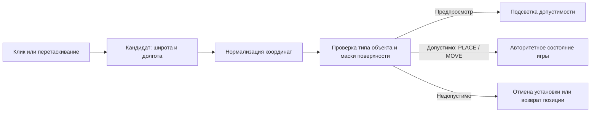

# Ограничение размещения оборудования на воде

Дата: 2026-09-08. Запрос: «проведи ресерч архитектуры - как можно добавить ограничение - что объект на воду поставить нельзя».

Статус: реализовано 2026-09-08 в `land-placement-151`. Ниже сохранён исходный ресерч; описание фактической реализации в этом разделе имеет приоритет над предложениями ресерча. Интерактивная browser QA не выполнялась.

## Реализованное правило

- Наземное устанавливаемое оборудование по умолчанию `land`, орбитальное — `any`. Поле `placementSurface` принимает `land | water | any`, доступно в банке объектов, сохраняется parser/schema и проходит round-trip public → editor → save → dist → runtime. При смене поведения банк устанавливает соответствующее правило по умолчанию. У фиксированных точек и маркеров меню правило не менялось; авторские координаты сохранены.
- Отдельная CPU-маска: `public/earth/Earth_Surface_4K.bin` (4096×2048, один бит на пиксель, 1 МиБ) и одноимённый JSON manifest. Производная от текущей specular: красный канал ≥128 — вода, иначе суша; ближайший пиксель, без расширения воды. Океаны и крупные озёра запрещены; ледниковая суша разрешена. Отдельного состояния coast в v1 нет. Разрешение около 0,088° на пиксель: малые водоёмы и точность всех берегов не гарантируются.
- Маска подготавливается явно `python3 scripts/prepare-surface-mask.py` (Pillow); обычные build/sync её не пересоздают. Manifest содержит хеши источника и результата. Перед запуском игра и тестовый режим редактора загружают и проверяют данные; отсутствующая/повреждённая маска блокирует старт. У CPU-правила нет зависимости от цвета океана, света, камеры, DPR или GPU readback.
- `src/surface-map.mjs` — географический sampler; `src/placement-policy.mjs` — политика; `src/mission-game.mjs` — обязательная проверка нормализованного PLACE/MOVE. Непринятая операция сохраняет run, инвентарь, nextId, исходную позицию и droppedAt. Вода не ограничивает распространение радиосигнала или траекторию перетаскивания.
- Проверяются клики, конечная позиция инвентарного броска с существующей инерцией, перенос узла и тест редактора. Недопустимый preview красный и исключён из сети. При release кандидат вычисляется заново. Mesh восстанавливается до вызова MOVE, preview-сеть сбрасывается и при неизменившемся run. `pointercancel` и отпускание вне Земли не подтверждают прошлую позицию и не показывают ошибку воды. Смена/перезапуск миссии отменяет отложенный инвентарный commit/уведомление.
- После отклонённой попытки сначала возвращается карточка/позиция, затем выезжает стандартный error popup с текстом из `wording.json`: «Нельзя установить объект на воду. Разместите его на суше.» Есть RU/EN, закрытие, отдельный ключ на каждую попытку и штатный звук ошибки. Наведение popup не вызывает. Reduced motion отключает движение; редактор использует существующий error toast после восстановления сцены.

### Проверки реализации

233/233 теста: маска/хеш/шов/полюса/Москва/Сибирь/океаны/Байкал/Каспий/Гренландия/прибрежная B; запрет PLACE/MOVE; orbital/water/any; повреждённые данные; отсутствие расходования инвентаря и изменения droppedAt; исключение preview из обоих движков; порядок rollback → popup, inertia, pointercancel, повторный release, смена миссии, reduced motion; round-trip банка. Для каждой из трёх текущих миссий построен допустимый наземный маршрут и подтверждена победа. Это проверка выполнимости, не изменение координат миссий.

`check`, `build`, `portable:check` проходят. Portable проверяет наличие маски, формат и SHA-256. Следующий шаг — пользовательская приёмка на игровой Земле, особенно у берега и при броске; интерактивный browser QA агент не запускал.

## Рекомендуемое решение

Добавить общий CPU-классификатор поверхности по географическим координатам и отдельную проверку допустимости размещения. Источником первой версии маски может служить уже согласованная с рендером `Earth_Specular_4K.webp`. Для рабочего правила закрепить её производную как отдельный версионированный игровой ассет: изменения художественного блика не должны менять возможность строительства.

Правило применять к размещаемому наземному оборудованию при PLACE и MOVE. Спутники над океаном допустимы. Фиксированные точки миссии, в том числе суда, и маркеры меню — отдельные сущности, к которым запрет автоматически не применяется. Запрет воды не означает запрет размещения за пределами России.



## Что есть в проекте сейчас

| Участок | Фактическое поведение | Где расширять |
| --- | --- | --- |
| `src/webgl-field.js`, `geoFromPointer` | Аналитическое пересечение луча со сферой, перевод обратно через `INVERSE_GEO_TO_SCENE_QUATERNION` в широту/долготу. Учитывается высота, тип поверхности не проверяется. | Оставить геометрическую проекцию независимой; проверять полученного кандидата общим сервисом. |
| `src/webgl-field.js`, `onPointerUp` | Клик вызывает onPlace; перенос вызывает onMove с preview. | Общая обработка подтверждения/отказа и восстановления отображения. |
| `src/main.js`, `beginPointerDrag` | Перенос из инвентаря заканчивается projectDrop → PLACE. Координата броска дополнительно сдвинута скоростью до 44 экранных px по каждой оси. | Проверить именно финальные координаты, до анимации принятого drop, и повторно при commit. |
| `src/mission-game.mjs`, `reduceMission` | PLACE проверяет тип/инвентарь; MOVE проверяет ID. normalizeGeo ограничивает числовые диапазоны и высоту. Вода не учитывается. | Последний обязательный барьер для обоих действий, после normalizeGeo. |
| `previewPlacementMove` / `previewMissionMove` | Во время drag создаётся временная позиция и пересчитываются сеть и feedback. | Отдельный статус запрещённого кандидата; он не должен порождать успешные соединения. |
| `src/editor-main.js`, `testAction` | Тестовый режим вызывает тот же reduceMission. | Передавать тот же контекст поверхности, что игре. |
| `placeMapPoint` / `src/editor-validation.mjs` | Авторинг фиксированных точек отделён от оборудования; v2-validation ограничивается parseMissionCatalog. | Диагностика поверхности с явной политикой точки, без запрета всех морских точек. |
| `src/object-catalog.mjs`, `parseObjectCatalog` | Есть только behavior=ground/orbital. Парсер явно возвращает label/short/icon/behavior. | Новую политику нужно добавить в парсер, иначе она потеряется. |
| `public/config/mission-system.schema.json` | У objectTypes additionalProperties=false. | Обновить схему, банк объектов, round-trip и серверный путь сохранения. |
| `src/asset-preparation.mjs`, bootstrap main.js | Карта specular уже входит в обязательную загрузку PreparedAssets. | Новый gameplay-ассет также должен быть готов до разблокировки ввода. |

Актуальные опорные места на дату исследования: webgl-field.js:1690, 1780, 1801, 1849; main.js:960, 1052, 1062; mission-game.mjs:53, 62, 76, 114, 301. При дальнейших изменениях ориентироваться прежде всего на имена функций.

## Выбор данных о суше

| Вариант | Преимущества | Ограничения / вывод |
| --- | --- | --- |
| Текущая specular-карта, один раз прочитанная на CPU | Уже локальна, имеет ту же UV-привязку, что поверхность; включает океаны и заметные озёра. Минимум новой инфраструктуры. | Хороший прототип. Это художественная карта отражения, не утверждённая игровая классификация: пограничные оттенки требуют решения. |
| Отдельная маска классов, подготовленная из текущей карты | Та же исходная география, стабильное правило, версия и контрольный хеш; можно корректировать конкретные берега независимо от бликов. | **Рекомендованный игровой вариант.** Нужны подготовка и приёмка данных. |
| Физические полигоны суши и озёр, например Natural Earth | Явная географическая семантика; пригодны для офлайн-генерации маски или point-in-polygon. | Берег может расходиться с художественной текстурой. Нужны учёт внутренних вод, отверстий, островов, шва ±180°; для частых проверок — пространственный индекс. |
| Russia_Fill_Mask_6K.svg / новый контур России | Уже имеются. | Не использовать как классификатор воды: это маска территории, она не описывает всю сушу планеты и все внутренние воды. |
| Цвет итогового кадра или GPU readback | Кажется простым визуальным тестом. | Не использовать: освещение, облака и эффекты меняют цвет; чтение GPU добавляет синхронизацию. Сам raycast сферы тоже не различает сушу и море. |

Natural Earth отдельно публикует [полигоны суши](https://www.naturalearthdata.com/downloads/10m-physical-vectors/10m-land/) и [озёра/водохранилища](https://www.naturalearthdata.com/downloads/10m-physical-vectors/10m-lakes/). Обозначение 1:10m — масштаб 1:10 млн, не разрешение 10 метров. Для полигонального варианта официальный [Turf booleanPointInPolygon](https://turfjs.org/docs/api/booleanPointInPolygon) поддерживает Polygon/MultiPolygon, отверстия и выбор отношения к границе. Установка Turf для растрового варианта не нужна.

### Что измерено локально

`app/public/earth/Earth_Specular_4K.webp` имеет 4096×2048. Шейдер уже использует её красный канал как oceanMask через smoothstep(0.24, 0.82, specularSample), независимо от контура России. Карта загружается как NoColorSpace. Это соответствует назначению data-текстур в [документации Three.js](https://threejs.org/manual/en/color-management.html).

Проверена выборка исходных пикселей с географической адресацией; [полный протокол с SHA-256 и координатами](research/land-placement/mask-probe.json).

| Контрольная область | Красный канал 0–255 | Соседство 3×3 |
| --- | ---: | --- |
| Москва | 0 | 0–0 |
| Центральная Сибирь | 0 | 0–0 |
| Тихий океан | 255 | 255–255 |
| Северный Ледовитый океан | 255 | 255–255 |
| Байкал | 255 | 251–255 |
| Каспий | 255 | 255–255 |
| Контрольная точка на ледниковой суше Гренландии | 0 | 0–0 |

Это подтверждает пригодность источника для прототипа, но не классификацию каждого берега. Из текущих точек миссий protected-network/B даёт 111 и соседство 10–255 — пример неоднозначности прибрежного пикселя. Простое объявление любого ненулевого значения водой будет ошибочным.

Имеющийся endpoint `finish-point-ship-1` — отдельная фиксированная точка с иконкой судна; её текущие координаты дают 0. Не делать вывод о поверхности по имени/иконке и не переносить пользовательские точки автоматически. Все прочитанные координаты оставлены без изменений.

## Предлагаемые слои и контракт

1. **`surface-map.mjs`**: immutable данные и чистая адресация `sampleSurface(latitude, longitude)`. Результат — land/water/coast/unknown либо числовой enum без аллокаций в pointermove. Ни Three.js, ни DOM, ни сетевых запросов внутри sampler. Отдельный загрузчик получает байты и создаёт sampler один раз.
2. **`placement-policy.mjs`**: проверка нормализованного кандидата по политике типа. Причины отказа различать: water, coast, unavailable, invalid-coordinate. Техническая ошибка загрузки не должна выглядеть как сообщение «на воду нельзя».
3. **Игровая логика**: общий контекст правил передаётся в reducer/общий обработчик команд; не доверять булевому action.allowed из UI. PLACE и MOVE повторно проверяются одной функцией. Включённое правило без подготовленного sampler не разрешает наземную установку молча.
4. **UI/WebGL**: получает verdict для preview; после release обязательно синхронизируется с фактическим результатом. Графика не определяет допустимость позиции и не записывает игровые координаты из анимации.
5. **Редактор/сервер**: тестовое прохождение использует тот же валидатор. Для фиксированных точек отдельная политика, начальное значение any; диагностика авторинга без произвольного переезда координат. На сервере сохранения — та же схема и при необходимости тот же массив классов без Canvas/WebGL.

Проектный пример новых данных (предложение, ещё не текущий формат):

```json
{
  "gateway": { "behavior": "ground", "placementSurface": "land" },
  "core": { "behavior": "ground", "placementSurface": "land" },
  "terminal": { "behavior": "ground", "placementSurface": "land" },
  "satellite": { "behavior": "orbital", "placementSurface": "any" }
}
```

`behavior` продолжает описывать высоту/перетаскивание, `placementSurface` — допустимую поверхность под объектом. Будущий морской терминал может иметь ground + water, не становясь спутником. Для минимальной версии достаточно land/any; water вводить одновременно с реальным сценарием. Не привязывать исключения к текстам названий или номеру миссии.

Для старых данных без поля на включении правила принять явную миграцию: orbital → any, устанавливаемое ground → land. В документированном режиме совместимости правило может быть выключено целиком, но не обходиться отсутствием контекста в одном из входов. Если одному типу terminal нужны оба режима в одной миссии, потребуется отдельный тип морского терминала либо политика на уровне роли; глобальное разрешение воды для всех terminal слишком широко.

### Координаты и CPU-память

После существующего обратного преобразования из 3D работать с latitude/longitude; дополнительное вращение камеры или Earth применять не нужно. Для массива, строки которого идут сверху вниз:

```js
u = (((longitude + 180) % 360) + 360) % 360 / 360;
v = (90 - latitude) / 180;
x = Math.floor(u * width);
y = Math.min(height - 1, Math.max(0, Math.floor(v * height)));
surface = pixels[y * width + x];
```

Числа проверяются до расчёта; окончательное правило работает на тех же нормализованных координатах, которые сохраняет reducer (сейчас latitude ограничена ±82°). ±180° должны попадать на общий шов, соседи по x оборачиваются, y ограничивается. У растрового массива верхняя строка — север; не добавлять texture.flipY к этим координатам. В Three.js raycast по Mesh может возвращать UV ([официальный Raycaster](https://threejs.org/docs/pages/Raycaster.html)), но здесь используются аналитические пересечения со сферой и геокоординаты уже доступны: второй raycast не нужен.

При 4096×2048 Uint8Array занимает **8 MiB**, RGBA-временный буфер — **32 MiB**, двоичная битовая карта — **1 MiB**. Это объём распакованных данных, не размер скачивания и не измерение FPS. Для первого варианта удобен один байт с классами; после измерения можно уплотнить. Один пиксель по широте — 0,08789°, примерно 9,8 км; по долготе физический размер уменьшается с широтой. Узкие реки и мелкие острова могут не представляться. Детализация должна соответствовать видимой карте и требованиям игры.

Оптимальный production-артефакт: небольшой JSON manifest (version, width, height, origin=north-west, encoding, hash) и одноканальный бинарный массив, созданный офлайн. Его можно читать одинаково в браузере и Node. Для прототипа разрешено использовать уже декодированное PreparedAssets изображение: один Canvas drawImage + getImageData при загрузке, затем извлечь канал и освободить временный Canvas/RGBA. [MDN getImageData](https://developer.mozilla.org/en-US/docs/Web/API/CanvasRenderingContext2D/getImageData) описывает получение пиксельного массива; проверять условия чтения локального/blob изображения и соответствие значений, не выполнять цветовую стилизацию маски.

Во время drag — только обращения к готовому массиву. Не выполнять fetch, decode, getImageData, загрузку текстур или GPU readPixels. MDN отдельно отмечает синхронные остановки при [чтении WebGL-пикселей на CPU](https://developer.mozilla.org/en-US/docs/Web/API/WebGL_API/WebGL_best_practices#avoid_blocking_api_calls_in_production). Наличие только маски в GPU не делает её доступной reducer.

## Поведение при перетаскивании

- Проверять **географический якорь основания**, с учётом текущего grabOffset, а не центр иконки, экранный указатель или радиус связи. Радиоволны могут проходить над водой.
- Над запрещённой точкой объект-превью остаётся под рукой, но получает видимый статус ошибки и короткое «Разместите объект на суше». Не останавливать drag на берегу и не притягивать к ближайшей суше: это ломает точку захвата. Применять проектные контракты motion и ограничений горячего пути.
- Новый объект при release на воде не добавляется, инвентарь и nextId не расходуются; карточка возвращается. Для клика — только отказ с обратной связью.
- Существующий объект возвращается в позицию **до начала жеста**; droppedAt, связи и прогресс не меняются из-за отклонённого MOVE. Не выбирать автоматически «последнюю сушу на траектории».
- **Прямое уточнение пользователя от 2026-09-08:** «также запиши что при попытке установить на воду и после того как установка отменилась - выползает соответствующая ошибка». Последовательность: попытка установки/переноса → отказ → восстановление карточки/позиции → выезжающее сообщение об ошибке. Наведение показывает preview, но не запускает это сообщение. Один показ на отклонённую попытку; обычный pointercancel его не вызывает. Предложение текста, не утверждённое дословно: «Нельзя установить объект на воду. Разместите его на суше». Включить эту последовательность в критерии проверки PLACE и MOVE; анимация уведомления не определяет игровой результат.
- Временно недопустимый объект не участвует в вычислении успешного preview-маршрута. Для feedback строить сеть без этого кандидата либо держать сеть отдельно от его графического ghost; нельзя оставлять зелёные линки к позиции над водой. После отмены сеть пересчитывается из принятого run.
- При coast до выбора точного правила давать отдельную подсказку «Чуть дальше от берега», а не объявлять такой пиксель географически доказанной водой. Точный порог и допустимость береговой линии закрепить в версии маски. Не расширять воду на несколько пикселей вслепую: на 4K это может запретить километры суши и небольшие острова.
- Проверяется именно установка, а не пересечение водой всей траектории переноса.

### Ловушки в существующем коде

1. `updateMission` сразу выходит, если reducer вернул тот же run. При этом WebGL уже вызвал updateNodeTransform для preview. Поэтому отказ MOVE должен отдельно запустить resync/rollback после очистки draggedNode; иначе объект визуально останется над водой, хотя в state — на суше.
2. `pointercancel` сейчас зарегистрирован на onPointerUp, который может подтвердить MOVE. При введении ограничения разделить cancel/release: cancel всегда откатывает. Это также покрывает прерывание жеста системой.
3. Инвентарный «бросок» использует сдвиг по скорости: конечный geo может оказаться в воде, даже если pointerup был над сушей. Preview и commit должны проверять одного кандидата. Возможный продуктовый вариант — сделать этот сдвиг только анимационным для ground; это отдельное изменение ощущения drag, не молчаливое следствие маски.
4. `onPointerMove` при отсутствии пересечения сейчас сохраняет прошлый preview. Нужен явный статус кандидата для release вне сферы/поля, чтобы не подтвердить устаревшую позицию. На pointerup вычислить/проверить окончательную позицию.
5. Между инвентарным вычислением координат и PLACE есть await settleGhost(240 ms). За это время может смениться миссия/режим. Финальный commit должен проверять текущий контекст жеста и повторно валидировать кандидата.
6. Сервер/парсер сейчас не сохранят новое поле objectTypes без обновления parseObjectCatalog и JSON Schema. Обновить также создание/дублирование/смену behavior в банке; экспорт, импорт и сохранение должны сохранять правило.

## План реализации и приёмки

1. Зафиксировать land-only для устанавливаемого наземного оборудования, any для спутников и политику фиксированных точек. Согласовать отношение к coast, озёрам и ледяной воде. Предложение: моря/океаны/крупные озёра запрещены, ледниковая суша разрешена, морской лёд считается водой.
2. Подготовить стабильную surface-маску из текущего источника и проверить игровые берега/острова. Зафиксировать источник/хеш и правила дискретизации. Новый контур NEW-012 не подменяет классификатор.
3. Реализовать чистые sampler/policy и проверку в reducer. Подключить загрузку до appReady, portable-check и тестовый режим редактора. Отсутствие обязательных данных — ошибка загрузки с повтором, а не тихое разрешение строительства.
4. Объединить preview/commit/reject/cancel во всех трёх способах размещения. Добавить одноразовую обратную связь без спама звуком/сообщениями на каждом pointermove; RU/EN-фразы через wording. Отказ установки не должен запускать звук успешного drop.
5. Добавить политику в банк объектов и существующий безопасный round-trip сохранения. Сначала только сообщать о проблемах авторских endpoints; не исправлять пользовательские координаты. Проверить выполнимость миссий: наличие суши в нужных коридорах, место шлюзам/ЦОД, связь с морской точкой без установки обычного терминала на воду.
6. Детерминированные проверки: суша/океан/Байкал/Каспий/остров/берег/шов, invalid numbers, отсутствующая маска; одинаковое решение preview и commit; запрет PLACE/MOVE не расходует inventory/ID и не меняет droppedAt; спутник над морем допустим; исключения endpoints; cancel и rollback; действия из редактора/импорта, сохранение нового поля после перезапуска; отклонённый preview не создаёт успешную сеть. Затем штатные check/test/build/portable:check.
7. Пользовательская проверка на реальной Земле: курсор/якорь/берег, grabOffset, исчезновение ложных линков, возврат объекта, бросок у побережья, узкие острова и морские миссии. Интерактивная browser QA — только по явному запросу пользователя.

Проведённое исследование не измеряло производительность реализации и не доказывает точность всех берегов. Новые runtime-зависимости, карты и игровые правила не установлены. Основной риск — качество границы классификации и согласованность всех входов размещения, а не стоимость одного обращения к массиву.
