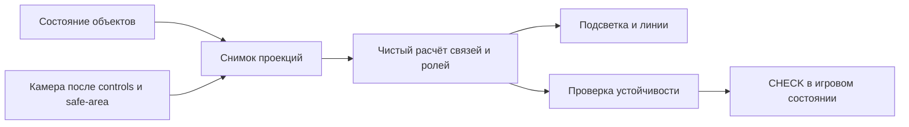

# Ракурсный режим соединения объектов

Дата: 2026-09-08 · Игра «Космос на связи»

**Обновление 2026-09-08: режим реализован по последующему запросу пользователя; описание фактической реализации — [SCREEN_SPACE_MODE.md](../SCREEN_SPACE_MODE.md).** Ниже сохранено исходное исследование и его предложения, а не точная спецификация текущего кода. Изучены текущие исходники, официальная документация Three.js и отдельный геометрический эксперимент. Числа для удобства управления ниже — стартовые гипотезы, а не утверждённые настройки.

## 1. Суть предложения

Добавить второй режим: связь определяется расстоянием между объектами **в текущем изображении камеры**. Игрок расставляет оборудование и вращает Землю так, чтобы видимые зоны связи соседних элементов пересеклись. Реальное расстояние в 3D при этом может быть большим.

Рекомендую правило: **в кадре собрана читаемая цепочка А → нужные элементы → Б, зоны соседей пересекаются, все участники видны, камера остановлена — маршрут засчитывается**.

Сохраняются типы и количество оборудования, последовательность ролей, наземное размещение на суше, высота спутников, пробуждение объектов и условия миссии. Дополнительная проверка прежнего 3D-расстояния в новом режиме не нужна: иначе ракурсное совпадение снова может выглядеть правильным и не засчитываться.

Это отдельная игровая условность. Предлагаемая короткая подсказка: «Поверни Землю так, чтобы зоны связи соседних элементов пересеклись в кадре». Не представлять этот принцип как физическую модель спутниковой связи.

## 2. Что сейчас есть в проекте

| Узел проекта | Нынешнее поведение | Значение для нового режима |
|---|---|---|
| [mission-evaluation.mjs](../../src/mission-evaluation.mjs), `evaluateMission`, `evaluatePathVariant` | Чистый расчёт без камеры; связность через `distanceBetween <= radiusA + radiusB` | Нужен отдельный источник геометрии, общий движок условий можно сохранить |
| Там же: `vector(node, true)` и `progress/cross` | Порядок определяется продвижением по географическому коридору на сфере, без высоты | Одной замены расстояния недостаточно для полностью ракурсного порядка |
| [mission-game.mjs](../../src/mission-game.mjs), `missionEvaluation`, `deriveNetwork`, `CHECK` | Получают placements и время, без снимка камеры | Все пути оценки должны получать один и тот же ракурс |
| [main.js](../../src/main.js), `renderMission` | Автоматически выполняет `CHECK`, когда сеть complete | Нужно защитить победу от мгновенного совпадения во время вращения |
| Там же: `withProjectedLayout` | Передаёт `screenX` только для старого движка; v2 сразу возвращает исходный run | Текущие v2-миссии не становятся ракурсными от существующего `screenX` |
| [webgl-field.js](../../src/webgl-field.js) | Основная камера — `PerspectiveCamera`; `applyPresentationOffset` меняет zoom и view offset | Использовать фактические матрицы после всех поправок камеры |
| Там же: `nodeMarkerFrame`, `updateNodeTransform`, `iconLinkAnchor` | Основание лежит на Земле, центр значка и волн поднят по направлению camera-up | Проверять центры значков/волн, а не координаты нижних оснований |
| [node-settings.mjs](../../src/node-settings.mjs), `resolveSignalRadius` | Радиус спутника зависит от высоты | Можно сохранить зависимость и проецировать полученный радиус |
| [mission-system.mjs](../../src/mission-system.mjs), `parseConnection`; [schema](../../public/config/mission-v2.schema.json) | Разрешена политика `geographicCorridor` | Новый режим требует изменения parser/schema/редактора, сейчас неизвестное значение не поддерживается |

В текущем расчёте `distanceBetween` измеряется прямая пространственная дистанция между сферическими координатами с высотой, а не километры по поверхности. Нынешние движущиеся волны — визуализация радиуса; мгновенное положение фронта волны не является границей игровой проверки.

## 3. Сравнение вариантов

| Вариант | Правило | Плюсы | Ограничения |
|---|---|---|---|
| Постоянный экранный порог | Центры ближе, например, 150 условных пикселей | Быстрый прототип | Отдаление камеры может собрать всё в тесную группу; порог расходится с размером видимых волн |
| Пересечение проекций зон связи | Экранное расстояние ≤ сумма экранных радиусов | Проверка соответствует изображению; сохраняются разные радиусы оборудования | Нужно точно согласовать центры, радиусы и видимость |
| Только угол между лучами камеры | Разница направлений меньше допуска | Явно ракурсная задача | Не совпадает автоматически с текущими кругами связи; требует другой визуализации |
| Экранная связь + прежний географический порядок | Меняется только проверка ребра | Меньше изменений | Визуально правильная последовательность может конфликтовать со скрытым порядком в 3D |

**Основной вариант — пересечение проекций зон связи и порядок вдоль экранного направления А → Б.** Географический порядок можно использовать для раннего технического сравнения, но не считать его полноценным воплощением предложенной механики.

Замена перспективной камеры на ортографическую для этого не требуется. Ортографическая проекция сохраняет размер объекта независимо от глубины, но поменяет существующее изображение Земли и характер управления. Это отдельное решение, не часть предлагаемого режима. [Документация OrthographicCamera](https://threejs.org/docs/pages/OrthographicCamera.html).

## 4. Точное правило связи

### 4.1. Что проецировать

Для каждого объекта определить стабильный центр `C` — центр значка и его зоны связи после штатного размещения. У наземного оборудования учесть высоту ножки и размер объекта; у спутника — его высоту. Аналогично определить центры А/Б.

Геометрия проверки не должна брать временный scale при pickup/drop, прозрачность, пульсацию, hover или фазу волн. Используются стабильные параметры объекта и та же функция расчёта центра, которую использует renderer. Иначе декоративная анимация начнёт создавать и разрывать связи.

`Vector3.project(camera)` переводит мировую точку в NDC. Камера предоставляет `matrixWorldInverse` и `projectionMatrix`; после изменения свойств проекции требуется обновить её матрицу. [Vector3.project](https://threejs.org/docs/pages/Vector3.html#project), [Camera](https://threejs.org/docs/pages/Camera.html), [PerspectiveCamera](https://threejs.org/docs/pages/PerspectiveCamera.html).

Для стандартного WebGL-прохода:

```text
clip = projectionMatrix × matrixWorldInverse × [C.x, C.y, C.z, 1]
ndc = clip.xyz / clip.w
screen.x = (ndc.x + 1) × W / 2
screen.y = (1 - ndc.y) × H / 2
```

`W/H` — размеры canvas в логических единицах layout, не физические пиксели drawing buffer. Границы рамки и перекрывающие панели перевести в эти же координаты. Нельзя брать расстояние просто в NDC: без поправки на aspect горизонтальная и вертикальная оси имеют разный масштаб.

### 4.2. Как получить экранный радиус

Текущие зоны вокруг значков ориентированы к камере. Пусть `R` — штатный радиус зоны, `U` — единичное направление camera-right:

```text
s = project(C)
edge = project(C + U × R)
r = length(edge - s)
```

Проверить тем же способом camera-up. Для круглого billboard в текущей перспективной проекции радиусы совпадают с точностью расчёта. Если позднее зона станет наклонной или вытянутой, потребуется отдельная модель эллипса; нельзя безоговорочно брать его больший радиус.

Проецировать **границу максимального радиуса**, а не очередную движущуюся волну. В новом режиме стоит показать тонкий постоянный контур этой границы; бегущие волны оставить внутри как декор. Тогда условие видно даже между импульсами.

### 4.3. Пара соседей

```text
d = length(sA - sB)
q = d / (rA + rB)
canLink = bothEligible && bothAwake && d <= rA + rB
```

Расстояние в глубину не ограничивает эту пару. Но участники должны пройти условия видимости и принадлежать правильным соседним ролям. Если пользователь под «верным расстоянием» имеет в виду точный интервал, можно позднее добавить `qMin..qMax`; для первой версии предлагается привычное пересечение зон.

Отдельно запрещать наложение самих значков: `d >= iconRadiusA + iconRadiusB + readableGap`. Значение `readableGap` задавать в единицах дизайн-сцены. Простое складывание всех значков в одну точку не должно давать читаемый маршрут.

### 4.4. Что делает zoom

При одинаковом масштабировании изображения центры, расстояния и проецируемые радиусы масштабируются вместе: отношение `q` сохраняется. Это предотвращает победу только за счёт уменьшения всей картинки. Проверка видимости при этом может измениться — раньше обрезанные объекты попадут в кадр.

Перемещение камеры вперёд/назад — другое действие: оно меняет относительную перспективу объектов на разной глубине, поэтому `q` может измениться. Для первого режима рекомендую фиксировать радиус орбиты камеры и FOV на уровне миссии, разрешив её поворот. Существующие автоматические поправки safe-area проецировать одинаково для всей геометрии; во время их движения не фиксировать победу.

## 5. Как определить порядок элементов

Не сортировать просто по `screenX`: цепочка может быть диагональной или направленной справа налево. Для каждой пары старт/финиш использовать ось в кадре:

```text
axis = sB - sA
u(P) = dot(sP - sA, axis) / dot(axis, axis)
cross(P) = length((sP - sA) - u(P) × axis)
```

1. Проверить, что А и Б достаточно разнесены. Почти совпавшие проекции дают неопределённую ось — ракурс непригоден.
2. Сформировать экранный коридор и допуски около концов. Ширину задавать относительно длины А→Б или общего масштаба радиусов, а не переносить старое число `corridorWidth=2` в пиксели.
3. Отсортировать участников по `u`; близкие значения считать неоднозначностью, а не разрешать её по ID/порядку создания.
4. Сопоставить типы с `path.steps`, проверить каждое необходимое ребро и условия миссии.
5. Для нескольких допустимых А/Б оценить варианты отдельно, сохранив нынешний механизм согласования общих ролей. Победивший вариант должен иметь все свои точки видимыми; скрытая неиспользованная альтернатива не обязана блокировать его.

Здесь нужна явная новая политика порядка. Нельзя поменять `distanceBetween`, оставив незаметно прежний 3D-коридор, endpoint caps и выбор ближайшего endpoint. Расстояния в выборе вариантов и привязке к концам тоже должны использовать выбранную систему координат.

В MVP каждый маршрут остаётся направленным коридором от А до Б. Свободная цепочка с поворотами и петлями потребует поиска соответствия ролей в графе, а не одной сортировки; это отдельное расширение.

## 6. Видимость и защита от ложного совпадения

| Ситуация | Предлагаемое поведение |
|---|---|
| Центр за камерой, за near/far или вне игрового окна | Не участвует в связи |
| Объект за Землёй | Не участвует, даже если его проекция совпала с видимым объектом |
| Значок под рамкой, нижним инвентарём или панелью описания | Не засчитывать невидимую часть маршрута; подсветить потребность изменить ракурс |
| Зоны пересеклись, но сами значки наложились | Попросить развести элементы |
| Две линии пересеклись | Пересечение не становится узлом; соединяются только заданные концы |
| Порядок объектов неоднозначен | Не фиксировать результат; показать спорную пару |
| Одно ребро совпало в одном ракурсе, другое — в следующем | Не накапливать их: вся цепь должна существовать в одном снимке |
| Drag preview выглядит правильным | Разрешить предварительную подсветку, но не победу до принятого drop |

Для Земли достаточно аналитического пересечения отрезка камера→центр/контрольные точки значка со сферой того же радиуса, который используется для игрового закрытия. Не проверять пересечение Земли с пространственным отрезком между двумя связанными объектами: это вернуло бы физическое ограничение, которого новый режим не требует.

`Raycaster` позволяет получить пересечения с объектами, упорядоченные по расстоянию. Для простого глобуса аналитическая сфера дешевле обхода треугольников; это инженерный выбор для проекта, а не требование библиотеки. [Raycaster](https://threejs.org/docs/pages/Raycaster.html).

Проверки одного центра мало для значка, наполовину скрытого горизонтом. Для MVP: центр и четыре контрольные точки окружности значка видимы; при пограничном положении считать объект непригодным для фиксации. Это консервативная аппроксимация, не попиксельное доказательство видимости всего диска. Для наземных точек также проверять видимость основания/принадлежность ближней стороне Земли, чтобы поднятый billboard не делал скрытый объект доступным.

Рекомендация по экранным связям: рисовать принятый линк по тем же проекциям центров в существующем WebGL-проходе. В первом варианте это связь изображения, поэтому она может проходить поверх изображения Земли; оба конца при этом реально видимы. Не показывать скрытую 3D-дугу как объяснение принятого 2D-соединения. Маску игровой рамки сохранить.

## 7. Когда засчитывать успех

Предлагается непрерывная предварительная подсветка и короткая фиксация после остановки камеры:

- Сеть пересчитывается при перемещении объектов, изменении камеры/проекции, viewport и истечении времени пробуждения.
- Пока камера/объект движется, игрок видит актуальные возможные связи, но миссия не завершается.
- После отпускания управления и остановки инерции вся правильная цепь должна удержаться, например, **300 мс**. Это гипотеза для настройки.
- Стабильность проверять по изменению проекций центров **и радиусов**, не только по `pointerup`. Начальный допуск — до 0,5 условного пикселя за последние 100 мс, с учётом масштаба сцены.
- Смена назначений ролей, разрыв, resize, уход объекта под панель, новый drag или смена миссии сбрасывают удержание. Большой разрыв кадров/возврат из фоновой вкладки также сбрасывают его: не засчитывать не наблюдавшееся удержание.
- Перед `CHECK` заново проверить последний снимок и его ревизии. Победа фиксируется игровым reducer; завершение анимации не является её основанием.

Чтобы избежать дрожания подсветки, можно использовать гистерезис: включать ребро при `q <= 0.98`, сохранять подсветку до `q > 1.04`. **Победу проверять отдельным строгим условием `q <= 1`**, а не по сохранённому состоянию подсветки. Числа — предлагаемые стартовые значения.

Отключить декоративный idle sway камеры в этом режиме: он не должен самостоятельно собирать/разбирать маршрут. Ручное вращение и инерция остаются. Reduced motion не отключает сам ракурсный расчёт; отключаются декоративные движения, смысл управления сохраняется.

После фиксации сохранить выбранные роли, placements и ракурс как снимок результата; проиграть успех в этом ракурсе. Позднейшая анимация камеры не отменяет уже завершённую миссию. При перезапуске/сбросе CTA очистить снимок и состояние удержания.

## 8. Встраивание в архитектуру

Сохранить чистый evaluator. Renderer передаёт геометрические данные, но не утверждает `complete`.



Предлагаемый контракт снимка:

```text
ProjectionSnapshot {
  missionId, runRevision, viewRevision, viewportRevision, timestamp,
  nodes: { id -> { center2d, radius2d, iconRadius2d, eligible, reason } }
}
```

В нём есть все endpoints и обычные объекты; `center2d` уже учитывает рамку координат и стабильную высоту значка. `eligible` — геометрический/экранный признак, не готовая игровая связь. После изменения placements нельзя использовать снимок с прежним `runRevision`.

План разделения:

1. Вынести общие функции стабильного центра/радиуса из renderer в доступный обоим слоям модуль. Не читать анимированный `matrixWorld` иконки как игровую истину.
2. Выделить геометрическую стратегию для evaluator: координаты порядка, коридор, расстояние, радиус, пригодность. Старая стратегия воспроизводит прежний world-результат.
3. Новый `projection-snapshot.mjs` готовит снимок из согласованных матриц камеры, placements и layout; `screen-connectivity.mjs` выполняет чистые проверки без DOM/WebGL-ссылок.
4. Передавать снимок через `deriveNetwork`/`missionEvaluation`/`CHECK`, включая предварительную расстановку и live feedback. Отсутствующий/устаревший снимок для ракурсного режима возвращает «ожидается ракурс», а не молча включает world-проверку.
5. Снимать матрицы после `controls.update`, camera settling и `applyPresentationOffset`, в существующем кадровом цикле. Не запускать дополнительный RAF и не вызывать полный `render()` приложения каждый кадр. Обновлять WebGL-сеть и изменившиеся UI-статусы адресно.
6. Не считать в кадре геометрию из damped presence/interaction. Пересчёт зависит от стабильных placements, камеры и дедлайнов, а не от пульсации материалов.
7. Сохранить общий механизм условий `all/any/atLeast`, согласования shared roles, ограничения инвентаря и пробуждения. Для MVP все paths одной миссии используют один режим.

Потенциальные затраты: проекции O(N), порядок O(N log N), проверка соседних рёбер O(N), плюс существующая обработка вариантов ролей. Для третьей миссии сейчас 11 размещаемых элементов плюс endpoints. Нужен замер на целевом ПК; это оценка сложности, не подтверждение FPS. Переиспользовать буферы/векторы, не делать GPU readback или raycast по всем треугольникам Земли.

## 9. Конфигурация и совместимость

Режим задаёт автор миссии в редакторе. Внутри начатой миссии игрок не переключает правила. Старые конфиги без поля продолжают использовать `geographicCorridor` и прежний evaluator.

Пример **будущего**, пока не поддерживаемого формата:

```json
{
  "connection": {
    "policy": "screenProjected",
    "screen": {
      "anchor": "signalCenter",
      "radius": "projectedCoverage",
      "order": "endpointAxis",
      "corridorFraction": 0.25,
      "ambiguityFraction": 0.01,
      "minimumEndpointSpan": 120,
      "iconGap": 8,
      "stableHoldMs": 300,
      "requireVisible": true
    }
  }
}
```

Все численные значения — кандидаты для прототипа. `minimumEndpointSpan/iconGap` в условных пикселях дизайн-сцены; относительные поля безразмерные. Старые `corridorWidth/ambiguityEpsilon` не интерпретировать как новые единицы. Parser/schema должны проверять структуру в зависимости от `policy`; текущие serializer/editor должны пройти round-trip без потери незнакомых старым версиям данных. До обновления редактора новый конфиг не сохранять через старую версию.

UI редактора: «Связь по расстоянию» / «Связь в ракурсе». Игра получает отдельную понятную подсказку. Точные названия и наличие выбора режима на экране миссий ещё не утверждены.

Сохранения требуют идентификатора политики/ревизии миссии: загрузка старого незавершённого run не должна случайно трактовать world-решение как screen-решение. Камеру можно восстановить, но промежуточное удержание успеха всегда начинается заново.

## 10. Проверенный геометрический пример

В отдельном [projection-probe.mjs](screen-space-connectivity/projection-probe.mjs) использован установленный Three.js, две точки и два billboard-радиуса 0,4. Это не игровая миссия и не испытание видимости за Землёй.

| Условие | Расстояние центров на экране | Сумма радиусов | q | Результат пары |
|---|---:|---:|---:|---|
| Камера прямо, 1920×1080 | 251,76 | 264,62 | 0,951 | Связь |
| Поворот примерно −20° | 432,31 | 249,06 | 1,736 | Разрыв |
| Тот же вид, 3840×2160 | 503,52 | 529,24 | 0,951 | Связь |
| Тот же вид, projection zoom 1,5 | 377,64 | 396,93 | 0,951 | Связь |

3D-расстояние между точками — 1,476 при сумме радиусов 0,8: прежний критерий не даёт связи ни в одном ракурсе. В новом критерии связь меняется от поворота без перемещения объектов; пропорциональное увеличение viewport и zoom сохраняет q. Это собственный расчёт, результат записан в [projection-probe.json](screen-space-connectivity/projection-probe.json).

Запуск из корня: `node app/DOCS/research/screen-space-connectivity/projection-probe.mjs`. Эксперимент содержит проверки этих четырёх утверждений, не подключает UI и не меняет игровые конфиги.

## 11. Критерии прототипа

| Проверка | Требование |
|---|---|
| Физически далеко, в кадре зоны пересеклись | World=false, screen=true при остальных выполненных условиях |
| Только поворот камеры | Связь обновляется без PLACE/MOVE |
| Изменение высоты спутника | Обновляются центр и проекция штатного радиуса |
| Full HD/4K, DPR 1/2 | Одинаковая геометрия даёт одинаковый результат; данные drawing buffer не влияют |
| Другой aspect/view offset/safe-area | Расчёт совпадает с текущим изображением; попадание в рамку перепроверяется |
| Пропущен обязательный элемент/перепутаны роли | Победы нет, даже когда все зоны визуально пересеклись |
| Закрыт Землёй/панелью, почти совпали А/Б | Победы нет; понятная локальная причина |
| Пороговое дрожание | Подсветка устойчива, строгий разрыв не превращается в победу |
| Движение/инерция/фон/resize/drag cancel | Нет случайной фиксации или использования устаревшего снимка |
| Два варианта endpoints/shared roles | Нет сборки победы из несовместимых вариантов и разных ракурсов |
| Старые миссии без нового поля | Прежние результаты всех world-тестов сохраняются |
| Перезапуск/CTA/переход экрана | Сброшены снимок, удержание и временные связи |

Для настоящей приёмки нужны отдельно: детерминированные геометрические тесты; реальные PLACE/CHECK в каждой текущей миссии; просмотр на целевом экране пользователем. Обязательно проверить, что **вся цепочка одновременно помещается в доступном ракурсе**, особенно полярная и длинная третья миссии. Наличие world-решения этого не доказывает.

## 12. Порядок дальнейшей работы

1. Отдельная экспериментальная конфигурация одной простой миссии: те же объекты и доступные повороты, сравнение world/screen без изменения опубликованной игры.
2. Проекции, видимость и постоянные границы зон; на отладочном слое показывать центры, r, q и причины отказа.
3. Экранный порядок ролей и реальные PLACE/CHECK с одним снимком; тесты совместимости старого режима.
4. Защита фиксации, отключение idle sway, согласованная отрисовка связей.
5. Проверка решаемости/читаемости всех трёх миссий и нужного оборудования. При отсутствии допустимого ракурса корректировать авторскую раскладку экспериментальной миссии явно, не расширять допуски скрыто.
6. После приёмки — поддержка в редакторе, отдельная подсказка игроку, затем публикация.

До реализации требуется принять три продуктовых решения: допускается ли перестановка ролей одним поворотом (здесь рекомендовано да), когда фиксируется успех (рекомендовано автоматически после остановки), какие миссии получают режим. Исследование не предполагает молчаливую замену существующего режима во всех миссиях.
